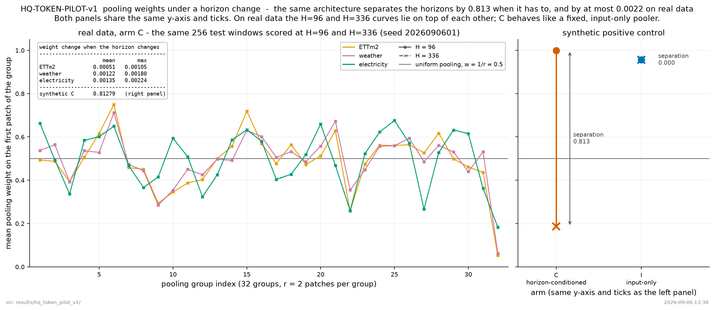
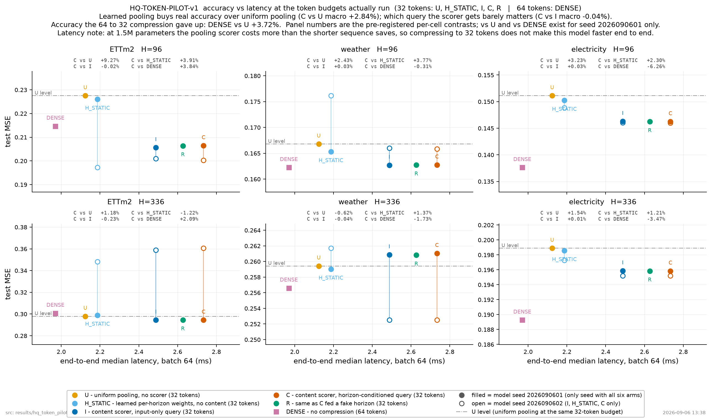

# 1. 무엇을 연구하나

**같은 계산 예산에서 과거 시계열의 어떤 정보를 보존해야 하는지를, 입력의 변화량뿐 아니라 예측할 기간을 보고 결정하는 방법**을 연구한다.

최상위 목표는 분석 지표를 새로 만드는 것이 아니라 **예측 정확도–계산비용의 관계를 개선하는 모델 구성요소**를 만드는 것이다. 이 노트의 소비처는 연구 주제 선택과 첫 실험 설계다. 성공이 확인된 방법이나 SOTA 결과를 기록한 문서가 아니다.

핵심 가설은 다음과 같다.

> [가설·미검증] 제한된 표현 예산에서는, 같은 과거라도 짧은 미래와 긴 미래를 예측할 때 유리한 압축이 다를 수 있다. 예측 기간에 조건화한 압축은 입력만 보는 학습형 압축보다 더 정확할 수 있다.

‘예측 기간을 알려준다’는 것은 미래 target을 알려주는 것이 아니다. horizon은 요청 시점에 알려진 과제 조건이다. 충분한 용량 아래에서 동일 lead-time의 이상적인 조건부 평균이 요청 horizon 때문에 달라져야 한다는 주장도 아니다. **유한한 용량과 토큰 예산에서 발생하는 표현 배분 문제**를 시험한다.

# 2. 기존 연구가 이미 해결한 것

| 선행연구 | 상태와 확인한 핵심 | 이 주제가 별도로 답해야 할 것 |
|---|---|---|
| A Time Series is Worth 64 Words: Long-term Forecasting with Transformers | 2023/ICLR. PatchTST는 patch 표현과 채널 독립 처리를 사용한다. [S1] | 동일 구조에서 표현을 압축하는 방식만 바꿨을 때 무엇이 달라지는가? |
| Efficient Time Series Processing for Transformers and State-Space Models through Token Merging | 2025/ICML. Local merging으로 토큰 처리 비용을 줄인다. [S2] | 입력 유사성뿐 아니라 예측 목표를 사용하는 추가 가치가 있는가? |
| Byte Pair Encoding for Efficient Time Series Forecasting | 2026/ICML 채택을 저자 소속기관 공지로 확인. 반복 motif를 토큰으로 만든다. [S3] | 빈번한 패턴과 현재 예측에 중요한 패턴을 구분할 필요가 있는가? |
| TimeSqueeze: Dynamic Patching for Efficient Time Series Forecasting | 2025/NeurIPS 워크숍 및 2026/arXiv 공개본. 국소 복잡도에 따른 동적 patching을 사용한다. 메인 NeurIPS 채택으로 쓰지 않는다. [S4] | horizon 조건화가 입력 기반 동적 patching 이상의 이득을 주는가? |
| Dynamic Semantic Tokenization for Time Series via Elastic Sampling on Physics-aware Perception | 2026/AAAI. 변화율·주파수 정보를 이용한 적응형 토큰화를 다룬다. 이번 추가 검색에서 확인했다. [S5] | ‘입력 변화량을 반영했다’만으로 새롭다고 주장할 수 없다. |
| TokenLearner 계열 | 2021/NeurIPS의 적응형 시각 토큰 학습. [S6] | 학습형 가중 pooling 자체를 새 아이디어라고 부르면 안 된다. |
| Perceiver IO: A General Architecture for Structured Inputs & Outputs | 2022/ICLR. Latent bottleneck과 query 기반 출력을 사용한다. [S7] | 일반적인 query/bottleneck 발상과 시계열 예측 목표 조건부 **입력 압축**의 차이를 설명해야 한다. |

**현재 확인 범위에서 novelty는 미확정이다.** 위 연구들을 ‘우리보다 약한 방식’으로 단정하지 않는다. 첫 실험의 목적은 작은 새 연산의 기전 확인이며, 논문 기여의 확인은 그 다음이다.

# 3. 왜 ‘horizon별로 모델 하나씩’ 학습하면 안 되나

각 horizon마다 별도 압축기를 학습하면, 각 모델에서 horizon 입력은 상수다. 이 결과만으로 같은 모델이 예측 목표에 맞춰 압축을 바꾼다는 가설을 시험할 수 없다.

따라서 첫 실험은 **하나의 모델이 H=96과 H=336을 함께 학습**한다. 비교 모델의 decoder에는 모두 실제 horizon을 제공한다. 실험군 사이 유일한 핵심 차이는 **압축기도 horizon을 받는가**다.

\[
Z=T_\phi(X_{<o};H,B), \qquad \hat Y_{o:o+H}=F_\theta(Z;H).
\]

- `o`: 예측 시작 인덱스. 입력은 `[o-L,o)`, target은 `[o,o+H)`.
- `L`: 과거 길이.
- `B`: 압축 후 실제 encoder token 수.
- `H`: 요청된 예측 길이.

horizon 조건은 입력 데이터보다 추가적인 정답 정보를 주지 않는다. target 값, 미래 실측 보조변수, test 손실에 기반한 token 선택은 금지한다.

# 4. 첫 구현의 범위 — 경계를 움직이는 tokenizer가 아니라 국소 pooling

[설계·미검증] 첫 버전은 **Forecast-horizon-conditioned local token pooling**으로 제한한다. 원래 연구 방향의 최소 구현이지, 완성된 동적 경계 tokenizer가 아니다.

`L=1024`, 기본 patch 길이·stride는 모두 16, 따라서 `N=64`개의 기본 token을 만든다. 주실험은 `B=32`다. 시간순으로 인접한 2개 token씩 묶어 하나로 압축한다. 이후 유망할 때만 `B=16`을 시험한다. `B=64`는 압축이 사라지는 제어 조건이다.

고정된 인접 그룹 \(\mathcal G_b\) 안에서:

\[
a_{bi}=\operatorname{softmax}_{i\in\mathcal G_b}
 g_\phi(e_i,\bar e,e_H),\qquad
z_b=\sum_{i\in\mathcal G_b}a_{bi}e_i.
\]

`g`는 비선형 MLP다. **선형 score에 horizon 항을 상수로 더하기만 하면 softmax에서 소거**될 수 있으므로 그렇게 구현하지 않는다. `e_i`는 patch 내용과 원래 시간 위치를 포함하고, `bar e`는 현재 history token의 평균이다. 값 경로에 horizon 벡터를 직접 더하지 않고, 첫 구현에서는 horizon이 **pooling 가중치**를 바꾸는 경로로만 사용되게 한다.

이 버전은 토큰을 원래 시간순으로 유지한다. 각 압축 token의 원래 구간·가중 중심도 기록한다. 원래 시간 위치를 잊고 압축 token을 새로운 등간격 실측값으로 위장하지 않는다.

# 5. 비교군

| ID | 압축기 | decoder의 horizon | 역할 |
|---|---|---|---|
| DENSE | 압축하지 않음, N=64 | 실제 H | 같은 실험용 backbone의 비압축 기준 |
| U | 인접 그룹의 균일 평균 | 실제 H | 단순 압축 기준 |
| I | 입력 기반 학습형 가중 pooling | 실제 H | **주요 baseline**. 압축기에는 horizon 대신 0 벡터 |
| H_STATIC | horizon별·위치별 가중치, 내용에는 의존하지 않음 | 실제 H | 내용 적응이 아니라 고정된 horizon prior로 충분한지 검사 |
| C | 입력과 실제 horizon 기반 pooling | 실제 H | 제안한 최소 개입 |
| R | 입력과 독립적으로 추출한 horizon 기반 pooling | 실제 H | 조건 의미를 끊는 학습 대조군 |

I/C/R은 동일한 네트워크 구조·초기 가중치·학습 표본·optimizer schedule을 사용한다. H_STATIC은 더 단순한 모형이며 파라미터 차이를 공개한다. ‘실제 모델이 읽지 않는 dummy parameter’로 동등성을 꾸미지 않는다.

R의 가짜 horizon은 압축기에만 들어간다. decoder·loss mask는 항상 실제 H를 사용한다. 모든 배치가 같은 H일 때 배치 내부 permutation은 아무것도 바꾸지 않으므로 R은 독립 난수로 생성한다.

**B=N일 때 모든 그룹 크기는 1이다. 같은 가중치를 복사한 I와 C의 출력은 같아야 한다.** 이 테스트가 실패하면 horizon이 압축 외 경로에 다르게 들어간 것이다.

# 6. 필요한 모델

## 6.1 주실험 모델

공식 PatchTST의 patch/channel-independence 발상과 split을 참고한 **소형 multi-horizon patch Transformer**를 사용한다. [S1]

이 실험용 모델은 공식 PatchTST의 동일 구현 또는 사전학습된 foundation model이라고 부르지 않는다. 첫 실험은 pretrained tokenizer 교체 문제가 아니라, 표현 압축의 중심 가설을 저렴하게 분리하는 단계다.

권장 사양은 `d_model=128`, encoder 3층, attention head 4개, FFN 256, dropout 0.1이다. 자세한 고정 구현과 readout은 함께 제공한 CLI 지시문에 있다. 모든 변형은 같은 readout을 사용한다.

## 6.2 비교·후속 이식 모델

| 모델 | 모델 ID / 코드 | 이번 역할 |
|---|---|---|
| 공식 PatchTST | `yuqinie98/PatchTST` | 공식 기준 성능과 split 확인. 실험용 모델과 이름 구분 |
| Chronos-2 | `amazon/chronos-2`, `amazon-science/chronos-forecasting` | 공식 예측을 별도 reference로 평가. 이번에 tokenizer를 교체하지 않음. [S8] |
| TiRex-2 | `NX-AI/TiRex-2`, `NX-AI/tirex-2` | 강한 recurrent reference. 설치·추론 가능성을 따로 감사. [S9] |

TiRex-2 공개 README는 streaming·fine-tuning 확장을 Pro로 소개하고, Python 패키지는 Linux/macOS에서 테스트했다고 적는다. Windows·CUDA에서는 compiler/toolkit 조건을 확인해야 한다. 설치가 막히면 핵심 실험 전체를 막지 말고 reference만 `BLOCKED_ENV`로 표시한다. [S9]

Chronos-2/ TiRex-2의 공식 예측 결과와 target 데이터로 학습한 실험 모델은 학습 조건이 다르다. 또한 ETT·Weather·Electricity의 사전학습 중복 여부를 확인하기 전에는 ‘미지 데이터 zero-shot 우위’라고 쓰지 않는다.

# 7. 필요한 데이터

| 데이터 | 선정 목적 | 출처 계약 |
|---|---|---|
| ETTm2 | 상대적으로 적은 채널에서 짧고 긴 예측의 표현 차이 확인 | PatchTST 공식 ETT minute split |
| Weather | 다른 물리 계열과 채널 수에서 반복되는지 확인 | 공식 Custom 70/10/20 계열 split |
| Electricity | 많은 개별 계열에서도 효과가 유지되는지 확인 | 공식 Custom split |

세 데이터 선택은 기존 실험에 익숙해서가 아니라, **작은 채널 패널·물리 측정·다수 수요계열이라는 서로 다른 데이터 성격**을 확보하려는 설계다. 의미·열 수·시간 간격은 다운로드한 원본에서 확인한다. 데이터는 PatchTST README가 연결한 원본 또는 동일 바이트의 검증된 사본을 사용한다. [S1, S10]

초기 조건: `L=1024`, `H in {96,336}`, primary `B=32`.

ETTm2는 공식 코드의 train 34,560 / validation 끝 46,080 / test 끝 57,600 인덱스를 따른다. Custom 데이터는 `num_train=floor(.7T)`, `num_test=floor(.2T)`, 나머지 validation이다. validation/test history가 직전 구간으로 넘어오는 것은 허용하지만, **target 구간은 자신의 split 안에 전부 있어야 한다.** [S10]

train-only 표준화, 전 채널 사용, channel-independent 학습을 기본으로 한다. 채널을 표본 추출해 평가한 결과를 full multivariate benchmark 결과로 부르지 않는다.

# 8. 판정의 순서

1. **실행 타당성:** 미래 target이 representation으로 들어가지 않고, 진짜 N→B 축소가 이루어지는가?
2. **핵심 비교:** C가 I보다 좋은가? 단순 uniform만 이겼다는 것은 충분하지 않다.
3. **대체 설명:** H_STATIC이나 무의미한 horizon을 받는 R로 같은 효과가 나는가?
4. **비용:** tokenizer·unmerge·decoder까지 포함한 시간이 어떤가? attention token 수만 보고 속도 향상을 주장하지 않는다.
5. **범위:** 다른 dataset·horizon·seed에서 유지되는가?
6. **후속 가치:** 기존 동적 토큰화와 native foundation model 비교가 가능한 수준인가?

[설계 기준] 주실험에서는 C/I의 6개 dataset×horizon 상대 MSE 개선을 동일 가중 평균한다. macro 1% 이상, dataset별 평균은 최소 2개 양수이고 어떤 dataset도 1% 넘게 악화하지 않는 것을 진척 기준으로 둔다. 이는 문헌의 보편적 임계값이 아니라 이번 투자 판단용 기준이다. bootstrap과 seed 범위를 함께 표시한다. 통계적으로 결론을 내리기 어렵다면 `INCONCLUSIVE`로 남긴다.

작은 모델의 C/I 비교가 좋아져도 `SOTA` 또는 `FOUNDATION_MODEL_IMPROVEMENT_CONFIRMED`로 승격하지 않는다. 공식 동적 baseline·native model·추론비용 비교가 별도다.

# 9. 어떤 결과면 멈추나

- I는 U보다 좋아지지만 C는 I와 같음: 학습형 압축의 이득은 있으나 목표 조건화의 추가 가치 미확인.
- C와 H_STATIC이 같음: 내용별 적응보다 horizon별 고정 pooling으로 충분할 수 있음.
- C와 R이 같음: horizon 의미 자체의 기여가 약함.
- C가 좋지만 전체 latency가 커짐: 정확도-only 가설과 효율 가설을 분리한다.
- 실험용 backbone이 제대로 학습되지 않음: 주제 NO_GO가 아니라 `BASELINE_UNRESOLVED`.
- B=32 최소 구현 실패: **고정 경계 local pooling 구현에 대한 부정적 결과**다. 모든 목표 조건부 토큰화의 불가능성을 뜻하지 않는다.

실패한 결과를 살리기 위해 같은 run에서 새로운 backbone, loss, retrieval, boundary predictor를 계속 추가하지 않는다.

# 10. Foundation 단계로 갈 때 필요한 것

이번 CLI는 작은 기전 실험과 native reference까지를 범위로 한다. 유망하면 별도 계획에서 다음을 확정한다.

- pretrained 모델의 patch embedding, 위치 encoding, attention mask, 상대위치 bias, forecast decoder와의 호환성.
- model family에 맞는 **embedding-level** pooling. 압축된 token을 원래 균일 간격의 raw 시계열처럼 넣지 않는다.
- 기존 tokenizer를 유지한 LoRA/full adaptation baseline.
- 동일 checkpoint·적응 예산·입력 정보에 대한 비교.
- 공식 GIFT-Eval/fev 등에서의 task·모델·pretraining overlap 계약.

이 단계의 인터페이스를 확인하지 않은 채 ‘Chronos-2나 TiRex-2에 바로 꽂힌다’고 약속하지 않는다.

# 11. 출처

[S1] **A Time Series is Worth 64 Words: Long-term Forecasting with Transformers(2023/ICLR)**. 공식 코드: <https://github.com/yuqinie98/PatchTST>

[S2] **Efficient Time Series Processing for Transformers and State-Space Models through Token Merging(2025/ICML)**. <https://proceedings.mlr.press/v267/gotz25a.html>

[S3] **Byte Pair Encoding for Efficient Time Series Forecasting(2026/ICML)**. 채택 공지: <https://www.cs.cit.tum.de/en/daml/all-news/article/nine-papers-accepted-at-icml2026/> · 공개본: <https://arxiv.org/abs/2505.14411>

[S4] **TimeSqueeze: Dynamic Patching for Efficient Time Series Forecasting(2025/NeurIPS 워크숍; 2026/arXiv)**. <https://neurips.cc/virtual/2025/130454> · <https://arxiv.org/abs/2603.11352>

[S5] **Dynamic Semantic Tokenization for Time Series via Elastic Sampling on Physics-aware Perception(2026/AAAI)**. <https://ojs.aaai.org/index.php/AAAI/article/view/39517>

[S6] **TokenLearner: Adaptive Space-Time Tokenization for Videos(2021/NeurIPS)**. 저자 설명: <https://research.google/blog/improving-vision-transformer-efficiency-and-accuracy-by-learning-to-tokenize/>

[S7] **Perceiver IO: A General Architecture for Structured Inputs & Outputs(2022/ICLR)**. <https://iclr.cc/virtual/2022/spotlight/6270>

[S8] **Chronos-2: From Univariate to Universal Forecasting(2025/arXiv 기술보고서; 메인 채택 미확인)**. <https://github.com/amazon-science/chronos-forecasting> · <https://arxiv.org/abs/2510.15821>

[S9] **TiRex-2: Generalizing TiRex to Multivariate Data and Streaming(2026/arXiv 공개본; 메인 채택 미확인)**. <https://github.com/NX-AI/tirex-2> · <https://arxiv.org/abs/2607.01204>

[S10] PatchTST 공식 데이터 loader: <https://github.com/yuqinie98/PatchTST/blob/main/PatchTST_supervised/data_provider/data_loader.py>

상태·코드 확인일은 2026-09-06이다. 논문 전체 재현을 수행한 기록이 아니다. 실행 시 실제 사용 commit·weight revision·데이터 hash를 별도로 남긴다.

---

> **여기부터는 결과다.** 위 1~11절은 착수 전에 쓴 계획·가설이며, 아래 결과가 나온 뒤에도
> 고치지 않았다. 계획과 결과를 같은 절에 섞지 않기 위해 구분한다.

# 12. 실행 결과 — 1차 파일럿(`HQ-TOKEN-PILOT-v1`, 2026-09-06)

> 🟡 실행 완료 · 과학적 판정은 아직 결론 내릴 수 없음(양성도 음성도 아님) · 갱신 2026-09-06
> **한 줄 요약**: 27개 학습을 전부 마쳤지만, 예측 기간을 함께 보는 조건부 압축이 입력만
> 보는 학습형 압축보다 낫다는 근거는 나오지 않았다 — 사전등록 8개 조건 중 3개만 통과했고,
> 핵심 원인은 pooling 가중치가 예측 기간에 따라 거의 안 움직인 것으로 보인다. 같은 구조가
> 합성 과제에서는 이 가중치를 실제로 크게 움직일 수 있었으므로, "이 방법이 틀렸다"와
> "이 구현이 학습을 못 한다"는 구분된다.

아래는 §5(비교군)에서 정의한 표기(`C`/`I`/`R`/`H_STATIC`/`U`/`DENSE`)를 그대로 쓴다. 모든
수치의 출처는 `results/hq_token_pilot_v1/` 아래 파일이며, 각 항목에 경로를 남긴다.

## 12.1 판정

| 필드 | 값 | 출처 |
|---|---|---|
| 실행 상태(`execution_status`) | `COMPLETE` — 사전등록 27개 fit 중 27개 완료, 실패·차단 없음 | `results/hq_token_pilot_v1/verdict.json` |
| 근거 수준(`evidence_level`) | `DEVELOPMENT_SCREEN` — 개발 단계 스크리닝이며 벤치마크 제출이나 논문 결과가 아니다 | `results/hq_token_pilot_v1/verdict.json` |
| 과학적 판정(`scientific_decision`) | `INCONCLUSIVE` | `results/hq_token_pilot_v1/verdict.json` |

사전등록 조건 8개 중 **3개 통과**. 나머지 5개는 미통과다 (`results/hq_token_pilot_v1/verdict.json` `conditions`, `results/hq_token_pilot_v1/STATUS.md` §3 — 판정 문자열은 이 두 결과 파일에서 읽었고, `execution_spec.json`의 사전등록 임계값과는 구분해서 인용했다).

| 조건 | 통과 |
|---|:--:|
| I·H_STATIC·C 세 arm이 두 seed 모두 core 학습 완료 | ✅ |
| C vs I macro 상대개선(RI)이 +1.0% 이상 | ❌ |
| 6개 dataset×horizon 셀 중 2개 이상 양수 | ❌ |
| 어떤 dataset도 -1.0%보다 나쁘지 않음 | ✅ |
| 두 seed의 macro가 모두 양수 | ❌ |
| 부트스트랩 macro 구간의 하한(lower95)이 양수 | ❌ |
| C vs H_STATIC macro RI가 +0.3% 이상 | ✅ |
| seed0(모델시드 2026090601)에서 C vs R이 양수 | ❌ |

## 12.2 주요 대조 — C vs I

같은 32-토큰 예산에서, 압축기가 horizon을 함께 보는 조건(`C`)과 입력만 보는 조건(`I`,
주 baseline)을 비교한다. macro는 3개 데이터셋 × 2개 horizon, 총 6개 셀의 동일가중 평균이다.

- **macro 상대개선: -0.037%**, 95% 구간 `[-0.128%, +0.033%]` (시간축 origin에 대한 순환
  이동블록 부트스트랩, 1000회, 모델 시드는 재표본하지 않음) — 사전등록 문턱 **+1.0%**의
  약 27분의 1 크기다.
  출처: `contrasts.json` `primary.macro`, `bootstrap.json` `lower95`/`upper95`.
- seed별 macro: 모델시드 2026090601 -0.072%, 모델시드 2026090602 +0.006% — 두 seed의 부호가
  갈렸다. 출처: `contrasts.json` `primary.per_seed_macro`.
- dataset별 (두 horizon 평균): ETTm2 -0.13%, weather -0.01%, electricity +0.02%. 출처:
  `contrasts.json` `primary.per_dataset_horizon_mean`.

*그림 1. 6개 dataset×horizon 셀의 C vs I 상대개선(부트스트랩 95% 구간)과 macro를, 사전등록
관문 +1.0%와 나란히 놓은 것 — 왼쪽 전체 스케일에서는 관문이 화면 오른쪽 끝 훨씬 밖에 있고,
오른쪽은 같은 값을 3.2배 확대한 것이다. macro(검은 마름모)는 0 근처에 걸려 있고 구간이
관문을 전혀 건드리지 못한다. electricity 두 셀(흰 원)은 유효 시간블록이 4개뿐이라 구간이
좁아 보이지만, 이는 정밀도가 아니라 표본 단위 수 부족 때문이다.*

## 12.3 null을 믿을 수 있게 만드는 통제 4가지

C vs I가 0에 가깝다는 결과 하나만으로는 "가설이 틀렸다"와 "압축 여유가 애초에 없었다/
scorer가 아무것도 못 배웠다"를 구분할 수 없다. 그래서 지시문에 없던 진단 4개를 사전등록
수치 변경 없이 추가했다 (`execution_spec.json` `added_validity_checks`).

| 통제 | 결과 | 무엇을 배제하는가 |
|---|---|---|
| 압축 여유폭: `DENSE`(64토큰, 무압축) vs `U`(32토큰, 균일 pooling) | **+3.72%** (모델시드 2026090601만) | 64→32 압축 자체에 이만큼의 여지가 있었다 — 여유가 0에 가까웠다면 애초에 어떤 pooling 규칙도 관문을 못 넘는 구조였을 것 |
| 학습형 압축의 효과: `C` vs `U` | **+2.84%** (모델시드 2026090601만) | 학습형 pooling 자체는 균일 pooling보다 낫다 — scorer가 완전히 무의미하게 학습된 것은 아니다 |
| 가짜 horizon 대조: `C` vs `R`(입력과 무관한 난수 horizon을 받는 대조군) | **-0.008%** (모델시드 2026090601만) | 진짜 horizon을 주나 가짜 horizon을 주나 결과가 같다 — horizon 정보 자체의 기여가 거의 없다는 뜻 |
| 메커니즘 용량 확인: 동일 구조를 horizon 조건부 pooling이 반드시 필요한 합성 과제에 적용 | **`CAPACITY_CONFIRMED`**, 가중치 분리 0.813, H=96 상대개선 +50.65% | 이 scorer 구조 자체는 horizon에 따라 가중치를 크게 바꾸는 함수를 학습할 능력이 있다 — 실데이터 null이 "학습이 안 되는 구조라서"는 아니다 |

출처: `contrasts.json` (`precondition_compression_headroom_DENSE_vs_U`, `secondary.C_vs_U`,
`secondary.C_vs_R`), `mechanism_capacity_check.json`. `C vs H_STATIC`(고정 horizon prior
대비 +1.89%, 두 seed 모두 포함)은 12.1의 통과 조건이자 12.4의 진단과 함께 읽는다 — 아래 참조.

## 12.4 결정적 진단 — 실데이터에서 pooling 가중치가 horizon에 반응하지 않는다

`C`의 pooling 가중치를 H=96으로 평가할 때와 H=336으로 평가할 때 비교하면, 실데이터
3종에서는 거의 움직이지 않는다.

| 데이터셋 | 평균 \|가중치 변화\|(96 vs 336) | 최대 변화(32개 그룹 중) |
|---|---:|---:|
| ETTm2 | 0.00051 | 0.00105 |
| weather | 0.00122 | 0.00180 |
| electricity | 0.00135 | 0.00224 |
| **합성 양성대조군(동일 구조)** | **0.813** | — |

출처: `results/hq_token_pilot_v1/figures/captions.md`(fig3), `mechanism_capacity_check.json`
`C_weight_separation_between_horizons`.

같은 아키텍처가 합성 과제에서는 0.813을 움직였는데 실데이터에서는 최대 0.00224에 그쳤다.
`C`가 `I`를 못 이긴 것이, "horizon 조건화가 시계열 예측에 원래 도움이 안 된다"보다는
"이 scorer가 학습 중 실데이터에서 horizon 신호를 쓰도록 유인되지 않았다"에 더 가깝다는
근거다. 다만 `C vs H_STATIC`은 통과했다(+1.89%, 두 seed 모두 양수) — 즉 `C`는 내용에 반응하는
pooling으로서는 고정 horizon prior(`H_STATIC`)보다 나은데, 그 우위가 horizon 조건화에서
오는지 내용 조건화 자체에서 오는지는 이 결과만으로 분리되지 않는다.

*그림 3. 32개 pooling 그룹 각각의 첫 patch 가중치를 H=96(원)과 H=336(x)으로 겹쳐 그린
것 — 왼쪽 실데이터 3종은 두 horizon 곡선이 사실상 포개져 있어 `C`가 고정된 입력전용
pooler처럼 행동함을 보여준다. 오른쪽은 같은 구조를 horizon이 반드시 필요한 합성 과제에
학습시킨 것으로, 같은 y축에서 두 horizon이 0.813만큼 갈라진다 — 오른쪽은 벤치마크 결과가
아니라 이 구조가 그런 함수를 표현할 수 있는지에 대한 용량 확인이다.*

## 12.5 효율 — 32토큰 압축이 지연을 줄이지 못했다

| 설정 | 토큰 수 | 파라미터 | end-to-end 지연(batch 64, ms) |
|---|---:|---:|---:|
| `DENSE` | 64 | 1,538,992 | **1.970** |
| `U` | 32 | 1,538,992 | 2.124 |
| `H_STATIC` | 32 | 1,539,120 | 2.187 |
| `I` | 32 | 1,563,697 | 2.488 |
| `R` | 32 | 1,563,697 | 2.627 |
| `C` | 32 | 1,563,697 | **2.733** |

출처: `results/hq_token_pilot_v1/efficiency.csv`, `STATUS.md` §8.

64토큰을 32토큰으로 압축했는데도 전체 지연이 줄지 않고 오히려 늘었다 — pooling scorer를
돌리는 비용이 짧아진 시퀀스가 attention에서 아끼는 비용보다 컸다. 이는 약 1.5M 파라미터인
이 파일럿 모델 크기에 한정된 관찰이며, 더 큰 모델에서의 비용 구조를 대표하지 않는다
(`STATUS.md` §15, fig2 캡션).

*그림 2. dataset×horizon 6패널에서 test MSE(y) 대 실측 end-to-end 지연(x). 학습형 pooling이
균일 pooling 대비 실질적 이득(`C` vs `U` macro +2.84%)이 있는 반면 어떤 query를 쓰는지는
거의 영향이 없고(`C` vs `I` macro -0.04%), 64→32 압축 자체가 +3.72%의 정확도를 지불했다.
채운 마커는 모델시드 2026090601(6개 arm 전부를 가진 유일한 시드), 빈 마커는 나머지 세
핵심 arm의 두 번째 시드다 — seed 간 격차가 arm 간 격차보다 넓게 벌어지는 패널이 많다.*

## 12.6 한계 — 왜 이 null을 최종 결론으로 못 박지 않는가

| 한계 | 내용 | 출처 |
|---|---|---|
| seed 잡음이 관문보다 크다 | arm `I`를 원래 사전등록과 무관한 8개 seed로 validation에서만 추가 학습: seed간 표준편차가 ETTm2 5.05%, weather 0.96%, electricity 0.78% — 사전등록 관문(+1.0%)보다 ETTm2에서 이미 크다. 이 값은 판정에 들어가지 않고, 두 seed짜리 부트스트랩 구간은 이 변동을 담지 못한다 | `seed_noise_floor.json`, `STATUS.md` §6 |
| electricity 시간블록 부족 | 부트스트랩에서 electricity의 유효 독립 시간블록이 4개뿐 — 구간이 좁아 보이는 것이 정밀해서가 아니라 표본 단위가 적어서다 | `bootstrap.json` `flags: LOW_EFFECTIVE_TIME_BLOCKS:electricity:4` |
| 학습 예산이 1 epoch 미만 | 고정 3000-update 예산이 electricity에서는 전체 학습 가능 window의 0.035 epoch에 불과(ETTm2 0.826, weather 0.257). 측정한 것은 수렴 품질이 아니라 초기 최적화 품질이다 | `execution_spec.json` `train_epoch_fraction`, `known_limitations.epoch_fraction` |
| instance normalization 없음 | 이 파일럿 모델에는 RevIN류 정규화가 없다. 절대 정확도를 공식 PatchTST 수치와 비교할 수 없다 | `execution_spec.json` `known_limitations.no_instance_normalization` |
| 강한 동적 토큰화 baseline 부재 | Local Token Merging·BPE for Time Series·TimeSqueeze·PATK 4개 문헌 방법 모두 공식 구현을 찾지 못해 `MISSING_OFFICIAL_BASELINE` — `MISSING_STRONG_DYNAMIC_BASELINE` | `optional_references.json`, `STATUS.md` §13 |

## 12.7 판정이 `SCREEN_NEGATIVE`가 아닌 이유

지시문의 사전등록 규칙은 "core가 충분히 완료된 상태에서 **두 seed의 macro가 모두 0
이하**"일 때만 `SCREEN_NEGATIVE`로 판정하도록 정한다 (`01_forecast_query_tokenization_CLI.txt`
14절). 이번 결과는 모델시드 2026090601에서 -0.072%였지만 모델시드 2026090602에서
+0.006%로 간신히 양수였다 (`contrasts.json` `primary.per_seed_macro`) — 그래서 이 규칙에
따라 `SCREEN_NEGATIVE`가 아니라 `INCONCLUSIVE`로 남는다. 이것이 "효과가 있다"는 뜻은
아니고, 두 seed로는 부호조차 안정적으로 정하지 못한다는 뜻에 더 가깝다.

## 12.8 다음 행동 후보 — 판단은 사용자 몫

아래는 위 한계(12.6)에서 각각 직접 따라오는 선택지를 나열한 것이며, 이 문서가 그 중
하나를 추천하지 않는다.

- electricity의 0.035 epoch 문제를 없애도록 학습 예산을 늘려 재측정한다.
- seed 수를 늘려 두 seed의 부호가 갈리는 상황(12.7)을 해소한다.
- instance normalization을 추가한 뒤 재측정한다(현재는 없음, 12.6).
- 이번 local pooling 최소 구현을 접고, §10에 적어 둔 foundation 단계 전제조건(embedding-level
  pooling, pretrained tokenizer 호환 등)으로 넘어가기 전에 설계를 다시 검토한다.
- 이 계열을 여기서 중단하고, `PROJECT_LOG.md`의 다른 후보 연구군으로 이동한다.

## 12.9 링크

- history: [2026-09-06](../../history/2026-09-06.md) — 구현·실행·판별자 반영·그림 생성까지의
  시간순 기록 (이 절과 내용이 겹치는 서술은 여기서 반복하지 않는다).
- 원본 결과: `results/hq_token_pilot_v1/` (`STATUS.md`가 15개 절짜리 전체 보고서다).
- 코드: `experiments/hq_token_pilot_v1/`, 불변식 테스트 `tests/hq_token_pilot_v1/`.
- 진입점 현황표: [`../../PROJECT_LOG.md`](../../PROJECT_LOG.md).

---

# 13. HQ-TOKEN-PILOT-v1 사후 감사 정정 (2026-09-06)

작업명 `HQ-TOKEN-PILOT-v1-AUDIT-CLOSURE`. 감사 대상 commit `36b01d2`.
재학습은 하지 않았다 — model fit 0회, 기존 27 core fit·24 seed fit·합성 학습·foundation
reference 전부 그대로 두었다. 기존 결과 파일 15개 + 그림 4개의 sha256 을 감사 전후로
대조해 하나도 바뀌지 않았음을 확인했다 (`ORIGINAL_ARTIFACTS_UNCHANGED`).

전체 감사 보고서: `results/hq_token_pilot_v1/audit_closure_v1/STATUS.md` (17개 절).

## 13.1 세 가지를 분리한다

| 항목 | 값 |
| --- | --- |
| 사전등록 과학적 판정 (변경 없음) | `INCONCLUSIVE` |
| 현재 구현에 대한 공학적 권고 | `STOP_SCALING_CURRENT_FIXED_NEIGHBORHOOD_C` |
| 주제 전체의 상태 | `OPEN_NOT_DIRECTLY_TESTED` |

앞의 것은 실험 전에 정한 판정이라 사후에 바꾸지 않았다. 두 번째는 "지금의 C 를 더 큰
백본·더 많은 데이터로 그대로 옮길 경험적 근거가 부족하다"는 뜻이다. 세 번째는 "예측
목표 조건부 토큰 배분이라는 주제 자체가 이 r=2 고정 국소 pooling 실험으로 반증된 것은
아니다"라는 뜻이다.

## 13.2 재검산 결과

`metrics.csv` 만 읽어 실험 코드를 전혀 import 하지 않는 별도 스크립트로 6개 대조를 다시
계산했다. `contrasts.json` 과 최대 차이 3.6e-14 퍼센트포인트 — 허용오차 1e-10 안이다
(`ARITHMETIC_REPRODUCTION_OK`). 원시 키 오차 배열에서 부트스트랩도 독립 구현으로 다시
돌려 저장값과 1e-6 퍼센트포인트 안에서 일치했다 (`BOOTSTRAP_REPRODUCTION_OK`).
arm 별 학습 스케줄 해시도 dataset×seed 마다 I/C/R 이 모두 동일했다.

## 13.3 학습곡선 — 이전 보고에 없던 사실

| dataset | best checkpoint | 마지막 구간 | final/best |
| --- | --- | --- | --- |
| ETTm2 | 첫 validation (600/3000) | 악화 | 1.13~1.17 |
| weather | seed0 마지막, seed1 중간(1200) | 엇갈림 | 1.00 / 1.03 |
| electricity | 마지막 (3000) | 개선 중 | 1.00 |

ETTm2 의 보고된 수치는 **3000 update 중 600 만 학습한 모델**의 것이고, 남은 예산은
오히려 성능을 13~17% 나쁘게 만들었다. electricity 는 마지막까지 개선 중이라 예산이
제약이었다. 세 데이터가 서로 다른 최적화 상태에 있었다는 뜻이며, 이 라벨은 곡선에 대한
서술이지 과적합·미수렴의 확정 진단이 아니다.

C 와 I 가 checkpoint 선택 때문에 우연히 비슷해진 것은 아니다 — 6개 짝 fit 전부 같은
update 를 골랐고, 공통 30개 checkpoint 전반에서 두 arm 의 validation MSE 차이 중앙값이
0.037% 다. 0.5% 를 넘는 3개는 전부 ETTm2 이고 부호가 서로 엇갈린다.

## 13.4 정정하는 다섯 가지 주장

이전 보고(§12 및 대화)에서 근거보다 강하게 쓴 것들이다.

| 이전 주장 | 정정 |
| --- | --- |
| `CAPACITY_CONFIRMED` 가 구조·최적화 실패 가능성을 배제했다 | **query path 반응성만** 보였다. 같은 합성 과제의 joint multi-horizon 목적에서는 C 가 I 보다 7.6배 나빴다 (joint MSE I 0.01945 대 C 0.14819). 구조·최적화 한계는 배제되지 않았다 |
| seed 잡음 5.05% 라 1% 효과는 해상도 밖이다 | 5.05% 는 **arm I 의 절대 변동**이다. C 와 I 는 seed 안에서 초기 상태와 데이터 스케줄을 공유하므로 짝 차이는 훨씬 안정적일 수 있다. 짝 차이의 seed 변동은 측정하지 않았다 |
| DENSE−U 3.72% 가 pooling 이 얻을 수 있는 최대 여유폭이다 | 학습된 DENSE 는 oracle 이 아니다. 관측된 한 비교일 뿐이고, 실제로 6개 cell 중 2개에서 압축된 C 가 DENSE 를 이미 이겼다 |
| 옵티마이저가 horizon 을 쓸 이유를 못 찾았다 | 현재 구조·예산에서 horizon 조건부 pooling 이 측정 가능한 이득을 내지 못했고 학습된 가중치가 거의 horizon 불변이었다. **왜인지는 규명되지 않았다** |
| 이 주제를 중단하라 | 중단 권고는 **현재 고정 이웃 구현의 확대**에 대한 것이다. 목표 조건부 토큰 배분이라는 넓은 질문은 열려 있다 |

## 13.5 유효한 채로 남는 것

- C 와 I 는 같은 frozen key, 같은 초기 상태, 같은 학습 샘플 스케줄에서 평가됐다.
- 주요 효과 C vs I = -0.037%, 독립 재도출 구간 [-0.128, +0.033].
- 가짜 horizon 을 준 R 과의 차이도 -0.008% 로 사실상 없다.
- 같은 입력에서 pooling query 만 바꿨을 때 test MSE 변화는 최대 0.0082%, 평균 가중치
  이동은 최대 0.00135 였다.
- 학습형 pooling 자체는 균일 pooling 대비 +2.84% 로 실제 이득이 있었다.
- 위상 이동 격자에서도 -0.144% 로 null 이 뒤집히지 않았다.
- 이 소형 구조에서 32토큰 C 는 64토큰 DENSE 보다 빠르지 않았다. 단계별 프로파일에서
  토큰을 절반으로 줄여 encoder 가 아끼는 시간은 0.040ms 인데 scorer 만 0.253ms 를 더
  쓴다. 다만 scorer 가 없는 U 와 DENSE 의 순서는 두 측정에서 부호가 뒤집혀 확정하지
  않는다.

## 13.6 다음 연구 시 반드시 바꿔야 하는 범위

이번 C 가 할 수 있었던 것은 **인접한 두 patch 사이의 혼합비를 바꾸는 것**뿐이다.
할 수 없었던 것 — 구간별로 토큰 수를 다르게 배정, 그룹 경계 이동, 불필요한 그룹 제거,
긴 구간을 한 토큰으로 짧은 구간을 여러 토큰으로 표현, 비국소 구간 선택, horizon 에 따른
총 토큰 예산 변경. 원 가설의 "예측 목표에 따라 표현 예산을 재배분한다"는 부분은 사실상
시험되지 않았다.

구조적 교란 하나를 기록해 둔다 — 현재 C 와 I 는 `HorizonEmbed` 모듈을 pooling query 와
decoder 에서 공유한다. C 에서는 그 파라미터가 두 경로에서 gradient 를 받고 I 는 decoder
경로에서만 받는다. 이번 null 을 유리하게 만들지는 않지만, 앞으로 양성 결과가 나오면
반드시 분리해야 할 교란이다.

## 13.7 다음 선택 (새 학습은 선택 전까지 시작하지 않는다)

- **A.** 1번 주제를 종료하고 2번 노트로 이동.
- **B.** 1번을 계속하되 r=2 고정 이웃 혼합을 손보는 방식이 아니라, horizon 별 가변 토큰
  배분과 이동 가능한 경계를 다루는 별도 v2 를 새로 사전등록 설계.
