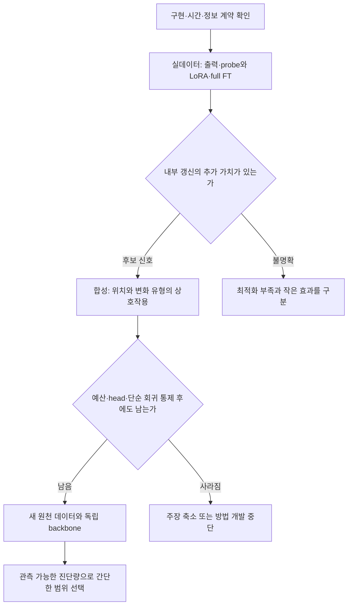

# 1. 이번 실험이 답할 질문

**같은 pretrained 시계열 FM과 같은 관측 정보를 사용할 때, 출력·동결 표현을 읽는 방법만 바꾸는 것보다 내부를 갱신할 추가 가치가 있는가? 그 추가 가치가 시간 의존성 및 변수 결합의 변화에 따라 다른 위치에서 나타나는가?**

최상위 목적은 설명 가능한 시계열 FM 적응 연구 주제를 찾는 것이다. 이번 단계의 목적은 새로운 adapter를 개발하기 전에 [가설 A](04_peft_adaptation_scope.md)의 전제가 실제로 있는지 판별하는 것이다. 소비처는 첫 실험의 범위와 이후 방법 개발 여부를 결정할 사용자·연구 검토자다.

상태 구분:

- `[확인: 코드/자료]`는 설치된 소스·checkpoint config·기존 원자료를 읽은 사실이다. 새로운 모델 학습 결과가 아니다.
- `[수학적 도출]`은 명시한 생성과정의 성질이다. 구현 검증이나 FM의 실제 반응과 다르다.
- `[설계안]`의 값은 첫 비교를 구체화하기 위한 제안이며 최적값·통계적 검출력의 보장이 아니다.
- 이번 사용자 요청은 A/B/C의 노트 보존과 A의 실험 설계다. 학습·패키지 설치·실행 명령 작성은 진행하지 않았다.

# 2. 결론부터: 실데이터의 필요성 확인 → 합성의 판별 → 새 원천의 확증

**실데이터 두 개발 패널에서 내부 적응 여지를 먼저 작게 확인하고, 정답 구조를 아는 합성에서 위치×변화의 상호작용을 검사한다.** 이후 새 원천 데이터와 다른 native multivariate backbone으로 적용 범위를 확인한다.

검토한 대안:

1. **실데이터만 먼저 크게 비교:** 실제 이득은 확인하기 쉽지만, 승리한 방법을 보고 “관계 변화였다”고 사후 설명할 위험이 크다. 첫 필요성 확인에 사용하되 기전 주장의 전부로 쓰지 않는다.
2. **합성에서 예상한 역할 분업을 만든 뒤 실데이터:** oracle과 교란을 통제할 수 있지만, FM보다 작은 회귀가 잘 푸는 문제에 맞춰 새 adapter를 만들 수 있다. 합성만 통과하면 방법 개발을 시작하는 gate는 두지 않는다.
3. **알려진 teacher의 time/group weight를 일부 바꿔 target 생성:** 어느 기능을 바꿨는지 정확히 알아 구현 진단에는 유용하다. 그러나 정답을 생성한 모듈을 같은 모듈로 되돌리는 문제가 되어 결론이 설계에 내장될 수 있다. 주기전 실험에서는 제외한다.

선행 기준은 Chronos-2의 native group/time 구조, ChronosX의 공변량 제거 대조, TRACE의 head/LoRA 선택 비교다. 이들의 성공을 재주장하는 대신 **출력 접근 범위와 적응 위치를 따로 통제**한다. [Chronos-2](https://arxiv.org/abs/2510.15821), [ChronosX](https://proceedings.mlr.press/v258/arango25a.html), [TRACE](https://arxiv.org/html/2503.16991v3).



그림은 연구 순서이며 실행 결과가 아니다.

# 3. 주장을 세 단계로 분리한다

**A1 — 내부 적응의 추가 가치.** 충분한 출력 보정·동결 표현 probe보다 내부 갱신이 나은가? Full FT만 이겨도 일반적인 적응 여지는 있지만 PEFT 위치 선택의 증거는 아니다.

**A2 — 위치와 변화의 상호작용.** Time-only와 group-only의 상대적인 이득이 변화 유형에 따라 달라지는가? 한 조건에서 한 방법이 1등이라는 사실보다, 정상 대조 대비 상대 차이가 어떻게 달라지는지가 중요하다.

**A3 — 선택 규칙의 실제 가치.** 관측 가능한 target support의 진단량으로 위치를 골랐을 때, 고정 LoRA 또는 작은 후보군의 일반적인 validation 선택보다 나은가? A1·A2가 확인된 뒤의 단계다. 이번 첫 파일럿에서 router·rank scheduler를 만들지 않는다.

Time/group은 독립적인 원인 손잡이가 아니다. Group module은 시간 정보를 포함한 표현을 받고 time module 변경은 이후 관계 결합에도 영향을 준다. A2가 확인돼도 우선 **특정 적응 위치의 선택적 반응**으로 해석한다. 실패 원인의 인과식별은 더 강한 주장이다.

# 4. Backbone과 실제 갱신 범위

## 4.1 첫 모델을 Chronos-2로 고르는 이유

[확인: 코드] 기존 환경의 `chronos-forecasting==2.3.1`에 full/LoRA `fit` 경로와 분리된 time/group attention이 있다. TimesFM 2.5의 공개 LoRA 예제는 native group 역할의 독립 검증을 대신하지 못하며, TimesFM 3·TiRex-2는 이 프로젝트에서 학습 경로 검증이 더 필요하다. 자세한 출처·경계는 [dossier §6](../../../reference/time_series_peft_research_dossier_20260907.md)에 있다.

[확인: config] 주 checkpoint 제안은 이미 캐시된 `amazon/chronos-2`, revision `29ec3766d36d6f73f0696f85560a422f50e8498c`다.

```text
encoder blocks          12
hidden dimension        768
attention heads         12
dimension per head       64
time/group q,k,v,o       모두 768 × 768, bias 없음
input/output patch       16
quantile levels          21
output dimension         21 × 16 = 336 / future patch
output hidden dimension  3072
base dropout             0.1
normalization            context 기반 scale + arcsinh
```

검토한 로컬 파일은 `chronos/chronos2/{model,layers,pipeline}.py` 및 캐시의 `config.json`이다. 모델을 로드해 PEFT를 붙이거나 backward를 실행한 것은 아니다.

## 4.2 이름 대신 실제 module path를 고정한다

```text
시간 경로 T   encoder.block.<i>.layer.0.self_attention.{q,k,v,o}
그룹 경로 G   encoder.block.<i>.layer.1.self_attention.{q,k,v,o}
출력 head     output_patch_embedding
공식 head LoRA의 대상
              output_patch_embedding.output_layer
```

`i=0,...,11`. PEFT wrapper prefix는 실행 환경에서 실제 `named_modules()`와 trainable parameter 목록으로 검증한다. `self_attention.*` suffix만 사용하면 T와 G에 모두 들어간다.

LoRA 설정의 첫 제안은 bias 학습 없음, adapter dropout 0, `alpha/r=2` 고정이다. 다른 rank에서 alpha까지 고정해 업데이트 scale이 함께 바뀌지 않게 한다. 초기화는 같은 모듈·같은 rank끼리 paired seed를 사용하며 무작위 A, zero B로 base 출력에서 시작한다.

## 4.3 동일 총예산 비교와 factorial을 분리한다

한 종류의 attention에 rank r을 쓰면 추가 파라미터는 다음과 같다.

\[
P_T(r)=P_G(r)=12\times4\times r(768+768)=73{,}728r.
\]

주비교는 head를 동결한 동일 총예산이다.

```text
ID      time rank    group rank    head          추가 학습 파라미터
T8      8            없음          동결          589,824
G8      없음         8             동결          589,824
TG4     4            4             동결          589,824
```

이 표는 **주어진 예산을 한 경로에 집중할지 나눌지**의 비교다. TG4의 경로별 rank가 다르므로 T×G의 순수한 2×2 factorial이라고 부르지 않는다.

동시 적응의 상호작용이 핵심으로 남을 때만 별도 비교를 추가한다: F0, T8, G8, TG8. TG8은 1,179,648 parameters로 비용이 두 배다. 이 실험의 손실 대비 `L_TG8 − L_T8 − L_G8 + L_F0`는 지정한 학습 절차 아래 두 적응 허용의 결합 효과이며 동일 예산 우위와는 다르다.

공식 default module map의 rank 8은 T8+G8에 output-layer LoRA까지 포함하므로 총 **1,206,912 parameters**다. 이를 OFF-LORA라 부르며 강한 실용 baseline으로 유지하되, T8/G8/TG4와 같은 예산이라고 표기하지 않는다.

Head readout이 결론을 바꾸는지 필요할 경우 T8/G8/TG4 모두에 같은 head LoRA rank 8을 추가한다. 이때 각 617,088 parameters다. 특정 방법에만 head를 허용하지 않는다. 위 수치는 config와 행렬 차원의 산술값이며 실제 등록 목록을 실행 시 재확인한다.

# 5. 출력 보정과 probe를 약하게 두지 않는다

“출력으로는 안 된다”를 검증하려면 무엇을 입력으로 받는 출력 방법인지 구분해야 한다.

```text
F0       동결 FM, 동일 native multivariate 입력
AFF      target의 최종 quantile 출력에 공통 양의 scale·offset
H-LIN    동결 encoder의 forecast embedding에 선형 residual readout
H-MLP    같은 embedding에 비선형 residual readout
H-FULL   기존 output_patch_embedding 전체만 fine-tuning
OFF-LORA 공식 LoRA module map, 비교용 공통 학습 계약
FULL     전체 pretrained model fine-tuning
RAW      같은 과거 원자료를 받는 단순 AR/VARX·residual 회귀
```

**AFF:** 한 target의 **raw-space 출력**에 `q'τ,h = a_c qτ,h + b_c`, `a_c>0`를 적용하며 lead와 quantile 간에는 공유한다. Native loss로 학습할 때는 보정한 raw quantile을 해당 origin의 loc/scale+arcsinh로 변환한 뒤 같은 loss를 계산한다. Arcsinh 공간에서 affine을 적용한 다른 함수를 AFF라고 부르지 않는다. 항상 F0를 초기값으로 포함한다. 이 방법은 hidden이나 raw covariate를 직접 읽지 않으므로 AFF 실패만으로 모든 출력 적응을 반증할 수 없다.

**H-LIN/H-MLP:** 이미 group interaction을 거친 frozen forecast embedding `z`를 읽고, 기존 normalized quantile 출력에 zero-initialized residual을 더한다. Probe가 잘되면 “관계 정보가 필요 없다”가 아니라 **현재 동결 표현으로도 충분히 읽어낼 수 있다**는 뜻이다. 평가 대상은 필요한 모든 future patch의 forecast embedding이며 context token까지 전체 hidden sequence를 읽는 모든 가능한 probe를 배제한 실험은 아니다.

[확인: 코드] `encode`가 encoder output·context normalization 상태를 반환한다. `forward`는 `hidden_states[:, -num_output_patches:]`의 **모든 future patch**에 같은 `output_patch_embedding`을 적용한다. H=96은 6개, H=144는 9개 embedding을 모두 cache하고 각각에 같은 residual readout을 공유한다. 아래 parameter 수는 이 공유 readout의 크기다. Cache에는 group 구성·origin·checkpoint·dtype·normalization 상태를 함께 기록하고, 미래 target 값은 feature 생성에 제공하지 않는 경로를 사용한다.

Config 기준 probe 크기 제안:

```text
H-LIN    Linear(768,336), bias 포함                258,384
H-MLP    Linear(768,533) → ReLU → Linear(533,336)  589,301
H-FULL   기존 ResidualBlock 전체                3,653,280
```

H-MLP는 T8/G8 예산과 523개, 약 0.09% 차이다. 사용하지 않는 dummy parameter로 숫자를 맞추지 않는다. H-FULL은 더 큰 대조군이며 저장 예산 우위를 주장하는 비교가 아니다. 대신 frozen embedding을 cache하면 전체 backbone backward 없이 강한 readout 대조를 만들 수 있다.

**RAW:** 같은 정보를 작은 모델이 직접 읽을 수 있게 한다. 실제 데이터에서는 training-only scale을 적용한 ridge AR/VARX 또는 F0+raw-lag residual 회귀를 보조 기준으로 둔다. 합성에서는 생성법상 정확한 선형 경쟁자이므로 필수다. Raw lag를 출력에 다시 넣은 방법을 AFF나 H-LIN과 같은 함수 클래스로 묶지 않는다.

RAW는 조건부 평균을 모든 quantile에 복제하지 않는다. 같은 supervised future label로 평균 회귀를 학습하고, fit 내부의 out-of-fold residual quantile offset으로 21개 quantile을 구성한다. 실데이터는 과거 block으로 학습해 뒤 block을 예측하는 rolling residual, 합성은 episode 단위 분리 residual을 사용한다. 최종 회귀는 전체 fit으로 재학습하며 residual estimation·ridge 선택 비용도 기록한다. 참 σ=0.6은 analytic oracle에만 제공한다. RAW의 평균 MSE와 calibration을 포함한 pinball 결과를 따로 남긴다.

첫 ridge penalty 후보는 표준화한 feature에서 `{1e−3,1e−1,10}`이며 validation 주점수로 선택한다. 실데이터의 첫 raw feature는 origin o에서 이미 관측한 각 채널의 lag `{1,...,16,H,2H,3H}`이고, 미래 lead별 direct 회귀를 쓴다. 합성의 horizon별 정렬은 §8.4를 따른다. 평균 회귀+residual quantile 방식은 native quantile-loss 학습과 다른 estimator임을 명시한다.

# 6. 실행 전 확인할 계약 — 성능 실험에 앞선 최소 확인

다음은 이후 실행 단계의 체크리스트다. 현재 통과한 것으로 표시하지 않는다.

- [ ] `peft` 사용 가능 여부를 assert한다. 현재 로컬 2.3.1은 미설치 시 LoRA 요청을 full FT로 바꾸는 fallback이 있어 이를 허용하면 비교 자체가 무효다.
- [ ] 실제 trainable 이름·개수와 optimizer 등록을 일치시킨다. 초기/업데이트 후 base tensor 비교로 동결을 확인한다.
- [ ] Zero LoRA·zero residual의 출력이 F0와 허용 오차 안에서 같음을 확인한다.
- [ ] Target을 바꿔도 입력 embedding이 변하지 않고, future value를 차단했을 때 예측도 바뀌지 않는지 확인한다.
- [ ] 같은 episode/panel의 동시 관측만 같은 group ID로 묶는다. **다른 시점의 window를 같은 group으로 묶으면 미래 관측이 다른 batch row를 통해 유입될 수 있다.** Group ID에 panel뿐 아니라 origin/episode도 포함한다.
- [ ] 공통 origin manifest에서 각 입력을 L+H episode로 만들고 `min_past=L`로 고정하거나 동일 custom sampler를 사용한다. 공식 long-series random cut이 stride16과 일치한다고 가정하지 않는다. Probe와 LoRA/FULL의 origin 순서·재사용 횟수·mask·group 구성 일치를 assert한다. 동일 origin이 중복 추출되면 batch 내 sample instance를 구분한다.
- [ ] 미니배치를 나눌 때 독립 group 단위로 나눈다. 한 패널의 채널을 microbatch로 쪼개 정보량을 바꾸지 않는다. 한 group도 못 담으면 해당 구성을 미실행으로 보고한다.
- [ ] Base dropout과 adapter dropout을 기록한다. Frozen probe는 eval cache인데 LoRA만 base dropout 0.1을 켜면 구조 외 차이가 생긴다.
- [ ] 기전 비교에서는 모든 방법에 같은 deterministic backbone 설정(dropout 0)을 적용한다. `model.eval()` 한 번만 호출하면 Trainer의 `train()`에 덮일 수 있으므로 실제 Dropout와 MHA dropout 경로를 확인한다. OFF-LORA는 공식 **module map** baseline이며 stock training recipe의 무수정 재현이라고 부르지 않는다. 기본 dropout 0.1은 후속 구현 민감도로 따로 확인한다.
- [ ] Probe·LoRA·FULL에서 같은 quantile grid, normalization, target mask와 reduction을 사용한다. 합성의 U/V future는 loss 대상에서 제외하고 Y만 평가한다.
- [ ] Native loss의 batch 평균에 masked auxiliary rows가 포함되는 효과를 기록한다. Real 패널의 모든 target 학습과 합성의 Y-only 학습을 섞어 loss 크기로 비교하지 않는다. Target 수가 다른 조건을 섞어 학습한다면 유효 target 기준 reduction을 별도로 고정한다.
- [ ] 같은 입력으로 backward 가능 여부, peak memory, update time을 측정한다. Official fit은 모델 복사도 만들므로 adapter bytes만으로 메모리를 예측하지 않는다.

Warmup 이후 정해진 수의 update에서 자원을 측정한 다음 전체 예상 비용을 산출한다. 특정 GPU에 들어간다거나 몇 시간 걸린다는 보장은 아직 없다.

# 7. 개발 실데이터 — 적용 가능성이 있는 오류부터 찾는다

## 7.1 첫 두 패널

특정 응용 도메인이 지정되지 않았으므로, 이미 로컬에 있고 시간축·동시 변수 구성이 명확한 두 패널을 제안한다. **둘 다 이전 연구에서 본 개발 자료**다.

```text
ETTm2
  파일    data/ETT-small/ETTm2.csv
  확인    69,680행, 7변수, 2016-07-01~2018-06-26
  L/H     384/96: 과거 4일 → 다음 1일
  역할    낮은 변수 수에서 적응·구현 경계 확인

Jena 2024 raw
  파일    data/jena_mpi_roof/mpi_roof_2024.csv
  확인    52,704행, 21변수, 2024-01-01~2025-01-01
  L/H     576/144: 과거 4일 → 다음 1일
  역할    다른 물리 도메인과 변수 수에서 동일 비교
```

L/H는 표준 최적값이 아니라 동일한 물리 기간을 맞춘 설계다. 행 구조·빈 셀은 확인했으나 sentinel·중복·간격·센서 정지는 아직 전체 QC하지 않았다. 별도 `weather.csv`는 52,696행이므로 raw 연간 파일과 동일시하지 않는다.

각 패널의 적격 numeric target을 고정 group으로 함께 예측한다. 미래 변수값은 모두 가린다. Calendar·외부 예보·다른 데이터셋을 추가하지 않는다. 결측·센티널은 input mask로 처리하고 query label의 결측은 해당 metric에서만 제외한다. 미래에서 과거로 보간하거나 양쪽 경계의 값을 써서 채우지 않는다.

Training에서 상수인 target, timestamp gap, 단위·물리적 파생 변수 목록을 성능 보기 전에 기록한다. Jena의 파생 변수는 독립 센서 수를 뜻하지 않는다. 물리적으로 구분되는 subset의 보조 실험은 metadata 기준으로 미리 고정하며 결과가 잘 나오는 채널만 남기지 않는다.

## 7.2 시간과 관측 예산

[설계안] QC 뒤 마지막 완전한 일 경계에서 다음 길이가 가능한 연속 구간을 metadata만으로 고른다. 실제 timestamp와 file hash를 실행 manifest에 고정한다.

```text
순서       입력용 과거       fit label 구간      validation label    evaluation label
길이       4H                64H                 16H                 32H
용도       최초 L context    adapter/head 학습   LR·checkpoint 선택  개발 진단
```

두 패널 모두 4+64+16+32=116일이다. 64일은 초소량이라는 주장을 위한 값이 아니라 충분한 적응·검증 구간을 먼저 확보하려는 첫 예산이다. 작은 support 비교(예: 16H)는 이후 중첩된 동일 cutoff의 보조 실험으로 둔다. 16H를 별도 계절에서 뽑지 않는다.

Origin `o`의 context는 `[o−L,o)`, label은 `[o,o+H)`다. Fit target 전체가 fit 구간 안에 들어오는 origin만 허용한다. Validation/evaluation의 과거 context가 이전 구간을 포함하는 것은 당시 관측 가능한 입력 사용이며, 그 미래 label을 학습에 쓰는 것과 다르다.

학습 origin stride 제안은 16(raw input patch 단위), validation/evaluation stride는 H다. 평가 target 구간은 겹치지 않게 하지만 자기상관은 남는다. 같은 origin에서 모든 방법에 동일한 group과 관측 mask를 제공한다. 여러 origin의 측정값이 batch 내 group attention으로 섞이지 않게 한다.

이를 보장하기 위해 허용 origin을 먼저 manifest로 고정하고, 각 origin의 L+H slice를 하나의 episode로 만들어 `min_past=L`을 적용하는 방식을 우선한다. 모델에 긴 원자료만 넘겨 내부 random slicing에 맡기는 방식은 이번 공통 sampler 계약과 다르다. 최종 실행 로그에 실제 origin sequence와 sampling 횟수 hash를 남긴다.

이 단계의 evaluation은 A를 고르는 개발 자료다. 결과를 보고 다음 방법을 정할 수 있지만 최종 blind test라고 보고하지 않는다.

## 7.3 왜 이 데이터로 shift 유형을 붙이지 않는가

ETT에서 T가 이기고 Jena에서 G가 이겼다고 두 데이터를 “시간 변화/관계 변화”로 명명하면 순환 논리다. 여기서는 **내부 갱신의 추가 이득 유무와 오류 위치를 탐색**한다. 변화 유형의 판별은 다음 통제 생성에서 다룬다. 실제 shift descriptor는 fit/validation 관측만으로 정의한 뒤 독립 데이터에서 평가해야 한다.

# 8. 합성 판별 실험 — 유지되는 양을 수식으로 명시한다

## 8.1 권장 생성과정

표준 autoregressive 조건부 평균과 알려진 innovation 분포를 사용하는 Gaussian lagged-triangular 과정이다. 특정 논문이 아래 수치·조합을 그대로 검증했다는 뜻은 아니다. VAR의 안정성·예측 covariance라는 선행 원리를 참고하며 아래 성질은 직접 도출한다. [statsmodels VAR 문서](https://www.statsmodels.org/stable/vector_ar.html).

독립적인 백색잡음 `U_t,V_t,ε_t ~ iid N(0,1)`를 두고:

\[
Y_t=aY_{t-s}+b\{\cos\theta\,U_{t-d}+\sin\theta\,V_{t-d}\}+\sigma\epsilon_t.
\]

[설계안] `a=0.5`, `b=√0.39`, `σ=0.6`, `d=48`, `H=16`, `L=256`을 첫 값으로 고른다. 자기항·관계항·잡음의 분산 기여가 0.25/0.39/0.36으로 한 항을 거의 무의미하게 만들지 않는다. H는 native output patch 1개이며 모든 필요한 lag가 관측 context에 들어간다.

네 조건:

```text
조건       자기지연 s    결합 각도 θ      바꾸는 직접 항
Q00 / P    32            π/12 (15도)      정상 기준
Q10        64            π/12            자기지연
Q01        32            π/4  (45도)      두 driver의 결합 방향
Q11        64            π/4             두 항 모두
```

양쪽 θ에서 두 driver 계수가 모두 0이 아니다. `0→π/2`는 교환 가능한 U/V의 순열이므로 주실험으로 사용하지 않는다. `0→π/4`는 유효 driver 수까지 바꾸므로 별도의 support-change stress 조건이다.

## 8.2 정확히 같은 것과 같지 않은 것

[수학적 도출] `a²+b²+σ²=1`이므로 정상상태에서 `Var(Y)=1`. `H≤min(s,d)`와 `L≥max(s,d)`이면 전체 관측 이력 `F_t`에 대한 미래 평균은:

\[
\mu_h=aY_{t+h-s}+b\{\cos\theta\,U_{t+h-d}+\sin\theta\,V_{t+h-d}\},
\qquad h=1,\ldots,H.
\]

필요한 자기항·driver 항은 모두 관측된 과거다. 따라서:

\[
Y_{t+1:t+H}\mid F_t\sim\mathcal N(\mu,0.36 I_H),\qquad
q_\tau^*(h)=\mu_h+0.6\Phi^{-1}(\tau).
\]

모든 조건의 oracle MSE는 0.36이다. 자기 이력만 사용하는 oracle의 평균은 `aY_{t+h-s}`, 조건부 분산은 `b²+σ²=0.75`다. 전체 driver 정보가 주는 oracle MSE 감소는 0.39로 같고, 추가 조건부 정보량은 `H/2 × log(0.75/0.36)`으로 같다.

`s`가 같을 때 θ만 회전하면 Y의 **전체 단변량 Gaussian 과정 법칙**과 ACF가 유지된다. 구체적으로 `s`의 정수배 k에서 `γ_Y(k)=a^(|k|/s)`, 그 외 lag에서는 0이다. U와 V의 단변량 law도 같다.

한계는 두 가지다.

1. s 변화는 조건부 평균식의 자기지연만 직접 바꾸지만 간접 전파의 교차공분산이 `d+ms`에 나타나므로 **전체 cross-lag covariance가 같지는 않다.** Q10을 순수한 모든 의미의 temporal-only 변화라고 부르지 않는다.
2. 같은 L에서 이용할 수 있는 자기회귀 lag 쌍은 L−s로 달라진다. Oracle 정보량은 같아도 미지의 규칙을 문맥 안에서 알아내는 난도까지 같지는 않다. L=512 보조 조건에서 차이가 유지되는지 확인하며 조건별로 L을 달리해 주비교를 꾸미지 않는다.

## 8.3 P/Q와 독립 episode의 의미

주파일럿은 **Q-only adaptation**이다. 동일한 원본 checkpoint F0에서 각 Q 조건의 독립 정상 episode로 적응한다. P=Q00은 비교 기준 생성분포이며 Chronos-2의 알려진 사전학습 분포가 아니다. “학습했던 P에서 Q로 이동한 모델”이라는 해석은 하지 않는다.

Source-adaptation 의존성을 검토할 필요가 생기면 후속으로 하나의 공통 source-adapted checkpoint FP를 만들고 모든 방법에 복제한다. 이때 P→P와 P→Q를 함께 비교하고 source 비용도 별도 기록한다. 방법별로 서로 다른 FP를 만든 뒤 target 방법만 비교하지 않는다.

첫 제안은 조건당 독립 학습 episode **n=64**, 별도 validation 64, evaluation 256이다. 각 episode는 `L+H` 길이를 갖고 단 하나의 forecast origin을 사용한다. n은 label window 수다. Y/U/V의 과거 관측은 `3nL`개 scalar, supervised future Y는 `nH`개이며, 관측 scalar 총량은 `n(3L+H)`다. 미래 U/V는 생성되더라도 모델에 관측값으로 제공하지 않는다. “64개 숫자만 학습”이라고 표현하지 않는다.

`min_past=L` 및 episode 길이 L+H로 origin이 정확히 L인지 확인한다. 공식 기본값대로 임의의 짧은 context cut을 만들면 생성 실험의 문맥 계약이 달라진다. U/V는 past-only covariates, future target loss와 주평가는 Y만 사용한다.

에피소드들은 독립적으로 생성하고 같은 episode의 U/V/Y만 같은 group에 넣는다. 주비교는 조건 간 공통 난수의 paired 변형을 사용하고, 서로 다른 episode ID 사이의 seed는 독립으로 둔다. Bootstrap은 같은 episode ID의 모든 Q 조건·모든 방법을 하나의 묶음으로 재표집한다. 학습 corpus 반복에서도 조건 간 대응을 보존하며 optimizer seed와 데이터 생성 seed는 별도 축이다.

Burn-in 제안은 최대 자기지연 기준 `12×64=768`이다. 초기값 0의 잔여 자기회귀 성분은 가장 긴 lag에서 분산 계수 `0.5^24` 수준으로 줄어든다. 이는 근사 근거이며 실제 평균·분산·ACF·oracle residual 검증을 대신하지 않는다. 한 trajectory 중간에서 계수를 바꾸면 초기 Q가 정상분포가 아니므로 이번 주판별에서 그 방식을 쓰지 않는다.

## 8.4 이 합성은 내부 PEFT를 반드시 요구하지 않는다

Oracle 평균은 raw lag의 선형결합이다. 충분한 표본을 가진 ridge AR/VARX나 F0+raw-lag residual 회귀가 풀 수 있다. θ 회전은 작은 input mixer로도 흡수할 수 있다. **그래서 합성은 내부 적응의 필연성을 만드는 양성대조가 아니라, 표본과 예산을 제한했을 때 위치별 반응이 다른지 판별하는 실험이다.**

필수 대조:

- 정답 s·θ를 아는 analytic oracle: 학습 baseline이 아니라 알려진 위험 하한.
- 후보 lag 집합 `{32,48,64}`를 모든 조건에 동일하게 허용하는 ridge/VARX: 실제 label로 계수를 학습한다. 조건별 정답 lag를 알려주는 oracle과 구분한다.
- F0+동일 raw-lag residual 회귀: FM의 출력이 남긴 오류를 간단한 외부 수정이 회수하는지 검사한다.
- F0, AFF, H-LIN/H-MLP 및 T8/G8/TG4.

마지막 관측 시점 t에서 h-step 미래를 예측할 때 후보 lag ℓ의 feature는 `Y_(t+h−ℓ), U_(t+h−ℓ), V_(t+h−ℓ)`로 정렬한다. H≤16<ℓ이므로 모두 context 안의 관측값이다. 모든 h에 origin 기준 같은 lag 한 점만 주어 정확한 선형 baseline을 약하게 만들지 않는다. 학습 label은 FM과 같은 nH개의 future Y로 제한한다. Context의 Y까지 추가 감독 label로 쓰는 regression은 별도 관측 활용 조건으로 표시한다.

Ridge가 잘 풀었다고 제외하거나 새로운 비선형 생성기로 바로 도망가지 않는다. 비선형 generator를 추가한다면 quadratic 등 그 생성법의 정확한 단순 경쟁자를 함께 추가해야 하며, 위 Gaussian quantile·정보량 공식을 재사용하면 안 된다.

원한다면 별도 부정 대조로 독립 distractor W를 넣을 수 있다. W는 실제 조건부 미래 정보를 추가하지 않으므로 정보량을 유지한다. 실제 U/V를 섞어 없애는 것은 정보 파괴 실험이므로 Q01과 같은 조건으로 취급하지 않는다.

# 9. 주평가와 사전에 계산할 대비

## 9.1 점수 정의

주평가는 동일 21개 quantile grid에서 mean pinball score다. `ρτ(e)=e(τ−1[e<0])`를 쓴다.

실데이터에서는 target c의 fit 구간 표준편차 `s_c`로만 scale을 정해, target별 `2ρτ(y−q)/s_c`를 origin·horizon·quantile에 평균한 뒤 target에 동일 가중 평균한다. 상수/거의 상수 target의 처리와 수치 floor는 fit-only QC에서 고정하고 별도 집계한다. 이 점수를 표준 WQL과 동일하다고 부르지 않는다.

합성은 모든 조건의 Y 분산이 1이므로 raw-scale mean pinball을 사용한다. 알려진 oracle quantile을 같은 평가 episode에서 채점한다. MSE와 oracle MSE 0.36의 차이는 별도 기전 진단으로 보고한다. Gaussian 합성에서는 mean=median이지만 실제 데이터에서는 0.5 quantile을 conditional mean으로 부르지 않는다.

보조: median MAE, horizon별 점수, quantile crossing, 80% interval coverage와 width, trainable bytes·peak memory·시간. A의 첫 판정에서 보조지표 중 잘 나온 것을 주지표로 바꾸지 않는다.

모든 FM 적응은 같은 native quantile 목적함수·normalization을 사용한다. 외부 probe도 normalized 출력 residual에 같은 loss를 적용한다. 최종 raw-space 주점수와 학습 loss의 집계가 다를 수 있음을 명시하고, validation model selection은 모든 방법에서 같은 주점수로 한다. 공식 `eval_loss`가 이 점수라고 가정하지 않는다.

## 9.2 A1 — 내부 이득의 비교

Fit/validation에서 선정한 가장 강한 출력/probe 대조를 H, 내부 방법을 I라고 할 때:

\[
\Delta_{I:H}=(S_H-S_I)/S_{F0}.
\]

Evaluation 결과를 보고 가장 약한 head를 고르지 않는다. H 선택 후보·예산은 미리 고정하고 H-LIN/H-MLP/H-FULL의 개별 결과도 함께 남긴다. “유의차 없음”은 head로 충분하다는 증거가 아니다. 추가 이득의 상한까지 작게 제한할 수 있어야 그 주장을 할 수 있다.

## 9.3 A2 — 위치×변화의 상호작용

동일 예산 T8/G8에서 `D(Q)=S_T8(Q)−S_G8(Q)`를 계산한다. 양수이면 G가 더 낫다.

\[
I_{relation}=D(Q01)-D(Q00),\qquad
I_{time}=D(Q10)-D(Q00).
\]

역할 분업 가설의 방향 예측은 `I_relation>0`, `I_time<0`이다. `D(Q01)−D(Q10)`도 직접 계산하되 두 개별 유의성 검정의 결과로 상호작용을 대체하지 않는다. 전체 D 값도 공개한다. 상대 이득만 달라지고 T가 모든 조건에서 이기면 “조건마다 서로 다른 모듈이 필요하다”는 강한 주장은 성립하지 않을 수 있다.

Q11은 결합 변화의 탐색·민감도다. TG4의 우위는 같은 예산을 나누는 가치이며, TG8을 추가한 factorial의 상호작용과 구별한다. Head 정책을 바꾸면 이 대비도 같은 정책으로 다시 정의한다.

## 9.4 표본과 불확실성

실데이터의 일별 evaluation block을 모든 방법·채널에 함께 재표집한다. 시간 의존성을 고려한 block 길이(예: 최소 한 horizon, 일·주 의존성의 민감도)를 보고한다. 32일이 긴 독립 표본은 아니며 2개 패널로 domain 일반화 유의성을 주장하지 않는다.

합성의 episode는 독립 평가 단위지만, 한 학습 corpus와 한 optimizer seed의 결과에 대한 **조건부** 불확실성이다. Evaluation episode만 많이 늘려 학습 불확실성까지 해결했다고 하지 않는다. 신호가 남으면 독립 학습 corpus와 optimizer seed를 별도로 늘린다.

실용적 최소효과 δ는 아직 관측한 PEFT 분산·비용이 없으므로 보편적 1% 같은 숫자로 확정하지 않는다. 첫 단계는 효과·비용·분산을 추정하고, 이후 확증에서 δ와 표본수를 고정한다. 논문용 확인 단계에서는 δ·주대비·다중비교 처리·중단 규칙을 evaluation 공개 전에 등록한다. 이전 HQ 실험의 분산이나 다른 study의 +8%/+5% gate를 재사용하지 않는다.

# 10. 최소 실행 묶음과 학습 예산 제안

전체 조합을 한 번에 실행하지 않는다. 아래는 후속 실행을 구체적으로 검토하기 위한 묶음이며 현재 실행 승인이 내려졌다는 뜻은 아니다.

## S0. 정확성·비용 preflight

한 작은 group의 forward/backward, zero-update identity, module map, dropout, mask, group 분리, 메모리와 속도를 확인한다. 성능 결론은 없다. 한 group을 담지 못하면 채널을 임의로 자르지 않고 configuration/resource 조건을 재설계한다.

## S1. 두 실제 개발 패널의 적응 여지

F0 및 학습 6종 AFF/H-LIN/H-MLP/H-FULL/OFF-LORA/FULL을 비교한다. Native 내부 학습이 필요한 방법은 OFF-LORA/FULL 두 종류이며, 나머지는 동일한 frozen cache를 재사용할 수 있다. RAW의 ridge 후보는 별도 CPU 대조로 기록한다.

[설계안] 방법별 3개 LR, seed 1개로 validation 탐색: `2 panels × 6 methods × 3 LR = 36 fit`. 그중 backbone backward가 필요한 fit은 12개다. 각 방법의 선택된 설정에 seed 2개를 추가하면 24 fit(그중 backbone 8개)이 더해진다. 기본 최대 묶음은 총 60 fit이며, 자원 실측 전 전체 소요시간은 미정이다. 경계 rescue는 이 숫자에 포함되지 않으며 별도로 센다.

첫 LR 후보:

```text
AFF                    1e-3, 3e-3, 1e-2
H-LIN / H-MLP          1e-4, 3e-4, 1e-3
H-FULL                 3e-5, 1e-4, 3e-4
OFF-LORA / T / G / TG  1e-5, 3e-5, 1e-4
FULL                   1e-6, 3e-6, 1e-5
```

LoRA에 full FT와 같은 작은 LR 하나만 주지 않기 위한 log-spaced 후보이며 최적값이라는 뜻은 아니다. 공식 Chronos-2 문서도 LoRA에 더 높은 LR을 권한다. [공식 fit](https://github.com/amazon-science/chronos-forecasting/blob/main/src/chronos/chronos2/pipeline.py).

나머지 첫 공통안: AdamW, weight decay 0, adapter dropout 0, 비교용 base dropout 0, 최대 500 optimizer updates, 매 50 updates와 step 0에서 validation, 동일 group 단위 sampler. **FM의 native context 기반 loc/scale+arcsinh는 유지하고**, RAW의 추가 전처리 scale과 주평가의 target scale만 fit에서 추정한다. Validation/evaluation 미래 label은 어느 normalization에도 쓰지 않는다. Effective batch는 update당 독립 group 8개를 목표로 하고 microbatch와 accumulation은 메모리 실측으로 정한다. 공식 API의 batch size는 series 수이므로 실제 group·target 수 일치를 assert한다.

0-step 후보를 포함하므로 validation 기준으로 적응하지 않는 선택도 가능하다. Best checkpoint를 실제 저장·복구한 뒤 평가한다. Probe의 빠른 계산을 숨기지 않고 cache 생성 비용까지 합쳐 보고한다.

500 updates는 bounded screen이지 full FT의 수렴 보장이 아니다. 최적 LR가 탐색 경계이고 validation이 계속 개선되거나 best checkpoint가 마지막 update에 몰리면 **최적화 제한**으로 기록한다. Validation만 보고 한 번의 사전 정의 rescue(인접 LR 한 점 또는 최대 1,000 updates 중 필요한 한 축)를 허용할 수 있다. 양·음성 결과 모두 같은 규칙을 적용하고 해당 추가 비용을 센다. Rescue 뒤에도 경계에 있으면 전역 적응 가능성을 부정하지 않는다.

## S2. 역할 판별

S2의 비용은 real 추가, synthetic screen, 독립 반복으로 분리한다. S1에서의 신호를 가진 개발 설정에 T8/G8/TG4를 추가하면 **패널당 3 scopes × 3 LR = 9 backbone fit**, 두 패널 모두면 18 fit이다. 합성 Q00/Q10/Q01/Q11, n=64와 같은 metric·head 정책을 별도로 고정한다.

첫 합성 역할 screen의 backbone fit은 `4 Q × 3 scopes × 3 LR × 1 seed = 36`개다. AFF/H-LIN/H-MLP와 RAW는 별도 cache/회귀 비용으로 기록한다. 전체 조합에 FULL·TG8·추가 rank·추가 horizon을 동시에 늘리지 않는다.

역할 차이가 남을 때만 선택된 LR/학습 규칙을 고정하고 독립 학습 corpus와 optimizer seed를 확장한다. 확인용 표본 제안은 최소 3개 학습 corpus × 2 optimizer seeds이며, 4 Q × 3 scopes를 모두 유지하면 **72 backbone fit 규모의 별도 묶음**이다. 이전 fit 재사용 여부와 실제 추가 수를 구분한다. 이 숫자는 검출력의 보장이 아니며 필요한 corpus 수는 pilot 상호작용의 분산과 이후 고정할 δ로 산정한다. Held-out evaluation episode를 늘리는 것만으로 이를 대신하지 않는다.

단순 oracle·RAW·probe가 이미 차이를 설명하면 새 adapter를 개발하지 않는다. FULL만 개선하고 T/G 차이가 없으면 일반 적응 연구로 해석을 좁힌다.

## S3. 적용 범위와 독립 검증

새 원천 family는 방법·정보 계약·HPO 예산을 고정한 뒤 평가한다. 이미 본 ETT/Jena의 다른 해상도·연도를 새 family로 세지 않는다. 이전 specialist holdout의 hospital/m5/restaurant/solar/us/world도 현재 연구 설계에서 결과를 본 개발 자원이다.

예약 후보는 **Beijing Multi-Site Air Quality**다. UCI 공식 metadata는 12개 station, 2013-03~2017-02 시간별 자료, pollutant 6개·기상 6개 및 NA를 명시한다. 첫 계약 후보는 station별 pollutant 6개 고정 target group, 미래 정보 없음이다. 원자료 다운로드·QC·이전 노출 검증은 아직 하지 않았으므로 확정된 holdout이 아니다. Station 간 동시 충격도 있어 12개 독립 domain으로 세지 않는다. [UCI 공식 자료](https://archive.ics.uci.edu/dataset/501/beijing+multi+site+air+quality+data).

두 번째 native architecture는 TimesFM 3 또는 TiRex-2의 검증된 학습 경로를 확보한 뒤 선택한다. Chronos-2-small/synthetic checkpoint는 보조 민감도이지 독립 architecture가 아니다. 이 단계 전에는 결론을 Chronos-2와 현재 검사한 조건에 한정한다.

새 원천은 연구자가 이전 결과를 보지 않았다는 뜻이며, FM의 사전학습에 없었다는 뜻은 아니다. Corpus 제외·시점·checkpoint provenance는 별도로 확인한다.

# 11. 결과에 따른 다음 행동

```text
관찰                                        해석과 다음 행동
F0가 oracle/강한 대조에 이미 가까움          그 조건의 적응 여지가 작음; 난도를 억지로 높이지 않음
AFF 또는 충분한 probe가 내부와 동등         내부 갱신 필요성의 근거 약함; 단순 해법을 남김
FULL만 개선, PEFT는 최적화 경계             최적화 제한과 rank 제한 구분; 한 번의 rescue 후 범위 제한
OFF-LORA 개선, T/G 상호작용 없음            일반 LoRA 활용 근거; A의 역할 선택 기여는 약함
T/G 차이가 head·예산 통제로 사라짐          용량/출력 접근의 효과; 역할 기전 주장 중단
합성에서만 예상한 분업                       통제 generator의 현상; 실제 적용 가능성 미확인
상호작용은 있으나 고정 T 또는 G가 늘 우위   변화별 선택이 필요하다는 강한 주장은 보류
독립 조건에서 예측 가능한 상호작용          작은 범위 선택 규칙 검토; validation 선택과 비교
선택의 regret가 독립 기간 수에 의존          B의 문제 존재 여부를 별도 검토
실제 필요한 예측 능력 손실                   C의 deployment 요구를 고정한 뒤 별도 검토
```

중단 규칙: 동일 원인에 대한 LR/학습 길이 rescue는 **1회**까지 제안한다. 이후 단순 baseline이 해결하거나 신뢰구간이 실용적 이득을 배제하면 해당 조건의 내부 PEFT 개발을 멈춘다. 불확실성이 큰 경우는 가설 반증과 구분한다. Generator·loss·head를 계속 바꿔 양성 결과를 찾는 연쇄 실험으로 넘어가지 않는다.

# 12. 이후 실행에서 남길 산출물

실행한다면 기존 experiments/results 구조에 연구 단위를 하나 만들고 다음 기록을 남긴다. 이번에는 해당 실행 폴더·스크립트를 생성하지 않았다.

- 계약: checkpoint/config hash, package versions, data hash, target/group/availability/split 정의, 미리 정한 비교군과 주대비.
- 구조: trainable parameter 전체 목록, frozen tensor 변화 검사, 실제 dropout/mask, zero-update identity.
- 비용: 각 trial의 optimizer steps, effective groups/target 수, 전체 관측량·고유 supervised label, peak memory·wall time·HPO 비용.
- 성능: origin×target×horizon×quantile 단위 예측, method별 validation 선택 기록, paired 효과·상호작용과 불확실성.
- 반증: RAW/probe와 oracle 결과, 실패·미실행 이유, 바뀐 계약과 이전 결과를 그대로 보존한 경위.

첫 산출물의 목표는 “T 또는 G가 이겼다”가 아니다. **내부 갱신이 필요한 조건이 있는지, 그 조건에 따라 위치의 상대적 가치가 달라지는지, 더 단순한 방법으로 설명되지 않는지를 분리해 보여주는 것**이다.
