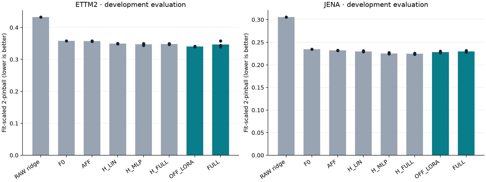

# PEFT A — S1 개발 실험 결과 (2026-09-08)

**[확인] S0 및 S1 실행·분석·검증 완료. A1 판정은 INCONCLUSIVE다.** 본학습 62개(적응 학습 60개 + F0 2개)가 모두 정상 종료됐다. 01:11:47~02:20:18 KST, 실제 경과 시간은 **68분 30초**다. RAW 원본/rescue와 사전 진단은 이 62개와 별도로 집계한다.

ETTm2에서는 LoRA의 추가 이득이 세 seed에서 같은 방향으로 나타났지만 날짜 불확실성을 고려하면 확정적이지 않았다. Jena에서는 선택된 readout이 LoRA/FULL보다 평균적으로 좋았다. **지금 결과로 내부 적응의 필요성이나 시간/변수 attention의 역할 분업을 주장할 수는 없다.** 반대로 내부 적응이 항상 불필요하다는 결과도 아니다.

## 관측 성능

낮을수록 좋은 주지표다. `±`는 세 optimizer seed의 표본 표준편차이며 신뢰구간이 아니다. F0와 RAW는 각각 한 번의 기준 결과만 비교하므로 seed SD를 표시하지 않았다.

```text
방법          ETTm2 평균 ± seed SD     Jena 평균 ± seed SD
RAW ridge     0.432415                 0.305604
F0            0.357813                 0.234400
AFF           0.357072 ± 0.000581      0.231927 ± 0.000327
H_LIN         0.349313 ± 0.000678      0.229767 ± 0.001006
H_MLP         0.347762 ± 0.003303      0.225372 ± 0.001453
H_FULL        0.348212 ± 0.001496      0.224529 ± 0.001356
OFF_LORA      0.340110 ± 0.000683      0.228089 ± 0.001793
FULL          0.346832 ± 0.009781      0.229771 ± 0.001737
```

Validation으로 고른 H는 ETTm2에서 H_MLP, Jena에서 H_FULL이다. F0 대비 관측 오차 감소는 ETT H 2.81% / LoRA 4.95%, Jena H 4.21% / LoRA 2.69%였다. 이 수치를 내부 적응의 추가 이득과 혼동하지 않는다.



다음은 선택 H 대비 내부 방법의 추가 이득을 F0 점수로 나눈 값이다. 양수는 내부 방법의 이득이다. 세 block 길이를 모두 공개하며 유의한 구간만 선택하지 않는다.

```text
패널·내부 방법   평균 Δ/F0    1일 block 95% CI   3일 block 95% CI   7일 block 95% CI
ETT LoRA        +2.14%       [-0.87, +5.43]%    [-0.70, +5.33]%    [-0.43, +5.08]%
ETT FULL        +0.26%       [-2.40, +3.16]%    [-2.23, +3.05]%    [-2.10, +2.97]%
Jena LoRA       -1.52%       [-4.51, +1.51]%    [-4.19, +1.35]%    [-4.10, +1.06]%
Jena FULL       -2.24%       [-4.93, +0.50]%    [-4.83, +0.31]%    [-4.02, -0.63]%
```

- ETT LoRA의 seed별 추가 이득은 `+2.81%, +0.86%, +2.75%`다. 방향은 일치하지만 1·3·7일 CI 모두 0을 포함한다. 평균 이득의 존재를 확정하거나 동등성을 선언할 수 없다.
- ETT FULL의 seed별 추가 이득은 `+2.98%, −3.86%, +1.67%`다. 한 seed는 validation에서 미적응 step0를 골랐다. 전체 미세조정이 안정적으로 더 강한 상한이라는 가정도 이 설정에서는 맞지 않았다.
- Jena LoRA/FULL은 각각 세 seed 모두 선택 H보다 나빴다. 그러나 LoRA CI는 모두 0을 포함하고, FULL은 7일 block에서만 0을 제외한다. 날짜 의존성 가정에 따른 민감도를 숨기고 확정적 열세라고 일반화하지 않는다.
- 32일의 평가와 두 개발 패널은 작은 근거다. 세 seed는 세 독립 도메인이 아니며 HPO 선택의 불확실성도 이 CI에 포함되지 않는다.

### 분포 품질은 별도 문제다

80% interval coverage의 세 seed 평균은 ETT H_MLP/LoRA/FULL `77.51/77.95/77.42%`, Jena H_FULL/LoRA/FULL `76.11/78.43/69.08%`였다. Jena F0는 `78.00%`였다. FULL의 점수만 보고 분포 품질도 좋아졌다고 할 수 없다.

인접 quantile 역전 비율은 ETT H_MLP/LoRA `1.05/0.033%`, Jena H_FULL/LoRA/FULL `4.04/2.30/2.17%`였다. 작은 pinball loss가 quantile의 단조성을 보장하지 않는다. 후처리 재정렬은 이번 계약에 없으므로 사후 적용하지 않았다. 후속에서는 모든 비교군에 같은 단조성 처리와 평가 규칙을 고정할 필요가 있다. 이 관측만으로 기존 다른 task의 능력을 잃는 catastrophic forgetting을 증명한 것은 아니다.

## 비용과 안정성 결과

아래 시간은 선택된 LR의 세 seed 평균이며 각 trial은 500 updates를 끝까지 실행했다. VRAM은 해당 방법의 Torch peak allocated 최댓값이다. Head 시간은 공유 cache가 준비된 뒤의 비용이다.

```text
패널       방법        선택 trial 평균    Torch peak allocated
ETTm2      H_MLP         11.22초           0.478 GiB
ETTm2      OFF_LORA     190.97초           1.198 GiB
ETTm2      FULL         132.02초           2.671 GiB
Jena       H_FULL        13.65초           0.527 GiB
Jena       OFF_LORA     188.34초           2.875 GiB
Jena       FULL         156.96초           4.722 GiB
```

LoRA는 FULL보다 peak allocated memory가 ETT 약 55%, Jena 약 39% 작았지만 학습 시간은 각각 약 45%, 20% 길었다. **이 구현에서 PEFT의 장점은 메모리·저장 효율이며 속도 이득은 관측되지 않았다.** ETT seed0 LoRA trainable checkpoint는 약 4.90MB, FULL은 약 477.97MB였다. LoRA 파일에는 공유 원본 모델이 포함되지 않는다.

[확인: 코드·타이머] LoRA는 97개 선형층에 A/B 연산을 추가한다. ETT seed0 선택 trial의 전체 시간 차이 60.58초 중 57.96초가 update 구간에서 발생했다. 큰 checkpoint 저장이나 동결 가중치 SHA 검사만으로 차이를 설명할 수 없다. [추정] 작은 추가 연산·형변환·모듈 호출 비용이 weight-gradient 절감보다 클 수 있으나, kernel profiler로 기여율을 측정하지 않았다. 일반적인 PEFT의 속도로 확대하지 않는다.

전체 62개 내부 trial 시간 합은 **3,896.47초**, Python 시작·종료를 포함한 guard 시간 합은 **4,109.00초**, 실제 S1 경과 시간은 **4,110.44초**다. ETT/Jena cache 생성 18.75/28.18초는 F0 trial에 이미 한 번 포함됐다. F0 시간은 전체 fit origin cache 준비를 포함하므로 zero-shot 단일 추론 지연으로 소개하면 안 된다. RAW 원본+rescue의 CPU 탐색 시간은 ETT 1.03초, Jena 9.99초이며 GPU 작업과 일부 겹쳤다.

각 내부 방법의 HPO 3개 LR + 추가 seed 2개 전체 trial 비용은 ETT LoRA/FULL `954.66/660.49초`, Jena LoRA/FULL `943.92/785.26초`다. 선택된 seed0를 중복 계산하지 않았다. 전체 방법별 내역은 [summary_and_costs.json](../../../../results/peft_adaptation_scope_v1/summary_and_costs.json)에 있다.

[확인] 62개 guard 모두 `completed=true`, `returncode=0`, safety stop 0건이었다. 저장된 자원 표본 433개에서 여유 RAM 최소 **15.80 GiB**, 여유 commit 최소 **10.30 GiB**, 학습 자식 RSS 최대 **2.12 GiB**, Git 프로세스 최대 **2개**, GPU 메모리 최대 **6,428 MiB**, GPU 온도 최대 **70°C**였다. RAM 등은 약 2초마다 검사하고 정상 상태의 로그는 약 10초마다 남기므로 이는 저장 표본의 극값이다.

02:23:07 Windows 조회에서 S1 시작 이후 Application crash 1000 및 System의 NVIDIA/Display/자원 고갈/Kernel-Power 관련 대상 기록은 **0건**이었다. 두 로그 조회 모두 성공했다. 이 결과는 이번 실행에서 프리즈가 재현되지 않았다는 근거이며 이전 NVIDIA 이벤트의 인과를 확정하거나 드라이버가 수정됐다는 뜻은 아니다.

## 연구 방향에 대한 판단

**A1에서 A2의 대규모 탐색으로 넘어가는 gate는 아직 통과하지 못했다.** 이유는 효과의 크기보다 우선 근거의 범위다. ETT의 긍정적 방향과 Jena의 부정적 방향만으로 각각을 시간 변화/변수 관계 변화라고 명명하면 결과에 원인을 끼워 맞추게 된다. 두 데이터는 target·계절·sampling·채널 수가 모두 다르다.

다음 순서가 타당하다.

1. **수치·분포 계약을 먼저 정리한다.** 다음 별도 실행에서는 frozen cache와 직접 평가의 group batch 크기를 맞추고, 공통 quantile 단조성 처리를 결정한다. 이번 원본 결과는 보존한다.
2. **강한 readout 대비 추가 효용을 더 긴 고정 평가 구간과 새 데이터 원천에서 확인한다.** LoRA 주비교의 날짜 불확실성은 관측 추가 이득을 확정할 만큼 좁지 않다. 학습 seed만 더 늘려서는 이 불확실성을 해결하지 못한다. 새 확인에서는 주비교, 필요한 최소 효과, 평가 기간, block 규칙, 추가 튜닝 한도를 결과를 보기 전에 정한다. 이미 본 ETT/Jena의 다른 구간은 새 원천 family로 세지 않는다.
3. **재현되는 이득이 있을 때 T8/G8/TG4의 동일 예산·동일 head 비교로 A2를 검사한다.** 소규모 합성 S2를 먼저 수행할 수는 있지만 탐색적 기전 검사로 표시한다. 양성 데이터만 고른 뒤 범용 선택 규칙을 주장하지 않는다.
4. **B/C는 관측한 문제에 맞춰 좁힌다.** B는 짧은 validation에서 선택한 적응 범위의 안정성을 직접 검사하는 후속 질문이다. C는 보존해야 할 능력과 분포 품질 요구를 먼저 고정해야 한다. 이번 Jena coverage 하락을 모든 task의 망각으로 해석하지 않는다.

즉 새 adapter를 더 붙이는 것이 현재의 우선 과제는 아니다. 먼저 **어떤 조건에서 작은 출력 적응을 넘어서는 이득이 재현되는지**를 확인해야 A의 논문 질문이 구체화된다. 더 긴 평가에도 이득의 상한이 실용적으로 작다면 해당 조건에서는 간단한 readout을 선택하는 것이 결과다.

## 무엇을 검증했는가

질문은 **Chronos-2 내부까지 적응시키는 것이 동결 모델의 강한 readout 적응보다 추가 가치를 주는가**이다. 이 S1은 A1의 두 개발 패널 검사다. 시간 attention과 변수 group attention 중 어디를 바꿔야 하는지(A2), 관측 가능한 변화로 적응 위치를 고를 수 있는지(A3)는 아직 검사하지 않았다.

공식 module map의 LoRA는 time/group attention 양쪽과 출력층 일부를 함께 갱신한다. 이 결과만으로 특정 attention 경로의 원인이나 역할을 분리할 수 없다. OFF_LORA는 공식 모듈 지도를 사용하는 비교군이며, 기본 학습 recipe를 그대로 재현했다는 뜻은 아니다.

## 실행 계약

```text
항목                    ETTm2                         Jena 2024
선택 기간               2018-03-02~2018-06-25        2024-09-07~2024-12-31
시간 간격               15분                          10분
채널 수                 7                             21
Context / horizon       384 / 96                      576 / 144
Fit / val / eval origin 379 / 16 / 32                 568 / 16 / 32
기간 구조               입력 전용 4일 + fit 64일 + validation 16일 + development evaluation 32일
```

- 두 선택 구간의 결측·중복 시각·불규칙 간격·fit 상수 채널은 모두 0이었다. Fit origin은 stride 16으로 겹치므로 379/568개를 독립 표본 수로 해석하지 않는다. Validation/evaluation의 미래 label 구간은 서로 겹치지 않는다.
- 모든 채널을 동시에 예측한다. 각 origin에서 관측된 과거만 입력하며, 미래 변수·달력·외생 예측을 추가하지 않는다. 같은 origin이 중복 추출돼도 sample instance별 group ID를 구분한다.
- Backbone은 `amazon/chronos-2`, revision `29ec3766d36d6f73f0696f85560a422f50e8498c`, 119,477,664 parameters다. 모델 고유의 context loc/scale과 arcsinh 정규화는 유지한다. 평가용 target scale은 fit 구간에서만 추정한다.
- Python 3.11.16, torch 2.11.0+cu128, chronos-forecasting 2.3.1, transformers 5.16.1, peft 0.20.0. `.venv-peft`는 기존 ML 설치를 공유하며 PEFT만 추가했다.
- AdamW, weight decay 0, gradient clipping 1, base/adapter dropout 0. Float32 가중치와 역정규화, BF16 autocast, autocast weight cache 비활성화. CPU threads 2, data-loader workers 0.
- Effective batch는 panel group 8개, microbatch는 group 4개다. 채널을 나누지 않고 두 번 누적한다. 모든 적응 방법은 동일 seed의 동일 origin 순서를 사용한다.
- 방법별 세 learning rate를 seed 0의 validation으로 고른 뒤, 선택된 LR에 seed 1·2를 추가했다. 최대 500 updates, step 0과 매 50 updates에서 validation. 최저 validation의 가중치를 실제 저장·복구한 뒤 평가한다. 선택된 step이 일러도 모든 trial의 실제 실행 예산은 500 updates다.

```text
방법        학습 파라미터   변경 범위
F0                    0   동결 모델
AFF                 2×C   원 단위 양의 scale/offset
H_LIN           258,384   동결 forecast embedding의 선형 residual readout
H_MLP           589,301   같은 embedding의 비선형 residual readout
H_FULL        3,653,280   기존 output_patch_embedding 전체
OFF_LORA      1,206,912   time/group q,k,v,o + output layer, rank 8
FULL        119,477,664   전체 모델
RAW         별도 집계     과거 lag의 multi-output ridge + OOF residual quantile
```

## 주지표와 비교 규칙

주지표는 **fit 표준편차로 나눈 2-pinball loss**다. 21개 quantile과 horizon의 유효 셀을 target별로 평균한 뒤 target을 동일 가중 평균한다. 낮을수록 좋다. 일반적인 WQL과는 다르다.

H_LIN/H_MLP/H_FULL 중 seed 0 validation이 가장 좋은 방법을 비교 readout H로 고정한다. Evaluation에서 가장 약한 head를 골라 비교하지 않는다. AFF와 RAW는 별도 공개 대조이며 H 선택 후보에는 포함되지 않는다.

주대비는 `Δ(I:H) = (score_H − score_I) / score_F0`다. 양수이면 내부 적응 I의 추가 이득이다. 세 seed의 **개별 loss를 평균**하며 예측 ensemble을 만들지 않는다. 1·3·7일의 circular day-block bootstrap을 4,000회 수행하고 모든 방법·채널·seed에 같은 날짜를 재표집한다. 재표집마다 유효 셀 수와 F0 분모를 다시 계산한다.

이 구간은 이미 훈련된 세 모델과 관측된 32일에 조건부인 불확실성이다. 독립 도메인이나 학습 corpus의 불확실성을 해결하지 않는다. MSE 계산에 사용한 점예측은 21개 quantile의 산술평균이며 조건부 기댓값으로 식별된 값이 아니다. 서로 단위가 다른 채널의 원 단위 MAE/MSE는 주결론의 기준으로 쓰지 않는다.

## RAW 대조와 남은 최적화 한계

RAW는 모든 FM fit origin을 사용한다. 과거 lag는 1~16, H, 2H, 3H다. 시간순 다섯 블록에서 첫 블록은 준비 구간으로 두고 네 번의 expanding-window OOF를 구성했다. 각 OOF origin의 label과 앞선 학습 label이 겹치지 않도록 purge했다. 결측 대체·scale도 각 fold의 과거에서만 추정했다. Quantile offset은 채널·lead별 OOF residual에서 추정한다.

처음의 ridge 후보 `0.001, 0.1, 10`은 두 패널 모두 상단을 선택했다. 다음 로그 간격 후보 `1000`을 한 번 추가하는 계약을 먼저 저장하고, 원본과 별도 `raw_rescue/`에 실행했다. Validation 점수는 ETTm2 `0.483061→0.441491`, Jena `0.406043→0.387744`로 낮아졌다. 최종 비교에는 validation으로 선택한 rescue 결과를 사용한다. 네 개의 고유 후보, 원본/rescue를 합쳐 패널당 일곱 번의 후보 계산 비용을 기록한다.

두 rescue도 상단을 선택했으므로 **정규화 탐색 범위 한계는 남는다**. Ridge 해의 계산 실패와 구별한다. `F0 + raw-lag residual` 회귀는 미실행이다. 따라서 “모든 단순 출력 보정이나 원자료 회귀를 충분히 최적화해도 실패한다”는 결론은 낼 수 없다. FM의 LR 경계와 모든 선택 seed의 step500 경계도 별도 공개한다.

FM의 LR 상단 선택은 ETT AFF/H_MLP/OFF_LORA 및 Jena H_LIN/FULL이었다. 마지막 step500를 선택한 반복은 ETT AFF seed0/1, Jena H_LIN seed0다. ETT H_MLP와 LoRA의 선택 step은 각각 `[200,200,150]`, `[100,100,100]`이므로 LR 경계만 보고 500 updates가 부족했다고 단정할 수 없다. FM의 추가 rescue는 수행하지 않았다. 전체 LR와 seed별 경계는 [verification.json](../../../../results/peft_adaptation_scope_v1/verification.json)에 보존했다.

## 마지막 수치 경로 점검

[확인] ETT FULL seed1은 validation에서 step0를 선택했지만 점수가 cached F0와 정확히 같지 않았다. 원인을 확인하려고 optimizer/backward 없이 새 pretrained 모델로 evaluation 32개를 재추론했다.

```text
조건              재계산 점수         저장된 결과와의 일치
1 group씩 추론    0.357813452711552   cached F0와 모든 예측 원소 bitwise 동일
4 group씩 추론    0.357772228887472   FULL seed1 step0와 모든 원소 bitwise 동일
```

Cache 생성은 항상 1 group, 내부 방법의 직접 평가는 4 groups였다. 배치 크기만 바꿔 차이를 완전히 재현했으므로 이 점수 차이 `−0.000041224`(F0의 약 `−0.01152%`)는 학습 이득이 아니다. S0 zero-update audit는 첫 train origin의 동일 1-group 경로만 검사했으며 전체 evaluation 배치 조건의 bitwise 동일성을 보장하지 않았다.

예측의 원 단위 평균 절대 차이는 0.00501, 최대는 0.75070이다. 단위가 다른 채널을 함께 보므로 최대 원 단위 값만으로 크기를 판단하지 않는다. Fit-std 단위 평균 절대 차이는 0.00179, 99백분위는 0.02001이며 native normalized 최대 차이는 0.03125였다. 이번 미적응 모델에서 측정한 크기를 모든 학습 모델의 수치 오차 상한이라고 주장하지 않는다.

PyTorch도 배치 연산과 개별 연산의 bitwise 일치를 보장하지 않는다고 설명한다. 여기서는 통제 재추론으로 배치 경로 차이를 확인했지만 특정 GEMM/SDPA 커널의 기여까지 분해하지 않았다. [PyTorch 2.11 numerical accuracy](https://docs.pytorch.org/docs/2.11/notes/numerical_accuracy.html#batched-computations-or-slice-computations).

진단은 guard 아래 12.24초, exit0, peak allocated 0.491 GiB, optimizer/backward 0회로 끝났다. 원래 source 계약·예측·점수를 바꾸지 않았다. [진단 JSON](../../../../runs/peft_adaptation_scope_v1/batch_precision_diagnostic/diagnostic.json)에 재현 결과를 남겼으며, 다음 확증에서는 cache와 직접 평가의 배치 계약도 일치시켜야 한다.

## 안전 조치와 재현성

- 이전에 실제 관측된 대량 `git diff --no-index`의 대상에서 가상환경을 제외하도록 `.gitignore`에 `.venv-*/`를 추가했다. Cache·checkpoint·로그는 Git에서 제외된 `runs/`를 사용한다.
- GPU 학습은 한 번에 하나만 실행하고 trial마다 별도 프로세스를 종료한다. Windows Job Object와 study lock으로 소유한 자식 프로세스 수명과 중복 실행을 관리한다.
- 여유 RAM 5 GiB, 여유 commit 6 GiB, 자식 RSS 8 GiB, Git 32개, GPU 메모리 10,500 MiB, GPU 온도 85°C를 감시 경계로 둔다. GPU는 10초, 나머지는 2초 간격이므로 순간적인 OS/드라이버 장애까지 예방한다는 보장은 아니다.
- 첫 S0에서 Jena FULL의 zero-update 불일치가 발견됐다. 같은 프로세스의 대조 진단으로 BF16 autocast weight-cache 경로 차이를 분리했다. 모든 방법에서 cache를 비활성화했고, 문제가 있던 Jena FULL의 동일 1-group 경로 차이는 0으로 복구했다. AFF 등의 허용오차 내 차이까지 모두 0이라는 뜻은 아니며 허용오차는 늘리지 않았다. 수정 후 실제 L/H·전체 채널의 forward/backward S0 네 개가 통과했다. 서로 다른 group batch 크기의 차이는 위 별도 진단과 구별한다.
- 검증은 모델 5개, 데이터 2개, guard 10개, 결과 verifier 12개 CPU 테스트를 포함한다. 최종 verifier는 62개 실행 종료 상태와 정확한 40개 선택 결과, 네 개 paired 효과, source/data/sampler hash, checkpoint 복구 및 guard 상태를 대조한다.
- NVIDIA 드라이버와 Defender 설정은 바꾸지 않았다. Commit/push하지 않았다.

## 산출물 위치

- 설계: [A 실험 계획](04_peft_adaptation_scope_experiment_plan.md)
- 코드·재실행: [실험 README](../../../../experiments/peft_adaptation_scope_v1/README.md)
- 수치: [선택 결과 CSV](../../../../results/peft_adaptation_scope_v1/selected_results.csv), [paired 효과 JSON](../../../../results/peft_adaptation_scope_v1/effects.json)
- 검증: [전체 결과 검증](../../../../results/peft_adaptation_scope_v1/verification.json), [Windows 이벤트 조회](../../../../results/peft_adaptation_scope_v1/windows_event_audit.json)
- 그림: [PNG](../../../../results/peft_adaptation_scope_v1/adaptation_comparison.png), [PDF](../../../../results/peft_adaptation_scope_v1/adaptation_comparison.pdf)
- 원본 실행·예측·가중치·감시 로그: `runs/peft_adaptation_scope_v1/`
- 재개와 수정 이력: [2026-09-08](../../../history/2026-09-08.md)
