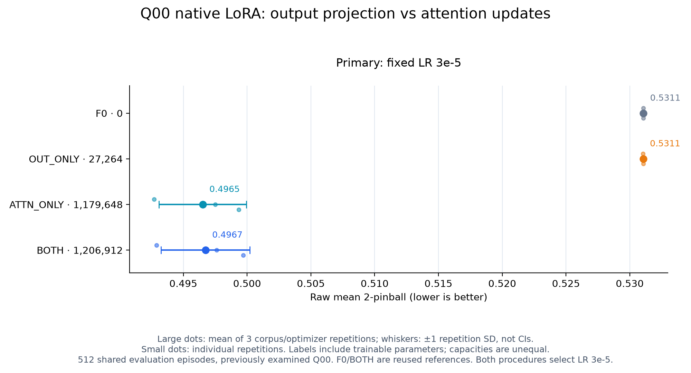
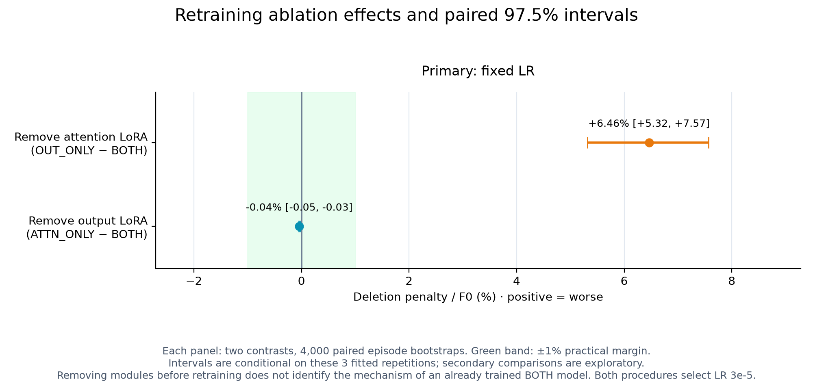
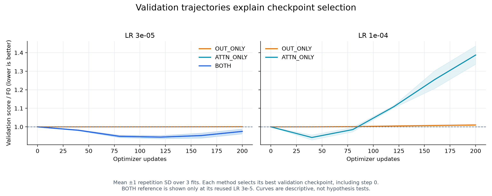

# Q00 native LoRA 삭제 대조: 결과와 연구 방향

2026-09-08. [실행 전 계획](09_peft_module_ablation_plan_20260908.md)에 따라 새 학습12개와 S0 세 개를 완료했다. [이전 통제 실험](08_peft_shift_mechanism_results_20260908.md)의 F0 및 OFF_LORA 결과는 수정 없이 재사용하며, 여기서는 OFF_LORA를 BOTH라고 표기한다.

## 1. 이번에 해결한 질문

**[확인] 이 Q00 학습 절차에서는 attention LoRA만으로 기존 결합 LoRA의 성능을 유지했다. Native 출력 projection LoRA만으로는 그 개선을 재현하지 못했다.** 출력층의 추가 갱신이 필요하다는 주장은 약해졌고, 다음 비교에서 native 출력층을 동결할 근거가 생겼다.

이것은 원 attention/output 모듈의 일부를 제외하고 사전학습 checkpoint에서 다시 학습한 결과다. 이미 학습한 BOTH의 일부를 추론 때 끈 실험이 아니다. 사전학습 출력층 자체는 모든 방법에서 유지한다. OUT_ONLY는 native head 전체가 아니라 마지막 projection에 LoRA를 붙인다.

```text
방법         LoRA 학습 파라미터   평균 quantile score↓   F0 대비 개선
F0                     0         0.531068              —
OUT_ONLY          27,264         0.531052              0.003%
ATTN_ONLY      1,179,648         0.496517              6.506%
BOTH           1,206,912         0.496737              6.464%
```

점수는 raw mean 2-pinball이며 세 corpus/optimizer 반복의 평균이다. Validation/evaluation은 반복 간 공유하고 evaluation은512개 독립 episode다. 표의 세 F0 행을 세 독립 평가 표본으로 세지 않는다. CSV18행에는 두 LR의 새 결과12개와 재사용 F0/BOTH6개가 모두 있으므로 LR 필터 없이 방법별 평균을 내면 이 표가 되지 않는다.



## 2. 삭제 비용과 동등 판정

주비교는 기존 BOTH가 선택한 LR3e-5를 고정했다. 부비교는 corpus0 validation에서3e-5/1e-4 중 하나를 선택해 다른 두 corpus에도 적용했다. 두 방법 모두3e-5가 선택돼 이번 주·부비교 결과는 같다. OUT_ONLY의 corpus0은 두 LR의 best score가 동일했고, 고정 후보 순서의 첫 값3e-5를 택했다.

```text
삭제한 갱신 경로   비교식                       효과/F0        paired 97.5% CI
attention          OUT_ONLY − BOTH             +6.4615%       [+5.3183%, +7.5690%]
output projection  ATTN_ONLY − BOTH             −0.0416%       [−0.0517%, −0.0309%]
```

양수는 삭제 후 악화다. Attention 삭제 비용은 모든 corpus에서 양수(5.9066/6.2986/7.1794%)이고 CI 하한이 운영 문턱1%를 넘는다. **이 설정의 반복적 실용 악화**로 분류한다. Output 삭제는 세 corpus 모두 아주 조금 좋아졌지만, CI 전체가 ±1% 안에 있으므로 **세 fitted repetition에 조건부인 평균 효과의 실용 동등**으로 분류한다. CI가0을 포함하지 않는 작은 차이와 실용 동등은 양립한다. 이를 큰 성능 개선이라고 과장하지 않는다.

두 대비를 한 가족으로 두고 각97.5% CI를 계산했다.512 episode를4000회 paired 재표집하며, corpus 평균 후 모든 방법과 분모 F0에 같은 가중치를 적용했다. 이 CI는 새로운 학습 데이터·optimizer seed·validation 선택의 전체 불확실성을 포함하지 않는다. 이미 검사했던 Q00 evaluation을 재사용한 탐색적 후속이며 독립 확증 실험도 아니다.



## 3. 학습과 예측에서 남는 문제

선택 step은 OUT_ONLY가0/80/120, ATTN_ONLY와 BOTH가 모두120/80/120이었다. 출력 갱신을 실제로 수행한 두 반복도 F0 대비 변화가 매우 작다. 이전 새 residual head 실험처럼 모든 반복이step0에서 끝난 상황은 아니다.

ATTN_ONLY의 LR1e-4는 세 corpus 모두step40을 선택했다. 이후 validation score는 커졌고, step200 평균은 F0의 약1.39배였다. [확인] 긴 학습이 그대로 이득이 되는 곡선이 아니므로, 이번 범위에서 학습량을 늘려 결과를 구제하지 않았다. [추정] 작은 target 표본에서 과적합 또는 최적화 경로 문제가 있을 수 있지만, validation 곡선만으로 둘을 분리하지는 못한다.



Median 예측을 참 조건부 평균의 자기지연/U/V 성분에 선형 투영하면 다음과 같다. Oracle 계수는 각각1이다.

```text
방법         자기지연 성분    U 성분     V 성분    median MSE   oracle 평균 MSE
F0           0.1427          0.0034     0.0016     0.966411     0.615092
OUT_ONLY     0.1428          0.0033     0.0019     0.966327     0.615097
ATTN_ONLY    0.8373          0.0128     0.0104     0.843156     0.492013
BOTH         0.8380          0.0128     0.0104     0.843895     0.492826
```

**[추정] Attention 갱신의 개선은 자기지연 성분을 더 반영하는 패턴과 함께 나타난다. 지연된 공변량 성분의 회수 문제는 여전히 남아 있다.** OLS는 출력의 기술적 분해다. Attention 내부의 인과 기능, 공변량의 완전한 무사용, hidden 정보 부재를 입증하지 않는다. Time attention과 group attention 중 어디가 이 변화를 만들었는지도 이번 실험은 구분하지 않았다.

80% 구간 coverage는 F0/OUT_ONLY79.60%, ATTN_ONLY77.50%, BOTH77.36%였다. 평균 폭은 각각2.5166/2.5146/2.2321/2.2261이며 저장된 예측에서 quantile crossing은0이다. Pinball/MSE가 좋아졌지만 coverage는 nominal80%에서 멀어졌다. 출력 LoRA를 제외했다고 확률예측 문제가 모두 해결된 것은 아니다.

이전 Q00의 ALIGNED score0.454828, 강한 RAW0.321088, oracle0.319528과의 큰 격차도 남는다. 이번 새 대조군과 paired 우열 검정을 한 숫자가 아니라 맥락 비교다. ALIGNED의 작은 지연 후보와 RAW의 명명된 변수·참 지연 포함 사전은 생성식을 아는 이점을 받는다. 이를 숨긴 채 새 PEFT의 열등성이나 FM의 무용성을 선언하지 않는다.

## 4. ML 방법론 주제를 어떻게 좁힐 것인가

현재 주제는 **“소량 target 데이터에서 시계열 foundation model이 과거 공변량의 지연 신호를 회수하도록 하는 효율적 적응”**이라는 문제 정의까지 좁힐 수 있다. 이번 실험은 그 문제의 진단 근거이며 새 알고리즘의 기여는 아직 없다.

출력 LoRA를 빼는 선택은 후속 비교를 단순화하지만, 줄어드는 학습 파라미터가2.26%뿐이다. ATTN_ONLY의 선택 LR 평균 내부 실행시간46.93초와 기존 BOTH46.88초에서도 실질적 속도 향상을 확인하지 못했다. 서로 다른 시점의 실행시간이므로 엄밀한 timing 비교도 아니다. **“출력층을 동결한 새 효율적 PEFT”라는 이름만으로 논문 주제를 삼지는 않는다.** OUT_ONLY의 용량은 BOTH의2.26%이므로 이번 격차가 위치 효과인지 용량·최적화 효과인지도 분리되지 않았다.

다음 단계는 기존 실패 조건을 계속 늘리기보다, 남은 공변량 회수 격차가 더 간단한 풀이로 사라지는지 판정하는 것이 우선이다.

1. **정답 지연 사전을 쓰지 않는 train-only lag search 대조를 고정한다.** Lag 선택에 validation/evaluation 또는 생성식의 참48을 사용하지 않고, 선택한 입력 변환·공변량 처리와 비용을 기록한다. 새 데이터 원천에서 native F0, ATTN_ONLY, 입력 정렬, 입력 정렬+ATTN_ONLY, **같은 추정 지연을 사용하는 RAW 회귀**를 비교할 수 있다. FM 비교군만으로 새 PEFT 필요성을 판단하지 않는다. 아직 실행한 비교는 아니다.
2. **그 풀이 이후에도 반복적인 추가 개선 여지가 있는 경우에만 PEFT 규칙을 설계한다.** 같은 정보·검증 예산·학습 파라미터/시간을 통제하고, 기존 정렬/출력 갱신/일반 LoRA/추정 지연 RAW보다 나은 최소 연산을 명시한다. 단순 입력 정렬이나 회귀로 해결되는 조건이라면 그 조건에 대한 새 PEFT 설계를 중단한다.
3. **새 규칙의 주장은 미사용 evaluation과 다른 원천에서 검증한다.** Native head를 유지한 time/group 분리는 갱신 위치를 조사할 때 필요한 추가 대조지만, 현재 전체 attention 결과만으로 자동 위치 선택 규칙을 정당화하지 않는다. 연구를 진행할 경우 다른 backbone·실데이터 또는 유보한 반합성 원천, 규칙 제거 대조, 전체 선택 비용이 필요하다.

이 순서는 추가 실험을 무한히 확장하자는 제안이 아니라, 새 방법이 필요한지를 판단할 중단 기준이다. 지연 정렬·공변량 adapter의 선행연구 범위와 중복 위험은 [이전 보고서의 문헌 검토](08_peft_shift_mechanism_results_20260908.md#5-ml-논문-주제로-어떻게-판단하는가)를 이어받는다. 이번 회차에 문헌 전문을 새로 읽거나 신규성을 추가 확인했다고 주장하지 않는다.

## 5. 실행·검증·안전 기록

- [확인] 새 학습12/12(2방법×2LR×3corpus), 12:04:21~12:11:54 KST, wall453.46초(7분33초), guard합453.14초, trial 내부합412.84초. 선택되지 않은 LR 반복 비용도 포함했다. 이전 F0/BOTH6개 guard188.20초는 재사용 원자료의 과거 비용이며 이번 실행에 더하지 않는다.
- [확인] S0세 개36.84초, 모든 GPU guard exit0/safety stop0. Wrapped BOTH의 초기 adaptation tensor hash·sampler·best step·val/eval 예측은 원 S0와 동일했다. 남긴 LoRA A는 module별 canonical 초기화와 실제 bitwise 비교했고 B0, 모듈 map/파라미터 수, native 출력부 유지, 동결 보존, checkpoint 복구를 확인했다.
- [확인] 본학습 자원 표본48개: 여유 RAM 최소15.31GiB, commit13.41GiB, child RSS 최대1.752GiB, Git 최대2개, GPU 메모리2262MiB, 온도55°C. 정상 표본은 약10초 간격이므로 순간 시스템 peak를 보장하지 않는다. 과거 재사용 guard21표본은 별도 집계했다.
- [확인] 12:13:12 Windows 조회 성공: S0 시작 이후 Application1000/1002 및 System NVIDIA/Display/resource/Kernel-Power 대상0건. 이번 관측 구간의 결과이며 향후 OS/드라이버 무장애 보장은 아니다.
- [확인] Trainer CPU6검사, analysis CPU9검사 통과. 최초 후처리 guard는 문자형 episode ID를 int로 읽어2.047초에 child_failed했다. 원 문자열 ID와 실제 manifest 필드를 보존하도록 분석기만 수정하고, 실제18개 artifact의 load/validate preflight를 통과시켰다. 첫 실패 로그를 보존했으며 `analysis_guard_verified`가8.078초/exit0로 완료됐다. 학습 재실행은 없었다.
- [확인] 분석에서 학습 adaptation checkpoint를 방법 간 동일하다고 요구하는 오류와 guard finish 메타행 처리 오류도 검토 중 수정했다. 각 trial의 자기 checkpoint hash, 원 pretrained config/weights/cache/source, 정확한12trial/18행, 후보 전체 복사·LR argmin, raw 점수 재계산, 표본 ID/target/quantile grid, 초기화/sampler를 확인했다. `verification.json`은passed=true다.
- [확인] PNG세 개를 실제 열어 축·범례·표시를 확인했고 PDF세 개를 생성했다. 원 연구 소스·계획·데이터·cache·예측 hash를 유지했다. Driver/Defender 설정 변경, 무관한 프로세스 종료, commit/push는 하지 않았다.

원자료: [18행 CSV](../../../../results/peft_module_ablation_v1/selected_results.csv), [효과·CI](../../../../results/peft_module_ablation_v1/effects.json), [검증](../../../../results/peft_module_ablation_v1/verification.json), [비용](../../../../results/peft_module_ablation_v1/costs.json), [새/재사용 자원 분리 집계](../../../../results/peft_module_ablation_v1/resource_summary.json), [Windows 조회](../../../../results/peft_module_ablation_v1/windows_event_audit.json). 큰 가중치·예측·로그는 ignored `runs/peft_module_ablation_v1/`에 보존한다. [실행 README](../../../../experiments/peft_module_ablation_v1/README.md).
