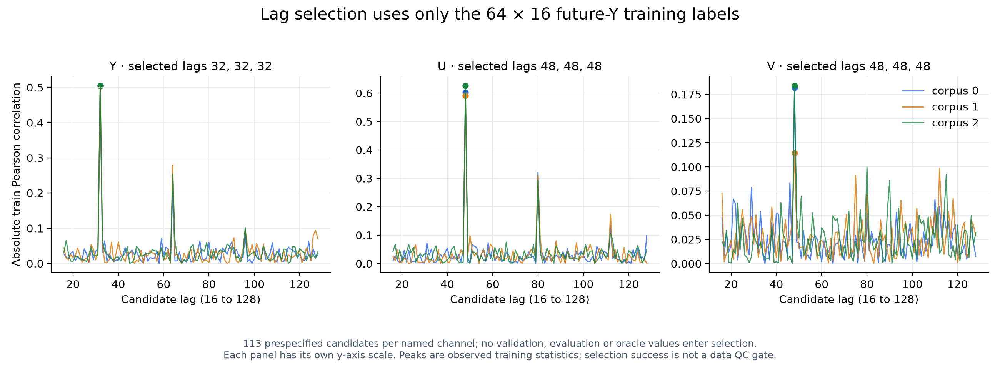
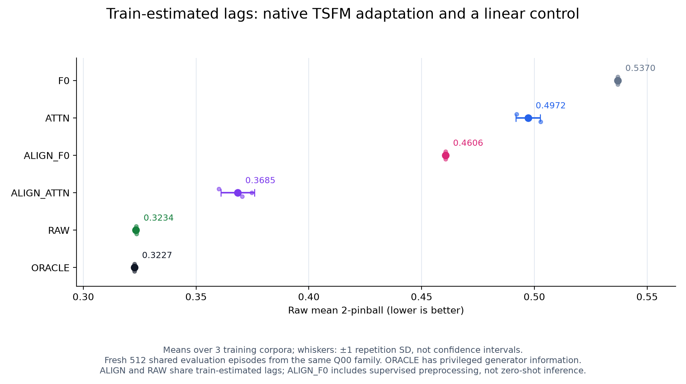
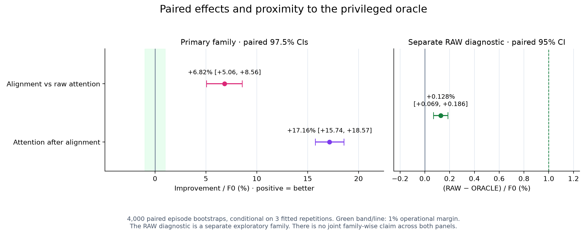
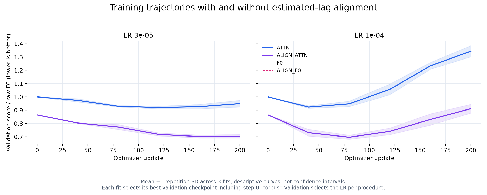

# Train-only 지연 추정: 결과와 PEFT 주제 판단

2026-09-08. [데이터 생성 전 실행 계약](10_peft_trainlag_plan_20260908.md)에 따라 새 GPU 실행 18개(LoRA 학습 12개, 동결 모델/cache 6개), CPU 회귀 3개와 최종 분석을 완료했다. S0 네 개와 CPU 테스트 31개도 통과했다.

**[확인] 학습 데이터에서 추정한 지연으로 입력을 정렬하면 Chronos-2의 예측이 개선되고, 정렬 후 attention LoRA에도 추가 이득이 있다. 그러나 같은 지연을 쓰는 단순 선형 회귀는 그보다 좋으며 oracle에 실용적으로 근접했다. 따라서 사전에 정한 기준에 따라 이 Gaussian 조건에서 새 PEFT 모듈 탐색을 중단한다.** 이는 이 조건의 방법론 필요성에 대한 판단이며 PEFT 전체의 유효성이나 실제 데이터에서의 우열을 결정하지 않는다.

## 이번에 제거한 의문과 남은 전제

[이전 삭제 대조](09_peft_module_ablation_results_20260908.md)는 attention LoRA만으로 결합 LoRA의 개선을 유지했지만, 공변량 신호를 잘 회수하는 단순 풀이가 참 지연 사전을 받았다는 문제가 남았다. 이번에는 각 Y/U/V에 대해 사전 범위 16…128의 113개 정수 지연을 검색했다. 최대 절대 Pearson 상관의 입력은 같은 64 episode × 16 horizon의 **1,024개 train 미래 Y label**과 원 과거 관측뿐이다. Validation/evaluation/oracle은 지연 선택에 쓰지 않았다. 과거 Y를 추가 감독 label로 늘리지 않았다.

세 train corpus 모두 Y=32, U=48, V=48을 선택했다. 선택 API에 참 지연은 전달하지 않았고, 선택 성공 여부를 데이터 QC나 재생성 조건으로 쓰지 않았다. 분석 단계에서 입력 hash와 113개 후보 전수 점수를 다시 계산해 일치함을 확인했다.



새 BASE_SEED=2026090810의 독립 난수 표본을 사용했다. Train은 corpus별 64개, validation 128개와 evaluation 512개는 corpus 간 공유한다. L=256/H=16이다. **같은 정상 Gaussian 생성 분포의 새 표본이며 새로운 실제 데이터 원천은 아니다.** 기존의 작은 정답 사전은 제거했지만, 채널별 단일 지연, 명명된 Y/U/V, 정상성·가법 선형 구조에 잘 맞는 회귀라는 전제는 남는다.

최초 생성본의 episode ID 접두사가 이전 실험과 겹친 것을 발견해 `runs/peft_trainlag_v1/data_initial_ids/`에 보존했다. 현재 ID는 `trainlag_b2026090810_*`이며 모든 숫자 배열은 최초 생성본과 bitwise 동일하다. 표본을 다시 뽑아 성공한 데이터로 바꾼 것이 아니다. 이 수정 후 S0와 본학습 계약을 고정했다.

## 최종 평가

점수는 원 단위의 21개 분위수·16개 horizon 평균 2-pinball loss로, 작을수록 좋다. 아래는 검증으로 선택한 설정의 세 학습 반복 평균이다. 공유 evaluation 512개를 1,536개 독립 표본으로 세지 않는다. F0와 ALIGN_F0의 반복 점수가 같은 것은 공유 평가 입력과 동일하게 선택된 지연 때문이다.

```text
절차                           평균 score↓   F0 대비 개선   80% 구간 coverage
F0: 원 입력, FM 동결             0.536967         —            79.43%
ATTN: 원 입력 + attention LoRA   0.497214        7.40%          75.15%
ALIGN_F0: 추정 정렬, FM 동결     0.460572       14.23%          81.02%
ALIGN_ATTN: 추정 정렬 + LoRA     0.368454       31.38%          69.97%
RAW: 추정 지연 선형 회귀         0.323352       39.78%          79.80%
ORACLE: 참 조건부 분위수         0.322664       39.91%          80.43%
```

ALIGN_F0도 target train label로 지연을 학습한 절차다. FM 가중치만 동결하며 zero-shot이나 무학습 방법으로 부르지 않는다. 정렬은 원 과거 U/V를 이동해 native 미래 공변량 입력으로 제공하고 Y 미래는 마스킹한다. 원래 시각의 미래 관측을 추가한 수는 0이다. 동시에 초기 NaN, 유효 문맥, 정규화, 미래 공변량 경로가 변하므로 개선을 특정 attention 기능 하나로 귀속할 수 없다.

RAW는 동일 추정 Y/U/V 지연의 세 feature에 intercept+OLS를 적합하고, train 잔차의 empirical 21 quantiles를 더한다. 별도 ridge/HPO/OOF calibration은 없다. 이름을 아는 세 feature와 계수 4개의 구조적 대조이며 일반적인 시계열 FM과 같은 가설 공간은 아니다. ORACLE은 생성식을 아는 진단 전용 참 조건부 분포다.



## 정렬과 LoRA의 효용은 실제로 남는다

512개 episode를 4,000회 paired bootstrap했다. 매 회 세 fitted corpus의 평균을 먼저 구하고 같은 episode 가중치로 분자와 F0 분모를 다시 계산했다. 두 주대비에 각각 97.5% CI를 사용하며 운영 문턱은 F0 score의 1%다. 아래 효과의 분모는 모두 F0이고, 직전 방법 자신의 점수에 대한 상대 개선율이 아니다.

```text
주대비                               효과/F0      paired 97.5% CI
(ATTN − ALIGN_F0) / F0                +6.8240%      [+5.0581%, +8.5596%]
(ALIGN_F0 − ALIGN_ATTN) / F0         +17.1551%     [+15.7412%, +18.5683%]
```

각 하한이 +1%보다 크고 세 corpus에서 모두 양수여서 두 대비 모두 사전 정의한 반복적 실용 개선을 충족했다. 즉, 입력 정렬의 효용과 정렬 후 적응의 추가 효용은 함께 관찰됐다. 정렬이 LoRA의 모든 효용을 없앤다는 해석도 맞지 않는다.

별도 탐색적 RAW 진단 `(RAW−ORACLE)/F0`는 **+0.1282%, 95% CI [+0.0690%, +0.1863%]**다. 상한이 사전 문턱 1%보다 작아 oracle 근접 판정을 충족한다. 이 구간은 0을 제외하므로 RAW와 oracle의 수학적 동일성이나 정확한 Bayes 최적성을 주장하지 않는다. 별도 RAW 진단까지 합친 전체 family-wise 오류율을 통제했다고 부르지 않는다.



모든 CI는 **이번 세 학습 결과와 validation 선택에 조건부**다. Train 표본·optimizer·LR 선택의 전체 변동을 재표집한 구간이 아니며, 독립 외부 데이터 확증도 아니다. LR 3e-5를 두 절차에 고정한 기술적 민감도 분석에서도 정렬 후 LoRA 효과는 +16.4942%이고 같은 계산 방식의 구간은 [+15.1297%, +17.8734%]였다. 이 부분석을 추가 확증 시험으로 세지 않는다.

## 점수 개선과 불확실성 품질은 구분해야 한다

```text
절차          중앙값의 Y MSE↓   중앙값의 참 조건부 평균 MSE↓   80% 구간 평균 폭
F0                0.984758                 0.623440                  2.512341
ATTN              0.841359                 0.484551                  2.129816
ALIGN_F0          0.731831                 0.368196                  2.244532
ALIGN_ATTN        0.455720                 0.101497                  1.398310
RAW               0.357921                 0.001418                  1.520087
ORACLE            0.356998                 0                         1.537862
```

ALIGN_ATTN은 평균 점수와 중앙값 오차가 개선됐지만, 80% 구간 coverage는 69.97%(corpus별 67.75~71.61%)로 낮다. 구간 폭도 oracle보다 좁다. 따라서 확률예측 전반이 해결됐거나 calibration이 좋다고 결론 내릴 수 없다. RAW의 평균 coverage는 79.80%(78.16~80.62%)이며, 중앙값과 참 조건부 평균의 MSE는 참 평균 분산의 약 0.218%다. 모든 선택 방법에서 quantile crossing은 0이었다.

RAW의 train 적합 잔차 분위수는 새 데이터의 잔차보다 낙관적일 수 있다. 이번 독립 evaluation에서 평균 coverage가 nominal에 가까웠다는 사실이 이 적합 방식의 일반적 calibration 보장은 아니다. 반대로 현재 ALIGN_ATTN의 undercoverage를 바로 새 PEFT 논문 주제로 선언하기에도 이르다. 독립 개발 데이터에서 간단한 구간 보정으로 해결되는지와 점수·coverage·폭의 교환 관계를 먼저 확인해야 한다.

## 학습 선택과 비용

Native 최종 output projection은 동결했다. Attention LoRA는 time/group qkvo 96개, rank 8/alpha 16, 학습 파라미터 1,179,648개다. 원 입력과 정렬 입력은 같은 초기 LoRA tensor와 minibatch sampler를 쓴다. 새 head는 없다. 200 updates, validation 40 updates 간격, effective 8/micro 4 groups, CPU 2 threads, BF16 cache-disabled/TF32 off의 동일 조건이다.

Corpus 0의 validation에서 원 입력 ATTN은 LR 3e-5, ALIGN_ATTN은 1e-4를 선택하고 나머지 corpus에 고정했다. 각 학습은 step 0을 포함해 자신의 최저 validation checkpoint를 복구했다. 선택된 ATTN step은 120/120/160, ALIGN_ATTN은 모두 80이다. Corpus 1에서는 두 절차 모두 다른 LR의 validation이 더 좋았지만 사전 선택 규칙을 유지했다. 평가 점수로 LR를 교체하지 않았다.



고학습률 ATTN은 40 updates 이후 검증 성능이 악화되고, ALIGN_ATTN 1e-4도 80 이후 악화된다. 이는 관측된 곡선이며 원인을 과적합 하나로 확정하지 않는다. 선택 LR가 두 후보의 경계에 있으므로 전역 최적 학습률을 찾았다고 할 수 없다. 고정 3e-5 부분석의 ALIGN_ATTN corpus 2는 마지막 step 200을 선택했다. 결과를 본 뒤 학습률·기간을 확대하는 구제 실험은 하지 않았다.

본실행은 13:11:32~13:23:12 KST, 약 **700.25초(11분 40초)**였다. 18개 guard 합계는 699.857초로, 채택되지 않은 여섯 LR fit의 비용도 포함한다. S0는 별도 44.979초다. CPU 지연 추정 합계 0.013675초, RAW 세 번의 적합 자체 약 0.002751초, 저장·평가를 포함한 RAW wall 합계 0.139642초였다. 분석 내부 wall은 1.845초, CPU 분석 guard는 4.078초다. RAW 시간은 분석 내부에 포함되므로 이를 모두 독립 비용처럼 더하지 않는다. 서로 다른 startup/cache/검증 비용을 포함하므로 이 수치로 보편적인 학습 속도 배수를 주장하지 않는다.

## 안전 실행과 실제 검증

본학습 18개, S0 네 개, CPU 분석 guard 모두 completed/exit 0이며 안전 중단은 0건이었다. 본학습 자원 표본 76개의 최소 여유 RAM은 14.994 GiB, commit은 11.812 GiB, 최대 child tree RSS는 1.761 GiB였다. GPU 메모리 표본 최대 2,295 MiB, 온도 53°C, Git 프로세스 최대 2개였고 Torch peak allocated는 약 0.832 GiB였다. 정상 GPU 자원 기록은 약 10초 간격이므로 표본 최대가 모든 순간의 최대를 보장하지 않는다.

13:26:34 KST Windows 조회에 성공했고, S0 시작 이후 Application 1000/1002와 System NVIDIA/Display/resource-exhaustion/Kernel-Power 대상은 모두 0건이었다. 이는 이번 구간의 관측이며 이전 크래시 원인을 확정하거나 향후 무장애를 보장하는 진술은 아니다. 드라이버·Defender·시스템 설정과 무관한 프로세스는 변경하지 않았다.

[확인] 최종 검증은 24개 전체 결과(18 GPU+3 RAW+3 oracle), 18개 선택 결과, corpus 0 LR argmin, 저장 예측의 점수 재계산, 지연 선택 입력 및 전수 점수, 원 과거 source index, 초기값·sampler, native cache·각자 checkpoint hash, RAW train-only OLS 재적합을 확인했다. 학습 전 고정한 source/plan/data/lag 및 이전 실험 참조 계약을 유지했다. CPU 테스트 31개가 6.12초에 통과했고 PNG 네 개를 실제 열어 확인했다. 큰 가중치·예측·로그는 ignored `runs/`에 보존한다. Commit/push는 하지 않았다.

## 논문 주제에 대한 결정

이번 결과가 지지하는 문장은 **“이 합성 조건의 lagged covariate 신호는 같은 관측과 target train label로 추정한 단순 회귀에서도 회수된다. 입력 정렬은 native FM 적응의 효용을 크게 바꾸지만, 이를 해결하기 위한 새로운 PEFT가 필요하다는 근거는 확보하지 못했다”**다. 원 입력 FM의 오차가 크다는 사실만으로 관측 정보 부재, attention의 표현 불가능성, PEFT의 본질적 실패를 주장할 수 없다.

지연 정렬 자체는 [LIFT, ICLR 2024](https://proceedings.iclr.cc/paper_files/paper/2024/file/b52b07a239a7afa155ca25cf17a55074-Paper-Conference.pdf)의 lead 추정·정렬·refinement와 겹치는 연구 축이다. 이번 global train-only 추정과 native 미래 공변량 경로는 LIFT 직접 재현은 아니다. [LTSF-Linear, AAAI 2023](https://ojs.aaai.org/index.php/AAAI/article/download/26317/26089)는 단순 선형 대조를 점검할 근거이며, 그 논문의 채널별 시간 투영과 이번 Y/U/V 공동 지연 회귀도 동일한 방법은 아니다. 기존 구성의 결합과 이번 성능 수치만으로 신규성을 주장하지 않는다.

**방법론 주제를 계속 찾는다면 다음 진입 기준은 실제 유보 원천에서 남는 잔여 문제다.** 우선 원 입력·train 추정 정렬, 단순 선형 대조, 표준 LoRA의 입력·label·선택 예산을 맞춘 비교에서 단순 풀이가 해결하지 못하는 반복적 격차가 있어야 한다. 비선형성·시간에 따른 지연 변화·적응 뒤 능력 보존 등은 원천에서 관측될 때 후보 원인으로 좁힌다. 원하는 방법이 이기도록 이번 생성기를 사후에 어렵게 바꾸는 것을 확증으로 취급하지 않는다.

그 뒤 기존 정렬·refinement 및 간단한 calibration 대조가 놓치는 부분, 예측에 필요한 최소 갱신, 다른 backbone에서의 재현을 구체화해야 새 PEFT 설계를 정당화할 수 있다. 이 외부 단계는 이번에는 실행하지 않았다. 현재 산출물은 방법론 후보를 걸러내는 근거이며, 새 ML 방법 논문 완성본이 아니다. 기존 실데이터 A1의 INCONCLUSIVE 판정과 B/C 후보는 이번 한 Gaussian 조건으로 기각하지 않는다.

## 재현 산출물

- [선택 결과 CSV](../../../../results/peft_trainlag_v1/selected_results.csv), [전체 24행 CSV](../../../../results/peft_trainlag_v1/all_results.csv), [효과와 선택 경계](../../../../results/peft_trainlag_v1/effects.json)
- [수치·계약 검증](../../../../results/peft_trainlag_v1/verification.json), [전체 비용](../../../../results/peft_trainlag_v1/costs.json), [자원 요약](../../../../results/peft_trainlag_v1/resource_summary.json), [Windows 조회](../../../../results/peft_trainlag_v1/windows_event_audit.json)
- [실행 README](../../../../experiments/peft_trainlag_v1/README.md), [분석 코드](../../../../experiments/peft_trainlag_v1/analyse.py), [그림 코드](../../../../experiments/peft_trainlag_v1/plot.py)
- PDF: [점수](../../../../results/peft_trainlag_v1/score_comparison.pdf), [대비](../../../../results/peft_trainlag_v1/paired_effects.pdf), [지연](../../../../results/peft_trainlag_v1/lag_search.pdf), [검증 곡선](../../../../results/peft_trainlag_v1/validation_trajectories.pdf)
