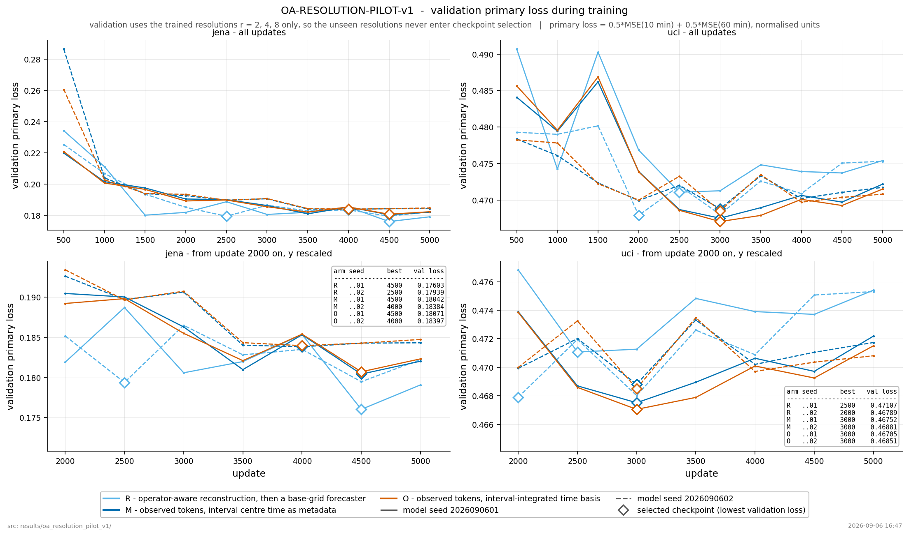
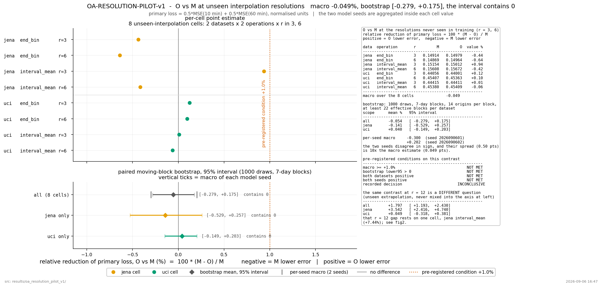
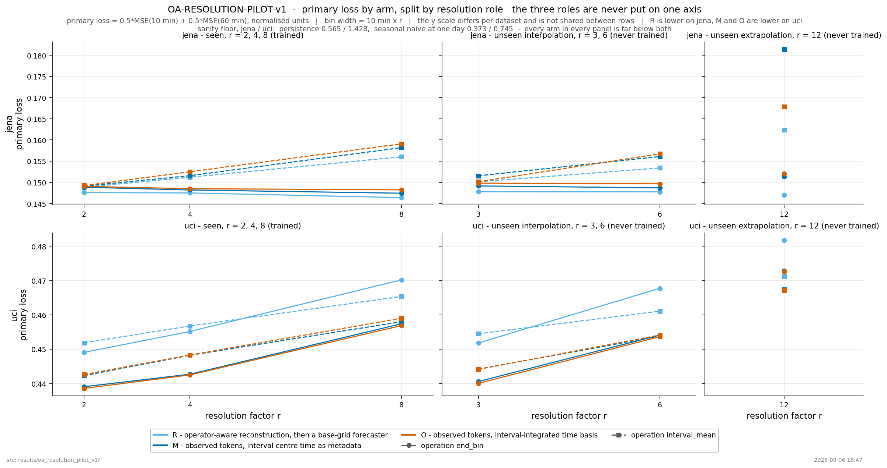
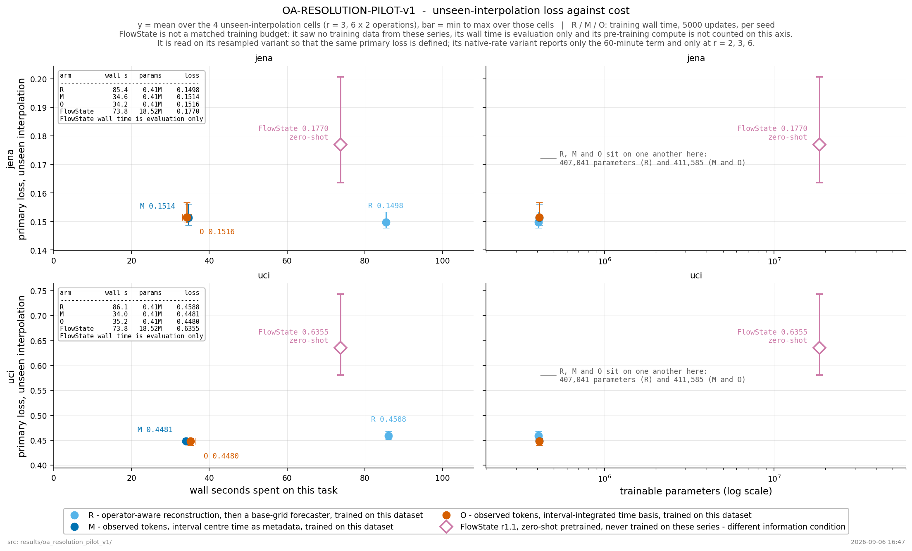

# 1. 핵심 질문과 목표

> [가설·미검증] 관측 간격뿐 아니라 각 값이 순간값·구간 평균·구간 합계 중 무엇인지 모델에 알려주면, 서로 다른 시간 해상도로 옮겨갈 때 더 정확하게 예측할 수 있는가?

목표는 새 집계 지표가 아니라 **관측 의미를 이해하는 입력 표현과 예측 decoder**를 만드는 것이다. 평가 소비처는 다른 sampling rate·aggregation task에서도 같은 모델을 재사용하려는 연구자다.

이 주제는 1번의 후속 branch가 아니다. 1번이 실패해도 그 사실만으로 이 주제가 실패하는 것은 아니다. 이번 작업은 후보를 문서로 보존하는 데까지만 한다.

# 2. 문제를 정확히 정의하기

각 관측을 잠재적인 시간 함수 f에 작용하는 연산으로 쓴다.

\[
y_k=\mathcal A_k[f]+\epsilon_k.
\]

예를 들어:

\[
\mathcal A_{\mathrm{point},t}[f]=f(t),
\]
\[
\mathcal A_{\mathrm{mean},[a,b]}[f]=\frac1{b-a}\int_a^b f(u)du,
\]
\[
\mathcal A_{\mathrm{integral},[a,b]}[f]=\int_a^b f(u)du.
\]

이산 데이터의 단순 합계라면 그 정의를 그대로 별도로 적는다. 연속 적분과 샘플 합을 단위·sampling interval 없이 같은 것으로 두지 않는다.

‘같은 1시간 간격 데이터’여도 정각의 온도와 지난 1시간 평균 온도는 동일한 관측이 아니다. 반면 합과 평균은 관측 구간 길이·샘플 수를 알면 서로 변환 가능한 경우가 많다. **단위 변환만으로 해결되는 문제를 새 모델의 장점으로 포장하지 않는다.**

이 문제는 결측값 복원과도 다르다. coarse 평균 관측만으로 사라진 fine-scale 정보를 완전히 복원할 수 있다고 주장하지 않는다.

# 3. 가까운 선행연구

| 논문 | 이미 다루는 것 | 이 후보가 별도로 보여줘야 할 것 |
|---|---|---|
| FlowState: Sampling-Rate-Equivariant Time-Series Forecasting(2026/ICML) [S1] | SSM encoder·함수형 basis decoder로 sampling rate와 출력 시간 격자에 대응 | point/mean/sum 같은 관측 연산을 **입력부터** 반영하는 것이 추가로 유효한가? |
| Coherent Probabilistic Forecasting of Temporal Hierarchies(2023/AISTATS) [S2] | 여러 시간 집계 수준의 표현과 coherent probabilistic forecast | 사후 reconciliation 또는 hierarchy embedding만으로는 부족한 관측 전이가 있는가? |

연속시간 decoder, 시간 해상도 전이, 합계 일관성은 이미 존재하는 연구다. 이들을 다시 구현한 것만으로 새롭다고 하지 않는다. 선행연구의 기능적 동등성 검사는 아직 완료되지 않았다.

# 4. 방법 후보

[설계·미검증] 입력 token에 다음 의미를 담는 encoder를 검토한다.

- 관측값과 단위 정규화 결과.
- 관측 시작·끝 시각 또는 순간 관측 시각.
- 연산 종류(point / mean / discrete sum / integral).
- 결측 여부와 유효 관측 수.

이 목록은 **앞으로 정의할 데이터 의미**이며, 실제 데이터 파일에 이런 이름의 컬럼이 있다고 주장하는 것이 아니다.

출력 query는 ‘다음 K개 점’만이 아니라 ‘이 구간의 평균 또는 합계’를 지정한다. Decoder가 잠재적인 연속 함수 또는 일관된 basis representation을 만들고, 요청한 관측 연산을 적용해 예측한다.

예를 들어 동일 정보 시점에서 구간 합계는:

\[
\hat S(a,c)=\hat S(a,b)+\hat S(b,c)
\]

를 만족하도록 만들 수 있다. 그러나 **일관된 오답도 가능하므로 주지표는 실제 target 예측오차**다. 일관성 오차는 보조지표다.

# 5. 데이터를 확보할 때 필요한 조건

가장 먼저 확인할 것은 source의 관측 의미다.

| 필수 정보 | 없을 때 생기는 문제 |
|---|---|
| 각 값이 instantaneous/mean/sum 중 무엇인지 | 다른 관측을 잘못 정규화할 수 있음 |
| interval endpoint와 단위 | 합·평균·적분 변환이 잘못됨 |
| 원본 고해상도 signal과 timestamp | 관측별 변형을 같은 잠재 경로에서 만들기 어려움 |
| split과 각 집계 window의 support | train/test 경계를 넘는 평균으로 누출 가능 |
| 실제 다른 해상도·다른 source | 합성 집계에서만 작동한 것을 실제 전이로 확대하기 어려움 |

후보 도메인은 전력의 power/energy 측정, 환경 센서의 point/average 기록 등이다. **특정 공개 데이터셋이 위 의미를 모두 제공한다고 이 문서에서 검증한 것은 아니다.** source metadata가 불분명하면 수치 배열을 보고 연산 종류를 추측하지 않는다.

초기 통제 검증을 위해 하나의 fine-resolution 원본에서 여러 관측을 만들 수 있지만, 이는 ‘구성된 관측 전이 실험’으로 표시한다. 실제 deployment와 동일하다고 부르지 않는다.

# 6. 반드시 포함할 baseline

1. 연산 의미를 이용한 올바른 단위 변환·재표본화 후 강한 forecasting 모델.
2. FlowState 또는 동일 역할의 연속 decoder에 같은 정보를 제공한 모델.
3. Fine-scale 예측 후 올바른 집계 연산을 적용한 모델.
4. Temporal hierarchy / reconciliation baseline.
5. 관측 연산 정보를 받지 않는 같은 용량 encoder.
6. 제안한 observation-aware encoder·decoder.

No-metadata baseline에 단위조차 잘못 준 뒤 이기는 비교는 금지한다. 모든 방법에 허용된 metadata를 같게 준 비교도 있어야 한다.

# 7. 최소 검증의 논리

[설계·미검증] 완전한 실험 계획 합의 전에는 실행하지 않는다. 먼저 다음 순서의 검증 가능성을 확인한다.

**동일 latent history·동일 정보량 비교:** 관측 방식만 바꿨을 때 성능을 비교한다. Fine observation을 쓰는 방법이 coarse observation만 쓰는 방법보다 좋다고 표현의 우위를 주장하지 않는다.

**보지 않은 해상도:** 학습한 관측 연산과 다른 간격을 평가하되, 스케일·구간·단위의 분포까지 나란히 보고한다.

**보지 않은 연산:** 연산 타입 일반화와 해상도 일반화는 별개다. 후자는 통과하고 전자는 실패할 수 있다.

**실제 source 전이:** metadata가 신뢰할 만한 별도 source에서 반복되는지 확인한다.

# 8. 예상 결과와 중단 이유

| 예상 가능한 결과 | 판정 |
|---|---|
| 단위 변환·resampling으로 같은 성능 | 새 모델을 만들 이유가 약함 |
| 일관성만 좋아지고 target 오차는 같음 | 예측 성능 중심 목표에는 불충분 |
| 합성 관측에서만 개선 | 증거 범위를 통제 실험으로 제한 |
| 같은 정보량에서도 unseen resolution 성능 개선 | 방법 연구로 발전시킬 근거 |
| coarse 입력에서 예측분포가 넓어짐 | 반드시 실패는 아님. 사라진 정보를 반영하는 정직한 불확실성일 수 있음 |

반증 조건은 ‘metadata를 정확히 준 단순 baseline과 강한 연속시간 모델이 이미 충분한가’다. 이 주제를 살리려고 불리한 단위·비정상 집계·잘못된 baseline을 만들지 않는다.

# 9. 주제로 선택할 때의 장점과 위험

**장점:** 입력과 출력의 의미를 동시에 바꾸는 모델 기여가 명확하다. Sampling rate와 measurement semantics를 분리해 실험할 수 있다.

**위험:** 데이터 의미 확인이 어렵고, 단순 변환으로 해결되는 문제일 수 있다. 고정 해상도 benchmark의 종합 MSE 1위를 곧바로 겨냥하는 주제와는 다소 다르다.

1번보다 후순위인 이유는 익숙함이나 이전 코드 재사용이 아니라, **실험을 정당화할 데이터 계약을 확보해야 하는 부담** 때문이다.

# 10. 출처

[S1] **FlowState: Sampling-Rate-Equivariant Time-Series Forecasting(2026/ICML)**. IBM 공식 연구 페이지: <https://research.ibm.com/publications/flowstate-sampling-rate-equivariant-time-series-forecasting>

[S2] **Coherent Probabilistic Forecasting of Temporal Hierarchies(2023/AISTATS)**. <https://proceedings.mlr.press/v206/rangapuram23a.html>

확인일: 2026-09-06. 이 노트의 모델 설계·예상 결과는 출처 논문의 결과가 아니라 새 가설이다. 실제 모델 학습은 수행하지 않았다.

---

## OA-RESOLUTION-PILOT-v1

실행일 2026-09-06. 브랜치 `oa-resolution-pilot-v1` (`origin/main` = `36b01d2` 기준).
산출물 `results/oa_resolution_pilot_v1/`, 상세 경과는 `_docs/history/2026-09-06.md`.

이 절은 위 1~10절의 가설 문서를 대체하지 않는다. 1~10절은 착수 전 설계이고, 여기부터가
실제로 돌린 것과 나온 결과다.

### 판정

```
EXECUTION STATUS:    COMPLETE
SCIENTIFIC DECISION: INCONCLUSIVE
PRIMARY O vs M (미학습 보간 30/60분): -0.049%   bootstrap 95% CI [-0.279, +0.175]
O vs R: +0.574%     M vs R: +0.624%
FLOWSTATE REFERENCE: OK (zero-shot, 정보 조건 다름)
```

사전등록 Go/No-Go 6개 중 4개 실패 → `OPERATOR_AWARE_REPRESENTATION_PROMISING` 아님.
Phase-2(pretrained model 에 같은 표현 이식)는 **제안하지 않는다**.

### 동결된 데이터 계약

두 source 모두 공식 문서로 관측 의미를 확인한 뒤에 모델 코드를 썼다.

| | Jena (MPI-BGC WS Beutenberg) | UCI Individual Household Electric Power |
| --- | --- | --- |
| 공개 기록 의미 | 10분 **구간 평균** (센서 10초 스캔, logger 가 평균·합계·최대 계산) | 1분 **구간 평균** (power / voltage / current) |
| 타임스탬프 | 평균 구간의 **끝** (문서에 명시) | 라벨된 분. 시작/끝 여부는 **공식 문서에 없음** |
| core 채널 | `T (degC)`, `p (mbar)`, `rh (%)` | `Global_active_power`, `Global_reactive_power`, `Voltage`, `Global_intensity` |
| 제외 | `rain (mm)` 합계, `max. wv` 최대 | `Sub_metering_1/2/3` (watt-hour 에너지 누적) |
| 기간 | 2023-01-01 ~ 2024-12-31 (커버리지 .999972) | 2007-01-01 ~ 2008-12-31 (커버리지 .995811) |

기간은 성능을 보기 전에 사전등록 규칙(가용성 → 연속 2년 → 커버리지 최대 → 동률이면 이른
구간)으로 골랐다. Jena 는 2019~2024 의 5개 후보, UCI 는 가능한 2개 후보를 실제로 평가했고
규칙이 지시문의 우선 후보와 같은 구간을 선택했다. 둘 다 105,264 base bins.

**중요**: 두 데이터셋 어디에도 진짜 순간 관측(instantaneous point)은 없다. 그래서 통제
관측 유형을 `END_BIN`(report interval 마지막 base bin 하나)과 `INTERVAL_MEAN`(구간 전체
평균)으로 정의했고, `END_BIN ≠ 수학적 순간값`임을 문서·코드·테스트에 못박았다.

### 세 방법의 정확한 정의

세 방법 모두 **같은 관측 정보**를 받는다 — 값, support 구간, 연산 종류, report width.

- **R** — operator-aware 재구성 baseline. `x̂ = argmin ‖Ax − v‖² + λ‖D₂x‖²` 로 288-bin
  base 격자를 복원한 뒤 공통 base-grid forecaster 에 넣는다. `A` 가 관측 연산 그 자체다
  (INTERVAL_MEAN 은 support bin 에 1/r, END_BIN 은 마지막 bin 에 1). λ 는 train/validation
  만으로 dataset 당 하나 동결 (둘 다 100).
- **M** — metadata-conditioned 일반 신경망. 관측 토큰을 그대로 받고, 시간 표현은 support
  **중심점**의 Fourier basis. 여기에 width·연산 임베딩을 더한다.
- **O** — 관측 인지 표현. M 과 모든 것이 같고 **관측 토큰의 시간 표현만** support 구간에서
  적분평균한 basis 를 쓴다: `mean_[a,b] sin(ωt) = sin(ωc)·sinc(ωd/2)` 폐형식, 학습
  파라미터 없음. future query 는 M/O 동일(중심점) — target 격자는 r 과 무관하게 10분
  고정이라 query 를 적분해도 해상도 정보를 나를 수 없고, 적분하면 M/O 차이가 둘이 된다.

공정성은 코드가 아니라 테스트로 강제했다: M/O 학습 파라미터 수 411,585 로 동일, 한 seed
에서 초기 상태 byte-identical, (dataset, seed) 당 학습 schedule SHA 가 세 arm 에서 하나,
평가 window 집합이 arm·연산·해상도 전체에서 동일.

학습은 r ∈ {2,4,8} × {END_BIN, INTERVAL_MEAN} 결정론적 순환으로 한 모델이 모두 학습한다.
checkpoint 는 **학습에서 본 해상도만으로** 계산한 validation loss 로 고른다 — r=3,6 을
모델 선택에 넣으면 "보지 않은 해상도"가 아니게 된다.


*그림 3. 세 arm·두 seed 각각의 validation primary loss 를 update 에 대해 그리고 선택된
checkpoint 를 표시했다. validation 은 학습에서 본 해상도(r=2,4,8)만 사용하므로 미학습
해상도에 대한 어떤 정보도 checkpoint 선택에 들어가지 않으며, 그림 2와 같은 dataset 별
순서가 학습 도중에도 이미 나타난다.
한계: validation loss 자체는 이 파일럿이 묻는 지표가 아니고, 두 seed 사이의 격차가 M 과
O 사이의 격차와 비슷한 크기다.*

### 주 결과 — 미학습 보간(30/60분)

| dataset | operation | r | R | M | O | O vs M | O vs R |
| --- | --- | --- | --- | --- | --- | --- | --- |
| jena | END_BIN | 3 | 0.14777 | 0.14914 | 0.14979 | -0.44% | -1.37% |
| jena | END_BIN | 6 | 0.14774 | 0.14869 | 0.14964 | -0.64% | -1.29% |
| jena | INTERVAL_MEAN | 3 | 0.15013 | 0.15154 | 0.15012 | +0.94% | +0.00% |
| jena | INTERVAL_MEAN | 6 | 0.15339 | 0.15608 | 0.15672 | -0.42% | -2.17% |
| uci | END_BIN | 3 | 0.45178 | 0.44056 | 0.44001 | +0.12% | +2.60% |
| uci | END_BIN | 6 | 0.46773 | 0.45407 | 0.45363 | +0.10% | +3.01% |
| uci | INTERVAL_MEAN | 3 | 0.45447 | 0.44415 | 0.44411 | +0.01% | +2.28% |
| uci | INTERVAL_MEAN | 6 | 0.46106 | 0.45380 | 0.45409 | -0.06% | +1.51% |

O 와 M 은 구분되지 않는다. macro -0.049%, bootstrap 구간이 0 을 포함하고, seed 두 개와
dataset 두 개 모두에서 부호가 뒤집힌다 (seed0 -0.300 / seed1 +0.202, jena -0.139 / uci +0.042).


*그림 1. 한 번도 학습에 쓰이지 않은 두 해상도(r=3, r=6)에서, 관측 구간을 적분한 표현(O)이
중심점 기반 metadata 조건부 표현(M)보다 primary loss 를 얼마나 줄였는지를 dataset×operation×r
8개 cell 전체와 dataset 별로 나눈 순환 이동블록 bootstrap 95% 구간과 함께 보여준다. macro 는
-0.049%, 구간은 [-0.279%, +0.175%]로 0 을 포함하고, dataset 별 구간도 마찬가지라 사전등록한
+1.0% 문턱에 어느 쪽으로도 가까이 가지 못한다.
한계: 이 구간은 시간축 origin 만 재표본하고 모델 seed 는 재표본하지 않는다 — 실제 두 seed 의
macro 는 -0.300%와 +0.202%로, 위 구간 폭보다 더 벌어져 있다.*

### 부수 소견 1 — R 대비 우열이 dataset 마다 뒤집힌다

| 대비 (미학습 보간, bootstrap) | pooled | jena | uci |
| --- | --- | --- | --- |
| O vs M | -0.054% [-0.279, +0.175] | -0.141% [-0.529, +0.257] | +0.040% [-0.149, +0.203] |
| M vs R | +0.588% [-0.621, +1.720] | -1.137% [-3.447, +0.858] | +2.339% [+1.159, +3.506] |
| O vs R | +0.532% [-0.788, +1.736] | -1.280% [-3.668, +0.836] | +2.378% [+1.201, +3.530] |

Jena 에서는 R 이 모든 role 에서 최고, UCI 에서는 모든 role 에서 최저다. 차이는 신호가
얼마나 복원 가능한가를 따라간다 — R 은 coarse 관측에서 Jena base 격자를 거의 정확히
복원하지만(RMSE 0.03~0.05, 신호 std 0.91), 뾰족한 UCI 가정 부하에서는 거칠게만 복원한다
(0.38~0.59, std 0.86). 그리고 토큰 모델이 이기는 쪽이 바로 후자다.

pooled 숫자 하나가 이 불일치를 가린다. 그래서 `METADATA_MODEL_SUFFICIENT` 같은 단일
토큰으로 요약되지 않고 `INCONCLUSIVE` 가 된다.


*그림 2. 세 arm(R/M/O)의 primary loss 를 해상도 r 에 대해, 학습에서 본 해상도·미학습 보간·
미학습 외삽의 role 별로 패널을 나누고 dataset 별로 행을 나눠 그렸다(손실 규모가 3배 차이 나서
축을 공유하지 않는다). arm 간 순서가 dataset 마다 뒤집힌다 — jena 에서는 R 이 가장 낮고, uci
에서는 M 과 O 가 가장 낮다(미학습 보간에서 O vs M 은 jena -0.139%, uci +0.042%).
한계: 각 점은 두 모델 seed 를 평균한 값 하나이며 이 그림 자체에는 구간이 없다 — 구간은
그림 1과 `bootstrap.json` 에 있다.*

### 부수 소견 2 — 가장 넓은 미학습 외삽(120분)에서만 기전이 보인다

r=12 에서 O vs M macro +1.760% [+1.193, +2.430]. 그러나 대부분이 jena INTERVAL_MEAN 한
cell(+7.44%)에서 나오고 uci 는 +0.049% [-0.318, +0.381] 이다. 그리고 jena r=12 에서도
R 이 O/M 둘 다 이긴다. 주 macro 에 섞지 않았고, 기전의 증거로 세지 않는다.

기전 진단이 같은 자리를 가리킨다. O 의 적분 basis 를 추론 시 중심점 basis 로 바꾸면
(O-WRONG-SUPPORT, 재학습 없음) jena INTERVAL_MEAN r=8 에서 +7.93%, r=12 에서 +7.81% 악화하고
나머지는 거의 움직이지 않는다. END_BIN 은 r 과 무관하게 support 가 1 base bin 이라
원래 차이가 작다. 즉 **기전은 설계대로 작동하되, 넓은 구간평균에서만 값이 있다.**
사전등록한 주 해상도(30/60분)에서는 값이 없다.

반대로 스칼라 width 채널을 어긋나게 주면 M/O 어디서도 0.016% 이내다 (END_BIN 에서는 이
변형이 구조적으로 무연산). O 는 width 를 적분 basis 로 나르고, M 은 width 채널을 안 쓴다.

### FlowState reference

`ibm-research/flowstate` r1.1 (Apache-2.0, 18.5M), 공식 `tsfm_public` API.
`scale_factor` 는 model card 정의(base seasonality 24 / 일주기 step 수)를 그대로 적용 —
10분 격자 24/144, report interval r bins 는 r/6. 추측한 값 없음.

| 미학습 보간 primary loss | R | M | O | FlowState (resampled) |
| --- | --- | --- | --- | --- |
| jena | 0.14976 | 0.15136 | 0.15157 | 0.17703 |
| uci | 0.45876 | 0.44815 | 0.44796 | 0.63547 |

FlowState 는 zero-shot pretrained, R/M/O 는 target-trained 다. 같은 표에 둘 수는 있어도
같은 학습 예산 경쟁이 아니며, 이 파일럿이 FlowState 를 개선했다거나 이겼다고 말하지 않는다.
native-rate variant 는 coarse 출력 격자가 시간을 정확히 나누는 r ∈ {2,3,6} 에서만 60분
지표로 채점했고, 나머지 6개 조건은 임의 upsampler 를 만들지 않고 not-evaluated 로 남겼다.


*그림 4. 학습된 세 arm 과 zero-shot 으로 읽은 FlowState r1.1 의 미학습 보간 primary loss 를
wall time 및 파라미터 수에 대해 그렸다(막대는 4개 미학습 보간 cell 에 대한 산포). R 은
재구성 단계 때문에 M·O 대비 약 2.5배의 wall time 을 쓰는 반면, M 과 O 는 파라미터 수가 같고
wall time 도 seed 간 산포 범위 안에서 같으며(jena 34.6 대 34.2초, uci 34.0 대 35.2초),
loss 도 같은 자리에 놓인다.
한계: FlowState 는 동일 예산 경쟁자가 아니다 — 이 시계열을 본 적이 없고, 사전학습 연산량은
wall-time 축에 들어있지 않으며, native-rate variant 가 60분 항을 r=2,3,6 에서만 정의하기
때문에 resampled variant 로 읽은 값이다.*

Chronos-2 는 본 인터프리터에서 import 불가 → `CHRONOS_REFERENCE_SKIPPED_TIMEBOX`.

### 한계

- 20~120분 밖의 해상도, 12시간 밖의 예측 구간, 48시간 밖의 history 에 대해 말한 바 없다.
- `END_BIN`·`INTERVAL_MEAN` 외의 관측 연산에 대해 말한 바 없다. 이산 SUM 은 단위 불변성
  통제로만 썼고 성능 arm 으로 세지 않았다 (표현·예측 차이 모두 정확히 0).
- r=12 이득이 사전등록 주 대비로도, 더 많은 dataset·더 많은 외삽 해상도에서도 살아남는지
  확인하지 않았다.
- 큰 pretrained model 이 이 표현을 실어 나를 수 있는지 확인하지 않았다. FlowState 는
  변형 없이 reference 로만 썼고 adapter 를 붙이지 않았다.
- 확률예측·보정·집계 수준 간 일관성은 측정하지 않았다. 점오차만 봤다.
- 5,000 update 는 파일럿 예산이고 세 arm 에 동일하다. 작은 target-trained 모델이지
  foundation model 이 아니다.
- UCI 타임스탬프가 1분 평균 구간의 시작인지 끝인지 공식 문서에 없다. `[t, t+1min)` 규약을
  채택하고 기록했다. 두 규약의 차이는 라벨 격자 전체의 균일한 1분 이동이라 세 arm 에 동일하게
  작용하고 대비를 바꾸지 못하지만, 결과의 벽시계 해석은 그만큼 불확실하다.

### 다음 결정

사전등록 주 대비가 실패했으므로 이 방법의 확대를 중단하고 다른 후보 주제로 이동할 것을
제안한다. 재방문한다면 유일하게 당길 실은 **넓은 support 영역**이다 — r=12 결과와
O-WRONG-SUPPORT 진단이 같은 곳을 가리킨다. 다만 현재는 단일 해상도·사실상 단일 dataset
관측이므로, 그것은 이 실험의 연장이 아니라 새 사전등록이어야 한다.
