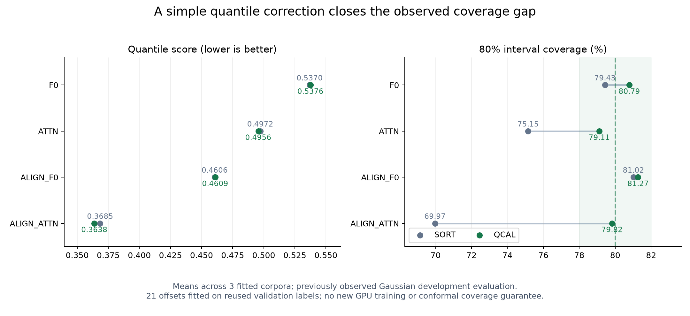

# C 후보 자기 평가: 단순 분위수 보정으로 현재 문제를 해결했다

2026-09-08. [사전 진단 계획](11_peft_calibration_closure_plan_20260908.md)에 따라 기존10번 예측에 CPU 보정을 적용했다. [확인] 4개FM 절차×SORT/QCAL×3corpus의24개 결과와12개 보정 fit을 완료했다. GPU 재학습은0회, CPUguard는4.062초/exit0, fixture테스트9개가 통과했다.

**정렬 후 LoRA의80% 예측 구간 coverage는69.97%에서79.82%로 회복됐으며 점수도 좋아졌다.** 따라서 이 관측만으로 새로운 calibration-preserving PEFT를 설계할 필요성은 약하다. C 전체를 기각하거나 실제 데이터의 보정 성능까지 확인한 결과는 아니다.

```text
절차          기존 score   보정 score   기존 coverage80   보정 coverage80
F0             0.536967     0.537572         79.43%            80.79%
ATTN           0.497214     0.495627         75.15%            79.11%
ALIGN_F0       0.460572     0.460948         81.02%            81.27%
ALIGN_ATTN     0.368454     0.363769         69.97%            79.82%
```

기존열도모든분위수를공통정렬한SORT이다. 이번source예측은crossing0이라기존raw수치와같다. QCAL은각분위수q의validation잔차(y-p_q)에서empirical q-quantile 하나를구해더한다. 추가파라미터는각fitted모델당21개이며, 128validationepisode×16horizon만사용했다. Evaluation배열을보정fit API에전달하지않았고, 모든offset을저장한뒤평가배열을읽었다.



ALIGN_ATTN의보정후corpus별coverage는80.24/78.96/80.27%였고점수는세corpus모두개선됐다. 평균coverage78~82% 및각corpus점수악화≤1%F0의사전운영기준을충족했다. `(QCAL−SORT)/F0` score변화는−0.8726%,기술적95%paired CI[−1.0469%,−0.6976%]다. Coverage변화는+9.855percentage points,구간[+9.395,+10.307]pp다.

보정은구간을공짜로정확하게만든것이아니다. ALIGN_ATTN의80%구간평균폭은1.398310→1.731656으로넓어졌고,중앙값MSE는.455720→.453468이었다. 기존RAW는score.323352/coverage79.80%로여전히기술적으로더좋으며,이번보정이원래신호회수격차를해결한것은아니다. F0와ALIGN_F0는보정뒤점수가약간나빠졌다. 모든모델에서보정이항상점수를개선한다고주장하지않는다.

## 근거의 범위

이Gaussian evaluation은이미10번에서관찰했다. 동일validation도checkpoint/LR선택에이미쓰였다. 따라서이는개발용탐색적진단이며새로운유보확증이아니다. 512episode의4000paired bootstrap은세fittedcorpus와기존선택에조건부이고,학습·선택불확실성을포함하지않는다. 네기술적대비에대해전체family-wise검정을주장하지않는다. 시간의존실데이터에서의conformalcoverage보장도없다.

직접관련선행에서도현상과단순대안을확인했다. [Chronos-2 Gated-LoRA 공개본](https://arxiv.org/html/2608.11359v1)은proper score개선과PICP80하락을함께보고한다. [WiSE-FT](https://arxiv.org/html/2109.01903v1)의가중치보간은동결기반LoRA에서는전역adapter강도조절과대응한다. [CQR](https://papers.nips.cc/paper/8613-conformalized-quantile-regression.pdf)은별도calibration에서구간끝점을보정하며exchangeability하의marginal보장을다룬다. 이번21분위수잔차보정을그방법의직접재현또는동일보장으로부르지않는다.

## 자기 평가와 다음 실행

앞선관측을새PEFT의동기로바로확대했다면단순출력보정으로해결되는문제를복잡하게만들었을가능성이크다. 이번에는기존예측을사용한4초대CPU진단으로이를걸러냈다. 실패한것은LoRA자체가아니라“현재undercoverage만으로새내부보존방법이필요하다”는주제진입근거다.

다음은[실제 원천 screen 계획](../02_adaptation_scope/12_peft_external_gap_plan_20260908.md)이다. 자전거대여와가정전력을사용하고train/선택validation/calibration/미래평가를분리한다. 모든비교군에같은보정을주어단순분포오차가내부적응필요성으로보이지않게한다. H_MLP/H_FULL의강한출력적응과표준LoRA·direct ridge를비교한다. 아직새방법이나양성결과를선언하지않으며전체연구탐색goal은계속진행중이다.

산출물: [전체24행](../../../../results/peft_calibration_closure_v1/all_results.csv), [요약·판정](../../../../results/peft_calibration_closure_v1/summary.json), [효과](../../../../results/peft_calibration_closure_v1/effects.json), [검증](../../../../results/peft_calibration_closure_v1/verification.json), [PDF그림](../../../../results/peft_calibration_closure_v1/calibration_comparison.pdf), [실행코드](../../../../experiments/peft_calibration_closure_v1/analyse.py).

원source/data/model/cache/예측·계약216개보호파일의전후hash와저장예측의score재계산이일치했다. PNG를실제열어확인했다. 원학습결과·시스템설정변경이나commit/push는없었다.
