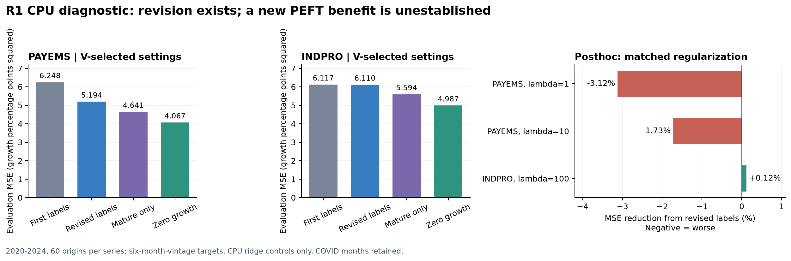

# 19. 수정 정답 R1: 자료 진입·CPU 결과

2026-09-08. [계획19](19_peft_revision_entry_plan_20260908.md)에 따른 첫 실행과, 평가 후 작성한 [동일 정칙화 진단19c](19c_revision_posthoc_diagnostic_20260908.md)의 결과다.

## 판단

**[확인] 실제 정답 수정은 존재하고 자료 진입은 통과했다. 그러나 현재 두 계열에서 새 PEFT를 설계하거나 GPU 실험을 확대할 근거는 확보하지 못했다.**

사전의 “correction arm이 FIRST보다 정규화 평균 MSE 1% 개선” screen은 통과했다. REVISED_FIXED_X의 개선은 15.887%였다. 이 원 판정은 `PRIORITIZE_FM_DIAGNOSTIC`으로 그대로 보존한다. 다만 사후 원인 진단에서 PAYEMS의 큰 개선은 정칙화 선택 차이를 통제하면 사라졌고, 단순 ZERO_GROWTH가 전체 평가에서 모든 ridge보다 좋았다. **후속 연구 판단은 `DEFER_NEW_PEFT_GPU_ON_CURRENT_TWO_SERIES`다.** 사전 screen 통과를 논문 성공이나 새 PEFT 필요성으로 바꾸지 않는다.

새 신경망/FM 학습은 0회다. CPU ridge 적합·예측을 실제로 실행했다. 이 결과로 비선형 FM의 revision 문제가 없다고 주장하거나 R1 전체를 반증하지 않는다.



## 확보한 자료와 정보 계약

ALFRED의 PAYEMS와 INDPRO, 관측 1989-12~2024-12를 받았다. 원값은 각기 고용자 수와 산업생산 지수이며, **같은 vintage의 연속 두 월로 계산한 100×로그 차분**을 모델 변수로 삼았다. INDPRO의 기준연도 변경을 raw level revision으로 오인하지 않기 위해서다. 변환이 모든 정의 변경을 없애는 것은 아니다. [공식 다운로드 설명](https://alfred.stlouisfed.org/help/downloaddata), [INDPRO 공식 페이지](https://alfred.stlouisfed.org/series?seid=INDPRO).

```text
                        PAYEMS          INDPRO
관측 월 수               421             421
원 CSV 수정 기간 행       6,161           8,925
요청 vintage + 경계       431             454
겹침 / 내부 기간 누락      0 / 0           0 / 0
잘못된 level             0               0
ZIP 크기(bytes)          36,943          60,729
```

최초 전체 urllib POST와 작은 POST는 각각 응답 헤더 이전에 30초 timeout이었다. 공식 Chrome 양식에서는 정상 다운로드됐다. 전체 PAYEMS/INDPRO의 download 이벤트까지 각각 3.066/3.205초였다. 원 실패 기록과 작은 probe를 보존하고, 전체 archive만 분석에 사용했다. 정상 브라우저 경로 변경은 [19a](19a_revision_download_transport_20260908.md), [19b](19b_revision_browser_download_20260908.md)에 남겼다. 전송 경로 차이의 근본 원인은 미확정이다.

- Target r월 1일 00:00을 origin으로 두고 vintage는 전날까지 허용한다. 보통 최신 발표 event는 r−2월이므로 관측 기준 2-step이다. r−2…r−7의 성장률 6개와 intercept를 사용했다.
- 모델 event는 1991-01~2024-12, 408개월/계열이다. 최초 성장률은 두 level이 함께 존재한 최초 vintage에서 계산한다. 서로 다른 최초 level끼리 차분하지 않는다.
- 정답은 event 6개월 뒤 월말 snapshot으로 고정한다. Training도 해당 성숙 시점 이후 정답은 더 바꾸지 않는다. “최종 진실”을 확보했다는 뜻은 아니다.
- V는 2016~2018, 36 origin/계열이며 그 정답이 전부 성숙한 2019-07-01에 λ/window를 선택했다. E는 2020~2024, 60 origin/계열이다. COVID 기간을 제외하지 않았다.
- FIRST/REVISED_FIXED_X는 과거 origin 당시 feature를 고정한다. CURRENT_X는 같은 lag 좌표의 값 버전만 갱신한다. 모든 arm의 현재 예측 입력은 같다.
- 날짜 기반 가용성 계약이며 실제 intraday 수신 시각을 재현한 것은 아니다. [ALFRED 도움말](https://alfred.stlouisfed.org/help).

## 정답 수정은 얼마나 있었나

408개월 중 최초 성장률과 6개월 성숙값이 달랐던 달은 PAYEMS 408개, INDPRO 404개였다. 판별 허용오차는 1e−10이다. 수정 규모는 성장률 **퍼센트포인트** 단위다.

```text
                                    PAYEMS       INDPRO
평균 절대 revision                  0.039589     0.241746
중앙 절대 revision                  0.028260     0.174831
95% 분위 절대 revision              0.116083     0.651024
최대 절대 revision                  0.443855     1.630154
revision RMSE / 과거 성장률 표준편차   0.376794     0.538008
성숙 전 수정 횟수 중앙값              2            5
```

수정이 실제로 관측된다는 것은 연구 조건의 존재를 보여준다. 이 수정 때문에 내부 적응에 지속적인 피해가 생긴다는 증거와는 구분해야 한다.

## 사전 CPU 비교

각 학습 arm은 V에서 동일한 10개 후보(λ 0.01/0.1/1/10/100 × expanding/120개월 window)를 비교했다. Intercept는 정칙화하지 않는다. 주지표는 E MSE이며 낮을수록 좋다.

```text
Arm                     PAYEMS MSE   INDPRO MSE
FIRST_FIXED_X             6.247944     6.117463
FIRST_BIAS                5.100162     6.114223
REVISED_FIXED_X           5.193594     6.110096
REVISED_CURRENT_X         5.515818     5.903325
MATURE_ONLY               4.640667     5.594107
AGE_CORRECTED             5.195927     6.111616
ZERO_GROWTH               4.067057     4.986747
LAST_KNOWN_GROWTH         9.473831    11.474504
```

FIRST_BIAS는 이미 성숙한 과거 사례의 평균 revision을 예측에 더한다. AGE_CORRECTED는 같은 경과 월의 provisional→mature 평균으로 아직 성숙하지 않은 training label을 보정한다. MATURE_ONLY는 최근 잠정 label을 기다리는 대조다. 이들은 모두 CPU 통계 모델이며 frozen FM가 아니다.

1991~2014 성장률 분산으로 정규화한 두 계열 평균에서 REVISED_FIXED_X는 FIRST 대비 15.887% 개선했다. 평균 정규화 MSE 차이의 12개월 공통 block bootstrap 95% 구간은 [0.058641, 62.276764]다. 두 계열은 서로 관련된 macro series이고, 이 구간은 여러 correction 후보 탐색까지 보정한 검정이 아니다. 특히 원17·다른 데이터의 실패/성공과 합쳐 보편적 효과로 해석하지 않는다.

## 사후 진단: 같은 λ에서도 수정 label이 좋은가

PAYEMS는 FIRST에서 λ1, REVISED에서 λ10을 골랐다. 원 비교는 각 정책을 V로 선택한 운영 성능 비교이며, 같은 λ에서의 label-only 효과가 아니다. 원 V에서 선택된 config의 합집합만으로 아래 사후 대조를 수행했다. E를 이용해 새 λ를 탐색하지 않았고 원 결과를 수정하지 않았다.

```text
같은 config       FIRST MSE   REVISED MSE   정정 label 효과
PAYEMS λ1          6.247944     6.442983     3.122% 악화
PAYEMS λ10         5.105475     5.193594     1.726% 악화
INDPRO λ100        6.117463     6.110096     0.120% 개선
```

**[확인] PAYEMS는 첫 label을 그대로 유지하고 λ만 1→10으로 바꿔도 MSE가 6.247944→5.105475로 낮아졌다.** 따라서 원 평균 15.887%를 수정 label 자체의 이득이라고 쓰면 틀린다. 평균 revision 보정의 큰 원 개선에도 λ 선택 차이가 섞였다. 이는 source label 정보가 무가치하다는 뜻이 아니라, 현재 실험에서 “수정으로 인한 적응 피해”를 입증하지 못했다는 뜻이다.

## 위기 구간과 해석 범위

독립 감사의 사후 연도 분해에서 FIRST 전체 제곱오차 중 2020년 비중은 PAYEMS 98.881%, INDPRO 90.027%였다. 주결과는 전체 2020~2024를 그대로 유지한다. ZERO가 이 전체 구간에서 가장 좋았다고 해서 정상 시기나 다른 시계열에서도 항상 좋다는 뜻은 아니다. 실제 2021~2024의 PAYEMS MSE는 LAST 0.03469, ZERO 0.08081로 순서가 다르다. 이 사후 분해를 새 선택 구간으로 사용하지 않는다.

이 결과는 과거 평온한 기간에서 고른 정칙화·적응 정책이 큰 충격에서 어떻게 동작하는지의 영향을 강하게 받는다. 신규 PEFT 연구로 바꾸려면 일반적인 충격 대응/정칙화 문제와 **잠정 label로 인한 학습 경로의 잔여 피해**를 구별해야 한다.

## 검증과 비용

- 통합 17개 테스트와 4개 subtest PASS. 미래 vintage를 변경해도 과거 origin의 학습/예측 정보가 바뀌지 않는 검사, 실제 실행 전체의 합성 자료 검사, CSV 기간 겹침/같은 vintage 변환 검사를 포함한다.
- V/E의 총 192개 origin에서 fixed-X revision 충분통계 갱신과 **외부 원 학습 행으로 재계산한** batch ridge를 비교했다. 최대 계수 차이 1.985e−15, 예측 차이 2.398e−14였다. 과거 label 수정 시 b += x×delta를 쓰는 알려진 선형 항등식의 확인이다. 1991~2024의 모든 개별 발표 이벤트를 순차 재생한 운영 비용 실험은 아니다.
- [독립 감사](../../../../results/peft_revision_entry_v1/independent_audit.json)는 원 CSV를 따로 파싱하고 log(level_t/level_t−1)로 truth/scale을 계산했다. 816개 first와 816개 mature, E120개 정답, V 선택·MSE·MAE·평균·CI·사후 matched 값을 검산했다. MSE 최대 차이 5.68e−14, CI 3.52e−12다.
- CPU 본실험 guard는 23:02:44~23:02:51 KST, 6.094초/exit0이다. 내부 결과 작성 전 wall 2.675초는 마지막 계약 재검증 및 guard 정리까지 포함한 총시간이 아니다. 사후 진단 guard 4.078초/exit0이다.
- 계열/arm별 E60회 ridge fit 누적은 약 0.0029~0.0039초다. 이 짧은 타이머에는 행 검사·window 선택·solve·예측이 들어가지만 snapshot/feature 생성·V 선택·IO는 빠진다. FM와의 비용 우위를 측정한 것이 아니다.
- 기존 결과/소스/런타임 등 1,237개 보호 hash와 본 코어 9개 소스를 계약에 고정했다. 후속 사후 진단/독립 감사는 별도 소스·출력이다. 기존17과 사전조사18은 변경하지 않았다.
- GPU 학습 0, OS/드라이버/Defender 설정 변경 0. 관측된 guard 자원 위반은 없었다. 짧은 작업의 로그는 주로 시작 표본이므로 child peak RAM/GPU 측정값으로 제시하지 않는다. 브라우저 다운로드 자체는 CPU child guard 밖이다. 과거 PC 프리즈의 원인이 해결됐다는 주장은 하지 않는다.
- 22:35:38~23:12:31 KST의 System ID41/153/2004/4101/6008 및 Application ID1000 조회는 0건이었다. 조회 오류도 없었다. 검사한 이벤트 범위에 한정한 결과다.

## 다음 접근

이번 조건에서는 새 adapter나 optimizer를 추가하지 않는다. “잠정 정답이 수정된다”라는 현실 조건은 확보했지만, 현재 자료의 점수 차이는 새 PEFT의 필요성으로 연결되지 않았다.

R1을 다시 열려면 먼저 native FM의 frozen 예측과 현재-vintage head를 비교하고, 같은 정보·정칙화·예산의 표준 corrected replay/reset보다도 남는 **회복 손실이나 재계산 비용**을 관찰해야 한다. Checkpoint 사전학습 범위와 평가 자료의 중복도 별도로 확인해야 한다. 이번에는 FM checkpoint를 실행하지 않았으므로 그 조건은 미검증이다. 현재 E를 반복해서 최적화한 뒤 미노출 성능처럼 쓰지 않는다.

현재 결론은 **자료 준비 완료, 선형 진단 완료, 신규 PEFT 필요성 미확보**다. CPU에서 관측한 한계를 전체 시계열 PEFT의 실패나 논문 주제 부재로 확대하지 않는다.

## 재현 파일

- [실험 README](../../../../experiments/peft_revision_entry_v1/README.md)
- [CPU 계약](../../../../runs/peft_revision_entry_v1/cpu_contract.json)
- [원자료 QC](../../../../results/peft_revision_entry_v1/data_qc.json)
- [원본 다운로드 receipt](../../../../data_external/alfred_revision_entry_v1/complete/browser_fetch_receipt.json)
- [V 선택](../../../../runs/peft_revision_entry_v1/validation_selection.json)
- [CPU 원 결과](../../../../results/peft_revision_entry_v1/cpu_results.json)
- [동일 config 사후 결과](../../../../results/peft_revision_entry_v1/posthoc_matched_config.json)
- [그림 PDF](../../../../results/peft_revision_entry_v1/revision_cpu_summary.pdf)
