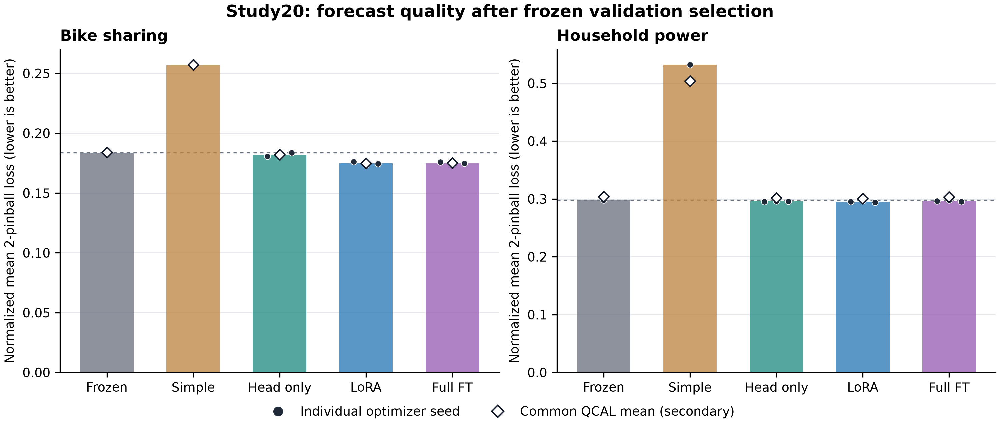
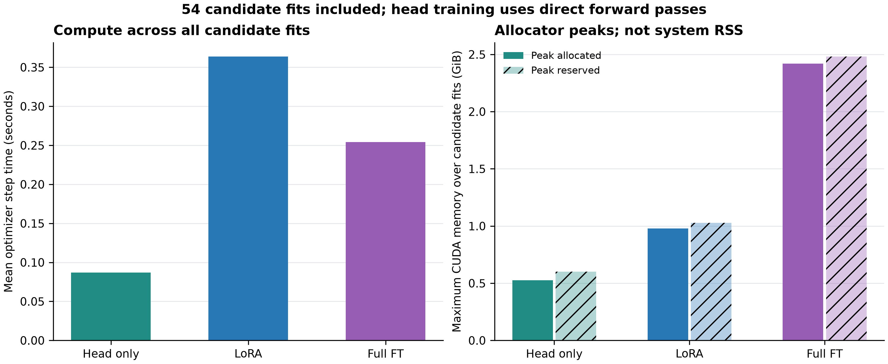

# Study20: 실제 full fine-tuning과 표준 PEFT 비교 결과

2026-09-09. [계획20](20_peft_fullft_reference_plan_20260909.md), [메모리 복구20a](20a_peft_fullft_memory_recovery_20260909.md), [활성 단계 검사20b](20b_peft_fullft_active_memory_recovery_20260909.md)에 따른 실행이다. 최종 실행은 `peft_fullft_reference_v3`이며 앞선 시도는 보존했다.

## 판단

**[확인] 표준 LoRA는 Bike에서 유용했지만, 실제 전체 모델 학습이 LoRA를 넘어서는 성능 여유는 이번 조건에서 확인되지 않았다.** 따라서 이 결과를 근거로 rank를 늘리거나 새로운 adapter/gate를 만드는 정확도 개선 분기는 진행하지 않는다. 현재 결과는 새로운 ML 방법의 성공이 아니라 연구 방향을 거르는 기준선 비교다.

LoRA의 F0 대비 주손실 감소율은 Bike 4.935%, Household 0.915%다. FULL_FT는 각각 4.822%, 0.483%였다. Bike에서 LoRA와 Full의 차이는 작고 시간 블록 신뢰구간은 양쪽 방향을 포함한다. Household에서는 LoRA가 세 seed 모두 Full보다 좋았지만 차이의 크기는 작다. 이를 두 방식의 일반적 동등성이나 Full의 성능 상한으로 해석하지 않는다.

## 실제 실행한 비교

- Native `amazon/chronos-2`, revision `29ec3766d36d6f73f0696f85560a422f50e8498c`. FULL_FT는 119,477,664개 전체 파라미터이며 encoder와 head의 실제 업데이트를 검증했다. 기존 H_FULL이라는 head 학습과 구분한다.
- 두 데이터셋 × 세 학습 방식 × 세 학습률 × 세 seed = **54 fits**, 각 200 updates, 합계 **10,800 updates**. Seed는 20000/20001/20002다.
- 매 fit의 checkpoint는 V로 고르고, 데이터셋/방식별 세 seed 평균 V가 가장 좋은 학습률 하나를 선택했다. 54개 전체 선택과 단순 기준선 선택을 고정한 후에만 C/E 예측을 생성했다.
- 최종 GPU 예측은 학습된 선택 모델 18개와 F0 두 개, 총 20회다. 별도 CPU 단순 기준선 두 개를 더해 22개 결과를 SORT/QCAL 두 방식으로 평가했으므로 44개 metric rows다. 세 seed의 예측을 합친 ensemble은 아니다.
- L336/H48, 24시간 간격의 rolling origins. 원천별 train90/V30/C20/E80 origins. C는 공통 출력 보정에만 쓰며 주평가는 C를 사용하지 않는다. 입력은 과거 관측값만 사용한다.
- Bike의 E는 2012-06-25~2012-09-14, Household의 E는 2008-06-10~2008-08-30이며 끝 시각은 제외한다. 이전 로컬 평가 다음 기간을 사용했지만 사전학습 중복 여부는 **UNKNOWN**이다.

## 주결과: SORT mean 2-pinball loss

각 target의 train 표준편차로 손실을 정규화한 뒤 target을 동일 가중 평균한다. 낮을수록 좋다. 감소율은 같은 데이터셋의 F0 손실을 분모로 사용한다.

```text
Method       Bike loss   F0 대비 감소      Household loss   F0 대비 감소
F0           0.183797       —             0.297988             —
SIMPLE       0.256710     -39.670%         0.532269           -78.621%
HEAD_ONLY    0.181992      +0.982%         0.295620            +0.794%
LORA         0.174726      +4.935%         0.295260            +0.915%
FULL_FT      0.174934      +4.822%         0.296549            +0.483%
```

SIMPLE은 V에서 계절성 1개와 context ridge 3개 중 선택한 절차다. Bike에서는 weekly seasonal, Household에서는 ridge λ100이 선택됐다. 선택된 단순 절차가 이 기간에서 좋지 않았다는 결과이며, 가능한 모든 통계 모델을 이겼다는 뜻은 아니다.



막대는 SORT 점수이며 학습군의 검은 점 세 개는 각 seed다. F0와 SIMPLE은 각각 하나의 결정적 결과다. 흰 마름모는 모든 방법에 같은 C 보정을 적용한 보조 결과다. 검은 점의 폭은 시간 신뢰구간이 아니다.

### 사전 지정한 비교와 불확실성

아래 수치의 단위는 **F0 손실 대비 백분율**이다. Full 이득은 `(LoRA loss − Full loss) / F0 loss × 100`, LoRA 이득은 `(Head loss − LoRA loss) / F0 loss × 100`이다. 상대방 손실을 분모로 한 상대 개선율과 다르다.

```text
비교                        Bike: 효과 [95% CI]       Household: 효과 [95% CI]
Full FT의 LoRA 대비 이득     -0.113 [-0.949, +1.043]   -0.433 [-0.950, -0.060]
LoRA의 Head 대비 이득        +3.953 [+1.302, +5.848]   +0.121 [-1.436, +1.356]
```

- Bike의 LoRA–Head 이득은 세 seed 모두 양수였다. 이 데이터에서는 출력 head만 바꾸는 것보다 표준 내부 적응이 유용하다는 근거다.
- Bike의 Full–LoRA 차이는 seed에 따라 방향이 달랐다. CI가 0을 포함하므로 우위를 확인하지 못했으며, 동등성을 입증한 것은 아니다.
- Household의 Full–LoRA 효과는 세 seed 모두 약 −0.43%였다. 시간 CI는 음수지만 작은 차이이고 네 개 탐색적 대비의 다중비교를 보정한 확증 검정은 아니다.
- Household의 LoRA–Head 차이는 방향이 섞이고 CI가 넓다. 이 자료에서 내부 적응이 반드시 필요하다고 일반화하지 않는다.

7일 moving-block bootstrap 4,000회이며 80개의 E 창은 서로 겹친다. CI는 선택된 세 모델과 고정된 V 선택에 조건부인 시간 변동을 다룬다. HPO, 학습 데이터, 원천 선택 및 사전학습의 전체 불확실성을 포함하지 않는다. 두 데이터셋을 합친 평균 하나를 주결론으로 사용하지 않았다.

### 보조 결과: 공통 QCAL

C의 residual quantile offset을 모든 방법에 동일하게 적용한 뒤 다시 정렬했다. E가 더 좋아지는 방법만 보정하거나 SORT와 QCAL 중 더 좋은 결과를 선택하지 않았다.

```text
Method       Bike QCAL loss   Household QCAL loss
F0           0.183998         0.304059
SIMPLE       0.257358         0.504050
HEAD_ONLY    0.181931         0.301781
LORA         0.174923         0.300703
FULL_FT      0.175143         0.303549
```

보정 후에도 LoRA를 넘는 Full의 이득은 나오지 않았다. QCAL이 모든 방법의 점수를 개선한 것도 아니다. 예를 들어 Household의 모든 신경망 계열은 SORT보다 QCAL 손실이 높았다. 이 결과를 보고 사후에 보정을 선택적으로 켜거나 끄지 않았다.

## 실제 비용

모든 arm은 direct forward를 사용했고 head-only용 feature cache는 만들지 않았다. 아래 시간은 실제 실행한 18 fits/arm의 평균 또는 합계다. Step 시간에는 이번 안전한 메모리 정리·동기화 비용도 포함된다.

```text
                    HEAD_ONLY      LORA           FULL_FT
학습 파라미터       3,653,280      1,206,912      119,477,664
원 모델 대비        3.058%         1.010%         100%
평균 fit 시간       27.59 s        85.09 s        63.18 s
평균 step 시간      0.087 s        0.364 s        0.254 s
18 fits 합계        8.28 min       25.53 min      18.95 min
최대 CUDA allocated 0.527 GiB      0.978 GiB      2.420 GiB
최대 CUDA reserved  0.602 GiB      1.027 GiB      2.480 GiB
checkpoint 중앙값   14.62 MB       4.90 MB        477.97 MB
```



LoRA는 파라미터 저장과 CUDA 메모리를 줄였지만 이 구현에서는 Full보다 fit 시간이 약 35%, step 시간이 약 43% 길었다. 이 차이의 원인을 프로파일링으로 규명하지 않았으므로, LoRA 일반의 속도 특성이나 새로운 알고리즘의 필요성으로 단정하지 않는다. 최적화된 구현, adapter merge 및 head feature cache를 비교한 결과도 아니다. Checkpoint는 학습된 tensor 저장량이고 공통 base model, 매핑 작업 파일, optimizer state를 포함한 총 저장량이 아니다. 매핑 작업 파일은 별도로 보존했으며 exact optimizer/RNG resume checkpoint는 제공하지 않는다.

54 fits의 모델 내부 측정 시간은 52.76분, guard 기준 합계는 56.09분이다. 선택된 18개만의 시간과 선택되지 않은 후보 비용은 summary에 별도로 있다. 본 runner는 재사용한 단순 기준선 선택과 S0 재검증, 54 fits, 최종 예측을 거쳐 60분 30.81초에 종료했다. 준비·실패 조사·이전 S0·CPU 분석 시간은 이 수치에 포함하지 않는다. 단순 기준선의 4후보 적합 시간은 Bike 0.069초, Household 0.031초였고, import를 포함한 CPU fit guard는 두 자료 합계 2.079초였다. 단순 선택 모델만의 end-to-end fit 시간은 별도로 측정하지 않았으며 전체 HPO 시간을 그 값처럼 표시하지 않았다.

## 선택 한계

```text
Dataset     Method      selected LR    selected steps (seed 20000/20001/20002)
Bike        HEAD_ONLY   3e-5           40 / 40 / 0
Bike        LORA        1e-4           40 / 80 / 40
Bike        FULL_FT     1e-6           120 / 80 / 120
Household   HEAD_ONLY   3e-5           80 / 120 / 200
Household   LORA        1e-4           40 / 40 / 40
Household   FULL_FT     3e-6           40 / 40 / 40
```

6개 조합 중 5개 학습률이 탐색 범위의 경계였다. 따라서 각 방법의 최적 성능을 찾았다고 말할 수 없다. Bike head의 한 seed는 step0, 즉 학습 전 모델이 선택됐다. 작은 자료(train90), 200 updates, 세 LR 및 두 원천이라는 범위를 유지한다. Full↔LoRA는 rank뿐 아니라 업데이트 위치와 최적화 방식도 다르므로, 어떤 방향의 차이든 rank 하나의 인과 효과로 해석할 수 없다.

## 다음 연구 판단

**표준 LoRA를 강한 기준선으로 유지하고, ‘현재 자료에서 LoRA보다 정확한 새 adapter가 필요하다’는 분기는 중단한다.** 이번 비교를 실패한 방법 하나로 세기보다는, 필요성이 약한 방향을 제거한 결과로 사용한다. 정답 수정의 피해를 입증하지 못한 Study19의 결론을 뒤집는 결과도 아니다.

이 자료에서 작은 성능 차이를 더 찾기 위한 rank/gate 추가, 동일 위치 dense 업데이트, 큰 예산 sweep을 바로 이어갈 이유는 약하다. 실행시간 차이는 먼저 구현·시스템 진단의 대상이며 그것만으로 새 ML 방법 논문이 되지는 않는다.

다음에 재개할 구체적인 작업은 **실제 적용 태스크 한 개의 제약과 실패 조건을 정하는 문제 명세**다. 어떤 자료가 언제 들어오고, 정답이 언제 사용 가능하며, 한 번의 업데이트에 허용되는 시간·메모리와 반드시 유지해야 하는 성능이 무엇인지 관측 가능한 값으로 정한다. 그 조건을 가진 독립 자료에서 F0/head/표준 LoRA의 실패가 반복될 때 원인 대조와 새 방법 설계로 넘어간다. 제약이나 실패를 새 방법에 유리하도록 사후에 만들지 않는다. 현재 측정만으로 새 PEFT 구조를 제안할 근거는 확보하지 못했다.

## 실행 안정성과 검증

- 준비 중 commit 기준 미달을 발견해 실패 기록을 보존하고 복구했다. 이후 54 fit 및 20 GPU forecast guard 모두 정상 종료했다.
- 43,200회의 활성 단계 commit 검사에서 최저 7.958GiB였으며 기준은 6GiB를 유지했다. 391개 저장된 resource sample에서 GPU 사용 최대 4,085MiB, 온도 최대 52°C, RAM 여유 최소 12.658GiB였다. GPU 값은 간헐적 표본 최대이며 연속 피크가 아니다.
- 중복 대기 브라우저 MCP helper 정리로 약 2.7GiB 여유를 확보했다. 정확한 PID/생성시각과 자식 범위를 확인했고 사용자 브라우저나 다른 앱, 드라이버·Defender·pagefile 설정은 변경하지 않았다. 이번 안전 중단의 자원 조건을 확인한 것이며 과거 PC 프리즈 원인의 확정은 아니다.
- 03:36~05:49:48 KST Windows 조회에서 Application 1000/1001은 0건이었다. System 필터에 잡힌 세 건은 WindowsAppRuntime.2 설치 성공 정보(ID19)였으며 WHEA 오류가 아니다. 조회 오류는 없었다. 학습 프로세스와 실행 lock이 남지 않았다.
- Core CPU 38개, 분석 CPU 9개 검사 PASS. S0 6/6 PASS. 독립 fit 자료 감사 PASS. 54개 core hash 및 이전 결과 1,408개 보호 hash를 포함한 분석 검증 PASS.
- 별도 stdlib/NumPy 코드가 **44개 평가 행을 직접 재계산**해 summary/CSV와 대조했고, 54 fits/18 selected fits/20 GPU forecasts/2 simple forecasts, 시간 분리 및 provenance 검사를 통과했다. GPU 재학습은 수행하지 않았다.

근거 파일: [summary.json](../../../../results/peft_fullft_reference_v3/summary.json), [metrics.csv](../../../../results/peft_fullft_reference_v3/metrics.csv), [독립 감사](../../../../runs/peft_fullft_reference_v3/independent_final_audit.json), [리소스 요약](../../../../runs/peft_fullft_reference_v3/execution_resource_summary.json), [Windows 기록](../../../../runs/peft_fullft_reference_v3/windows_final.json), [그림 manifest](../../../../results/peft_fullft_reference_v3/figures/manifest.json).
