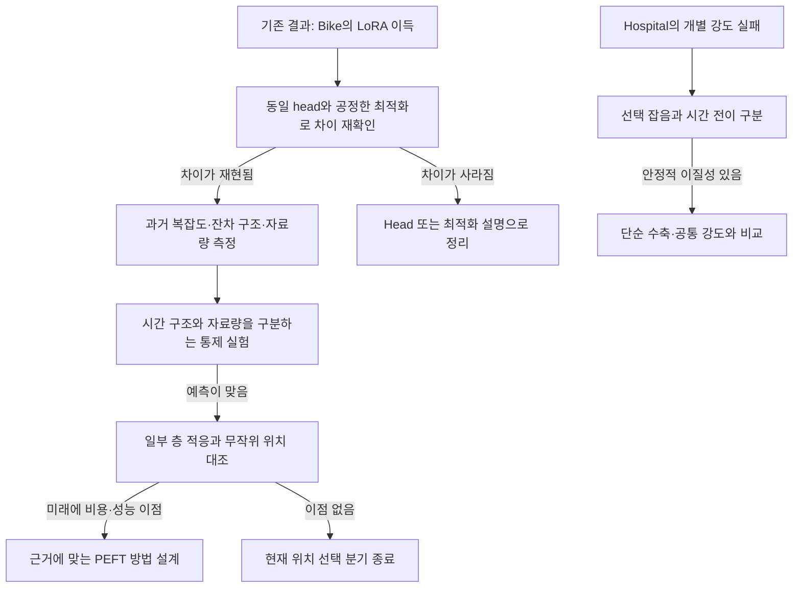

# 관찰된 PEFT 이득에서 원인·방법으로: 순차 진단 후보

2026-09-10. 사용자 요청에 따른 **연구 후보와 실행 순서 제안**이다. 이번 작업은 기존 기록 검토와 선행 경계 확인이며 새 통계 계산·feature 추출·학습은 하지 않았다. 아래 수치는 기존 결과, 설명과 방법은 별도 표시한 가설이다. 기존에 닫은 분기를 새 이름으로 다시 실행하지 않는다.

## 1. 답과 우선순위

가능하다. 다만 복잡도를 측정한 뒤 바로 adapter를 만드는 대신, **어떤 구조가 어떤 모델에서 회수 가능한 오차를 남기는지**를 확인해야 한다. 복잡한 데이터는 정보가 풍부할 수도, 예측 불가능한 잡음이 많을 수도 있다. 데이터 복잡도와 학습 필요성은 같은 양이 아니다.

목적은 새로운 TSFM PEFT 방법의 근거를 찾는 것이다. 이번 문서의 소비처는 사용자와 연구자가 다음 진단 하나를 선택하는 단계다. 정확도 개선뿐 아니라 같은 정확도에서의 실제 적응 비용 감소도 후보가 될 수 있다. 그러나 데이터에 맞춰 비용 제약을 사후에 만들지 않는다.

```text
순서       후보                              현재 근거 / 역할
1          R1 내부 적응 이득의 조건           Bike의 실데이터 차이에서 시작하는 주 경로
2          R2 필요한 적응 위치·범위           R1 통과 후 이어지는 방법 설계 경로
별도 3     R3 개별 적응 강도의 불안정성        Hospital 실패 원인을 좁히는 보조 경로
보류       R4 감독이 없는 방향의 손상         현상은 강하지만 단순 기존 대조와 중복
```

R1과 R2는 독립 논문 두 개가 아니라 하나의 연구 흐름이다. R3는 R1 실패를 자동으로 구제하는 분기가 아니다. 네 후보를 모두 순서대로 GPU에 넣는 대기열도 아니다.



## 2. R1 — 어떤 시간 구조에서 내부 적응이 유리한가?

### 출발점과 경쟁 설명

[확인] [Study20](../06_fullft_reference/20_peft_fullft_reference_results_20260909.md)에서 LoRA의 F0 대비 손실 감소는 Bike 4.935%, Household 0.915%였다. Head 대비 추가 이득은 각각 **3.953%F0, 0.121%F0**다. 후자의 시간 블록 구간은 양방향을 포함한다. Bike head의 한 seed는 step0이 선택됐고 여러 LR가 grid 경계였다. 따라서 두 데이터셋의 평균만 보고 복잡도가 원인이라고 회귀할 수 없다.

[가설 R1a] 과거에 반복되는 시간 구조가 frozen 모델의 예측에 충분히 반영되지 않고, LoRA가 그 구조를 활용하도록 계산을 바꾼다.

[경쟁 설명 R1b] Head의 용량·초기화·최적화가 불리했다. 충분히 학습한 같은 head를 두면 차이가 줄어든다.

[경쟁 설명 R1c] 자료량과 시간 전이가 차이를 만든다. 복잡도가 비슷해도 실제 독립 학습 구간 수와 안정성이 다르면 적응 이득이 달라진다.

### 무엇을 측정할 것인가?

처음부터 수십 개 특성을 탐색하지 않고 다음 네 묶음으로 제한한다. 모든 선택용 특성은 해당 예측 시점 이전 자료로만 계산한다.

1. **스펙트럼 분산:** 평균·추세 처리와 주파수 격자를 고정한 정규화 spectral entropy `−Σ p_k log(p_k)/log(K)`. 상수열은 정의 불가로 별도 표시한다. 높은 값 자체를 적응 필요로 해석하지 않는다.
2. **반복 구조의 안정성:** 시간별 자료의 일·주 주기 자기상관과 인접 과거 구간의 스펙트럼 차이. L336에는 주간 주기가 두 번뿐이므로 주간 추정이 불안정할 수 있다. 더 긴 과거로 측정할 때는 접근 가능한 이력과 모델 입력 길이를 따로 명시한다.
3. **모델이 남긴 예측 가능한 오차:** 과거 rolling out-of-fold F0/head median 잔차의 자기상관과 일·주 패턴. Train 적합 잔차만 쓰지 않는다. 같은 정보의 계절성 보정·ridge가 이 오차를 회수하는지도 본다. Median 잔차 분석은 진단이고, 주지표인 pinball loss의 가법적 분해로 주장하지 않는다.
4. **자료량·전이:** 학습 시간 길이, 겹치지 않는 목표 구간 수, 결측률, 과거 구간 간 수준·변동성 차이. 겹치는 90개 origin을 90개 독립 표본으로 간주하지 않는다.

목표량은 `G=(S_frozen_same_head−S_LoRA_same_head)/S_F0`이며 F0 대비 절대 효용도 함께 보고한다. Head가 나빠져 생긴 큰 G는 성공 근거가 아니다. 기존 Study20의 native HEAD_ONLY 값과 새 동일-head 진단 결과는 다른 실험으로 구분한다.

### 원인을 구분하는 순서

**R1-0, 저장 결과 진단:** 기존 예측을 seed·origin·horizon별로 확인한다. Bike 이득이 일부 기간·한 seed·구간 폭 변화에만 몰리는지, median 예측도 개선됐는지 먼저 본다. 이미 본 E를 재분석하므로 모두 탐색적이다. 이 자료를 다시 미노출 test로 부르지 않는다.

**R1-1, head 대조 정리:** native F0와 native 표준 LoRA를 참조로 유지하고, 같은 hidden tap·token 처리·양자점 출력 형식의 작은 residual MLP를 frozen/LoRA 양쪽에 붙이는 통제 비교를 설계한다. 동일 초기 head, F0와 일치하는 초기 출력, 동일 입력·loss·split·선택 예산을 확인한다. Native head-only도 유지한다. Linear와 MLP 두 용량만 먼저 비교하며 큰 decoder를 탐색하지 않는다. Chronos-2의 실제 head/hidden 경로를 코드로 확인한 후 최종 구조를 고정한다.

동일 step 수만으로 최적화가 공정하다고 가정하지 않는다. 각 arm에 같은 크기의 LR 선택 기회를 주되 LR 수치 자체는 같을 필요가 없다. 경계 선택이나 학습 실패가 발생하면 그 원인만 수정해 한 번 재확인한다. LoRA와 head를 공동 학습한 차이는 해당 절차의 효과이지 ‘정보가 없었다’는 증명이 아니다.

**R1-2, 구조와 자료량 대조:** 재현된 차이에 한해서 과거 자료량의 제한된 두 수준과 시간 구조의 통제 조건을 검사한다. 추세+계절성+잔차 생성 조건에서 주기 안정성과 잡음 비율을 따로 바꾸고 길이·scale·horizon·target 접근권을 맞춘다. 실데이터의 시간 순서를 섞어 나빠진 결과만으로 주기의 인과성을 주장하지 않는다. 합성에서는 강한 RAW/계절성 기준선을 두며, 합성에서만 성립하면 실제 PEFT 방법 근거로 넘어가지 않는다.

기존 Bike/Household는 개발용 사례다. 조건별 반복 창을 늘려도 독립 도메인이 늘지는 않는다. 원인 설명을 고정한 다음 별도 시기와 독립 원천을 확보해야 한다. 자료를 먼저 확인하고 유효 블록 수와 실행 예산을 정할 것이며, 지금 임의의 표본 수로 검정력을 보장하지 않는다.

### 방법으로 연결되는 조건

[미검증 방법 후보] 안정적인 특정 시간척도의 잔차가 남고 그 척도에 대한 개입으로 내부 적응 이득이 달라지면, **척도별 작은 residual adapter 또는 시간 모듈에 제한한 LoRA**를 검토할 수 있다. 반면 과거 residual 보정만으로 해결되면 그 단순 대조를 먼저 채택한다. Raw complexity가 약하고 모델 잔차가 강한 예측자라면 ‘복잡한 데이터용 adapter’보다 ‘모델이 놓친 구조로 적응을 선택하는 절차’가 적절한 질문이다.

진행 조건: head 최적화 대조 뒤에도 내부 적응 이득이 남고, 설명이 개발 자료 밖에서 방향을 예측해야 한다. 실용 효과 문턱은 새 test를 보기 전에 정한다. 두 번의 사전 지정 개발 재현에서 방향이 유지되지 않으면 이 기전을 보류한다. 이는 넓은 PEFT 가설의 반증이 아니다.

선행 경계: [Time-PEFT 저자 저장소](https://github.com/kaist-dmlab/TimePEFT)는 spectral entropy·채널 정보 흐름과 frequency/channel adapter를 이미 연결한다. [MSFT, NeurIPS 2025](https://papers.neurips.cc/paper_files/paper/2025/hash/20563b8508ba42e1b688d922e926ee26-Abstract-Conference.html)는 여러 sampling scale을 fine-tuning에 반영한다. ‘주파수를 쓰는 PEFT’ 자체는 신규성 후보가 아니다. 이번 확인은 README/공식 초록 수준이며 전체 구현 재현이나 신규성 조사를 끝낸 상태는 아니다.

## 3. R2 — 필요한 적응을 일부 층에만 배치할 수 있는가?

[확인] [Study09](../02_adaptation_scope/09_peft_module_ablation_results_20260908.md)의 합성 Q00에서 attention-only는 결합 LoRA 성능을 유지했지만 제거한 파라미터는 약2.26%였다. 이는 실데이터의 특정 층 선택이나 큰 효율 개선을 입증하지 않는다. Study20의 Full이 LoRA를 넘지 못한 결과도 ‘정답 rank가 낮다’는 증명이 아니다.

[가설] R1에서 확인한 시간 구조의 적응에 필요한 갱신이 특정 깊이·모듈에 집중돼, 모든 위치에 균일하게 LoRA를 배치할 필요가 없다.

측정은 같은 용량·선택 예산의 층별 probe 손실, 과거 학습 구간의 gradient 방향 일치도, 소수 층에만 LoRA를 두고 **처음부터 다시 학습한** 성능이다. Probe 손실이 높은 층에 adapter를 넣어야 한다는 규칙은 가정하지 않는다. Gradient 크기도 파라미터 scale과 차원의 영향을 받으므로 크기 순위만으로 기전을 주장하지 않는다.

R1이 통과하면 앞/중간/뒤의 세 위치군으로 먼저 제한한다. 같은 head에서 동일 rank 비교(위치 효과)와 동일 총 파라미터 예산 비교(효율)를 구분한다. 전체 LoRA, 고정 마지막 층, 미리 고정한 복수 무작위 위치, 가능한 동일 예산의 기존 적응 배분 방법을 대조한다. 과거 진단으로 위치를 정한 뒤 새로운 시간 구간의 결과를 확인한다. 좋은 층을 test에서 고르면 oracle 분석일 뿐이다.

[미검증 방법 후보] 과거 진단값으로 LoRA 위치·rank를 고르는 선택 절차. 새 adapter 블록이 없어도 유효한 ML 방법이 될 수 있지만, 진단 비용을 포함한 전체 적응 비용에서 이득이 있어야 한다. ‘파라미터 수 감소’만 보고 메모리·속도 감소를 가정하지 않는다. [AdaLoRA, ICLR 2023](https://arxiv.org/abs/2303.10512)는 중요도에 따른 파라미터 예산 배분을 이미 다룬다.

진행 조건: 사전 선택이 고정 위치와 무작위 대조를 넘어야 한다. 단 한 자료에서 유리하거나 전체 LoRA 대비 절약이 미미하면 현 위치 선택 분기를 닫는다. 정확도 동등 주장은 사전 허용 오차와 충분한 불확실성 평가가 있어야 한다.

## 4. R3 — 개별 적응 강도는 왜 미래로 전달되지 않았는가?

[확인] [Hospital 완료 결과](../08_hospital_shared_strength/24_hospital_results_20260910.md)에서 표준 LoRA는 F0보다1.183% 좋았지만 INDIVIDUAL은 GLOBAL보다0.412%F0 나빴다. GLOBAL은 두 seed 모두 alpha1이었다. 현재 직접 개별 선택 분기는 종료한 상태다.

경쟁 설명은 세 가지다. **12개월 V2의 선택 잡음**, **계열별 이득의 시간 변화**, **안정적인 개인화 이득 자체가 거의 없음**이다. 두 seed로는 학습 변동과 계열 고유 차이를 충분히 분리할 수 없다. 현재 결과만으로 gradient conflict를 주장할 수도 없다.

먼저 저장된 alpha별 손실 곡선의 평탄함, GLOBAL과의 손실 여유, V2 대 E1/E2의 선택 순위 변화를 기술한다. 평가 자료에서의 alpha 최적값은 사후 상한으로만 표시한다. 현재의 2005/2006은 이미 확인했으므로 새 규칙의 test로 재활용하지 않는다. V2를 월별로 무작위 재표집한 구간도 독립적인 연도 반복이나 진짜 선택 신뢰구간으로 취급하지 않는다.

그다음 필요한 자료는 더 긴 과거와 여러 순차 validation 구간이다. 과거 양을 늘릴수록 선택이 안정되면 잡음 설명에, 최근 과거에서는 반복되나 멀어진 시점에서 뒤집히면 시간 변화 설명에 무게가 실린다. 어느 쪽도 자동으로 인과 확정은 아니며 구조 변화를 통제한 보조 검사가 필요하다. 84개월 자료만으로 구분할 수 없으면 자료 부족으로 보류한다.

[미검증 방법 후보] 안정적인 계열 차이가 남을 때만 `alpha_i=(1−w_i)alpha_global+w_i alpha_local`의 부분 수축이나 간단한 그룹 강도를 먼저 비교한다. w는 미래 성능이 아니라 과거 반복 선택의 신뢰도로 정한다. 경험적 Bayes·예측 결합과 겹치는 단순 기준선이며 이를 새 PEFT라고 이름 붙이지 않는다. 출력 alpha 선택은 추론 보정이고, 실제로 adapter 계수를 학습하는 절차와도 구분한다.

기발하지만 후순위인 설명은 ‘공유 학습에서 계열의 갱신 방향이 충돌한다’는 것이다. 같은 총 파라미터 예산에서 공유+작은 그룹 residual adapter로 연결할 수는 있다. 그러나 현재 alpha 실패는 그 증거가 아니다. 과거 gradient 충돌이 미래 손해를 예측하고 단순 부분 수축으로 해결되지 않을 때에만 추가 검토한다. 지금은 이 후보를 위해 새 모델을 만들 이유가 없다.

중단 조건: 과거로 예측되는 안정적 이질성이 없거나, 수축이 공통 alpha를 넘지 못하면 개인화 분기를 닫는다. 최근 실패를 복잡한 gate로 자동 구제하지 않는다.

## 5. R4 — 감독이 없는 방향의 업데이트를 제한하는 PEFT (보류)

[확인] [Study17](../04_objective_observation/17_coarse_supervision_results_20260908.md)에서 월합 감독의 head가 Eagle 시간별 MSE를 약27.77배 악화시켰다. 이미 train에서 보정의 패턴 에너지가 수준 에너지보다 훨씬 컸다. 현상과 측정량은 가장 분명한 편이다.

월합 연산을 C, 예측 변경을 d, C의 영공간으로의 직교 투영을 P_N이라 두면 `||P_N d||²/(||d||²+epsilon)`으로 감독이 보지 못하는 변경 비율을 기술할 수 있다. 큰 값은 보이지 않는 변경을 뜻할 뿐, 그 변경이 실제로 해롭다는 증거는 아니다. 별도 fine 정답과 개입 대조가 필요하다.

[미검증 방법 후보] 감독이 없는 출력 방향의 변경을 억제하며 LoRA를 학습하는 제약. 그러나 [Study22의 정정 포함 스크린](22_peft_method_candidate_screen_20260909.md)에서 기존 단순 패턴 보존과 선행 중복을 이미 검토했다. [Temporal Disaggregation](https://journal.r-project.org/articles/RJ-2013-028/)은 집계 일치와 패턴 보존을 다룬다. 단순 투영을 다시 새 adapter로 포장할 수 없다.

다시 열 조건은 실제 태스크에 필요하면서 단순 투영이 부족한 관측 조건, 또는 동등하게 제공할 수 있는 별도 fine 감독이 확보되는 경우다. 새 방법에 유리하도록 인위적으로 관측을 복잡하게 만들지 않는다. 현재는 R1보다 우선하지 않는다.

## 6. 하나씩 진행하기 위한 체크리스트

- [ ] **첫 작업 R1-0:** Study20 원 예측·split·head 학습 곡선 목록을 확인하고, Bike 추가 이득이 언제/어느 horizon/어느 seed에 있는지 재분해한다. 저장값만으로 불가능한 항목은 없는 것으로 기록한다.
- [ ] 같은 과거 입력에서 미리 정한 소수 시간 특성과 F0/head 잔차 구조를 계산한다. 두 데이터셋 평균 상관계수를 일반 법칙으로 보고하지 않는다.
- [ ] ‘반복 시간 구조 / head 최적화 / 자료량·전이’ 중 어느 설명이 관측과 맞는지와 반례를 한 장으로 정리한다. 좋은 예와 나쁜 예를 함께 남긴다.
- [ ] R1-1의 실제 hidden/head 경로·자료 분할·예산·평가 시점·최소 실용 효과·중단 기준을 고정한다. 그 후 한 번의 통제 학습을 진행한다.
- [ ] 재현될 때만 R1-2 → R2로 이동한다. 확인된 원인에 따라 adapter 형태가 달라진다.

모든 기존 E는 개발에 노출된 것으로 기록한다. 새 test에서 특성·층·rank·수축 계수를 다시 고르지 않는다. Seed 수를 도메인 수로, 겹치는 창 수를 독립 표본 수로 세지 않는다. 다수 후보 결과는 탐색적 결과로 표시하고 확증에서는 주대비를 제한한다. 원 계약·checkpoint·결과를 덮어쓰지 않는다.

새 GPU 진입 시 기존 시스템 안전 절차를 재확인하고 한 작업씩 실행한다. 학습 시간은 이번 문서로 추정하지 않는다. 우선 저장 자료 진단의 범위와 새 fit 수를 확정한 뒤 실측 기준으로 예산을 제시한다.

**권고:** R1-0부터 시작한다. 첫 산출물은 새로운 adapter가 아니라, ‘Bike에서 실제로 무엇이 개선됐으며 무엇으로는 설명되지 않는가’를 보여주는 진단이다. 그 진단이 있어야 complexity, layer 선택, adapter 설계를 같은 연구 질문으로 연결할 수 있다.
