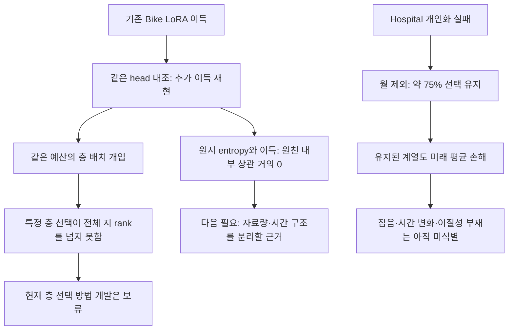
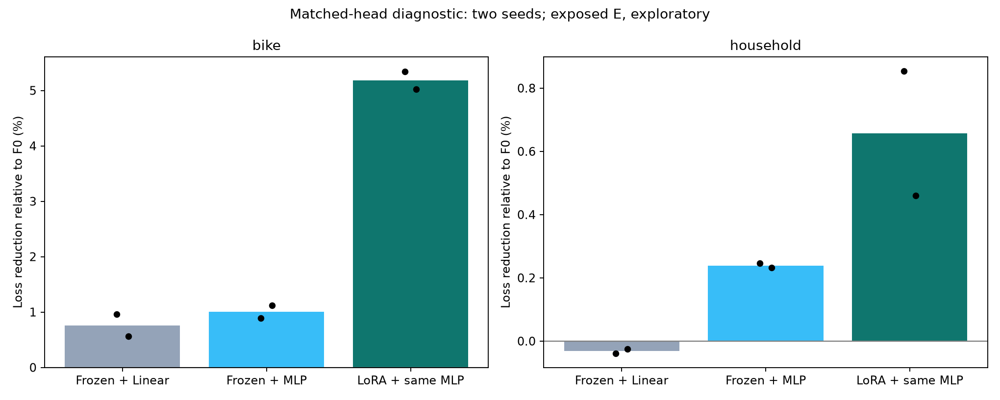
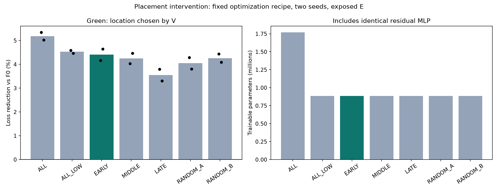
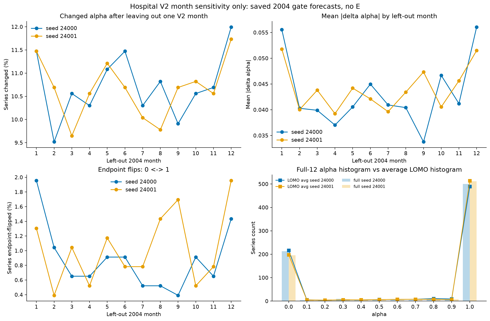

# R1–R3 실행 결과: 내부 적응 이득은 남지만 새 선택 방법의 우위는 미확보

2026-09-10 · 상태: 이번 통제 학습 36 fits와 평가 24회, 저장자료 진단 및 독립 감사 완료. 이 문서가 임시 CPU 스냅샷을 대체한다. [실행 전 후보](25_phenomenon_to_mechanism_roadmap_20260910.md)와 [실행 범위](../../../../experiments/peft_mechanism_diagnostics_v1/PURPOSE.md)를 함께 보관한다.

## 결과와 판단

[확인] 같은 residual MLP를 사용해도 Bike의 LoRA 추가 이득은 남았다. 그러나 그 원인이 원시 복잡도나 특정 깊이의 병목이라는 증거는 얻지 못했다. 위치 선택은 같은 예산의 전체 층 저 rank 대조를 넘지 못했고, Hospital 개인화 실패는 월별 선택 불안정만으로 설명되지 않았다.

```text
단계  이번에 한 일                           관측 결과                             판단
R1    같은 head에서 내부 LoRA 유무 재학습    추가 이득 Bike 4.171 / Household .418  내부 적응 절차의 효용 재현
R2    위치를 고정하고 같은 예산으로 재학습   EARLY 4.404 / ALL_LOW 4.528            위치 선택 우위 미확보
R3    저장 alpha 곡선·월 제외·미래 전이      75% 선택 안정, 미래 개인화 효과 음수  단순 불안정 설명 불충분
```

R1 수치는 `(S_MLP − S_LoRA+MLP)/S_F0 × 100`, R2 수치는 `(S_F0 − S_method)/S_F0 × 100`이다. 모두 양수가 좋다. `%F0`는 F0 손실로 정규화한 차이이며 상대 비교 대상의 손실을 분모로 한 개선율과 다르다.



## R1. 출력 head의 차이를 통제해도 내부 적응이 필요한가?

Chronos-2의 원 native output head를 동결하고, 마지막 hidden에 zero-init residual head를 더했다. Frozen+MLP와 LoRA+같은 MLP의 구조·초기 가중치·출력 형식이 동일하다. Linear는 작은 용량의 참조다. LoRA는 12개 block의 time/group attention q/k/v/o에만 적용했고 output projection LoRA는 없다.

- 두 원천 Bike/Household, seed 25000/25001, 각 arm의 optimizer recipe 두 개: 총 24 fits.
- recipe `(head LR, LoRA LR)`는 `(1e-4, 1e-4)`와 `(3e-4, 3e-5)`. Frozen arm도 같은 두 head LR를 받았다. 완전한 2차원 HPO나 최적 LR 보장은 아니다.
- 각 fit은 200 updates, 40마다 V 평가, microbatch 4/effective 8. Seed 평균 V로 recipe를 고르고 각 fit의 V 최저 checkpoint를 평가했다. 모든 dataset/arm에서 recipe 0이 선택됐다.
- Train 90/V 30/C 20/E 80 origins, context 336시간, horizon 48시간. 이번 head/LoRA 선택에는 V를 사용했다. 기존 E는 이미 여러 번 확인한 개발 자료이며 새로운 독립 test가 아니다. 겹치는 origin은 독립 표본이 아니다.

[확인] E 손실과 F0 대비 평균 개선:

```text
원천        F0 손실       Frozen+Linear       Frozen+MLP          LoRA+같은 MLP
Bike        .183797058    .182397143          .181944135          .174278500
F0 대비                  +0.762%             +1.008%             +5.179%

Household   .297987550    .298082805          .297275166          .296029680
F0 대비                  −0.032%             +0.239%             +0.657%
```

같은 MLP 대비 내부 LoRA의 추가 이득은 Bike **4.445, 3.896%F0**, Household **0.607, 0.229%F0**다. Bike에서 두 seed 모두 추가 이득이 양수이고 평균 1%F0를 넘어 R2의 파일럿 진입 조건을 통과했다. 두 원천 모두 LoRA가 F0 자체도 개선했으므로 이번 큰 차이는 악화한 head만을 분모 비교 대상으로 삼아 생긴 현상이 아니다.



검은 점은 두 seed, 막대는 평균이다. 두 패널의 세로축 범위가 다르므로 축 수치를 함께 읽는다. 신뢰구간이나 독립 도메인 반복을 나타내지 않는다.

**해석:** 단순한 head 구조·초기화 차이만으로 Bike 이득을 설명하기 어려워졌다. 이것은 고정한 학습 절차에서 내부 가중치를 적응시키는 효과다. Frozen representation에 정보가 없었다거나, MLP의 충분한 최적화 한계를 모두 배제했다거나, 시간 주기를 LoRA가 회수했다는 증명은 아니다. 일부 checkpoint가 step 200에서 선택돼 더 긴 최적화의 영향도 남는다.

### 원래 Study20 예측에서 추가로 확인한 것

[확인] Bike는 과거 14일 target context의 평균 spectral entropy .550, ACF24 .754, ACF168 .871이었다. Household는 .812/.237/.236이었다. 반면 원천 내부에서 entropy와 origin별 기존 LoRA 추가 이득의 Pearson 상관은 **−.019/−.013**이다. 두 원천 평균의 차이로 복잡도의 일반 법칙을 만들 수 없다. 이 entropy는 detrend/Hann 처리한 두 target의 PSD 요약이며 선행연구의 complexity 정의를 재현한 결과가 아니다.

원 Study20의 Bike 추가 이득은 세 seed 모두 양수였고 E origin의 76.25%에서 양수였다. 두 target 모두 이득이 있었으며 casual 쪽이 더 컸다. Median MAE도 F0 대비 5.325% 개선돼 분위수 폭만 바뀐 현상으로 설명되지 않는다. 가장 큰 양의 효과 origin 한 개를 제외한 기술적 민감도에서도 약 3.04%F0의 추가 이득이 남았다. 이는 새 주지표나 평가 집합 변경이 아니다.


[미확정] 회수 가능한 특정 시간척도의 잔차라는 기전은 확보하지 못했다. 이번에는 합성 주기/잡음 조작이나 자료량 두 수준의 R1-2를 실행하지 않았다. 구체 기전이 없는 상태에서 합성 조건을 만들어 설명을 맞추지 않고, R2를 별도의 제한된 배치 효용 검사로 진행했다. 따라서 원 로드맵의 모든 원인 규명 단계를 완료했다는 의미가 아니다.

## R2. 어느 층에 적응을 몰아야 같은 예산에서 유리한가?

Bike에서 R1과 같은 residual MLP, seed, recipe 0, 200 updates를 유지했다. EARLY/MIDDLE/LATE는 각각 앞/중간/뒤 4개 block의 rank 6이다. RANDOM_A=[5,7,8,9], RANDOM_B=[4,6,7,9]는 실행 전 정한 무작위 4개 block이다. ALL_LOW는 12개 block에 rank 2를 둔다. 이 여섯 arm은 adapter 294,912개와 MLP 589,301개를 합쳐 **각각 884,213개의 동일 학습 파라미터**를 사용한다. R1 ALL(rank 8)은 총 1,768,949개인 큰 예산 참조다.

[확인] V 평균으로 EARLY/MIDDLE/LATE 중 **EARLY**를 선택한 기록을 저장한 뒤 E를 열었다. ALL_LOW와 random은 대조이며 그 세 후보의 위치 선택 집합에는 없었다. 전체 여섯 방식 중 V가 가장 낮은 것도 ALL_LOW였다.

```text
방식          F0 대비 개선 평균   seed별 개선       학습 파라미터   fit 내부 평균 초
ALL rank8      5.179%             5.338 / 5.020     1,768,949        50.10
ALL_LOW        4.528%             4.591 / 4.466       884,213        46.92
EARLY (V선택)  4.404%             4.165 / 4.643       884,213        35.13
MIDDLE         4.251%             4.035 / 4.468       884,213        32.30
LATE           3.551%             3.797 / 3.304       884,213        28.70
RANDOM_A       4.049%             4.290 / 3.809       884,213        31.29
RANDOM_B       4.259%             4.433 / 4.085       884,213        31.96
```



[확인] EARLY는 ALL_LOW보다 평균 **0.124%F0 나빴고**, seed별 우열도 바뀌었다. 두 random보다 평균은 좋았지만 작은 차이이며 두 seed로 일반화 우위를 주장하지 않는다. 특정 층을 고르는 절차의 성능상 필요성은 확보하지 못했다.

효율에서는 구분이 필요하다. EARLY는 큰 ALL 대비 총 학습 파라미터를 약 50.0% 줄이고 이번 내부 fit 시간은 약 29.9% 줄였다. 그러나 F0 대비 이득은 5.179→4.404%로 줄었다. ALL_LOW도 같은 파라미터 절약을 얻지만 시간 감소는 약 6.4%에 그쳤다. **파라미터 감소와 실행 시간 감소는 같은 지표가 아니다.** 시간은 두 fit의 관측치이며 초기화·진입 대기·위치 선택을 위한 여러 fit·평가 비용을 포함하지 않는다. 탐색 전체 비용을 무시한 빠른 방법 주장은 하지 않는다.

[판단] 이번 고정 층 배치 분기는 여기서 보류한다. 사전 허용 오차가 없으므로 성능 동등을 선언하지 않는다. Probe나 gradient로 위치를 예측하는 모델은 학습하지 않았고 AdaLoRA 같은 기존 배분 방법과의 비교도 없다. 따라서 새 자동 배치 방법을 검증한 결과가 아니다.

## R3. Hospital의 개별 강도 선택은 왜 다음 연도로 전달되지 않았나?

이 단계는 새 GPU 학습 없이 기존 두 seed의 767개 관련 계열과 V2=2004년, E=2005/2006년 예측을 재계산했다. 계열별 alpha는 F0와 공유 LoRA 예측의 혼합 강도다. 새로운 학습형 adapter가 아니다.

[확인] V2에서 개별 강도는 공통 강도보다 **0.781/0.559%V2-F0** 좋아 보였지만, 미래 E에서는 **−0.405/−0.419%E-F0**로 나빴다. 원 주효과 −0.411889897%F0가 독립 재계산과 일치한다. 두 구간의 정규화 분모는 서로 다르다.

[확인] E를 보고 alpha를 고르는 사후 oracle의 평균 여지는 공통 강도 대비 약 .320%F0다. 이것은 달성된 방법 성능이나 안정적인 개인화 가능성의 증거가 아니다. V2 alpha와 E oracle alpha의 Spearman 상관은 .030/.040이고 V2의 F0–LoRA 끝점 이득과 E의 해당 이득 상관도 .020 정도였다. V2 선택과 미래 선택 사이의 전이가 약하다.


### 12개월 중 한 달씩 제외하면 선택이 바뀌는가?

V2 예측만 사용해 12개 leave-one-month-out 선택을 다시 계산했다. 원 alpha grid와 동률 규칙을 유지했다. E는 이 계산에 사용하지 않았다. 12개월 전체 손실 곡선의 원 기록 대비 최대 차이는 8.88e-16, 전체 자료의 alpha 선택은 두 seed 모두 완전히 일치했다.

- 공통 alpha는 두 seed의 12개 경우 모두 1로 유지됐다.
- 각 seed에서 **192/767개(25.03%)**의 계열이 한 번 이상 바뀌었다. **575/767개(74.97%)**는 모든 월 제외에서 같은 값을 유지했다.
- 계열×제외월 단위의 변경 비율은 10.72%/10.66%, 평균 절대 alpha 변화는 .043/.044였다.
- 0과 1의 끝점 사이가 한 번 이상 뒤집힌 계열은 6.00%/6.65%였다.



이 검사는 12개월 표본에 대한 민감도이지 독립 연도 반복이나 선택 신뢰구간이 아니다. 월별 원점수가 종속돼 있으며 한 달을 빼는 검사는 작은 교란만 준다.

추가로 기존 E와 기술적으로 연결해 보니 **모든 월 제외에서 alpha가 유지된 575개 계열도 개별 선택의 미래 평균 손해가 양수**였다(INDIVIDUAL−GLOBAL normalized loss .003027/.002411). 변경된 192개에서도 .000949/.003127로 손해였다. 집단별 원래 alpha 구성이 다르고 공통 alpha와 같은 계열은 손실 차이가 0이므로 집단 간 인과 비교는 아니다. 다만 ‘월 제외로 흔들리는 계열만 제거하면 해결된다’는 설명은 뒷받침되지 않는다. 이 join은 사후 진단이며 새 규칙을 E로 선택하지 않았다.

[판단] 일부 선택 민감도는 있지만 **검증 선택이 전부 불안정해서 실패했다**고 결론내릴 수 없다. 짧은 검증의 잡음, 실제 시간 변화, 안정적인 계열별 이질성 부족을 현재 자료로 분리하지 못한다. 직접 개인화 분기는 닫힌 상태로 유지한다. 안정성에 따른 수축이나 그룹 adapter를 자동으로 추가하지 않는다.

## 다음에 연구를 이어간다면

우선순위는 R1의 원인을 좁히는 일이다. 이번에 새롭게 확보한 것은 ‘같은 head 아래에서도 Bike의 내부 적응 이득이 남는다’는 통제 결과다. 주제는 아직 **어떤 조건에서 추가 내부 적응이 필요한가**이고, entropy 기준 adapter나 특정 층 선택이라는 답은 확보하지 못했다.

1. 다음 개발 실험은 자료량과 시간 구조의 영향을 구분하는 주대비 하나로 제한한다. 먼저 과거 rolling 구간에서 모델 잔차와 단순 계절성/선형 보정의 회수 가능성을 확인한다. 현재 E에서 좋은 특성이나 시간척도를 골라 미래 선택 규칙으로 포장하지 않는다.
2. 측정 가능한 구조가 확인될 때만 주기 안정성과 잡음 비율을 따로 바꾸는 통제, 또는 자료량 두 수준의 실험을 사전에 고정한다. 구조 개입이 기대한 방향으로 내부 적응 이득을 바꾸지 않으면 그 설명을 중단한다. 현재 자료로는 특정 frequency adapter 형태를 정할 근거가 없다.
3. 방법 후보가 생기면 미노출 시기와 독립 원천에서, F0·같은 head·전체 저 rank LoRA·단순 잔차 보정을 포함해 확인한다. 최소 효과와 선택 비용을 사전에 고정한다. Hospital은 여러 과거 연도에서 예측 가능한 이질성부터 보여야 다시 연다.

위는 다음 설계 조건이다. 이번 실행 뒤 추가 학습 대기열은 없다. 신규성 조사·새 방법 구현·독립 test 확증·R1-2 원인 개입은 완료하지 않았다.

## 실행과 검증 근거

[확인] 새 GPU runner는 **32분 46.6초**(진입 대기 포함), guard 내부 실행 합은 25분 35.8초였다. 본학습 36×200=7,200 updates와 smoke 9 updates, 평가 24회다. 독립 CPU 분석·문서 작성 시간은 runner 시간 밖이다.

[확인] 보호 대상 원 코드·모델·자료 50개 hash를 확인했다. 새 fit의 초기 F0 예측 오차 0, frozen hash 보존, 같은 seed의 초기 MLP hash 일치, checkpoint 재로드 예측 일치를 확인했다. 24개 평가 손실을 NumPy로 독립 재계산한 최대 차이는 **0**이다. R1 24 fits와 R2 12 fits의 checkpoint/선택/동일 예산을 검사했다.

[확인] 63 guard jobs가 모두 exit 0, 안전 중단 0회였다. 샘플링한 최소 가용 RAM 9.560GiB/가용 commit 9.623GiB, 최대 GPU 사용 2,008MiB/온도 54°C였다. 16:27:19–17:01:20 KST Windows 조회에서 Application 1000/1001, NVIDIA/Display4101, WHEA, 자원고갈, Kernel-Power41 대상 이벤트 0건이고 조회 오류도 0건이다. 현재 관련 학습 프로세스와 guard lock은 없다. 이는 이번 구간의 관측이며 과거 크래시 원인을 해결했다는 뜻은 아니다.

진입 대기 중 기존 사용자 승인에 따라 Chrome을 종료해 commit 여유를 확보했다. 파일 삭제·드라이버/보안/페이지파일 변경은 없었다. 이번 작업의 commit/push도 없다.

## 산출물과 재현

- [결과 묶음과 코드 실행 안내](../../../../results/peft_mechanism_diagnostics_v1/README.md)
- [통제 실험 독립 감사](../../../../results/peft_mechanism_diagnostics_v1/controlled/summary.json), [seed별 손실·시간 CSV](../../../../results/peft_mechanism_diagnostics_v1/controlled/metrics.csv)
- [R1 기존 예측 진단](../../../../results/peft_mechanism_diagnostics_v1/reference/summary.json), [target·horizon 분해](../../../../results/peft_mechanism_diagnostics_v1/reference/components.json)
- [Hospital alpha 진단](../../../../results/peft_mechanism_diagnostics_v1/hospital_strength/summary.json), [월 제외 감사](../../../../results/peft_mechanism_diagnostics_v1/hospital_strength/month_sensitivity.json), [안정성과 미래 손해의 사후 연결](../../../../results/peft_mechanism_diagnostics_v1/hospital_strength/stability_transfer_descriptive.json)
- [시스템 조회](../../../../results/peft_mechanism_diagnostics_v1/controlled/system_audit.json), [자원 극값](../../../../results/peft_mechanism_diagnostics_v1/controlled/resource_extrema.json)

작은 코드·CSV·JSON·그림은 results/experiments에 남겼고, 대형 checkpoint·예측·원 계약은 기존 정책대로 로컬 runs에 있다. 파일럿 E 노출 이력을 없애지 않는다. CPU 중간 스냅샷의 `followup_summary.json`/`saved_artifact_snapshot.md`는 기존 자료 재분석에만 해당하며 새 R1/R2 완료 근거는 controlled/summary.json이다.
