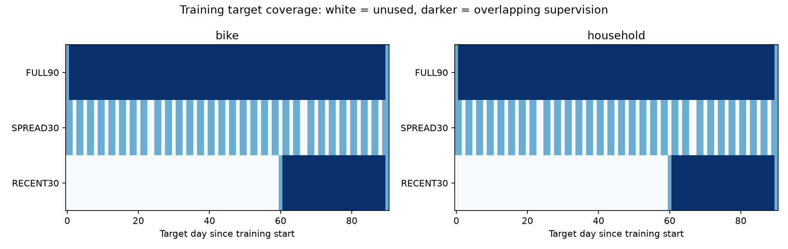
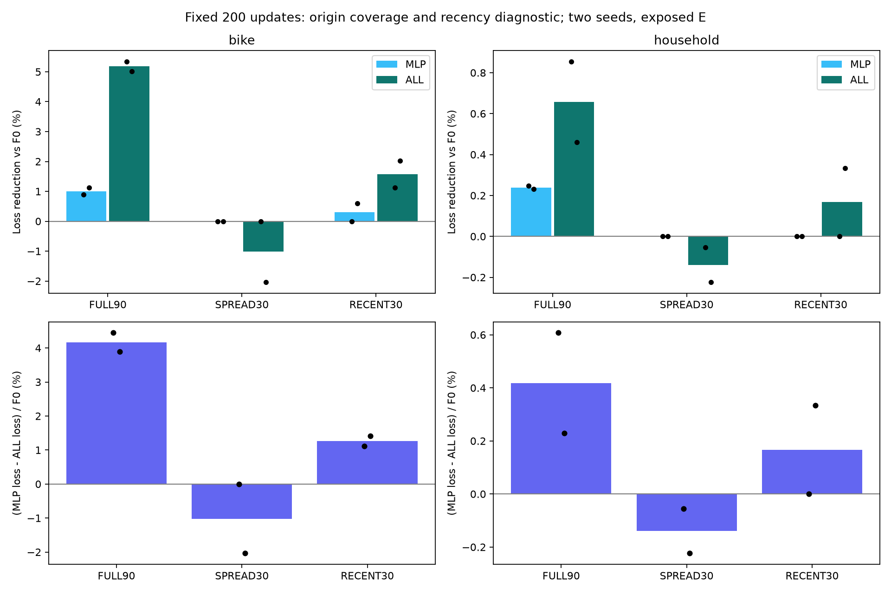
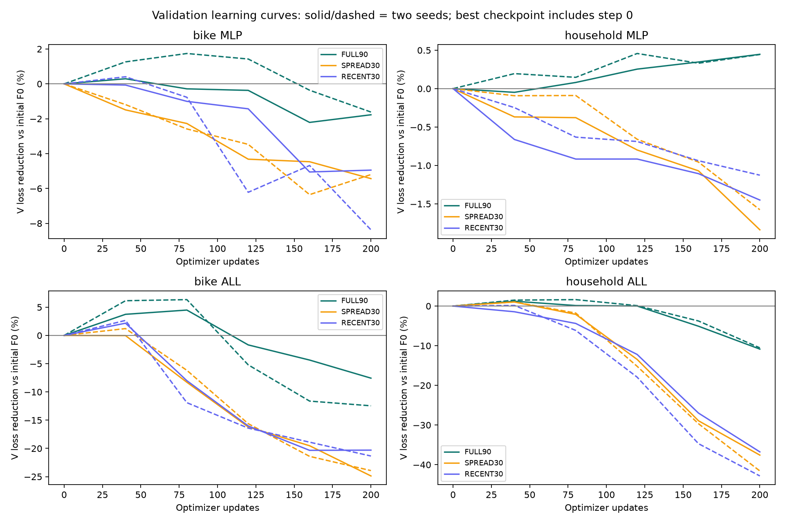
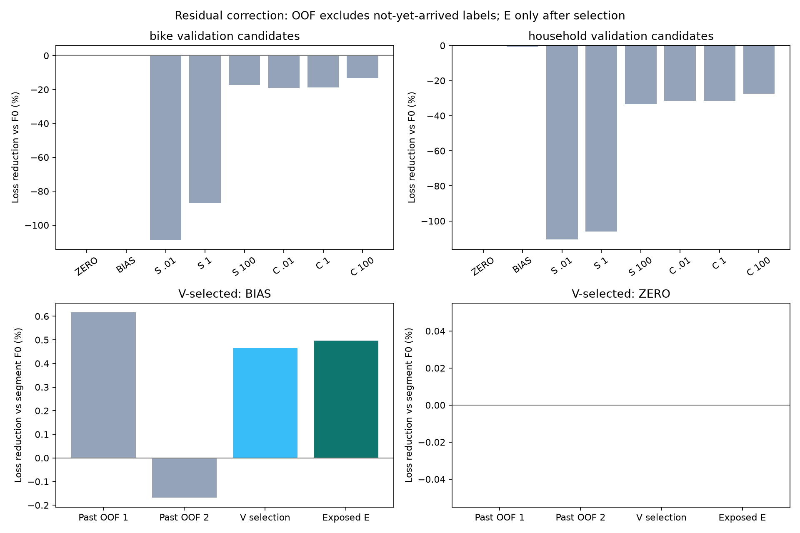
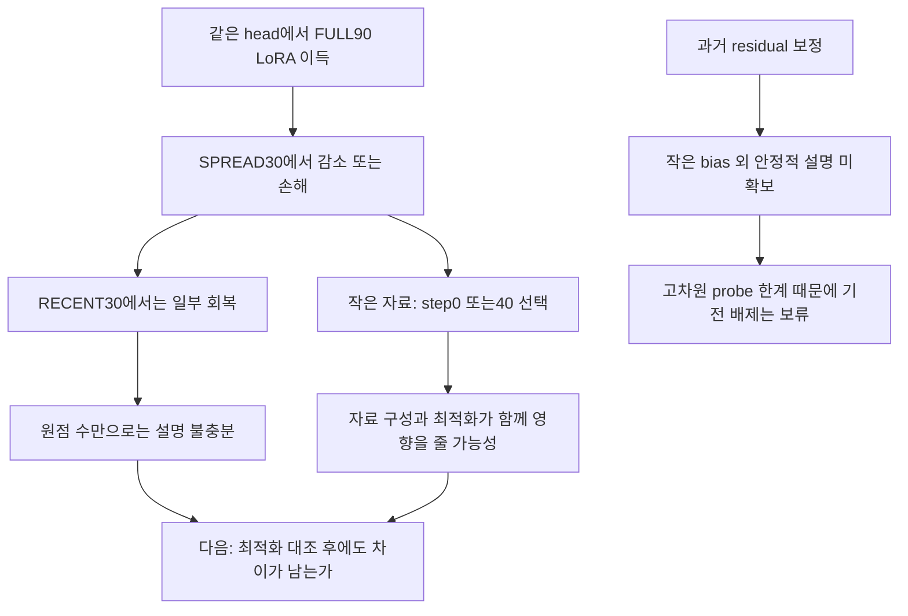

# R1 후속 검증: 학습 원점 구성에 따라 LoRA의 손익이 바뀐다

2026-09-10 · 완료. [이전 같은-head 실험](26_mechanism_diagnostics_20260910.md)의 남은 원인을 검증했다. 새 16 fits/16 평가, 기존 FULL90 8 fits 재사용, F0 과거 예측과 잔차 보정 검사를 완료했다. 실험 조건은 [실행 전에 고정한 범위](../../../../experiments/peft_r1_validation_v1/PURPOSE.md)에 있다.

**[확인] 같은 수의 학습 창이어도 시간 구간 구성에 따라 LoRA의 이득이 달라졌다. [미확정] 그 원인이 최근성, 자료 다양성, 최적화·조기 종료 중 무엇인지는 아직 구분하지 못했다.** 원시 complexity나 특정 시간척도의 병목을 검증한 결과는 아니다.

## 1. 자료를 어떻게 줄였나

모델·head 초기화·loss·LR·업데이트 수를 유지했다. Chronos-2 native head를 동결하고 같은 residual MLP를 붙인 MLP 대 ALL(attention LoRA rank8 + 같은 MLP)이다. 두 원천과 seed25000/25001, head/LoRA LR1e-4, 200updates, 40마다 V, micro4/effective8을 사용했다. FULL90은 이전 모든 arm에서 선택된 recipe0의 실제 checkpoint/예측을 hash 검증 후 재사용했다. 새로운 자료 조건별 LR 탐색은 하지 않았다.

```text
조건       학습 원점    target 시간 범위     실제 서로 다른 target 시간
FULL90     90개         91일                 91일 = 2,184시간
SPREAD30   30개         같은91일             60일 = 1,440시간
RECENT30   30개         최근31일             31일 =   744시간
```

하나의 창이 48시간을 예측하고 원점은 하루 간격이다. 따라서 45개를 격일로 고르면 정답 범위가 거의 줄지 않는다. 이번에는 `round(linspace(0,89,30))`으로 기간 양끝을 보존한 SPREAD30을 사용했다. RECENT30은 원점60..89다. 아래 진한 색은 겹친 감독이고 흰색은 선택하지 않은 target 시간이다.



[한계] 창 수, 고유 정답 시간, 최근성은 완전히 분리되지 않았다. 원점 감소는 같은 200updates에서 개별 표본의 반복 노출도 늘린다. 과거 context 접근과 원 FULL90의 평가용 scaling은 유지했다. 따라서 모든 원자료 접근권을 줄인 sample-complexity 실험이나 순수한 두 요인 인과 실험이라고 부르지 않는다.

## 2. 결과: 같은 30개라도 분산과 최근이 달랐다

주효과는 `G = 100 × (S_MLP − S_ALL) / S_F0`다. 양수는 같은 head 위에 LoRA를 더한 효용이고, 음수는 손해다. 평균은 두 seed의 평균이다.

```text
원천        FULL90          SPREAD30         RECENT30
Bike        +4.171%F0       −1.019%F0        +1.267%F0
Household   +0.418%F0       −0.139%F0        +0.167%F0

Bike seed별
25000       +4.445           0.000           +1.118
25001       +3.896          −2.038           +1.417

Household seed별
25000       +0.607          −0.055            0.000
25001       +0.229          −0.224           +0.334
```

[확인] 두 원천·두 seed 모두 FULL90→SPREAD30에서 추가 이득이 줄었고, SPREAD30→RECENT30에서는 늘었다. 이는 이번 고정 학습 절차에서 관찰한 방향 일치이지 통계적 유의성이나 독립 도메인 일반화 증명이 아니다. 특히 SPREAD30의 Bike 한 seed와 RECENT30의 Household 한 seed는 step0을 선택해 효과가 정확히0이다.

F0 자체에 대한 절대 효용도 함께 봐야 한다.

```text
원천/조건             Frozen+MLP 개선     LoRA+같은 MLP 개선
Bike FULL90             +1.008%              +5.179%
Bike SPREAD30            0.000%              −1.019%
Bike RECENT30           +0.299%              +1.567%
Household FULL90        +0.239%              +0.657%
Household SPREAD30       0.000%              −0.139%
Household RECENT30       0.000%              +0.167%
```



검은 점은 두 seed, 막대는 평균이다. 원천별 축 범위가 다르다. 오차막대나 독립 반복 수를 뜻하지 않는다.

**이번에 약해진 설명:** 원점 개수만 알면 적응 효용을 설명할 수 있다는 설명. 같은30개에서 손익이 달랐으며, 실제 정답 시간이 더 적은 RECENT30이 SPREAD30보다 좋았다.

**아직 가능한 설명:** 최근 구간과 미래의 관계, 선택한 구간의 상태·계절 구성, 반복 감독의 차이, 작은 자료에서의 최적화 불안정. 이번 결과만으로 ‘최근 데이터만 쓰면 항상 좋다’고 말할 수 없다. 실제 최고 평균은 여전히 FULL90이었다.

E를20개 원점씩 나눈 기술적 분해에서도 시간별 효과는 균일하지 않았다. Bike FULL90의 G는 −.213/+5.496/+4.217/+7.183%F0, RECENT30은 −3.577/+4.297/+.121/+4.229였다. 이 분해는 E를 본 뒤의 설명 자료이며 새 선택 규칙에 사용하지 않았다.

## 3. 학습 곡선이 드러낸 미해결 요소

새16 fits 중 **9개가 step0**, **7개가 step40**을 선택했다. Step0 선택은 실행 오류가 아니라 V가 학습 전 예측을 선호했다는 뜻이다. 실제로 step0 체크포인트의 E 예측이 원 F0 예측과 일치하는지도 검사했다.



[확인] 작은 자료에서 뒤의 업데이트는 V 손실을 크게 악화시키는 경우가 많았다. [추정] 과적합 또는 과도한 업데이트가 일부 원인일 수 있다. 그러나 학습률·반복 노출·표본 구성과 분포 변화를 이 곡선만으로 나눌 수는 없다. 특히 step1..39의 별도 V 기록은 없으므로 첫40updates 사이의 좋은 지점을 놓쳤을 가능성도 남는다.

따라서 여기서 바로 ‘자료가 부족하면 특정 adapter가 필요하다’로 넘어가면 안 된다. 이번 검증은 **고정한 적응 절차가 학습 구간 구성에 민감함**을 보였고, 최적화 조건을 맞춘 뒤에도 같은 차이가 남는지는 미검증이다.

## 4. 단순 과거 잔차 보정이 LoRA 이득을 설명하는가

현 target 자료로 적응하지 않은 F0의 train/val rolling 예측을 새로 만들었다. 입력은 각 원점 이전336시간뿐이다. 보정 학습의 과거 OOF는 두 시간 구간이며, 학습 origin의48h 정답이 검증 시작 전에 모두 도착한 경우만 포함했다(29개/59개 train origins). Ridge의 feature 표준화도 해당 과거 fold에서만 적합했다. 미래 입력을 바꿔도 feature가 변하지 않는 검사와 fit target end≤forecast origin 검사를 통과했다.

후보는 보정 없음(ZERO), target/lead별 median residual 편향(BIAS), 과거 일·주 template를 쓰는 SEASONAL_RIDGE, 전체 past context의 CONTEXT_RIDGE다. Ridge lambda는 .01/1/100으로 고정했다. Train90으로 적합한 후보를 V pinball score로 선택해 파일로 저장한 다음 E를 열었다. 보정은 모든 quantile을 같은 양만큼 이동하며 폭을 학습하지 않는다.

```text
원천       V 선택       과거 OOF1/OOF2 개선     V 개선      E 개선
Bike       BIAS         +0.616 / −0.168%        +0.465%     +0.497%
Household  ZERO          0.000 /  0.000%         0.000%      0.000%
```

각 열은 해당 구간 F0 손실로 정규화했다. 구간별 분모가 다르므로 서로 같은 손실량인 것처럼 합산하지 않는다.



[확인] Bike의 선택된 편향 보정은 E에서 .497% 개선했다. FULL90 LoRA의 F0 대비5.179% 개선보다 작고 둘의 차이는 약4.681%F0다. 이것은 **검사한 보정으로 현재 LoRA 이득이 설명되지 않았다**는 결과다. 모든 출력 보정의 한계를 증명하지 않는다.

이 검사의 중요한 한계는 ridge 용량이다. Seasonal feature는292차원, context feature는 Bike1,776/Household1,440차원인데 OOF 학습 원점은29/59개, 전체도90개뿐이다. 출력은96개의 target×lead residual이다. 강한 정규화 λ100이 가장 덜 나쁜 경계였고, 더 작은 feature나 강한 수축은 검사하지 않았다. MSE로 median residual을 맞춘 뒤 전체 quantile pinball을 평가하는 목적함수 차이도 있다. 폭은 유지되지만 위치를 잘못 이동하면 꼬리 분위수 점수는 나빠질 수 있다. 따라서 고차원 probe의 실패로 계절성이나 단순 보정 기전 전체를 닫지 않는다.

## 5. 연구 판단과 다음 최소 검증



**현재 주제 후보는 ‘시계열 target 학습 구간의 구성과 업데이트 예산이 내부 적응의 이득을 어떻게 바꾸는가’로 조금 좁혀졌다.** 새 PEFT 방법을 확보했다는 뜻은 아니다. 같은 모델·같은 원천 내부에서 손익이 바뀌는 관찰이 생겼다는 뜻이다.

다음 우선순위는 frequency adapter 설계보다 **최적화 대조 한 번**이다. 이미 관측한 step0/40 집중에 맞춰 초반 V 간격을 촘촘히 하고, 원점당 반복 노출이나 누적 업데이트를 맞춘 조건에서도 SPREAD30과 RECENT30 차이가 유지되는지 사전 고정해야 한다. 낮은 LR 대조도 함께 정하되 결과를 보고 계속 범위를 늘리지 않는다. 이 차이가 사라지면 데이터 기전보다 기존 학습 설정 설명에 무게를 둔다. 남을 때만 시간 상태·구간 대표성 등 과거로 측정 가능한 변수를 확인한다.

새 원천과 미노출 시기 검증은 그 다음이다. 원 raw에 현재 E 뒤 자료가 남아 있어도 다른 실험에서의 노출과 사전학습 중복을 확인하지 않았으므로 지금 fresh라고 부르지 않는다. 이번 결과는 이미 확인한 E를 사용한 개발 진단이다. 시간 구조의 합성 개입·독립 미래 확증·새 adapter 학습은 이번 범위에 포함되지 않았고 자동 추가 실행하지 않았다.

## 6. 실행 무결성과 실제 오류 기록

[확인] 원 입력 코드·모델·자료50개 및 기존 FULL90 artifact32개의 hash를 확인했다. 같은 head 초기hash, frozen 파라미터, checkpoint 재현, 원점 subset, holdout target/시간/scale, 선택 순서를 검사했다. 새 F0 V score와 기존 step0 V score의 차이는 두 원천 모두0이다. 24개 모델 평가와2개 보정 평가를 float64 NumPy로 독립 재계산한 최대 점수 차이는 **5.55e-17**이다.

[확인] 새 학습16회와 모델 평가16회는 정상 종료했다. **마지막 CPU 보정 검사의 assertion 실패1회**가 있었고 기록을 보존했다. Float32에서 같은 보정값을 더할 때 양자화 때문에 분위수 간격이 최대6.1035e-5 달라졌는데1e-10 보존 검사를 요구한 것이 원인이다. 처음에는 비교 dtype 차이를 의심했으나 실제 배열 검사에서 덧셈 자체의 float32 반올림으로 좁혔다.

동결한 원 스크립트는 유지하고 `residual_dtypefix.py` 사본에서 F0 예측을 float64로 변환한 뒤 보정하도록 한 줄만 바꿨다. 보정 모델·선택 hash·허용 오차는 유지했다. 폭 차이는0, 원 float32 계산 대비 Bike E 점수 차이는5.67e-11이다. 별도 CPU retry만 수행했으며 재학습은 없었다. 진단 중 첫 불충분한 가정의 검사와 사본 생성 전 복구 호출도 실패했지만 학습/GPU 단계는 다시 실행하지 않았다.

총 guard37시도=36성공+CPU assertion1실패, 자원 안전 중단0회다. 첫 진입 로그부터 CPU 복구 완료까지 **19분53.2초**이며 진단 대기 시간을 포함한다. Guard 내부 합은13분59.5초다. 코드·설계·최종 분석 작성 시간 전체를 뜻하지 않는다.

최소 관측 가용RAM10.625GiB/commit9.994GiB, 최대GPU1,856MiB/53°C였다. 17:34:21–17:55:12 KST 조회에서 Application1000/1001, NVIDIA/Display4101, WHEA, 자원고갈, Kernel-Power41 대상 이벤트0, 조회 오류0이다. 관련 학습 프로세스와 guard lock도 없다. 과거 PC 크래시 원인을 해결했다는 주장은 하지 않는다.

이번 작업에서 파일 삭제·시스템 설정 변경·commit/push는 없었다.

## 근거 파일

- [산출물과 실행 안내](../../../../results/peft_r1_validation_v1/README.md), [독립 감사 summary](../../../../results/peft_r1_validation_v1/summary.json), [seed별 CSV](../../../../results/peft_r1_validation_v1/metrics.csv)
- [보정 선택](../../../../results/peft_r1_validation_v1/residual/selection.json), [보정 평가](../../../../results/peft_r1_validation_v1/residual/evaluation.json), [수치 오류 원인](../../../../results/peft_r1_validation_v1/residual_dtype_diagnosis.json)
- [입력 시간 범위](../../../../results/peft_r1_validation_v1/coverage_audit.json), [시스템 조회](../../../../results/peft_r1_validation_v1/system_audit.json)
- [FPP3 시간 순서 검증](https://otexts.com/fpp3/tscv.html), [잔차 진단의 범위](https://otexts.com/fpp3/diagnostics.html), [Time-PEFT 저자 구현](https://github.com/kaist-dmlab/TimePEFT). 이번 검사는 해당 방법의 구현 재현이나 신규성 확증이 아니다.
