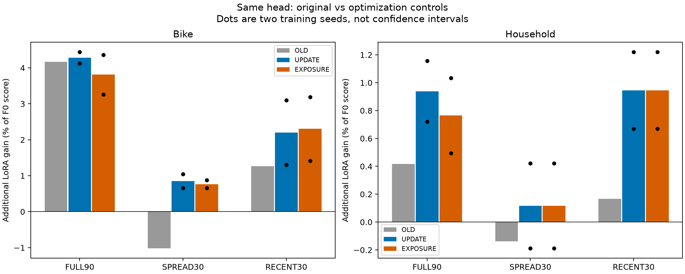
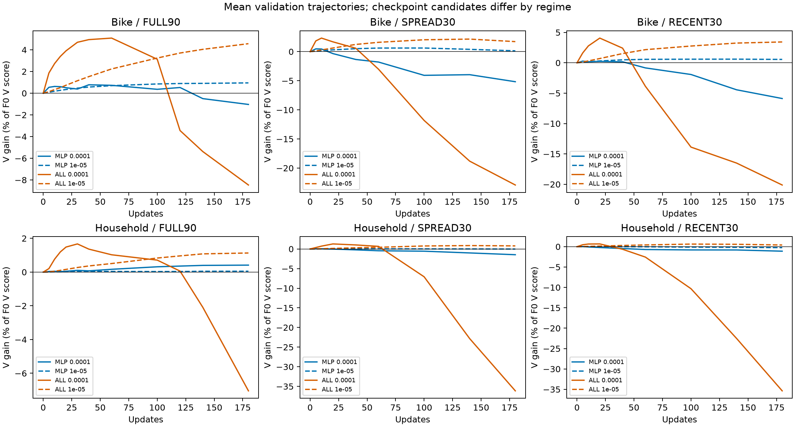
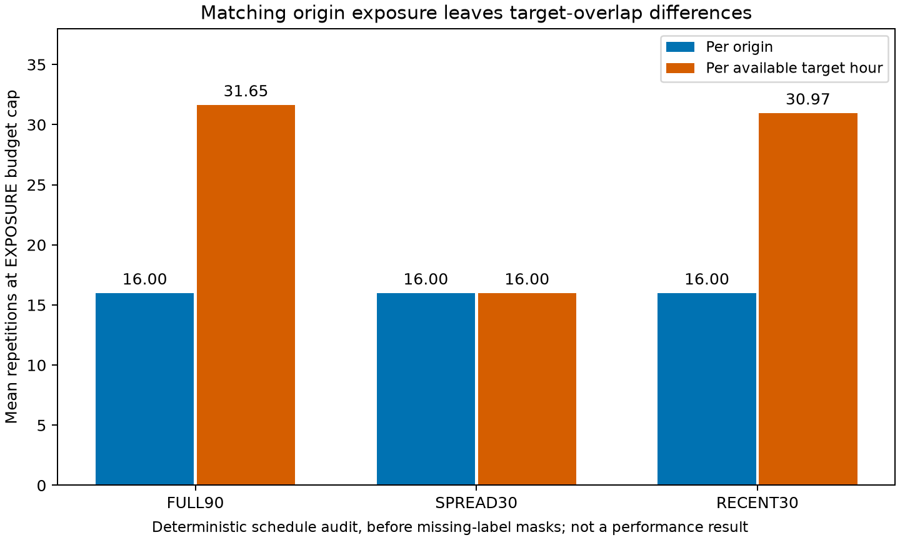
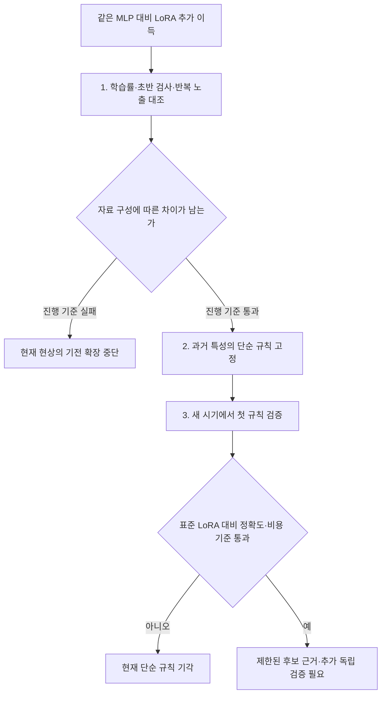

# 28. 최적화 대조 → 과거 효용 예측 → 미래 평가

상태: **1단계 완료, 사전 진행 기준 통과.** 2026-09-10 사용자 `123 쭉 해줘` 요청에 따라 48개 학습·48개 E 평가·smoke2개를 완료하고 독립 재계산했다. [앞선 관측과 한계](27_r1_coverage_residual_validation_20260910.md), [실행 전 고정 프로토콜](../../../../experiments/peft_optimization_control_v1/PURPOSE.md). 후속은 [29번 미래 기간 검증](29_overlap_transfer_20260910.md)으로 분리한다.

## 결과: 최적화 문제와 남은 차이를 구분

추가 LoRA 이득 `G = 100 × (MLP score − MLP+LoRA score) / F0 score`. 양수일수록 LoRA가 유리하다. 같은 MLP를 사용하지만 총 학습 파라미터 수는 다르다. 아래는 seed25000/25001 평균이며 신뢰구간이 아니다.

```text
자료·조건              기존 R1     UPDATE    EXPOSURE     (단위: %F0)
Bike FULL90             +4.17       +4.28       +3.81
Bike SPREAD30           -1.02       +0.85       +0.76
Bike RECENT30           +1.27       +2.20       +2.30
Household FULL90        +0.42       +0.94       +0.76
Household SPREAD30      -0.14       +0.12       +0.12
Household RECENT30      +0.17       +0.95       +0.95
```



**[확인] SPREAD30에서 LoRA가 손해라는 기존 평균 결과는 최적화를 보완하자 양수로 바뀌었다.** 따라서 작은 자료에서는 LoRA가 작동하지 않는다고 해석하면 틀린다. 동시에 Bike FULL90−SPREAD30 차이는 UPDATE3.43%F0, EXPOSURE3.05%F0로 남았고 두 seed 모두 양수였다. FULL90 자체 이득과 이 차이가 두 선택 규칙에서 각각 평균1%F0 이상이라는 사전 기준을 모두 통과했다. Household SPREAD30은 seed별−0.19/+0.42로 부호가 섞인다.



48개 선택 결과 중26개가 step20 이내였다. 두 선택 규칙이 같은 학습 trajectory를 재사용하므로 48개를 독립 실험 표본으로 세지 않는다. LR1e-4 trajectory의 기존 구현과 공통된 V 체크포인트56개는 점수가 정확히 일치했다. 따라서 관측 변화는 모델을 몰래 바꾼 결과가 아니며, 조기 체크포인트/LR/선택 예산 보완을 함께 적용한 결과다. 각 요소의 단독 효과를 모두 식별한 것은 아니다.

**현재 가능한 결론은 “최적화 보완 후에도 자료 구성별 LoRA 효용 차이가 남는다”이다.** 표현 정보 부족, complexity의 인과, 새 adapter 필요성까지 증명하지 않았다. 기존 E는 이미 여러 번 사용한 개발 자료이며 LR2개가 전역 최적화를 보장하지 않는다.



기계판독 결과: [summary.json](../../../../results/peft_optimization_control_v1/summary.json), [개별 점수·선택 정보](../../../../results/peft_optimization_control_v1/metrics.csv). 원본 보존·입력 범위 감사는 같은 결과 폴더의 `evidence/`에 복사했다.

## 왜 이 순서인가

이전 작은 자료 실험16개 중9개는 step0,7개는 step40이 최선이었다. 따라서 SPREAD30에서 LoRA 이득이 사라졌다는 관측만으로 complexity/representation 병목을 말할 수 없다. 학습 초반을 놓쳤거나 자료당 업데이트가 너무 많았을 가능성을 먼저 확인한다.



실제 실행에서 2단계의 범위를 제한했다. 독립 개발 cell이6개뿐이므로 학습형 효용 예측기와 별도 중간 시간 검증을 완료했다고 주장하지 않는다. 과거 자료 구성의 단순 규칙을 고정하고, 3단계에서 그 규칙의 첫 새 시기 검증을 수행한다. 복잡한 predictor의 학습·독립 원천 일반화·새 adapter 개발은 이번 완료 범위에 포함되지 않는다.

## 1단계에서 고정한 것

- 원 모델·자료·같은 residual MLP·LoRA rank8 유지. MLP589,301개, MLP+LoRA1,768,949개로 총 학습 파라미터 수는 다르다.
- FULL90/SPREAD30/RECENT30 × Bike/Household × MLP/ALL × seed2 × LR2(1e-4,1e-5):48개180step trajectory.
- UPDATE 선택은 모든 조건에 `[0,5,10,20,40,60,100,140,180]`의9기회.
- EXPOSURE 선택은 FULL90 `[0,15,30,60,120,180]`, subset30 `[0,5,10,20,40,60]`의6기회. 각 후보의 기대 origin당 반복 노출이 일치한다.
- 같은 condition/seed 내 arm/LR의 표본 인덱스 스트림을 맞춘다. 조건 사이에는 같은 RNG seed를 쓰지만 실제 index/gradient 경로는 다르다.
- LR는 각 원천/조건/arm/선택규칙에서 두 seed 평균 V로 결정, E 이전에 선택 저장. 기존 노출 E이므로 개발 실험이다.
- Bike FULL90의 추가 이득과 FULL90−SPREAD30 차이가 두 규칙 모두에서 두 seed 양수·평균≥1%F0일 때 후속 진행. 유의성 검정이 아닌 사전 비용 판단 기준이다. Household/RECENT 결과도 숨기지 않는다.

## 2·3단계 자료 감사

후속 CPU 단위 감사에서 추가 혼입을 수치화했다. EXPOSURE는 **origin당** 기대16회 반복을 맞추지만,48h 정답구간의 중복 때문에 모든 사용가능 target hour당 평균 반복은 FULL90 약31.65회/SPREAD30 16회/RECENT30 약30.97회다(결측 mask 적용 전, 상한step 기준). 고유 정답시간은 각각2184/1440/744시간이다. 따라서 pure effective-sample-size 대조가 아니다. 결과 후 protocol을 바꾸지는 않으며, 통과 시에도 overlap/coverage와 complexity를 구분해야 한다. [기계판독 단위 감사](../../../../runs/peft_optimization_control_v1/exposure_unit_audit.json)는 로컬 runs 자료다.

같은 정답시간을 예측하더라도 origin이 다르면 context와 forecast lead가 달라지므로 **완전히 동일한 학습 사례의 반복은 아니다.** 위 수치만으로 중복 가중치 보정이 필요하다거나 유효표본수를 계산했다고 주장하지 않는다.

추가로 E 선택 전에 확인한 입력 범위: FULL90과 SPREAD30의 과거336h context timestamp 합집합은 **완전히 같은2472시간**이다. RECENT30은1032시간이다. 따라서 공통 전처리 뒤 중복을 제거한 과거 전체에만 계산한 entropy/ACF 같은 결정적 특성은 FULL90과 SPREAD30에서 동일하다. 두 조건의 효용 차이가 남는다면 그런 특성 하나만으로는 차이를 설명할 수 없다. 선택된 origin별 window 분포나 supervised target coverage를 포함한 특성은 달라질 수 있으며, 그것까지 배제하는 검사는 아니다. 이 timestamp 합집합은 독립 관측 수를 뜻하지 않는다.

[확인: 범위 제한 읽기전용 감사] 기존 같은-head label은2원천×3조건=6개 cell이다. 두 seed는 최적화 반복으로 독립 자료점이 아니다. 앞선 external-gap/temporal-replication은 head 구성이 달라 같은 label로 섞을 수 없다.

PEFT 관련 MD/JSON/CSV 계약·기록 및 주요 prepared archive에서 다음의 사용 범위를 확인했다. 모든 바이너리와 사전학습 자료를 전수 감사한 것은 아니다.

```text
기존 사용 범위             Bike                       Household
external_gap               2011-01-01 ~ 2011-07-10    2006-12-17 ~ 2007-06-25
temporal_replication       2011-07-10 ~ 2012-01-16    2007-06-25 ~ 2008-01-01
Study20 / R1               2012-01-16 ~ 2012-09-14    2008-01-01 ~ 2008-08-30
raw 끝                    2012-12-31                 2010-11-26
```

아래는 1단계 실행 중의 후보 감사 기록이다. 최종 후속에서는 Household 후보 A와 Bike panel start2012-04-06의 full90 형식을 선택했다. Bike 새 E는2012-09-14~12-04이며 학습/V에는 이전 개발 E의 일부가 과거 자료로 재사용된다. 세부 고정 계약은 [후속 PURPOSE](../../../../experiments/peft_overlap_transfer_v1/PURPOSE.md)에 있다. 아래 경계는 시작 포함/종료 제외이며 후보 전체를 동시에 실행하거나 독립 원천으로 세지 않는다.

```text
후보 A: Household 원 Study20 길이 재현
precontext 2008-08-30 ~ 2008-09-13
train      2008-09-13 ~ 2008-12-13    90 origins
embargo    2008-12-13 ~ 2008-12-15
val        2008-12-15 ~ 2009-01-15    30 origins
embargo    2009-01-15 ~ 2009-01-17
cal        2009-01-17 ~ 2009-02-07    20 origins
eval       2009-02-07 ~ 2009-04-29    80 origins

후보 B: Household 짧은 rolling 형식
precontext 2008-08-30 ~ 2008-09-13
train      2008-09-13 ~ 2008-11-16    63 origins
val        2008-11-16 ~ 2008-11-30    13 origins
cal        2008-11-30 ~ 2008-12-14    13 origins
eval       2008-12-14 ~ 2009-03-08    83 origins

후보 C: Bike 남은 기간의 축소 평가
precontext 2012-09-14 ~ 2012-09-28
train      2012-09-28 ~ 2012-10-28    29 origins
val        2012-10-28 ~ 2012-11-11    13 origins
cal        2012-11-11 ~ 2012-11-25    13 origins
eval       2012-11-25 ~ 2013-01-01    36 origins
```

후보 B의 뒤에는 Household190일 block을2009-03-08/2009-09-14/2010-03-23부터 추가할 수 있다. A/B는 겹치므로 독립 표본으로 동시에 세면 안 된다. Bike C는90-origin 재현이 아니며 V target 관측률도 약88.1%다. 48h horizon의 인접 일별 origin은 정답24h가 겹친다.

1단계 통과 후에도6개 cell로 복잡한 predictor를 학습하지 않는다. 추가 시기별 같은-head label과 적은 수의 과거 feature를 먼저 고정하고, 최종 미래 block은 feature/규칙 선택에 사용하지 않는다. Train→V drift나 V residual을 사용하면 V 정답이 도착한 뒤의 의사결정이라는 점과 그 비용도 포함해야 한다. 단순 entropy→adapter 조합의 신규성은 확보되지 않았다.

추가 읽기전용 로컬 원천 감사:

- `data_external/uci_air_quality/raw/AirQualityUCI.csv`: hourly,2004-03~2005-04. CO(GT)/NO2(GT)를 target2개로 하고 센서2개/T를 더한5채널 평가가 기술적으로 가능하다. -200 결측처리와 관측mask가 필요하다. 기존FEV평가 노출은 있지만 직접PEFT학습 흔적은 제한 검색에서 찾지 못했다.
- `data/electricity/electricity.csv`: hourly,2016-07~2019-07. Root의실제헤더검증으로 date+0..319+OT, 즉측정321개(OT포함)다. target0/1,context0..4처럼 결과와무관한규칙고정이가능하지만고객ID·원본대응은미확인. HQ token pilot평가이력이있다.
- `data/weather/weather.csv`와 `data/jena_mpi_roof/`: 같은MPI/Jena source family로묶어야한다.10분단위H48은8시간이므로hourly48시간과의물리적차이를맞춰야한다. 일부중복/시간gap과PEFT S1노출이있다.
- `data/ETT-small/ETTm2.csv`: PEFT S1노출자료다.15분단위이므로기존hourly조건과도다르다.

**서로다른원천이라는속성과 연구선택에미노출인최종평가라는속성은별개다.** AirQuality/Electricity는Bike/Household와다른자료원천후보이지만,프로젝트전체에서처음보는test라고부르면안된다. Jena의연도나Electricity의채널을쪼개독립원천수를늘리지않는다. 사전학습비중복은모두미확인이다. 이감사는추가평가가능성을확인했을뿐2·3단계학습을완료한것은아니다.

## 안전·현재 검증

- 기존50개 코드/모델/자료 hash 확인, 원 파일 변경 없음.
- 사전 Python 문법검사 통과. 독립 점수식은 기존16예측에서 최대차1.11e-16으로 확인했다. 개발 중 첫1개 확인에서 pinball의2배 계수 누락을 발견해 분석 코드에서 고쳤으며 새 선택/성능 해석 전이었다.
- fit archive의 실제 V를 쓰는3step smoke2개 후 본학습. smoke도 과거자료이며 pseudo-validation이라고 부르지 않는다.
- 메모리 진입 기준 commit13GiB/RAM5GiB 두 번, 실행 중6GiB/5GiB/85C, child900초 유지. 첫 진입은 커밋 부족으로 대기했고09:17:22UTC에13.02GiB로허용됐다.
- 최종 98개 guard 작업 모두 exit0, 보호 중단 없음. 표본 기록상 최소 RAM10.40GiB/커밋9.74GiB, 최대 GPU2314MiB/54°C. 이 수치는 주기적 표본이며 순간 최대치나 과거 PC 크래시 원인을 증명하지 않는다.
- 학습48개에서 frozen weight·초기 head/표본 스트림 pairing·V checkpoint replay 확인. 선택을 첫 E 전 저장했고 예측48개의 독립 점수 재계산 최대차1.11e-16. 분석 코드의 E 전 고정 hash와 F0 입력4개 hash도 확인했다. 분석기 사전 개발에서 finish 로그의 자원 필드 부재와 JSON 숫자형 처리도 보완했으며 학습 실패가 아니다.
- 1단계는 사전 진행 기준 통과로 완료했다. 이 통과는 새 PEFT 방법 성공 선언이 아니라 후속 가설의 검증 비용을 쓸 근거다.

학습·분석 코드: [fit.py](../../../../experiments/peft_optimization_control_v1/fit.py), [run.py](../../../../experiments/peft_optimization_control_v1/run.py), [analyse.py](../../../../experiments/peft_optimization_control_v1/analyse.py).
