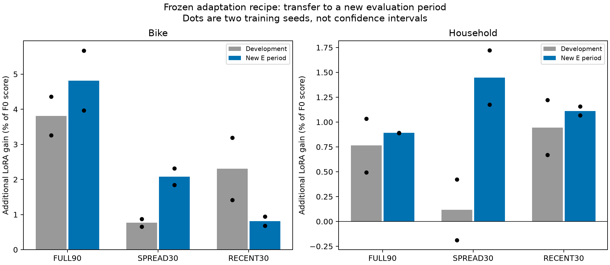
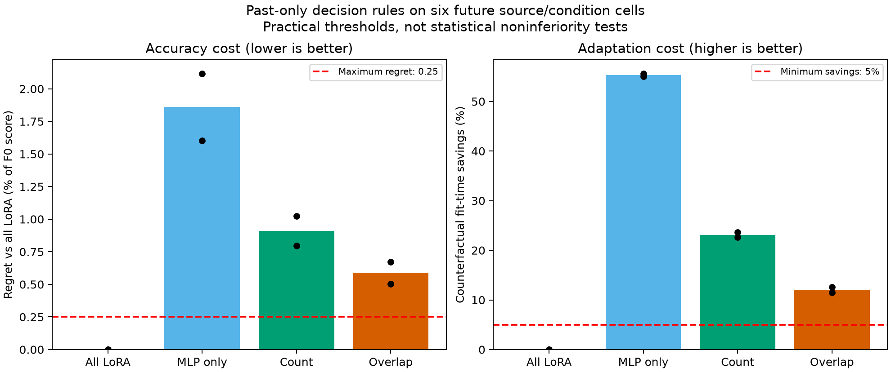
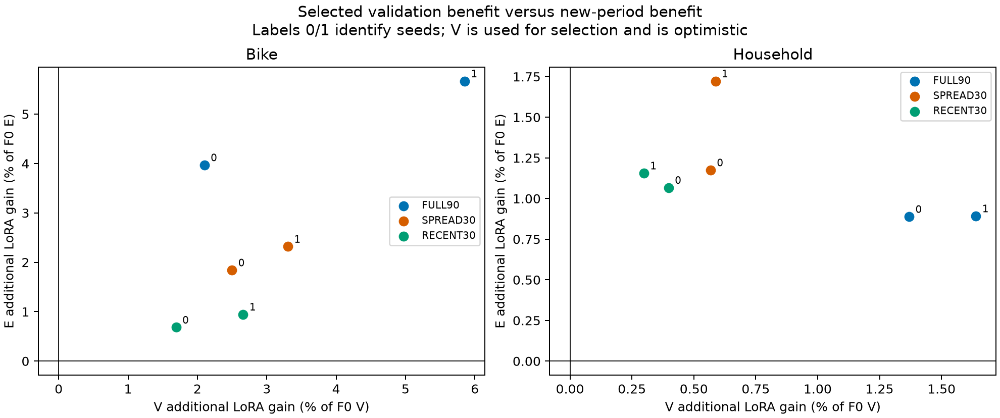
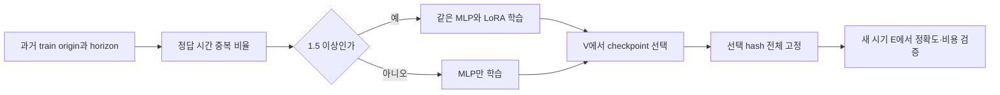

# 29. 과거 자료 구성으로 LoRA 사용 여부 결정 → 새 시기 검증

상태: **24학습·26예측·독립 검산 완료. OVERLAP 선택 규칙은 사전 정확도 기준 실패로 기각한다.** LoRA 추가 이득 자체는 새 시기12개 대응 비교에서 모두 양수였다. [1단계 완료 결과](28_optimization_control_20260910.md), [미래 E 전 고정 계약](../../../../experiments/peft_overlap_transfer_v1/PURPOSE.md). 2단계는 학습형 predictor 대신 단순 규칙으로 제한했고, 3단계에서 그 규칙의 첫 새 시기 검증을 끝냈다.

## 무엇을 발견했나

정규화 quantile loss를 사용한다. 추가 이득은 `100 × (MLP score − MLP+LoRA score) / F0 score`이며 양수가 LoRA에 유리하다. seed0/1은26000/26001이고,12개 비교는2원천×3조건×2seed로 독립 자료12개를 뜻하지 않는다.

```text
자료·조건             개발 평균       새 E seed0 / seed1      새 E 평균   (%F0)
Bike FULL90             +3.81           +3.97 / +5.67            +4.82
Bike SPREAD30           +0.76           +1.84 / +2.32            +2.08
Bike RECENT30           +2.30           +0.68 / +0.95            +0.81
Household FULL90        +0.76           +0.89 / +0.89            +0.89
Household SPREAD30      +0.12           +1.18 / +1.72            +1.45
Household RECENT30      +0.95           +1.07 / +1.16            +1.11
```



**[확인] 두 자료 모두 개발 기간의 RECENT30 > SPREAD30 순위가 새 시기에는 SPREAD30 > RECENT30으로 바뀌었고, 각 기간의 두 seed에서 방향이 일치했다.** 중복 비율과 origin 수는 그대로인데 효용 순서가 바뀌었다. 따라서 현재의 정적인 중복 비율만으로 LoRA 사용 여부를 고정하는 가설은 유지할 수 없다. 시기와 seed가 함께 바뀌었으므로 시간 변화만의 인과 효과를 식별한 결과는 아니다.

F0를 함께 확인해도 적응 이득은 남았다. 새 시기의3조건×2seed 평균 F0 대비 개선은 Bike MLP0.826%/MLP+LoRA3.397%, Household MLP1.098%/MLP+LoRA2.248%였다. 두 arm 모두12개 모델 각각에서 F0보다 좋았다. LoRA의 같은-head 추가 이득이 나온 이유가 MLP만 F0보다 크게 망가졌기 때문인 사례는 아니다.

## 선택 규칙의 성능·비용 판정

아래 손실 증가는 항상LoRA 대비6cell 평균이며 낮을수록 좋다. 비용 절감은 선택한 fit들의 전체 작업 시간 합을 항상LoRA 시간 합과 비교한다. 각각 두 seed 결과다.

```text
규칙           손실 증가 (%F0)       학습시간 절감         사전 정확도·비용 기준
항상LoRA       0.000 / 0.000          0.00 / 0.00%          기준 모델
항상MLP        1.604 / 2.117         55.06 /55.63%          정확도 실패
COUNT          0.794 / 1.024         22.64 /23.59%          정확도 실패
OVERLAP        0.503 / 0.674         11.54 /12.63%          정확도 실패
```



OVERLAP은 비용5% 절감 기준은 넘었지만 평균 손실 허용치0.25%F0를 두 seed 모두 넘었다. 원천별 허용치0.5%F0에서도 Bike0.614/0.773으로 모두 실패, Household0.392/0.574로 한 seed 실패했다. 허용치를 결과에 맞춰 올리지 않는다. COUNT와 항상MLP도 정확도 기준을 통과하지 못했다. 항상LoRA는 절감 기준을 적용할 후보가 아닌 비교 기준이다.

OVERLAP의 평균 손실은 개발0.147%F0에서 새 시기0.588%F0로 커졌다. 개발에서 LoRA를 생략하기로 한 SPREAD30의 실제 추가 이득이 커진 것이 직접적인 실패 지점이다. 이 수치는 두 원천·세 sampling 조건을 동등 가중한 제한된 평가이며 실제 배포의 모든 작업 분포를 대표하는 절감률이 아니다.

## 현상에서 다음 가설로: 정적 특성보다 실제 적응 반응



**[확인] 새 V에서도 SPREAD30 > RECENT30의 추가 LoRA 이득 순서가 두 원천·두 seed에서 나타났고 새 E에서도 유지됐다.** V에서 양수였다가 E에서0이하로 바뀐 쌍은0/12였다. 따라서 이번 규칙 실패를 “현재 V에서의 이득이 전부 미래에 사라졌다”로 설명하면 틀린다. 과거 개발 기간의 정적 구성 규칙이 현재의 반응 변화를 반영하지 못했다.

다만 V는 checkpoint 선택에 사용해 낙관적이고, 이 V 이득을 얻기 위해 MLP와 LoRA를 모두 끝까지 학습했다. 아직 저렴한 사전 선택기를 얻은 것은 아니다. V/E는 각자의 F0 분모를 쓰므로 크기의 차이를 순수한 과적합이나 분포 변화의 양으로 해석하지 않는다.

현재의 연구 질문은 **“현재 자료의 적응 반응을 작은 비용으로 측정해, backbone LoRA가 head 적응보다 필요한 경우와 예산을 예측할 수 있는가?”**로 좁히는 편이 타당하다. 새 방법 논문으로 주장할 결과는 아직 없다. 후속 우선순위는 다음과 같으며 이번 실행에서는 추가 학습하지 않았다.

1. 같은 총 파라미터/학습 예산의 넓은 head를 추가해 LoRA 이득이 head 용량 부족만으로 설명되는지 확인한다. 현재 동일 head 구조 대조만으로는 frozen 표현의 정보 부족을 증명할 수 없다.
2. full fit의 V 이득을 무료 feature처럼 쓰지 말고, 고정된 소수 업데이트의 probe에서 이득·안정성을 측정할 수 있는지 검증한다. probe 자체의 시간과 선택 비용을 포함하고 단순 early stopping/항상LoRA를 대조해야 한다. 이번 결과는 이 저비용 대리 측정의 성공을 보여주지 않는다.
3. 더 많은 과거 block에서 개발하고 새 원천/새 E에서 규칙을 다시 고정 검증한다. 이번 E는 이후 연구에서는 개발 자료로 취급한다. 원천2개·시간별1개 E·seed2개로 일반성을 주장하지 않는다.

아래는 평가 전에 고정한 설계와 감사 기록이다.

## 2단계: 무엇을 측정하고 어떤 가설을 검증하는가

자료2원천×3조건의6개 cell로 복잡한 complexity predictor를 학습하면 과적합 여부를 판단하기 어렵다. 대신 과거 학습 설계에서 계산되는 `overlap_ratio = origin수 × 48h / 고유 정답시간수`를 사용한다. 값은 FULL90약1.978, SPREAD30 1, RECENT30약1.935다. 같은 정답시간도 context/lead가 다르면 다른 예측 사례이므로 유효표본수나 인과 변수라고 부르지 않는다.

고정 규칙 OVERLAP은 이 값이1.5 이상이면 같은 MLP+LoRA, 아니면 MLP만 학습한다. 이는 개발 관측으로 만든 단순 휴리스틱이며 현재 설계에서는 sampling condition을 구분하는 규칙과 같다. 비교군은 항상LoRA, 항상MLP, origin수60 이상일 때만LoRA인 COUNT다. 학습된 새 adapter를 만들었다고 주장하지 않는다.

개발6cell에서 OVERLAP의 항상LoRA 대비 평균 손실 증가는 seed별0.078/0.216%F0, COUNT는0.425/0.952%F0였다. 이는 같은 개발 결과로 만든 규칙의 설명력이며 독립 예측 검증이 아니다. 중복 비율의 인과나 일반적 complexity 예측기로 해석하지 않는다. 새 시기 E로 넘어가야 재현 여부를 판단할 수 있다.



## 3단계: 고정한 평가

- Bike E `[2012-09-14,2012-12-04)`, Household E `[2009-02-07,2009-04-29)`. 익숙한2원천의 새로운 정답 시기이며 새 원천은 아니다. Bike 학습/V는 과거 개발 E 일부를 재사용한다. 사전학습 중복은 미확인이다.
- 2원천×3조건×2arm×seed26000/26001=24학습. LR는 이전 EXPOSURE의 V 선택을 그대로 이관한다. FULL90최대180step/subset최대60step, 후보6개와 origin당 기대 노출을 맞춘다. 미래 V에서 checkpoint를 고르고 E 전24개 선택을 일괄 저장한다.
- 같은 head는 구조·초기값이 같다는 뜻이다. MLP-only와 MLP+LoRA에서 head는 각각 학습되므로 최종 head weight를 고정한 LoRA 단독 인과 대조는 아니다. 총 파라미터도589,301/1,768,949로 다르다.
- 예측24개+F0예측2개. 모델·원 데이터 준비 구현은 기존 버전을 재사용하며 원 파일을 수정하지 않는다. cal 정답은 사용하지 않는다.
- 해석 시 같은-head 추가 이득과 함께 F0 대비 각 arm의 절대 개선도 확인한다. 항상LoRA 대비 정확도·비용 기준을 통과하더라도 F0보다 못하면 적응 자체의 필요성을 별도 제한으로 남긴다. F0를 사후에 selector 후보로 추가하거나 고정 규칙을 바꾸지는 않는다.
- OVERLAP의 seed별6cell 평균 손실 증가가 항상LoRA 대비0.25%F0 이하, 각 원천 평균0.5%F0 이하, 학습시간 절감5% 초과이면 실용 기준 통과다. 유의성/비열등성 검정이 아니다. 더 싼 COUNT/항상MLP가 정확도 기준을 통과하면 그 비교군을 우선한다.
- 비용은 Python import·모델 로드·V·체크포인트 재현과 guard 시작/종료 overhead를 포함한 작업 시간이며 admission 대기는 제외한다. 두 arm을 모두 실행해 계산한 가상 배포 비용이며, 이번 연구가 실제 절감한 비용과 구분한다. 처음 분석기에 사용한 기존 fit 내부 시계가 import를 제외함을 첫 미래 fit 중 발견해, E 전 별도 [시계 명세](../../../../experiments/peft_overlap_transfer_v1/COST_CLOCK.md)와 [분석 사본](../../../../experiments/peft_overlap_transfer_v1/analyse_guard_cost.py)을 동결했다. 원본 코드·성능 기준·임계값 변경과 재학습은 없다.

실행 코드: [run.py](../../../../experiments/peft_overlap_transfer_v1/run.py), [prepare.py](../../../../experiments/peft_overlap_transfer_v1/prepare.py), [최종 독립 분석기](../../../../experiments/peft_overlap_transfer_v1/analyse_guard_cost.py). 최초 분석기는 보존하며 비용 평가는 위 시계 명세를 적용한 사본을 사용했다.

읽기전용 데이터 감사에서 fit archive의 물리 cutoff는 Bike2012-08-22/Household2009-01-15, train/V origin만 포함함을 확인했다. 원본 raw SHA와 manifest 일치, causal fill/train-only scaling 코드 흐름 및 조건별 origin 인덱스 범위를 확인했다. 준비 작업72.766초/exit0, 평가 target의 관측률은 Bike98.02%/Household99.95%로 고정 QC70%를 통과했다. 관측률은 origin×lead mask 기준이며 고유 시간 비율이나 독립 표본수가 아니다. 감사는 새 E 예측·성능을 보지 않은 metadata/코드 확인이었다.

## 완료·안전·재현 근거

- 새24fit/26forecast/CPU준비1개, 총51guard 모두exit0. 컨트롤러35분45.91초(준비 별도), fit 작업 시간 합23분4.80초. 두 arm을 모두 실행한 연구 비용이며 위11.5~12.6%는 가상의 배포 선택 비용 비교다.
- MLP 초기값/표본 스트림 pairing, 원본 가중치 보존, 정확한 V checkpoint replay, 후보 내 최선 선택, 코드·자료·checkpoint hash 검증 통과.24개 선택 고정11:14:56UTC < 첫 미래 평가11:15:01UTC. 비용 시계/보조 진단 코드도 선택 전 고정됐다.
- NumPy 독립26예측 점수 최대차2.22e-16. 별도 data-engineer가 프로젝트 score 함수 없이26개NPZ를 검산했고 점수 오차2.22e-16, 요약 이득·비용 최대차1.07e-14로 판정 일치.
- 새 실행의 표본상 최소 RAM11.55GiB/커밋10.68GiB, 최대 GPU2149MiB/51°C. 보호 기준 완화·시스템 설정 변경 없음.
- 09:12:57~11:27:14UTC 두 단계 전체의 대상 Windows 시스템/앱 오류 이벤트0, 조회 오류0. 해당 실험 학습 프로세스0, guard lock 없음. 이 관측은 과거 PC 크래시의 원인을 해결했다는 의미가 아니다.
- 결과 [summary.json](../../../../results/peft_overlap_transfer_v1/summary.json), [모델별 점수](../../../../results/peft_overlap_transfer_v1/metrics.csv), [규칙별 점수·시간](../../../../results/peft_overlap_transfer_v1/rule_metrics.csv), [V/E 보조 진단](../../../../results/peft_overlap_transfer_v1/validation_transfer.json), [독립 근거 목록](../../../../results/peft_overlap_transfer_v1/README.md). 작은 계약/감사 사본은 결과 폴더의 `evidence/`, 무거운 모델·예측 원본은 로컬 `runs/`에 보존했다. 이번 턴 commit/push는 하지 않았다.
