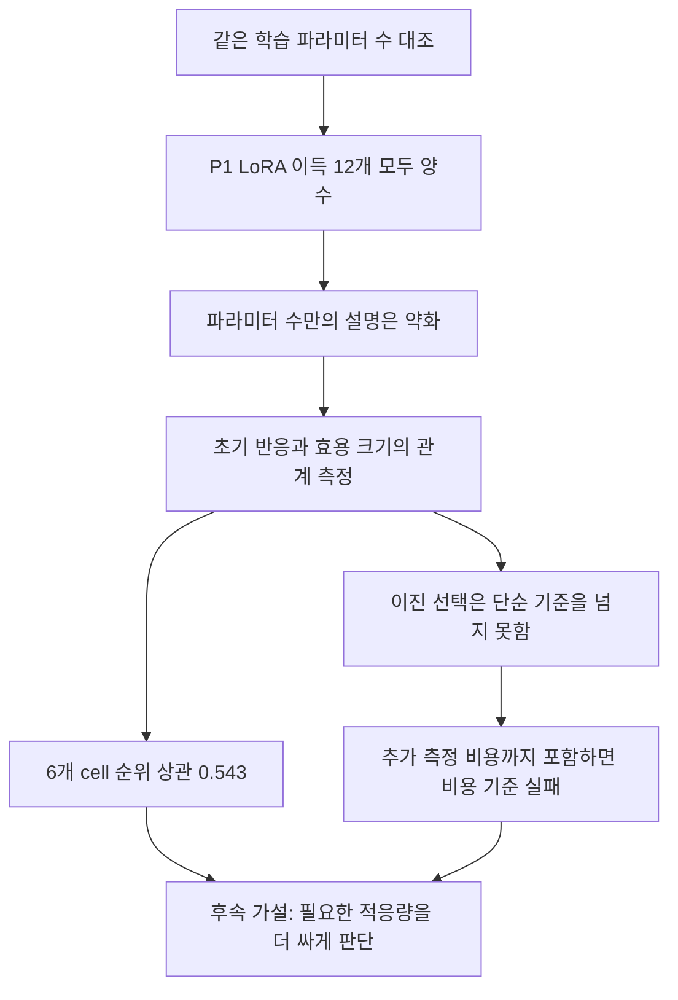

# 동일 학습 파라미터 수 head 대조와 짧은 적응 반응

2026-09-10 완료. [확인] **학습 파라미터 수를 맞춰도 LoRA의 추가 이득은 남았다. 짧은 반응은 효용 크기에 관한 단서를 주지만, 현재의 이진 선택 규칙은 비용 기준을 실패했다.** 논문에 넣을 수 있는 통제 결과는 축적됐고, 새로운 PEFT 방법의 기여는 아직 확보하지 못했다.

새 WIDE 학습36개 + 짧은 ALL 학습24개 + WIDE 평가24개 + smoke1개, 총85개 guard 작업이 정상 종료했다. 아래 P0/P1은 두 자료 기간이며, 두 E 모두 이미 본 **개발 평가 구간**이다. 새 독립 test가 아니다.

## 1. 파라미터 수를 맞춰도 남는 이득

ALL은 기존 작은 MLP head + 전체 블록 LoRA, WIDE는 동결 백본 + 넓은 ReLU head다. 두 모델의 학습 파라미터는 각각 **1,768,949개**다. 평가 지표는 학습 구간 표준편차로 정규화한 평균 quantile loss이며 작을수록 좋다. 아래 추가 이득은 `100 × (WIDE 손실 − ALL 손실) / F0 손실`이다. F0 기준 정규화 차이이며 WIDE 자체 손실 대비 상대 개선율과 다르다.

```text
LoRA 추가 이득: 같은 학습 파라미터 수 WIDE 대비, 두 seed 평균 (%F0)

기간   원천         FULL90    SPREAD30   RECENT30
P0     Bike          +4.040     +0.797     +2.230
P0     Household     +0.901     +0.103     +1.043
P1     Bike          +4.779     +2.192     +0.836
P1     Household     +1.025     +1.517     +1.672
```

사전에 주 기준으로 지정한 **P1 Bike FULL90**은 seed별 +4.358 / +5.200%F0, 평균 +4.779%F0였다. 두 seed 양수·평균1%F0 이상이라는 후속 진행 기준을 통과했다. P1은12/12 비교가 양수다. P0는11/12이며 Household SPREAD30에서 한 seed는 −0.197%F0, 다른 seed는 +0.402%F0였다. 예외를 제외하지 않았다.

작은 head 대비 P1 Bike FULL90 이득은 이전 +4.819%F0였고, 넓은 head 대비는 +4.779%F0다. 이 비교에서는 파라미터 수를 늘린 head로 대부분의 LoRA 효용을 대체하지 못했다. **단순히 학습 파라미터 수가 더 많았기 때문이라는 설명은 약해졌다.** 다만 WIDE가 작은 head보다 항상 좋지도 않았다. 특정 head 계열·두 LR·고정 학습 예산의 결과이므로 모든 head의 충분한 최적화나 표현 능력까지 통제했다고 주장하지 않는다.


막대는 두 seed 평균, 점은 개별 seed이며 신뢰구간이 아니다. 패널마다 y축 범위가 다르다. 파란 막대가 양수면 같은 학습 파라미터 수에서도 ALL이 유리하다. 빨간1%선은 P1 Bike FULL90에만 적용한 주 기준이다.

## 2. 짧은 학습에서 실제 반응이 보이는가

전체 update 상한의 1/12·1/6에서 실제 V 예측을 저장했다. FULL90은15/30step, 부분집합은5/10step이다. 최저점으로 바꾸지 않은 raw checkpoint 점수다. `g = 100 × (WIDE V 손실 − ALL V 손실) / F0 V 손실`을 최종 추가 이득과 비교했다.

```text
초기 반응과 최종 추가 이득의 관계

기간   probe 예산  방향 일치   항상 ALL 기준   순위 상관*   평균 절대오차 (%F0)
P0       1/12       11/12          11/12          0.771          0.598
P0       1/6        11/12          11/12          0.771          0.758
P1       1/12       11/12          12/12          0.543          1.065
P1       1/6        11/12          12/12          0.543          0.876

* Spearman: 원천×자료구성 6개 cell의 두 seed 평균에 대해 계산.
```

[확인] 효용 크기와 연결되는 서술적 신호는 있다. 그러나 P1의 순위 상관0.543은6개 cell에서 얻은 값이고, 방향 예측은 항상 ALL보다 못했다. 양성 비율이 높아 11/12라는 정확도만으로 좋은 선택기라고 판단하면 안 된다. 학습형 predictor·유의성 검정·신뢰구간은 만들지 않았다.


산점도의 각 점은 원천·자료 구성·seed 한 조합이다. 순위 상관은 이 점 전체가 아닌6개 cell 평균으로 계산했다. P0 반응은 사전 고정 LR1e-4, P0 최종 WIDE는 V 선택 LR을 쓴다. P1에서는 과거에서 이관한 LR로 두 측정을 일치시켰다. 따라서 기간별 상관 차이를 순수한 시간 일반화 차이로 해석하지 않는다.

### 검증 구간 안에서 안정적이면 미래에도 맞는가

V 원점 앞14개·뒤14개를 비교하고 가운데2개를 제외했다. 두 반쪽의 target 시간 비중복을 실제 metadata로 확인했다. context 공유와 시간 의존성은 남으므로 독립 fold가 아니다.

```text
앞·뒤 V 반응의 부호 일치
P0   1/12:12/12    1/6:12/12
P1   1/12:12/12    1/6:10/12
```

구체 반례는 **P1 Bike RECENT30, seed26000**이다. 5step에서 앞/뒤 반응은 −0.627/−0.421%F0로 둘 다 WIDE에 유리했고 전체 g도 −0.416이었다. 하지만 최종 E는 ALL에 +0.711%F0 유리했다. 10step에서도 전체 g는 −0.205였고, 앞/뒤는 +0.190/−0.630으로 갈렸다. 다른 seed의 반응은 양수였다. **한 seed의 V 내부 부호 일치만으로 seed 안정성이나 최종 효용을 보장할 수 없다.** 더 오래 측정한다고 모든 안정성이 함께 좋아지지도 않았다.

## 3. 실제 시간까지 지불하면 효율적인가

`g>0`이면 ALL, 아니면 WIDE를 고르는 규칙을 미리 고정했다. P1에서 두 예산 모두 seed26000은 Bike RECENT30만 WIDE, seed26001은6개 조건 모두 ALL을 골랐다.

```text
P1 규칙 평가: 항상 ALL 대비

probe 예산   seed      손실 증가 (%F0)    시간 절감 (%)     품질 / 비용 기준
  1/12       26000          0.118            -6.397            통과 / 실패
  1/12       26001          0.000           -13.287            통과 / 실패
  1/6        26000          0.118            -7.902            통과 / 실패
  1/6        26001          0.000           -14.294            통과 / 실패
```

품질 기준은 seed별 평균 손해≤0.25%F0, 원천별≤0.5%F0이며 통과했다. 비용은 두 seed 모두5% 초과 절감해야 하는데 오히려 늘었다. 두 모델 prefix를 재사용하고 전환 overhead를0으로 둔 **현재 분리 실행 방식의 낙관적 가상 비용**이다. 실제 배포 selector의 실측 절감이 아니며, 가능한 모든 구현의 절대 하한도 아니다. 공유 로딩·feature cache의 개선 가능성은 이번에 측정하지 않았다.


```text
P1 실제 probe 시간 — imports·모델 로딩·초기 V·중간 검증 포함

update 예산   ALL prefix 소요      ALL 전체 시간 대비 중앙값   WIDE 전체 시간 대비 중앙값
   1/12        16.25~23.57초                28.85%                        55.58%
   1/6         19.59~30.97초                34.74%                        59.50%
```

update 비율을 wall-clock 비율로 바꿔 읽을 수 없다. 비용 비교는 종료 예산이 맞는 P1만 사용했고, 기존 ALL 전체 시간과 이번 측정 시간 사이의 시간대·캐시 차이는 남는다.

계산상 더 직접적인 한계도 있다. seed26001은 모든 조건에 ALL을 골랐으므로 **probe 비용이0이어도 현재 규칙의 시간 절감은0%**다. 공유 로딩만 고치는 것으로 두 seed의5% 절감 기준을 해결할 수는 없다. LoRA를 거의 항상 선택하면서 매번 추가 진단 비용을 지불하는 구조가 문제다.

## 4. 무엇을 남기고 어떻게 나아갈 것인가



[판단] **통제된 관찰 결과는 남길 가치가 있지만, 지금 바로 새로운 PEFT 방법 논문으로 제출할 해결 성과는 부족하다.** LoRA의 효용 자체는 기존 방법의 성과이며, 이번 실험만으로 complexity·중복·잔차 구조 중 무엇이 원인인지 확정하지 못했다.

다음 순서가 적절하다. 아래는 후속 제안이며 추가 학습을 실행하지 않았다.

1. **효용의 이질성을 새 원천·시간 구간에서 먼저 확인한다.** 이미 본 두 E는 개발 자료로 남긴다. 별도 원천과 미노출 구간의 조건·예산을 사전에 고정한다. 현재처럼 LoRA가 거의 항상 우세하면 사용 여부 분류의 필요성이 약하다.
2. **필요한 적응량을 대상으로 문제를 다시 정의한다.** 후속 가설은 한 번의 LoRA 학습에서 얻는 신호로 필요한 step·rank 등 예산을 판단할 수 있는지다. 신호가 실제 효용 곡선과 연결되는지부터 검증하고, 두 모델을 별도로 돌리는 probe는 현재의 비용 절감 방법 후보에서 제외한다. 단순한 early stopping 아이디어 자체는 새 기여가 아니다.
3. **측정 비용을 포함해 기존 기준선을 넘어야 방법으로 발전시킨다.** 항상 LoRA, 표준 조기 종료, 동일 예산의 고정 적응과 비교한다. 공유 로딩으로 시간을 줄이는 구현 개선과 새로운 ML 기여를 구분한다. 새 원천에서도 대부분 같은 결정만 나온다면 선택기보다 기존 LoRA를 쓰는 결론을 받아들인다.

앞선 [29번](29_overlap_transfer_20260910.md)의 정적 중복 규칙은 비용을 줄였지만 정확도 기준을 실패했다. 이번 반응 규칙은 정확도 기준은 지켰지만 비용을 늘렸다. 두 결과를 통해 무엇을 동시에 해결해야 하는지 좁혔다. 아직 그 동시 해결 방법은 없다.

## 설계와 재현 근거

- WIDE는768→1601→336 ReLU, 은닉 bias1109개 학습/492개0 고정, 출력층0 초기화다. 더미 파라미터 없이 모든 학습 텐서가 갱신됐다. **파라미터 수 일치이며 함수 클래스·FLOPs 일치가 아니다.**
- P0에서 LR1e-4/1e-5를 두 seed 평균 V로 선택했다. Bike3조건 및 Household SPREAD/RECENT는1e-5, Household FULL은1e-4였다. P1에는 그대로 이관했다. FULL180step, 부분집합60step, 선택 기회 각6회다. 원 모델·loss·자료 분리·안전 기준은 유지했다.
- 본 controller36분41.69초. guard 총시간29분58.61초: WIDE학습694.988초, short ALL700.124초, WIDE평가383.173초, smoke20.328초. 최초 진입 대기 약8분과 준비 작업은 별도다.
- 85guard 전부정상종료/보호중단0. 자원로그 관측 최저 RAM10.872GiB·commit9.822GiB, 최대GPU2269MiB·54°C. 시작 기준 RAM5/commit13GiB 및 실행 guard를 완화하지 않았다.
- 독립61fit/48probe 검산 통과, old ALL→short ALL의24쌍 history 차이0. 별도 probe CSV8개 필드 대조 최대차0. 독립52예측·24효용 비교 최대 점수/효용 오차4.53e-14. 본 분석의 NPZ score 최대차2.78e-16.
- 13:34:11~14:23:32UTC의 지정 Windows 이벤트 ID 조회0건/조회오류0, 해당 학습 프로세스0/guard lock없음. 과거 PC 크래시 원인 해결을 증명하는 검사는 아니다.
- 모든 WIDE 선택은 새 WIDE E 평가 전에 봉인됐다. 분석은 본학습/E 전 별도 hash 계약으로 고정했다. 사전 코드 검토 오류2건을 학습 결과 전에 수정했다. 사후 ad-hoc CSV 교차검산에서 JSON 키를 잘못 쓴1회 오류는 읽기 키만 수정했으며 재학습·결과 변경은 없다.
- 같은 두 원천·두 seed와 이미 노출된 E라는 한계, 학습 파라미터 수와 표현 능력의 차이, 미확인 FM 사전학습 중복을 유지한다. commit/push는 하지 않았다.

[결과·CSV·그림 목록](../../../../results/peft_capacity_probe_v1/README.md) · [실행 전 계약](../../../../experiments/peft_capacity_probe_v1/PURPOSE.md) · [수치 요약](../../../../results/peft_capacity_probe_v1/summary.json) · [봉인·감사 근거](../../../../results/peft_capacity_probe_v1/evidence)

선행연구 경계: 저랭크 갱신은 [LoRA](https://arxiv.org/abs/2106.09685), head/backbone 분리와 표현 변화 논의는 [Kumar 등, ICLR 2022](https://openreview.net/pdf?id=UYneFzXSJWh), 초기 학습을 이용한 자원 배분은 [Hyperband](https://jmlr.org/papers/v18/16-558.html)와 관련된다. 이 연구들이 현재 시계열의 원인을 증명하거나 이번 후속 가설의 신규성을 보장하지는 않는다.
