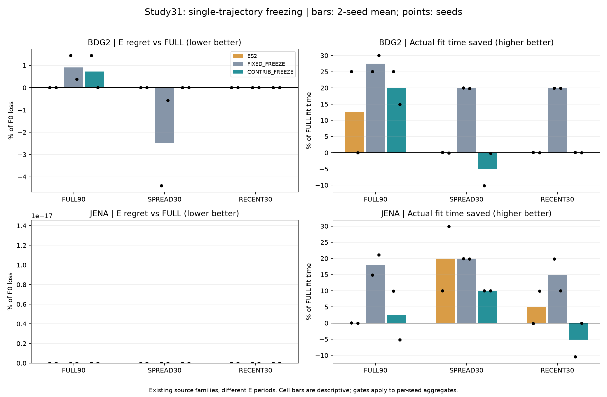
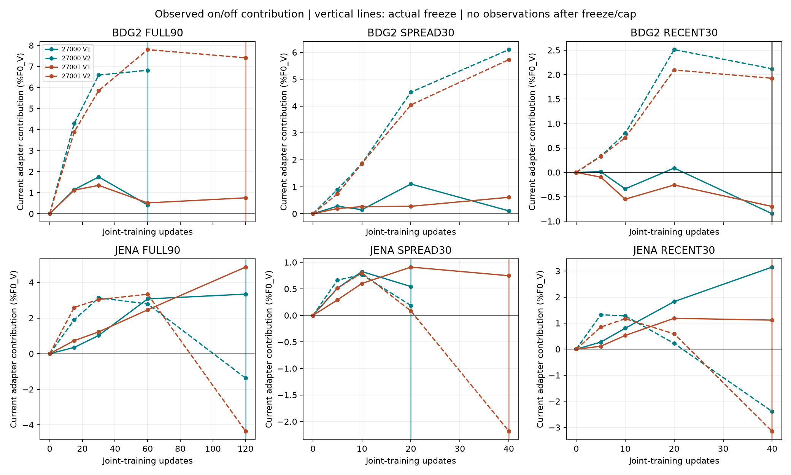
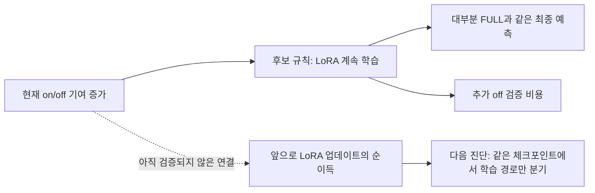
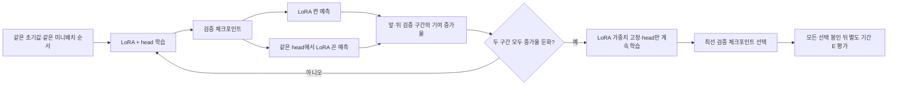

# 단일 LoRA 학습에서 필요한 적응량 판단: on/off 반응과 동결

2026-09-11 최종 실행·분석 완료. **현재 기여 증가율로 동결 시점을 정하는 규칙은 채택 기준을 통과하지 못했다.** 자원 정리 후 시간을 다시 측정한 보완 분석에서도 단순 고정 동결이 두 시드 모두 평균 성능과 비용에서 우세했다. 이는 현재 동결 규칙의 실패이며, 이전에 확인한 같은 용량 head 대비 LoRA 효용 전체를 부정하지 않는다. [직전 동일 용량·짧은 반응 실험](30_capacity_probe_20260910.md)의 후속이다.

## 결과: 단순 대조를 넘지 못했다

아래 시간은 **정리 전13학습을 같은 절차로 재측정하고, 정리 후35학습 시간과 합친 보완 분석**이다. 평가 점수·선택 체크포인트는 원본을 사용했다. 비용 재측정 대상과 집계 기준은 E 전에 고정했으며, 재측정 자체는 E 완료 후 수행했다. 반복 시간 측정이 각 항목당 한 번이므로 시스템 상태를 완전히 통제한 확증 결과로 해석하지 않는다.


```text
방법               seed     평균 손해(%F0)   시간 절감(%)   해당 seed 기준
ES2                27000        0.000            7.53       통과
                   27001        0.000            5.04       통과
고정 동결          27000       -0.492           19.92       통과
                   27001       -0.032           21.46       통과
기여 기반 동결     27000       +0.240            7.42       통과
                   27001        0.000            3.77       비용 실패
```

손해는 FULL 대비 E 손실 차이를 F0 손실로 나눈 값이며, 양수면 악화·음수면 개선이다. FULL90/SPREAD30/RECENT30 × 두 원천의6조건을 seed별 동일 비중으로 평균한다. 두 seed 각각 평균 손해≤0.25%F0, 원천 평균 손해≤0.5%F0, 실제 학습 시간 절감>5%를 요구한다. 기여 기반 seed27000의 BDG2 평균 손해는+0.4802%F0로 원천 기준에도 가깝다. seed27001은 비용 기준에 실패하므로 후보 전체는 실패다.

고정 동결은 두 seed에서 후보보다 평균 손실이 낮고 시간이 짧다. ES2도 계산상 두 seed에서 후보를 지배하지만, seed27000 시간 차이는0.175초이고 seed27001의5.037% 절감은5% 기준에 매우 가깝다. 이 작은 차이를 반복 측정 없이 안정적인 속도 우위로 주장하지 않는다. **고정 동결의 약20% 절감과 후보의 필요성 미확보를 중심 결론으로 삼는다.**



Jena의 표시된 성능 차이는 모두0이다(자동 축의1e-17 표기는 효과 크기를 뜻하지 않는다). 고정 동결도 모든 조건에서 좋은 것은 아니다. BDG2 FULL90에서는 FULL보다+1.441/+0.385%F0 악화했고, SPREAD30에서는−4.394/−0.576%F0 개선했다. 따라서 평균 통과를 조건별 무해성으로 확대하지 않는다. [전체48행 수치](../../../../results/peft_contribution_freeze_v1/resource_matched/metrics.csv)와 [원본 시간 분석](../../../../results/peft_contribution_freeze_v1/summary.json)을 함께 보존했다.

## 무엇을 발견했고, 어디까지 원인을 말할 수 있는가

[전체 기록과 예측을 대조한 진단](../../../../results/peft_contribution_freeze_v1/completion_review.json)에서 기여 기반12조건 중8조건이 LoRA를 동결했다. 그8개 중7개는 동결 이전 체크포인트를 최종 선택했고, 동결 후 head 학습 구간에서 선택한 경우는1개였다. 후보의 최종 E 예측은12개 중11개에서 FULL과 완전히 같았다. 나머지1개인 BDG2 FULL90 seed27000에서는 고정 동결과 같은 예측을 선택했고 FULL보다1.441%F0 나빴다. **후보가 FULL보다 더 좋은 E 예측을 선택한 조건은 없었다.**



BDG2 SPREAD30에서는 현재 on/off 기여가 계속 커지는 구간이 관찰되지만, 후보는 두 seed 모두 동결하지 않았고 고정 동결이 더 좋은 E 점수를 얻었다. 이는 **현재 head에 조건부인 LoRA 기여와, 앞으로 LoRA를 더 학습할 가치가 같은 양이 아님**을 보여주는 반례다. 두 검증 구간의 반응이 서로 달라 동결이 늦어지는 경우도 있다.

다만 이를 곧바로 과적합·표현 복잡도·분포 변화가 원인이라고 단정하지 않는다. 네 방법은 학습 경로와 최선 V 체크포인트 선택이 함께 달라진다. 예를 들어 BDG2 SPREAD30 seed27000의 고정 동결은 동결 직전과 같은step20을 선택했으므로 그 개선을 head tail 자체의 효과로 부를 수 없다. 현재 실험은 정책 전체의 차이를 측정했으며, 순수한 이후 LoRA 업데이트의 인과 효과를 따로 분리하지 않았다.



## 이후 방향: 현재 규칙을 닫고 반례의 원인을 먼저 측정

현재 E에 맞춰25% 임계값을 바꾸거나 새 이름을 붙여 방법으로 주장하지 않는다. 다음 작업의 우선순위는 아래와 같다. **아래는 후속 제안이며 이번에 추가 학습한 실험은 아니다.**

1. **같은 상태에서 이후 업데이트의 가치를 분리한다.** 새 개발 구간에서 미리 정한step의 모델·optimizer·head 상태를 공유하고, 동일한 후속 batch로 LoRA+head 지속과 LoRA 고정+head 지속을 비교한다. 고정된 마지막step 성능과 최선 V 선택 성능을 둘 다 기록해, 업데이트 효과와 선택 효과를 구분한다. 현재 기여/기여 증가율이 이 차이를 예측하는지 먼저 확인한다. 개발용 진단의 분기 학습 비용은 실제 정책 비용과 별도로 공개한다.
2. **고정 동결을 넘어설 수 있는 저비용 신호인지 검증한다.** 추가 off 예측 없이 얻는 gradient/update 통계, 단순 V 개선률, 고정 시점, ES2 및 가까운 AFLoRA 계열을 대조한다. 기여 신호가 단순 기준을 넘지 못하면 제거한다. 두 모델을 동시에 학습하는 온라인 선택기는 이전study30의 비용 실패를 반복할 수 있으므로, 연구용 진단을 그대로 배포 규칙으로 옮기지 않는다.
3. **선택 규칙을 고정한 뒤 새 원천·새 기간에서 평가한다.** 이번 E는 이미 결과를 확인했으므로 다음 규칙을 정하는 개발 근거로 취급하고 최종 증명에 재사용하지 않는다. 조건별 손해와 관측 비용까지 포함해 단순 고정 동결보다 나은지 판단한다. 차이가 남지 않으면 이 동결 분기를 중단한다.

지금 확보한 것은 반례와 강한 단순 대조다. 아직 새로운 ML 방법의 기여나 논문 성립을 입증한 결과는 아니다. 기존 원천2개·seed2개이므로12조건을 독립 표본으로 센 유의성 주장을 하지 않는다.

## 실행 안정성과 시간 비교의 복구

사용자 “다시해줘 필요없는거는 꺼도 돼” 승인 후, 알려진 불필요 browser automation/template 보조 및 Office·Phone·Riot 보조46프로세스를 종료하고 설정/작업관리자 창을 정상 종료했다. 기록상 commit 여유는10.53→13.09GiB로 회복했고 이후 약15.8GiB로 유지됐다. GPU는 하나씩 실행했고 원래 메모리·GPU 보호 기준을 유지했다. [정리 기록](../../../../results/peft_contribution_freeze_v1/evidence/resume_cleanup_result.json).

같은 Jena FULL90 seed27000의180updates와 동일 체크포인트가 정리 전109.641초, 정리 후40.344초였다. 정리 전13개와 이후35개의 원 시간을 그대로 비교하면 실행 환경 차이가 섞인다. 따라서20:11:13UTC에13개 재측정 계약을 봉인했고, 첫 E 시작20:22:58UTC보다 앞섰음을 실제 로그로 확인했다. 원본48학습은 그대로 두고 완료 후13개만 동일절차로 반복했다.90개 NPZ·371개 배열, 전체 검증 history(utc 제외), 체크포인트가 원본과 정확히 일치했다. 원13개 시간 합837.110초, 새 측정326.923초다. 반복에 쓴326.923초도 연구 비용으로 남겼으며 빠른 쪽만 고르는 방식은 쓰지 않았다.

원본 시간에서 후보의 절감률은12.57/3.77%, 보완 시간에서는7.42/3.77%다. 둘 다 후보 전체는 실패지만, 원본 시간에서 ES2 seed27000가14.80% 느렸던 수치는 보완 후7.53% 절감으로 바뀐다. 그래서 원본 시간의 방법 간 속도 비교를 확정 결론으로 사용하지 않는다. [시간 계약](../../../../results/peft_contribution_freeze_v1/evidence/timing_contract.json), [독립 재현 감사](../../../../results/peft_contribution_freeze_v1/evidence/independent_timing_replay_audit.json), [13대체/35유지 검산](../../../../results/peft_contribution_freeze_v1/evidence/independent_timing_analysis_audit.json).

총112 GPU guard(S0 1+학습48+E50+재측정13)는 모두exit0.266개 자원 측정 표본의 최소RAM9.130/commit9.482GiB, 최대child RSS1.689GiB/GPU1891MiB/53°C였다. 종료 이벤트112개는 자원 측정에서 따로 분리했다. 재개 본실험29분41초, 재측정6분32초이며 분석·정리 시간은 별도다. UTC20:05:50~20:43:31의 지정 Windows System41/4101/153/2004/6008 및 Application1000은0건, 조회 오류0건이다. 현재 학습 프로세스와 guard lock은 없고, 기존study30 및 현재 동결 입력·소스 hash도 통과했다. 표본 최대치와 해당 기간의 정상 종료는 과거 드라이버 크래시 원인이 해결됐다는 증명은 아니다.

마지막 자원 요약 helper의 첫 실행은 `finish` 이벤트에 `gpus` 필드가 없어서 실패했다. 원인 기록을 보존하고 종료 이벤트와 측정 기록을 구분하도록 후처리만 수정한 뒤exit0를 확인했다. 원학습·고정분석·평가 점수는 바뀌지 않았다. [집계 오류와 원인](../../../../results/peft_contribution_freeze_v1/evidence/completion_review_failure.json).

독립 fit/forecast 감사에서 검증 손실 최대차1.67e-16, 기여8.90e-14, E 점수2.22e-16, 원 집계1.38e-14였다. 보완분석의13개 시간대체·35개유지, 품질 불변, 집계·기준·지배 판정은 별도 계산과 오차0으로 일치했다. [수치·그래프·전체48학습 기록·감사 파일](../../../../results/peft_contribution_freeze_v1/README.md).

## 이전 중단 기록

첫 실행은13학습 뒤 다음 작업의commit 시작 기준13GiB를600초 충족하지 못해 중단됐다. 당시 E는0개였으며, 학습 실패와 구분해 기록했다. 아래 그림은 **당시의 고정 스냅샷**이고 현재 완료 상태가 아니다.


완료 상태에서 `run`/`timing_replay`를 다시 호출하면 기존 완료파일 때문에 거부하도록 되어 있다. 다음 연구를 시작할 때 원본 run을 지우거나 `--prepare`로 덮어쓰지 않는다.

## 질문과 비교

이번 질문은 **“현재 LoRA의 기여가 더 이상 빠르게 늘지 않으면, 이후에는 head만 학습해도 되는가?”**다. 별도 대조 모델을 훈련하지 않고, 같은 모델·같은 head에서 LoRA를 잠깐 꺼서 검증 예측을 얻는다. 켰을 때와 껐을 때의 검증 손실 차이가 현재 head에 조건부인 LoRA의 기여다. head도 함께 적응했으므로 표현 학습의 순수 인과 효과나 미래 적응량 자체로 해석하지 않는다.



실제 실행하는 비교는 다음과 같다.

1. `FULL`: LoRA와 head를 정해진 업데이트 수까지 학습.
2. `ES2`: 검증 손실이 두 번 연속 개선되지 않으면 둘 다 조기 종료.
3. `FIXED_FREEZE`: 전체 예산의 1/3 시점에 LoRA를 동결하고 head 학습 지속.
4. `CONTRIB_FREEZE`: on/off 반응 증가율이 두 검증 구간 모두 과거 최대의 25% 이하로 낮아지면 LoRA 동결. 시작 가능한 가장 이른 시점은 예산 1/3, 이후 head 학습 지속.

현재 LoRA 출력은 동결 후에도 유지한다. 네 방법 모두 같은 작은 head, rank8 LoRA, 초기값, 학습률, 체크포인트 간격을 사용한다. 초기 학습 파라미터1,768,949개, 동결 뒤 head589,301개. 이전 자료에서 선택한 LR1e-4를 이전하며, 새 자료에서 최적화됐다는 주장은 하지 않는다. [실행 전 고정 프로토콜](../../../../experiments/peft_contribution_freeze_v1/PURPOSE.md)에 수식·예산·임계값·누수 방지·운영 기준을 기록했다.

## 자료와 판단 기준

BDG2 late2017와 Jena2023의 비중첩 평가 기간을 사용한다. 원자료는 기존 프로젝트에 있었으므로 완전히 미노출인 원천이라고 부르지 않는다. FM 사전학습에 없었다는 주장도 하지 않는다. FULL90/SPREAD30/RECENT30 세 구성, 두 seed로 총48학습과 F0 포함50평가를 계획한다. 데이터 파일·정규화·시간 분할은 별도 데이터 감사 후 동결한다.

E를 보기 전에 모든 방법의 검증 선택을 확정한다. FULL 대비 두 seed 각각에서 평균 손해≤0.25%F0, 원천별 평균 손해≤0.5%F0, 실제 학습 시간 절감>5%를 모두 요구한다. 관측 추가 비용과 프로세스·모델 로딩·선택 복원 비용을 학습 시간에 포함하며, 자원 대기와 E 예측은 분리한다. ES2 또는 고정 동결만으로 더 낫다면 새 신호의 필요성은 확보되지 않는다. 원천2개·seed2개이며, 12개 cell을 독립 표본처럼 취급하지 않는다.

## 선행연구와 논문 주장 범위

**학습 중 동결 자체는 새 아이디어가 아니다.** [AFLoRA, ACL2024](https://aclanthology.org/2024.acl-short.16/)는 점수에 따라 저랭크 projection을 동결하며 feature transformation vector를 함께 사용한다. [FreezeOut](https://arxiv.org/abs/1706.04983)은 점진적 동결을, [AdaLoRA](https://openreview.net/pdf?id=lq62uWRJjiY)는 적응적 rank 배분을 다룬다. 이번 파일럿은 AFLoRA를 재현한 비교가 아니며, 기존 방법 대비 신규성을 입증하지 못한다.

우선 on/off 반응이 단순 조기 종료·고정 동결보다 유용한지 판단한다. 성공해도 다음 단계는 가장 가까운 선행방법과의 비교·원천 확대이며, 실패하면 임계값을 E에 맞추지 않고 실패 조건을 보존한다.

## 실행 검증 상태

CPU 정책 테스트5개 통과. 동결 시 학습 파라미터 집합이 달라져 checkpoint에서 LoRA가 누락되는 오류를 피하도록, 최초 학습 대상 이름을 고정하여 저장·복원한다. GPU smoke,48학습,50평가,시간 재실행13개 및 독립 검산을 완료했다. 이전13학습 중단 시점의 부분 그래프2개도 역사적 기록으로 보존했다. 기존 메모리·GPU 보호 기준은 유지한다.

데이터 준비 중 날짜 문자열 처리 오류와 Jena 동일행 중복24개를 확인했다. 첫 실패의 부분 BDG2파일2개는 담당 에이전트가 삭제후다시 생성해 실패산출물보존원칙을 지키지 못했다. 두번째 부분결과는보존재사용했다. Jena 중복은선택4채널값이동일한행만축약하며충돌이면오류처리한다. 원자료/기존연구결과는불변이다. 이는E성능을보기전원시시간축교정이며, 완료된데이터감사에서train통계/causal fill/mask재현오차0을확인했다.

실험·분석 계약 동결: 2026-09-10T15:15:39UTC. Plan `f5d0f9222c15d2e35e6f6facbb730f6e8a35bf67435e33f57635b9d75780fc57`, contract `463354ee7cd43c43921769b73caddafb7be2930ce78b9d33db7d271774d0bfc9`.

추가 해석 한계: SPREAD30/RECENT30은 optimizer가 사용하는 target origin을30개로 제한한 조건이다. 정규화 통계는 공통91일 train구간 전체에서 계산하고 과거 context도 이용하므로, 관측 자체가30개뿐인 엄격한 few-shot 조건이 아니다.

실행 검증: S0 guard24.5초 exit0, on/off 원복·동결 LoRA 불변·head tail 변경·최선V 재현확인. 독립 데이터감사는 82개유일경로/115개hash참조를검증해PASS(계획의85항목은중복경로를포함한참조수). 본학습15:17:50UTC 시작. 독립수치감사스크립트도E전별도계약으로고정했다.
