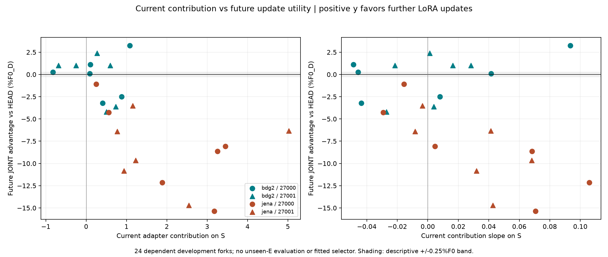
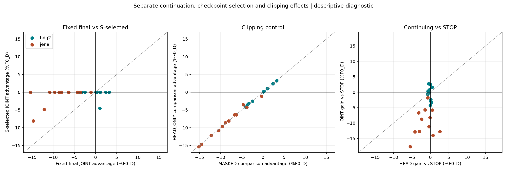
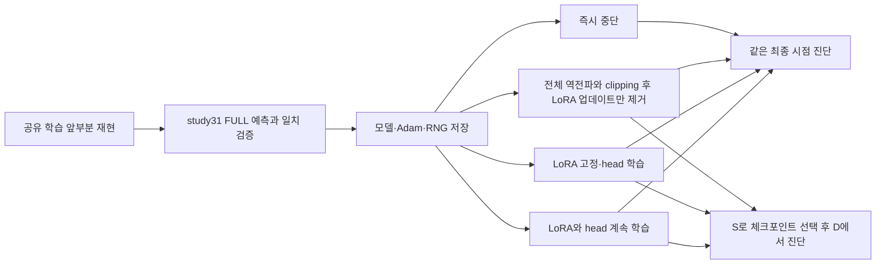

# 이후 LoRA 업데이트의 가치와 논문 성립 조건

2026-09-11 완료. 사용자 승인으로 [study31](31_contribution_freeze_20260911.md)의 후속 진단을 실행했다. **현재 LoRA가 예측에 기여하는 것과 앞으로 LoRA를 업데이트할 가치는 구분해야 한다는 반례가 반복됐다. 그러나 이를 이용해 조기 종료·고정 동결을 이기는 새 방법은 아직 없다.** 이번 질문은 같은 학습 상태에서 이후 업데이트의 효과와 체크포인트 선택의 효과를 구분하는 것이었다.

## 결과와 판단

[확인] 본실험 12조건·24분기, S0 포함 13개 GPU 작업 모두 정상 종료. 본실험 702.140초(11분42초), S0 18.219초. 독립 감사에서 원시 예측 점수를 1,264회 대조했고(공유 checkpoint 중복 참조 포함) 최대 차이는 1.67e-16이었다. 두 seed의 방향 분류는 12쌍 중 11쌍에서 일치했다. 기존 V를 나눠 진단한 결과이며 새 미노출 시험 성능은 아니다.

```text
최종 시점 비교                  전체    BDG2    Jena
LoRA + head 지속 우세             7       7       0
LoRA 고정 + head 지속 우세        16       4      12
작은 차이 구간                    1       1       0
둘 다 즉시 중단보다 나쁨           9       1       8
```

우세 판정은 실행 전에 정한 ±0.25%F0 구간 바깥이다. %F0는 초기 D 손실로 정규화한 손실 차이이며 상대 오차 감소율이나 통계적 유의성을 뜻하지 않는다. 아래의 utility도 비용을 차감한 순효용이 아니라 이 손실 차이다.

**1. 현재 기여는 이후 학습의 필요성과 다르다.** 현재 S에서 LoRA on/off 기여가 양수인 분기는 21개였고, 그중 16개는 이후 HEAD_ONLY가 JOINT보다 좋았다. Jena는 12분기 모두 현재 기여가 양수지만 이후 LoRA 고정이 유리했다. BDG2에서는 FULL90 4분기는 고정이, SPREAD30 4분기는 LoRA 지속이 유리했다. 이 비교는 이미 학습된 LoRA를 유지한 상태에서 업데이트만 멈추는 것이므로, LoRA를 처음부터 쓰지 말자는 근거가 아니다.



전체 C–U Spearman은 -0.726이나 원천별로 BDG2 -0.161, Jena -0.413이다. 원천이 섞인 상관만 보고 신호의 부호를 뒤집어 새 정책으로 쓰면 안 된다. 의미 있는 차이 23개에서 실행 전 지정한 `C>0이면 지속`의 방향 일치는 4/23(17.4%), 항상 동결은 16/23(69.6%)였다. 이 값은 개발 자료상의 기술 통계다. 반복 분기·seed를 독립 표본으로 취급한 유의성 주장은 하지 않는다.

**2. 체크포인트 선택이 실제 사용 결과를 크게 바꾼다.** 고정 최종 시점 평균 JOINT 이득은 -4.350%F0지만 S로 체크포인트를 고르면 -0.727%F0다. 24개 중 21개는 두 방법 모두 같은 공유 앞부분의 체크포인트를 선택해서 차이가 정확히 0이다. BDG2 SPREAD30 seed27001의 step40 분기에서는 최종 step60 JOINT가 +1.014%F0 유리하지만, S 선택 후에는 -4.542%F0로 역전된다. JOINT는 step5, HEAD_ONLY는 step60을 선택했기 때문이다. 따라서 최종 학습 궤적의 차이를 그대로 실제 선택된 예측의 개선으로 주장할 수 없다.

**3. 단순 중단이 강한 대조다.** HEAD_ONLY가 JOINT보다 유리한 16개 중 STOP까지 이긴 것은 3개뿐이다. JOINT가 HEAD_ONLY와 STOP을 모두 이긴 것은 6개다. 두 지속 방식 모두 STOP보다 나쁜 9개는 일반적인 과도한 학습으로도 설명될 가능성이 있다. [추정] 이는 학습 지속 여부와 업데이트 대상을 함께 판단할 필요성을 시사하지만, 세 가지 선택을 하는 새 알고리즘의 필요성·우월성을 입증하지는 않는다. 과적응, 학습률, head 공동 적응, 시기 변화 중 어느 것이 원인인지는 미확정이다.



**4. clipping만으로 전체 방향은 설명되지 않지만 영향은 남는다.** MASKED_UPDATE 대조 후 원시 이득 부호는 24/24 동일하고 ±0.25 구간 분류는 23/24 동일했다. 경계의 BDG2 RECENT30 seed27000 step40은 +0.251에서 +0.231로 작은 차이 구간에 들어간다. HEAD_ONLY와 MASKED 차이는 최대 1.140%F0이므로 clipping 영향이 없다고 말하면 안 된다. MASKED는 첫 업데이트에서 JOINT와 같은 head gradient norm·업데이트를 확인하지만 이후에는 두 궤적이 달라진다. 미래 전체 head 궤적을 고정한 순수 LoRA 효과 추정은 아니다.

원 [study31](31_contribution_freeze_20260911.md)의 SPREAD30 고정 동결 이득과 이번 최종 시점 JOINT 이득은 평가 구간(E 대 D)과 체크포인트 선택 여부가 다르다. 이번 결과로 과거 결과를 뒤집거나 그 원인을 완전히 규명했다고 해석하지 않는다. 복잡도나 분포 변화의 인과성도 이번에는 측정하지 않았다.

## 이번에 실제로 검증하는 것

같은 Chronos2/MLP/LoRA·학습률·데이터 구성·두 seed를 유지한다. 모든12조건에서 정해진 예산1/3·2/3 시점에 모델·Adam·CPU/CUDA 난수 상태를 저장하고 이후를 비교한다. 이전에는 해당 시점 optimizer snapshot이 없었으므로 FULL 학습을 재현해 이전 예측과 정확히 일치하는지 먼저 확인한다. **재현한 fork 안에서 branch 상태가 같다는 뜻이며, 저장하지 않았던 과거 optimizer 자체와 같다고 주장하지 않는다.**



MASKED_UPDATE는 clipping 집합이 달라져 head 업데이트까지 달라지는 효과를 분리하기 위한 연구용 대조다. 계산을 절약하는 새 방법이 아니다. V 앞14개를S(선택·현재 신호), 뒤14개를D(진단)로 쓰고 두 origin을 비워 target 중첩을 막는다. 문맥은 겹치며 둘 다 이전에 본 V이므로 독립 미노출 holdout이 아니다. 기존 E는 진단 결과 선택에 사용하지 않는다.

고정 최종 시점의 `D_HEAD − D_JOINT`가 양수이면 LoRA 지속이 상대적으로 유리하다. 두 방법 모두 중단보다 나쁠 수 있으므로 STOP 대비 이득도 함께 본다. S가 고른 체크포인트의 같은 차이를 별도로 계산해 선택 효과를 구분한다. ±0.25%F0는 기술적인 작은 차이 구간이며 통계적 동등성 검정이 아니다. [실행 전 동결 프로토콜](../../../../experiments/peft_future_utility_v1/PURPOSE.md).

## 논문을 쓰려면 어떤 결과가 필요한가

방법론 논문의 목표 주장은 예를 들어 다음과 같다. **시계열 FM에서 현재 adapter 기여만으로 미래 적응 가치를 판단하면 특정 조건에서 예산 배분을 잘못하며, 이를 설명하는 측정 가능한 신호로 학습을 조절하면 강한 단순 대조보다 일반화와 비용이 개선된다.** 지금은 이 문장의 앞부분을 검증하는 단계다.

1. **반복 가능한 문제.** LoRA 지속이 유리한 조건과 동결이 유리한 조건이 seed·기간이 달라도 나타나고, 단순한 최적화 실패나 head 용량 차이로 설명되지 않아야 한다. 항상 고정 동결이 충분하면 복잡한 선택기의 필요성이 작다.
2. **반증 가능한 설명.** 현재 기여와 미래 순이득의 차이가 검증 선택, gradient clipping, head 공동 적응 등의 대조를 거친 뒤에도 남아야 한다. 복잡도 같은 이름을 붙이는 것만으로는 부족하고, 측정값이 언제 유익한지를 미리 예측해야 한다. 이번 진단은 분포 변화나 표현 복잡도의 인과성까지 증명하지 않는다.
3. **실행 가능한 방법과 가까운 선행연구 대비 차이.** [AFLoRA, ACL2024](https://aclanthology.org/2024.acl-short.16/)에 이미 적응적 동결이 있고 [AdaLoRA, ICLR2023](https://openreview.net/forum?id=lq62uWRJjiY)는 rank 예산을 적응적으로 배분한다. 따라서 새 신호의 독자적인 역할을 ablation으로 보이고 가까운 구현 대조를 포함해야 한다. [Kumar 등, ICLR2022](https://openreview.net/forum?id=UYneFzXSJWh)의 head/backbone 공동 적응·feature distortion 연구는 대안 설명의 근거지만 이번 시계열 현상의 원인 증명은 아니다.
4. **공정한 성능·비용 개선.** 같은 용량 head, 일반 LoRA, ES2, 고정 동결 및 가까운 선행방법과 같은 튜닝·데이터 예산으로 비교한다. 고정 동결도 개발 자료에서 시점을 튜닝한 강한 대조를 사용해야 하며 임의의 한 시점만 이겨서는 부족하다. 신호 측정, 로딩, 선택, 추가 학습 비용을 포함하고 평균·최악 조건·불확실성을 보고한다. FULL 대비20% 절감은 이미 단순 고정 동결이 보여준 결과라서 그것만으로 새 기여가 되지 않는다.
5. **개발을 넘어선 재현.** 규칙을 고정한 뒤 추가 원천·새 기간·가능하면 다른 FM에서도 확인한다. source/seed를 늘리고 시간 의존성을 반영한 불확실성을 보고한다. 필요한 데이터셋 수나 개선율에 보편적인 합격선은 없다.

**내부 목표의 예시**로 FULL100분·고정 동결80분이면, 새 방법이 비슷한 품질에서72분으로 줄이는 것은 고정 동결 대비 추가10% 절감이다. 또는 같은80분 안에서 재현 가능한 실질적 예측 개선을 보일 수 있다. 이는 논문 합격 기준도, 이번 진단의 사후 채택 기준도 아니며 다음 방법을 설계할 때 고려할 효용 목표다.

분석 중심 논문도 가능하지만, 넓은 적용 범위에서 재현되는 새로운 발견과 기존 설명을 배제하는 강한 대조가 필요하다. 이번 작은 진단 한 번이나 실패 사례의 나열만으로는 부족하다. 결과가 좋지 않아도 D에 맞춰 임계값을 반복 조정하지 않고 이 진단 뒤 방향을 다시 판단한다.

## 다음 방향과 중단 기준

현재 방향은 **현상 진단은 진전, 예측 신호와 방법론 기여는 미확보**로 판단한다. 현재 기여의 부호를 뒤집거나 복잡도라는 이름을 붙여 곧바로 adapter를 만들 단계는 아니다. 논문 후보 질문은 **이미 얻은 적응은 유지하면서 추가 적응을 언제 멈추거나 제한할 것인가**다. 아래는 후속 제안이며 이번에 추가 실행하지 않았다.

1. **조기 종료로 충분한지 먼저 검증한다.** 새로운 개발 기간에서 튜닝한 ES·고정 동결과 비교해 HEAD_ONLY가 유리한 영역이 실제 선택된 checkpoint에서도 남는지 확인한다. 사후 최선 선택은 가능성의 상한 참고일 뿐 배포 가능한 정책이 아니다. 남는 이득이 없으면 선택기 연구를 접는다.
2. **남는 경우에만 짧은 미래 반응을 신호로 만든다.** 훈련 내부의 과거→다음 구간에서 LoRA 지속, head 지속, 중단의 손실 변화와 계산 비용을 측정한다. 현재 on/off 기여와 비교하고, head/LoRA 별 학습률 및 clipping 대조를 포함한다. 관측 비용이 이득보다 크면 폐기한다. 이번 D를 다시 맞추는 임계값 탐색은 하지 않는다.
3. **방법을 고정하고 새 기간·원천에서 한 번 평가한다.** 강한 단순 대조와 가까운 기존 방법을 이기고, 신호 제거·무작위 신호·원천 이름만 쓰는 대조에서 이득이 사라져야 신호의 역할을 주장할 수 있다. 순서 의존성을 반영한 불확실성, 추가 seed, 다른 FM의 재현이 필요하다. 여기서 성공해야 방법 논문의 중심 결과로 삼는다.

즉, 유용한 논문 결과는 단순히 LoRA 추가 이득이 양수인 것이 아니라 **예측 가능한 조건 차이 → 대안 설명을 통제한 신호 → 그 신호를 사용한 공정한 성능·비용 개선 → 새 자료 재현**으로 이어지는 결과다. 현재는 첫 단계의 제한된 반례와 일부 대조를 확보했다.

## 실행·검증 기록

- 2026-09-11 06:54:32 KST 계획·fit/run/analyse/PURPOSE 동결. 원 study31 학습 소스와 결과 유지.
- CPU Adam 복원·다음 업데이트·snapshot 불변 확인. S0에서 2분기 JOINT 재실행 예측 일치, 모델·Adam·RNG 복원과 MASKED 첫 head 업데이트 일치 확인.
- 본실험 06:55~07:07, controller exit0. 12조건·24분기 및 S0, 총 13 guard 정상. 선택·신호에는 S만 사용; 기존 E를 예측·점수화·선택에 사용하지 않음.
- 독립 점수 감사 exit0: 보호 hash115개, 1,264회 원시 점수 재계산(중복 참조 포함), prefix·분기 시작 예측 일치, S만 사용하는 earliest checkpoint 선택, 24행 CSV·전체 학습 기록·집계 검증. 감사 코드는 학습·분석 코드와 별도로 작성.
- 71개 자원 측정에서 최소 여유 RAM10.924GiB/commit11.617GiB, 최대 학습 프로세스 RSS1.720GiB/GPU1859MiB/55°C. 자원 표본 사이의 순간 최대치를 보장하지 않음.
- 06:54:45~07:09:47 KST 지정 Windows System/App 오류 이벤트 0건, 조회 오류 0건. 이번 실행이 정상이라는 근거이며 과거 GPU 드라이버 원인이나 영구적 크래시 해결을 입증하지 않음.
- 완료 감사 시 학습·controller 프로세스 0, guard lock 없음. 현재 연구 source/input115개, study31 frozen source24개, study30 frozen source23개 hash 일치. 기존 holdout 결과를 다시 분석하지 않음.

[결과 폴더와 실행 방법](../../../../results/peft_future_utility_v1/README.md) · [24분기 원시 집계 CSV](../../../../results/peft_future_utility_v1/metrics.csv) · [고정 분석 집계](../../../../results/peft_future_utility_v1/summary.json) · [자원·사후 기술 감사](../../../../results/peft_future_utility_v1/completion_review.json) · [독립 감사](../../../../results/peft_future_utility_v1/evidence/independent_audit.json).

모델·Adam·RNG snapshot과 원시 NPZ는 로컬 runs에 보존했다. 읽기 쉬운 집계·전체 학습 점수·그래프·작은 증거 파일은 results에 묶었다. 이번 턴 commit/push는 하지 않았다.
