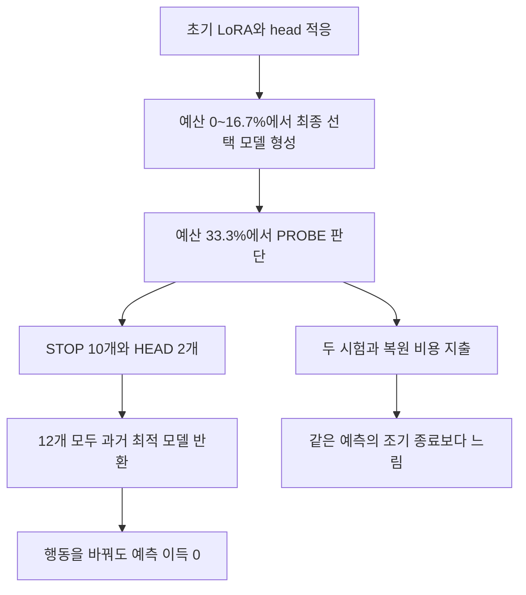
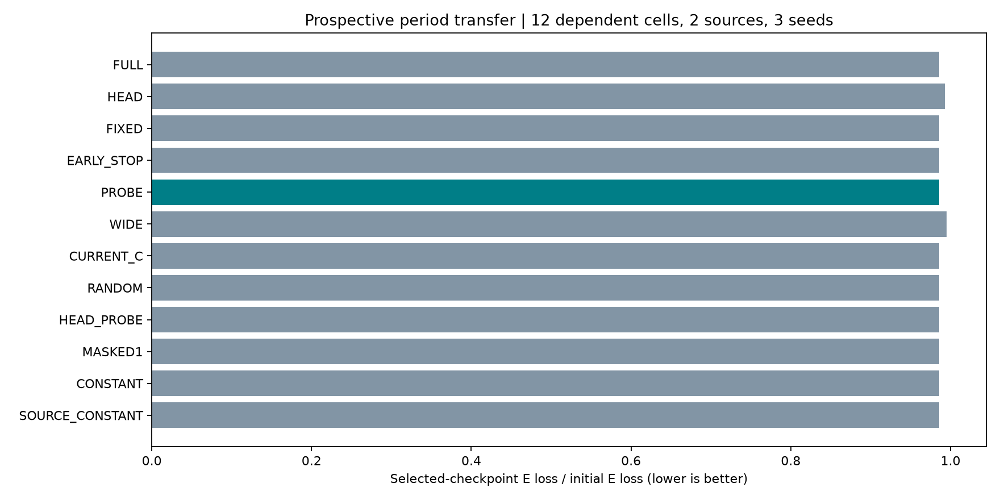

# 짧은 적응 반응의 시기 전이·신호 제거·실제 비용 검증

2026-09-11 완료. **요청한 세 가지 검증을 모두 실행했고, 현재 PROBE 후보는 0/3 기준 통과로 종료한다.** 새로운 PEFT 방법의 우월성은 확보하지 못했다. 다만 초기 LoRA 적응의 평균 이득과, 그 이후 추가 업데이트를 결정하는 규칙의 이득을 분리했고, 후자가 실패한 이유를 좁혔다.

[결과·재현 자료](../../../../results/peft_decision_transfer_v1/README.md) · [144행 결과](../../../../results/peft_decision_transfer_v1/metrics.csv) · [고정 분석](../../../../results/peft_decision_transfer_v1/summary.json) · [이전 32번 진단](32_future_utility_20260911.md)

## 세 가지 질문의 결과

```text
1. 새 기간에서 조건에 맞는 행동을 고르는가?     미통과
   STOP 10 / HEAD 2 / JOINT 0.
   하지만 최종 선택 모델은 12/12 모두 STOP과 동일.
   공통 행동·원천별 행동·무작위 대비 추가 이득 0.

2. 짧은 JOINT 시험 신호가 실제로 필요한가?     미통과
   CURRENT_C / HEAD_PROBE 대비 추가 이득 0.
   JOINT 시험 신호를 제거해도 선택된 예측이 같음.

3. 강한 단순 대조보다 품질·실제 비용이 나은가? 미통과
   FULL / FIXED와 같은 품질로 더 빠름.
   그러나 같은 품질의 EARLY_STOP보다
   seed별 28.37% / 20.12% / 33.68% 더 느림.
```

판정 문턱 0.25%F0와 5% 시간 절감은 실행 전에 정한 **후속 연구 진행 기준**이다. 학회 합격선이나 통계적 유의성·동등성 검정이 아니다. 세부 조건은 [동결 프로토콜](../../../../experiments/peft_decision_transfer_v1/PURPOSE.md)에 있다.

여기서 HEAD 행동은 **이미 배운 LoRA 가중치는 유지하고 이후 업데이트만 동결**한다. 표의 HEAD baseline은 처음부터 head만 학습하는 HEAD0다. 서로 다른 비교다. 현재 후보가 결정한 것은 “LoRA를 처음부터 쓸지”가 아니라 “예산 1/3까지 LoRA와 head를 학습한 뒤 무엇을 더 할지”였다.

## 평균에서 보이는 이득과 원천별 반례

F0는 초기 미적응 모델의 평가 손실이다. %F0는 손실 차이를 이 초기값으로 나눈 단위이며, 상대 오류 감소율과 같지 않다. 아래는 12조건의 E/F0 평균과, PROBE 기준 손실 개선량이다. FULL·FIXED·ES도 PROBE와 같은 선택 모델을 내므로 이들의 head 대비 차이도 같다.

```text
방법                          평균 E/F0   PROBE 이득(%F0)
PROBE                         0.985639     0.000
FULL / FIXED / EARLY_STOP      0.985639     0.000
CURRENT_C / HEAD_PROBE         0.985639     0.000
CONSTANT / SOURCE_CONSTANT     0.985639     0.000
RANDOM / MASKED1               0.985639     0.000
HEAD                          0.993080    +0.744
WIDE                          0.995080    +0.944

비교                     Jena          BMRA
LoRA 포함 적응 vs HEAD    +2.238        -0.750 %F0
LoRA 포함 적응 vs WIDE    +2.275        -0.387 %F0
```

[확인] 동일 학습 파라미터 수 WIDE head보다 **전체 평균에서는 +0.944%F0**, 하지만 **BMRA에서는 −0.387%F0**였다. “어디서나 LoRA가 더 좋다”는 결과가 아니다. 좁은 head 대비 평균 +0.744%F0의 조건부 90% 구간은 **[−0.083, 1.541]**로 0을 포함한다. WIDE 대비 구간은 **[0.197, 1.639]**다.

두 원천을 고정하고 평가 origin 2개씩 묶는 paired circular block bootstrap 2,000회를 사용했다. 세 seed·두 학습 구성은 같은 정답 시계열을 공유하므로 함께 재표집했다. 이 구간은 이 원천과 기간 안의 불확실성이며, 새로운 데이터셋 모집단에 대한 구간이 아니다. WIDE와 LoRA+좁은 head는 학습 파라미터 수가 각각 **1,768,949개**로 같지만 함수 종류나 최적화 난이도까지 같다는 뜻은 아니다. 좁은 head는 589,301개다.


## 왜 행동이 달라도 결과는 같았나

[확인] 선택된 recipe0의 모든 시험 조건에서 **JOINT·HEAD1·STOP의 V 최적 모델 해시가 동일**했다. 사후에 세 행동 중 정답을 완벽히 알아도, 이 출력 선택 규칙 안에서 얻는 추가 예측 이득은 0이었다. 따라서 oracle regret 0이나 행동 분류의 높은 정확도를 신호의 성공으로 해석할 수 없다. 이 조건에서는 세 행동이 모두 같은 예측을 내기 때문이다.



선택 지점은 예산 0%에 2조건, 8.3%에 5조건, 16.7%에 5조건이었다. 결정은 33.3%에서 했다. [확인] 이 설정의 최종 선택 모델은 전부 판단 시점보다 먼저 존재했다. [해석] **판단 시점을 너무 늦게 잡은 것이 이번 설계의 중요한 한계**다. 이를 근거로 모든 시점의 short probe나 모든 LoRA 적응이 무용하다고 일반화할 수는 없다.

또 하나의 한계는 비교 대상의 불일치다. [policy.py](../../../../experiments/peft_decision_transfer_v1/policy.py)는 STOP trial을 현재 fork V와 비교하지만, 실제 STOP 출력은 과거 prefix의 최적 V 모델이다. 예를 들어 BMRA SPREAD30 seed28002는 다음과 같았다.

```text
현재 fork V       0.3906139
짧은 HEAD trial V 0.3905815  → 현재 fork보다는 조금 좋아 HEAD 선택
과거 최적 V       0.3876354  → 여전히 더 좋으므로 실제 출력은 과거 모델
```

seed28003에서도 같은 불일치가 있었다. 코드가 다른 모델을 잘못 저장한 실행 오류가 아니라, **실행 전에 정한 규칙이 실제 반환 모델의 가치를 제대로 비교하지 못한 설계상 문제**다. 결과를 본 뒤 규칙을 고쳐 같은 E에 다시 맞추지 않았다. [V-only 독립 검토](../../../../results/peft_decision_transfer_v1/evidence/independent_policy_review.json)와 [전체 모델 비교](../../../../results/peft_decision_transfer_v1/completion_review.json)에 근거를 보존했다.


## 학습률·clipping 대조가 알려준 것

학습률은 개발에서 선택한 하나만 보고 원인을 단정하지 않도록, 첫 시험 seed에서 세 recipe를 모두 실행했다. recipe0은 head/LoRA 각각 1e-4/1e-4, recipe1은 1e-4/3e-5, recipe2는 3e-5/3e-5다.

[확인] head 학습률을 고정하고 LoRA 학습률만 낮추자, 고정 최종 시점의 JOINT 대비 HEAD 우위가 BMRA FULL90에서 **17.573 → 3.651%F0**, Jena FULL90에서 **23.323 → 5.670%F0**로 줄었다. SPREAD30의 최종 시점 부호는 일부 recipe에서 뒤집혔다. 따라서 recipe0의 후반 악화를 바로 “시계열 복잡도 때문에 LoRA가 해롭다”는 설명으로 바꾸면 안 된다.

clipping 방식만 구분하는 MASKED 대조와 HEAD1의 최종 차이는 최대 **0.698%F0**였다. 영향이 완전히 0은 아니지만, 선택된 recipe0에서는 이 대조도 최종적으로 같은 prefix 모델을 반환했다. 12개 LR·clipping 대조의 값은 [고정 분석](../../../../results/peft_decision_transfer_v1/summary.json)의 `LR_clipping_controls`에 모두 있다. 다른 recipe에서 발견한 작은 차이를 새로운 최종 정책으로 사후 채택하지 않았다.

## 실제 비용: FULL만 이기는 것으로 충분하지 않았다

```text
방법          평균 적응 시간     평균 E/F0
EARLY_STOP       10.284초          0.985639
PROBE            13.058초          0.985639
FIXED            16.006초          0.985639
FULL             23.817초          0.985639
HEAD             12.341초          0.993080
WIDE              8.612초          0.995080

PROBE 시간 절감률       seed28002   seed28003   seed28004
vs FULL                  47.03%      42.95%      45.58%
vs FIXED                 20.35%      13.76%      21.09%
vs EARLY_STOP           -28.37%     -20.12%     -33.68%
vs HEAD                 -7.57%      -7.56%      -2.40%
vs WIDE                -55.11%     -54.36%     -45.70%
```

음수는 후보가 더 느리다는 뜻이다. 12조건×6정책, **72번을 실제로 실행**했다. 각 실행의 선택 step·모델 해시·V 예측이 공유 진단 경로와 정확히 일치했다. 분기 진단의 일부 구간 시간을 이어 붙인 추정치가 아니다.

적응 시간에는 모델 로딩, 데이터 준비·해시 검사, 학습, V 평가, 두 시험, 상태 복원과 최종 모델 복원이 포함된다. Python 모듈 import 전 시간, 사후 재현 검증·파일 저장·E benchmark 예측은 제외한다. 전체 연구 비용이나 추론 처리량과 구분해야 한다. 정책별 실행 순서를 순환시켰지만 조건당 측정은 한 번이므로 정밀 하드웨어 성능 검정은 아니다.


왼쪽은 고정 최종 시점에서 JOINT보다 HEAD가 유리한 반응을 보여 준다. 하지만 실제 출력은 오른쪽처럼 조기 종료와 같은 모델이다. 이 두 평가 대상을 섞으면 미래 업데이트 신호를 찾았다는 관찰을 실제 정책의 개선으로 잘못 연결하게 된다.

## 다음 연구에서 바꿔야 할 순서

**현재 후반 동결 PROBE 후보는 종료한다.** 같은 E에서 margin·결정 시점·분류기를 바꿔 성능이 나오는 조합을 찾지 않는다. 수정 정책은 이번에 검증한 결과가 아니다.

다음 진입 문제는 “학습 후반에 LoRA를 더 돌릴지”보다 **“초기 적응에서 어떤 변화가 head만으로 해결되지 않는가”**가 더 직접적이다. 이번 Jena/BMRA의 부호 차이는 출발 단서일 뿐, 원천 이름 두 개로 일반적인 조건을 배웠다는 증거는 아니다. 재개한다면 다음 순서로 제한한다.

1. **새 개발 자료에서 선택할 가치부터 확인한다.** 조기 종료·충분히 튜닝한 동일 용량 head·간단한 출력 보정까지 비교하고, 실제 반환 모델 기준으로 선택 가능한 행동 사이에 의미 있는 차이가 남는지 본다. 단순 정책과 oracle의 차이도 거의 없으면 controller 연구는 여기서 중단한다.
2. **그 차이가 남을 때 원인을 개입으로 분리한다.** 초기 학습량·head/LoRA 학습률·clipping·자료량을 맞추고, 수준·스케일 변화와 시간 의존성 변화 등을 구분한다. 복잡도 통계와 성능의 상관만으로 원인을 선언하지 않는다. source별 고정 선택보다도 더 설명하는지 확인한다.
3. **그 뒤 신호와 방법을 만든다.** 신호의 목표는 현재 fork보다 조금 좋아지는 것이 아니라, 이미 가진 최적 모델과 강한 단순 대조를 넘어설 가능성이다. 시점과 기준은 개발에서 정하고, 판단 비용을 포함해 새로운 E에서 검증한다. 두 번째 FM·더 넓은 원천과 시기·가까운 선행 방법을 추가해야 논문 기여를 주장할 수 있다.

이 순서는 이번 설계에서 늦은 판단 시점과 0인 선택 여지를 충분히 걸러내지 못한 점을 보완한다. 앞당긴 PROBE가 성공할 것이라는 결론은 아직 없다. [AFLoRA](https://aclanthology.org/2024.acl-short.16/)처럼 적응 중 동결하는 방법과 [Hyperband](https://jmlr.org/papers/v18/16-558.html)처럼 짧은 학습으로 자원을 배분하는 선행 연구가 이미 있으므로, “probe를 한다/동결한다” 자체를 새로움으로 주장할 수 없다.

## 실행·자료 계약과 검증

- Chronos-2, attention LoRA rank8/alpha16, residual MLP533. context336시간·horizon48시간, batch8/micro4. FULL90/SPREAD30 최대180/60 updates. WIDE head는 동일 학습 파라미터 수 대조다.
- 개발은 Jena2021/BMRA2022의 2원천×2구성×1seed=4조건, 시험은 Jena2022/BMRA2023의 2원천×2구성×3seed=12조건. 원천 자체를 처음 보는 외삽 검증은 아니다.
- train90/V30/cal20/E80 origins 중 E는 사전에 고른 0,4,...,76의20개만 사용했다. cal은 사용하지 않았다. 모든 개발 E는 가장 이른 시험 E보다 먼저 끝난다. 시계열 원시 자료나 FM 사전학습에 이 기간이 포함됐는지는 별개이며, 사전학습 중복은 알 수 없다.
- BMRA 채널은 미래 구간의 관측 가능성 QC를 포함해 골랐다. 예측 성능으로 고르지는 않았으나 가용성에 조건을 건 선택이라는 한계가 있다. 일별 target은 split 안에서 겹치지만 split 사이 target은 겹치지 않는다. 결측 target은 손실에서 제외하고, context만 과거 방향으로 보간했다.
- FULL90/SPREAD30은 optimizer가 뽑는 origin 수를 뜻한다. 공통 과거 context와 train 기간 통계를 사용하므로 “30개 정답만 가진 문제”로 해석하지 않는다. 상세 날짜·채널·결측은 [데이터 계약](../../../../experiments/peft_decision_transfer_v1/PURPOSE_DATA.md)과 [데이터 감사](../../../../results/peft_decision_transfer_v1/evidence/prepared_data_audit.json)를 따른다.
- 개발에서 각 방법의 LR·고정 동결 시점·ES patience·probe margin을 튜닝했다. 최종 선택은 TREE recipe0, FIXED HEAD1, ES2, PROBE margin0, WIDE recipe2였다. SOURCE_CONSTANT도 두 원천 모두 STOP이었다. 개발 4조건의 작은 탐색이라는 한계가 있다.
- 계획 동결 → S0 → 개발20학습/20평가 → 개발 선택 봉인 → 시험32학습 봉인 → 시험32평가 →72실제 재실행 → 고정 분석 → 독립 감사 순서를 확인했다. 총177 GPU 작업 모두 정상 종료했고, 정책이나 문턱을 E 결과에 맞춰 바꾸지 않았다.
- 독립 감사는 source39개/input9개 해시, V 점수1,260개·current_C32개·E 점수379개, 결과144행, 72재실행, 177guard와 시간 순서를 확인했다. 최대 점수 차이는 V 4.25e-14/E 2.22e-16이었다. [감사 원문](../../../../results/peft_decision_transfer_v1/evidence/independent_audit.json).
- 본 controller는 **5,371.231초(89.52분)**, 별도 S0는22.266초였다. 이 전체 연구 시간과 위 정책별 적응 시간은 다른 양이다. 508개 자원 표본에서 최소 여유 RAM12.792GiB/commit12.420GiB, 최대 자식 RSS1.863GiB/GPU1864MiB/54°C였다. 완료 후 이번 학습 프로세스와 guard lock이 없음을 확인했다.
- 실행 구간의 지정 Windows 이벤트(System41/4101/153/2004/6008, Application1000)는0건, 조회 오류0건이었다. [이벤트 조회](../../../../results/peft_decision_transfer_v1/evidence/windows_event_audit.json)는 해당 구간·ID만의 확인이다.
- 준비 중 검사 helper의 `train_origins_origins` 키 오류1건은 GPU 계획 동결 전에 수정했다. 실패 로그·partial 파일은 보존했다. [실패 기록](../../../../results/peft_decision_transfer_v1/evidence/prepared_attempt01_failed_preparation_failures.json). GPU 실행 실패와 구분한다.
- 원 study32/31/30의 보호 대상 해시도 유지했다. 사후 `completion_review.py`와 독립 감사·문서 코드는 동결 학습 코드와 구분했다. 기존 결과를 덮어쓰지 않았고 이번 턴 commit/push는 하지 않았다.



4개 PNG와 전체 학습 history, 144행의 per-origin 손실 합·유효 개수·scale을 담은 작은 NPZ를 결과 폴더에 모았다. 원시 예측·모델 checkpoint는 로컬 runs에 보존한다. 새 방법의 성공을 주장하는 자료가 아니라, 현재 후보의 실패와 남은 연구 질문을 재검증할 수 있는 기록이다.
