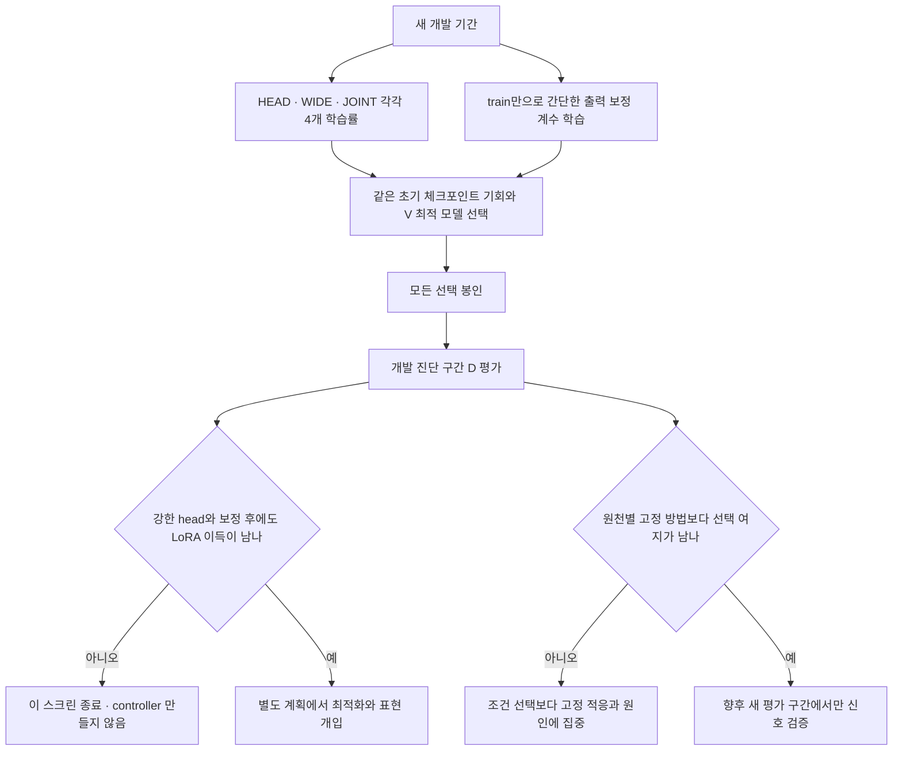
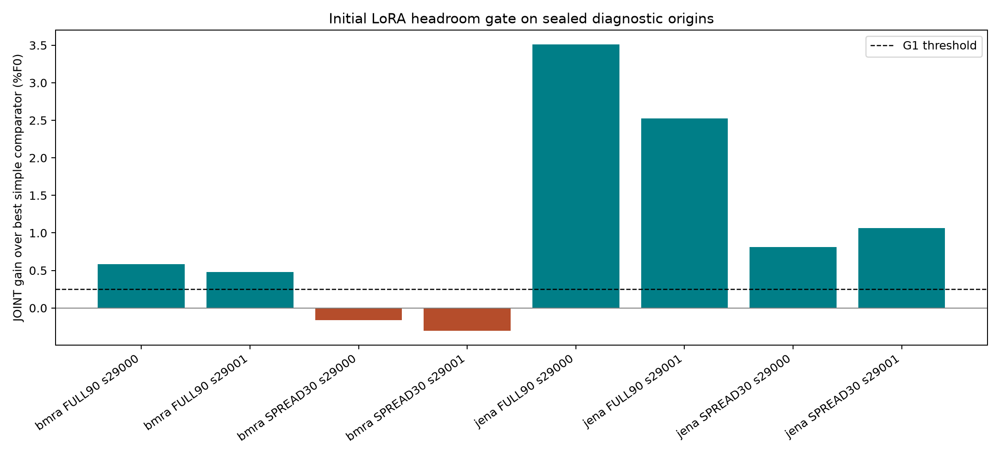
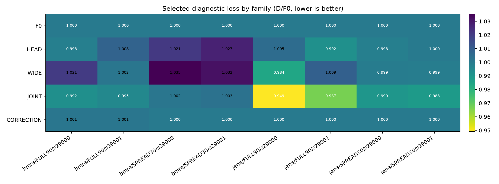
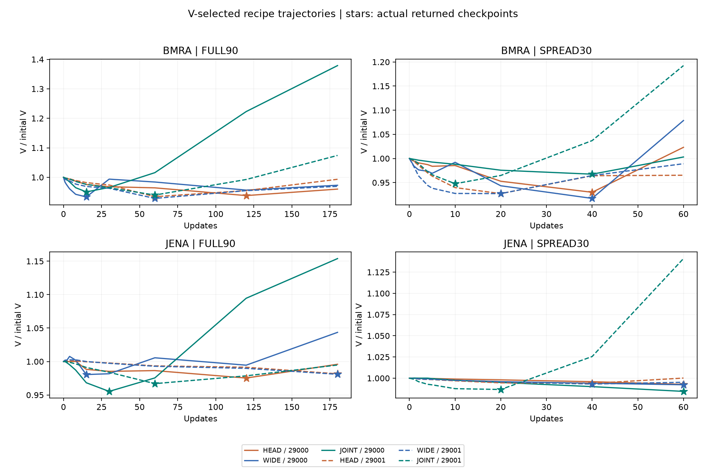
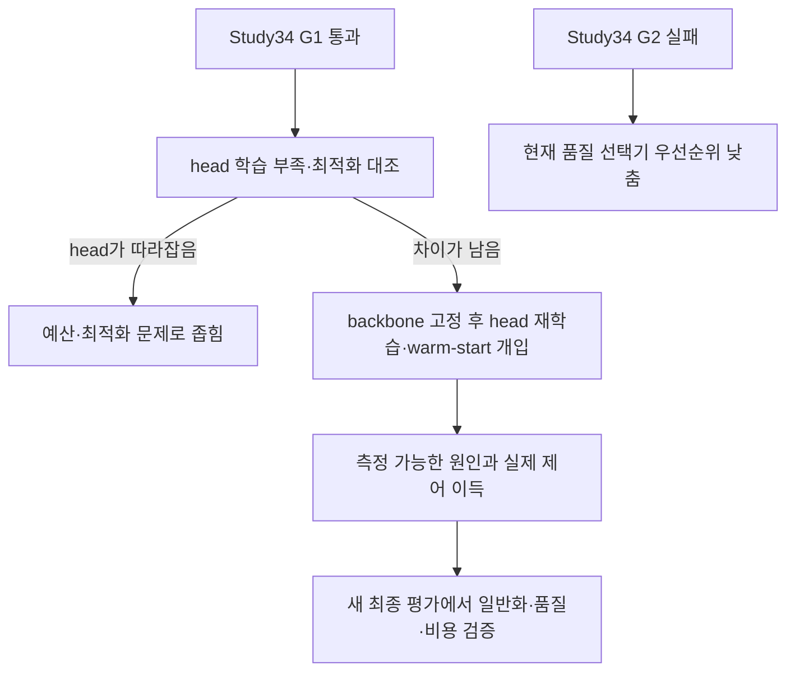
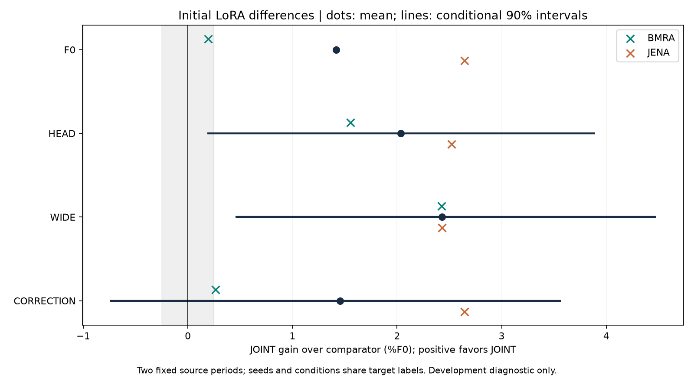
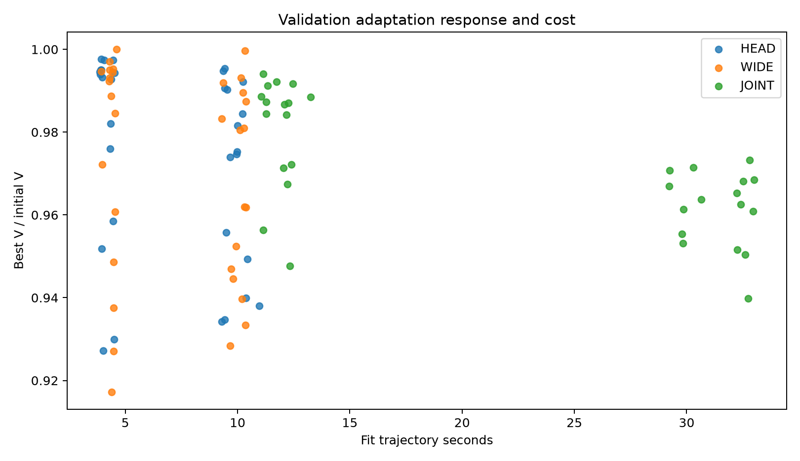

# 초기 LoRA 적응: 강한 head 이후에도 해결할 문제가 남는가

2026-09-11 완료. **[확인] 초기 LoRA 이득의 원인을 조사할 G1은 통과했고, 조건별 방법 선택의 추가 여지 G2는 통과하지 못했다.** Study33의 후반 PROBE 후보를 종료하고 진행한 별도 개발 진단이다. 새 방법이나 논문 기여가 확립된 결과는 아니다. [전체 결과와 근거](../../../../results/peft_initial_headroom_v1/README.md).

[고정 설계](../../../../experiments/peft_initial_headroom_v1/PURPOSE.md) · [이전 결과](33_decision_transfer_20260911.md)

## 왜 이 검증부터 하나

Study33에서 선택한 행동 12개가 모두 같은 과거 최적 모델을 반환했다. 따라서 짧은 반응을 잘 측정하는 것보다, 실제로 선택할 가치가 있는 서로 다른 모델이 존재하는지 먼저 확인해야 한다. 초기 LoRA와 동일 용량 head의 원천별 차이는 단서이며, 아직 head가 표현하지 못하는 구조가 있다는 증거는 아니다.



## 비교와 판정

- 두 원천 × FULL90/SPREAD30 × 두 seed. HEAD·동일 학습 파라미터 수 WIDE·LoRA+HEAD인 JOINT에 각각 네 학습률 후보를 준다. 총96학습과 V 선택 후24평가, 별도 S0 세 가지다.
- 기존 Chronos-2, L336/H48, 21분위 손실과 batch8/micro4를 유지한다. 1·2·4 step부터 관찰하며, 모든 모델이 V에 따라 step0까지 선택할 수 있다.
- 출력 보정은 F0 train 예측으로 bias/양의 affine 계수를 맞추고 V에서 보정 강도를 고른다. 계수 fitting에는 V/D 정답을 쓰지 않는다.
- G1: 최소 한 원천·학습 구성에서 두 seed 모두 JOINT가 F0/HEAD/WIDE/보정 중 가장 좋은 결과보다 0.25%F0 넘게 좋아야 원인 개입 단계로 넘어간다.
- G2: 조건마다 최선 방법을 안다는 oracle조차 전체 고정 방법 및 원천별 고정 방법보다 두 seed에서 각각 0.25%F0 넘게 좋지 않으면 controller 연구로 이어가지 않는다. oracle은 실현 가능한 방법 성능이 아니다.
- D는 새로운 방법을 설계할 개발 진단 자료다. 최종 미노출 평가가 아니며, 별도의 새 최종 평가 자료를 준비하거나 열지 않았다. 데이터 기간과 노출 감사는 아래에 기록했다.

문턱은 후속 투자 여부를 정하는 기준이지 논문 합격선이나 유의성 검정이 아니다. 두 seed와 학습 구성은 같은 정답 기간을 공유한다. 학습률 네 개를 비교했다고 모든 head의 최적화를 끝냈다는 주장도 하지 않는다. LoRA의 A/B 학습률 비율은 이번에 다루지 않는다.

## 선행 근거

[Kumar 등, ICLR 2022](https://openreview.net/pdf?id=UYneFzXSJWh)는 고정 특징의 readout과 내부 적응을 구분할 이유를 제공한다. [LoRA+, ICML 2024](https://proceedings.mlr.press/v235/hayou24a.html)는 adapter의 최적화 설정도 중요한 원인임을 보여 준다. 이들의 결과를 현재 시계열의 원인으로 그대로 적용하지 않고 대조 실험의 근거로 사용한다. [Chronos 공식 구현](https://github.com/amazon-science/chronos-forecasting)은 이미 LoRA 적응을 지원하므로 LoRA 적용 자체는 새로움이 아니다.

## 실행 상태

데이터는 Jena 2019-05-04~2020-01-01, BMRA 2018-01-04~2018-09-03의 두 블록이다. 기존 원천의 과거 기간이며, 확인한 PEFT 이력의 target 사용 기간과 겹치지 않는다. BMRA 채널은 Study33의 고정 네 채널을 재사용했고 2018 관측 가능성을 사전에 확인했다. 사전학습 중복 여부는 알 수 없다. [데이터 계약](../../../../experiments/peft_initial_headroom_v1/PURPOSE_DATA.md).

준비 과정에서 데이터 보조 작업이 읽기 전용 범위를 넘어 run/analyse를 작성한 충돌이 있었다. GPU 실행 전에 해당 작업을 중지하고 다른 버전과 첫 계획을 `runs/peft_initial_headroom_v1/preflight_conflict`에 보존했다. 메인에서 두 구현을 검토해 동일 초기 예측·paired sample·V 선택 해시 검증, step 우선 동률 처리, 개발 D 전에 선택 봉인, seed별 고정 방법 대조를 복구했다. 수정 후 CPU2tests를 재실행해 통과했다. 결과를 본 뒤의 방법 변경이 아니다.

최종 재봉인 plan SHA256: `82b4244377ecca692726554a6c85c21a64c8aaaa1a1ba86f29ce81001a4d6a5e`. source46개와 prepared input5개,96fit/24forecast/3S0. 실행 전 독립 코드·데이터 검토 통과.

CPU 손실의 독립 scalar 계산 및 보정 순서 보존 두 테스트 통과. HEAD/WIDE/JOINT S0 모두 exit0, 합계30.344초. 가중치 동결·선택모델 복원 exact 검증 통과. 본학습 session86835는 exit0으로 종료했으며 10:03~10:51 KST, 2,839.739초(47.33분)가 걸렸다. 96fit+24forecast+3S0, 총123 guard 모두 정상 종료했다. GPU를 순차 사용했으며 이전 실험·원자료·시스템 설정은 유지했다.

## 실제 결과: 남는 이득과 반례

`%F0 = 100 × (대조 손실 − JOINT 손실) / 초기 동결 모델 손실`이다. 일반적인 대조군 대비 상대 오차 감소율과 다르다. 아래는 F0/HEAD/WIDE/보정 중 D에서 사후적으로 가장 좋은 대조군 대비 JOINT의 이득이며 양수가 좋다.

```text
원천 / 구성              seed 29000   seed 29001   G1
BMRA / FULL90                +0.583       +0.476   통과
BMRA / SPREAD30              −0.163       −0.303   미통과
Jena / FULL90                +3.509       +2.523   통과
Jena / SPREAD30              +0.810       +1.067   통과
```

네 조합 중 세 조합이 두 seed 모두 +0.25%F0를 넘었다. 최소 한 조합이면 진입한다는 G1을 통과했다.



```text
방법                 평균 D/F0 (낮을수록 좋음)
F0                    1.000000
HEAD                  1.006190
WIDE                  1.010095
JOINT                 0.985817
CORRECTION            1.000371

JOINT 평균 이득: F0 +1.418 / HEAD +2.037 / WIDE +2.428 / 보정 +1.455%F0
```

**BMRA SPREAD30은 JOINT가 head보다 좋지만 F0보다 나쁘다.** Head만 비교하면 실용적 이득을 과장한다. F0 대비 원천별 JOINT 평균 이득은 BMRA +0.192, Jena +2.644%F0다. Jena에서는 사후 target 분해상 기압·온도 모두 head 대비 개선을 보였으나, 이것은 인과 개입이 아니다.



## G2 실패: 현재 선택 controller의 품질 여지는 작다

두 seed 모두 전체 및 각 원천에서 가장 좋은 고정 방법은 JOINT였다. 조건의 최선 방법을 사후적으로 아는 oracle의 추가 이득은 **+0.0408/+0.0756%F0**로 0.25 기준에 미달했다. Oracle은 실제 구현 가능한 방법의 성능이 아니다. 이 후보 집합에서는 그 상한부터 작으므로 복잡한 품질 선택기보다 **고정 초기 LoRA 이득의 원인**에 집중한다. 모든 시간 절감 정책을 반증한 것은 아니다.

## 아직 표현의 한계라고 단정할 수 없는 이유

24개 선택 신경망 출력 모두 F0와 달랐으며, 8조건 모두 JOINT와 HEAD/WIDE 출력이 각각 달랐다. Study33의 동일 모델 반환 현상은 이번에 없었다. 그러나 일부 head는 예산 마지막 step을 선택했다.

```text
조건                           HEAD   WIDE   JOINT
BMRA FULL90 / 29000              120     15      15
BMRA SPREAD30 / 29000             40     40      40
Jena FULL90 / 29000              120     15      30
Jena SPREAD30 / 29000             60     60      60
BMRA FULL90 / 29001               60     60      60
BMRA SPREAD30 / 29001             20     20      10
Jena FULL90 / 29001              180    180      60
Jena SPREAD30 / 29001             40     40      20
```

FULL90 상한180/SPREAD30 상한60에 걸린 선택은 HEAD2/WIDE2/JOINT1개다. **[확인] head의 충분한 수렴을 입증하지 못했다. [추정] 최적화 속도 차이와 유용한 표현 변화 가능성이 함께 남는다.** 동일 파라미터 수는 동일 함수 집합·최적화 난도가 아니다.



별표가 실제 반환 모델이다. 일부 JOINT는 후반 V가 크게 악화되어 초반 checkpoint를 반환했다. 최종 step 성능만 비교하면 선택 효과를 혼동한다.

## 다음 순서와 중단 조건 — 아직 미실행

이번 관측 이후 작성한 후속 계획이다. 현재 D는 개발 자료로 남기며 새 기간의 역할·예산·판정을 실행 전에 따로 고정한다.

1. **학습 부족부터 배제:** 새 개발 기간에서 HEAD/WIDE/JOINT에 제한된 예산 확장과 LR 대조를 주고 동일 V 규칙으로 선택한다. 학습·V 곡선, 최종/선택 모델, 실제 시간을 함께 기록한다. head가 따라잡으면 표현 한계보다 예산·최적화 문제로 좁힌다. V 평탄화만으로 수학적 수렴을 주장하지 않는다.
2. **공동 적응과 내부 변화 분리:** 초기 backbone과 JOINT 학습 backbone을 각각 동결하고 같은 초기화·예산·선택 기회로 새 head를 다시 학습한다. 충분히 맞춘 공통 head에서 LoRA를 추가하는 warm-start 대조도 설계한다. 단순 LoRA on/off 손해는 공동 적응 의존성일 수 있어 필요성의 증명이 아니다. 추가 fitting 비용까지 포함한다.
3. **원인이 남을 때 방법화:** 내부 변화의 이득이 head 재학습 후에도 남고 새 개발 기간에서 반복되면 train/V에서 측정할 잔차 구조·적응 반응으로 그 이득을 예측한다. 신호가 개입 결과를 예측하고 제어에 이득을 줄 때 adapter/업데이트 규칙으로 만든다. 최종적으로 별도 봉인한 새 원천·기간에서 강한 head, 고정 LoRA, 단순 보정 대비 품질/비용을 검증한다. Complexity라는 이름만 붙이는 것은 기여가 아니다.



## 비교의 범위와 통계 한계

HEAD 학습 파라미터589,301개, WIDE/JOINT 각각1,768,949개. JOINT는 attention LoRA r8/alpha16/dropout0,12블록96모듈이다. HEAD/WIDE LR은 `[1e-5,3e-5,1e-4,3e-4]`, JOINT (head,LoRA) LR은 `(1e-5,1e-5),(3e-5,3e-5),(1e-4,3e-5),(1e-4,1e-4)`다. 네 번씩 탐색했지만 모든 head 최적화 방법을 소진한 것은 아니다. 선택되지 않은 LR 후보는 D 평가하지 않아 D에 대한 완전한 LR 인과 대조도 없다.

SPREAD30은 분산 선택한 train origin30개다. 공유 과거 context와 전체 train 통계가 있어 엄격한 30개 label 예산으로 부르지 않는다. 두 구성의 기대 origin 노출은16회이며 업데이트 상한은 다르다. 출력 보정은 train 표준편차 단위 중심화 최소제곱, variance ridge1e-6, slope[0.25,4], bias/affine 강도0.25/0.5/1와 identity 총7후보다. 분위 순서는 보존하지만 pinball 최적 보정은 아니다. BMRA FULL90은 bias0.5가 V 선택되어 D에서는 악화했고 나머지는 identity였다.

기간은 오른쪽 끝 제외다. Jena2019 train05-18~08-17/V08-19~09-19/cal09-21~10-12/D10-12~2020-01-01; BMRA2018 train01-18~04-19/V04-21~05-22/cal05-24~06-14/D06-14~09-03. cal은 사용하지 않았다. Jena target 관측률100%, BMRA train/V/cal/D는99.24/94.93/99.79/96.19%. 결측 target 마스크·인과적 context 채움·train 통계를 사용했다. fit 파일에 cal/D가 없고 holdout에 train/V origin이 없다. train/V와 V/cal 간48시간 간격, D는80개 중 매 네 번째20origin으로48시간 target이 겹치지 않는다.

기존 원천의 다른 과거 기간이며 새 원천·미래 시기 전이 시험이 아니다. BMRA 채널은 뒤 시기 관측 가능성을 썼던 Study33 선택을 재사용해 그 조건부 선택 한계가 남는다. 두 seed·두 구성은 같은 정답 기간을 공유하므로 독립 데이터셋8개가 아니다.

조건부90% 구간은 D origin2개 길이의 paired circular block bootstrap2,000회다. 원천 기간 고정, seed·구성을 함께 재표집하며 F0 분모도 재계산한다. JOINT 이득 HEAD `[+0.188,+3.894]`, WIDE `[+0.455,+4.478]`, 보정 `[−0.747,+3.564]`%F0. 보정 구간은0을 포함하고 새 원천 일반화 구간이 아니다.





시간 그림은 후보 하나의 trajectory 시간과 V 손실이다. 전체 탐색 비용·배포 성능의 직접 비교가 아니며 계산 효율 우월성을 주장하지 않는다.

## 완료 검증과 실행 중 문제

123 guard 모두 exit0. 자원270표본에서 최소 가용 RAM13.93GiB/commit13.59GiB, GPU최대1,785MiB/53°C. 종료 점검에서 해당 학습프로세스0/guardlock없음.10:02~10:59KST 지정 System/Application 오류 이벤트0건·조회오류0건. 이번 기록이며 PC 오류의 영구 해결을 증명하지 않는다.

독립 검산에서 source46/input5 및 Study33 source39/input9 해시 일치. V 최대차2.22e-16/D차이0,40행점수·96trajectory·예제별archive·G1/G2·bootstrap 일치. [완료 검사](../../../../results/peft_initial_headroom_v1/completion_review.json), [독립 감사](../../../../results/peft_initial_headroom_v1/evidence/independent_audit.json), [Windows 조회](../../../../results/peft_initial_headroom_v1/evidence/windows_event_audit.json).

첫 독립 감사는 완료 시각의 소수 초 생략 때문에 마지막 시간 순서 검사에서 실패했다. 마지막 guard `01:51:02.468248Z`, 완료 파일 실제mtime `01:51:02.503112Z`, 본문기록 `01:51:02Z`였다. 감사 스크립트에서 이 마지막 경계만 `[t,t+1초)`로 해석하고 실제mtime이 guard 뒤인지 확인하여 재검사 통과했다. [실패 원본](../../../../results/peft_initial_headroom_v1/evidence/independent_audit_failure.json)을 보존했다. 동결 학습·분석 코드와 결과는 변경하지 않았다.

`independent_audit.py`와 `completion_review.py`는 봉인 후 추가한 검산·설명 보조이며 학습 코드에서 import하지 않는다. 이번 결과와 기록은 로컬 정리이며 commit/push하지 않았다.
