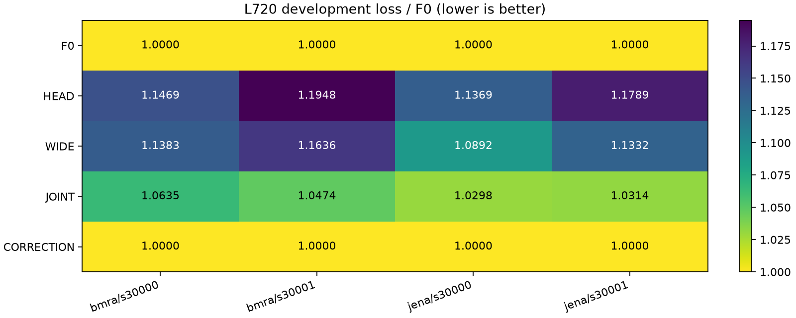
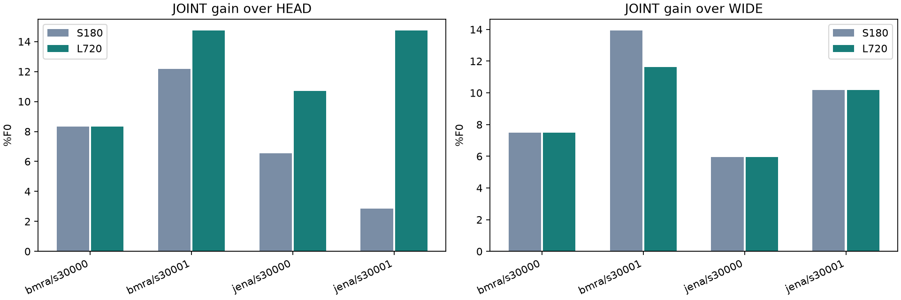
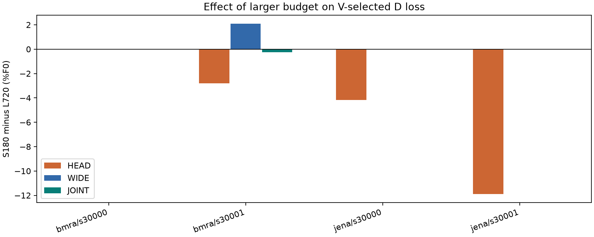
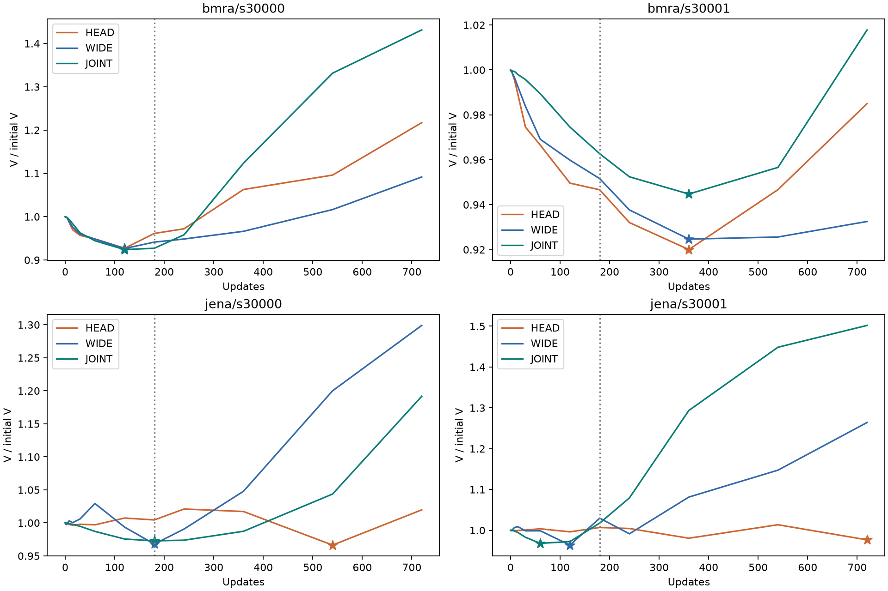
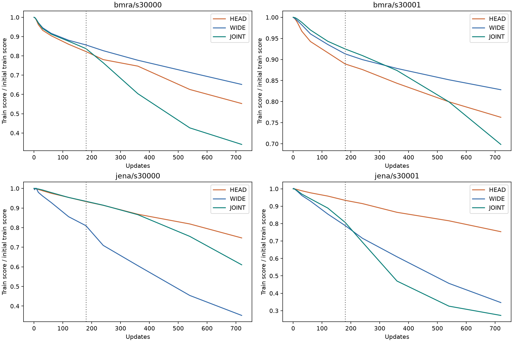
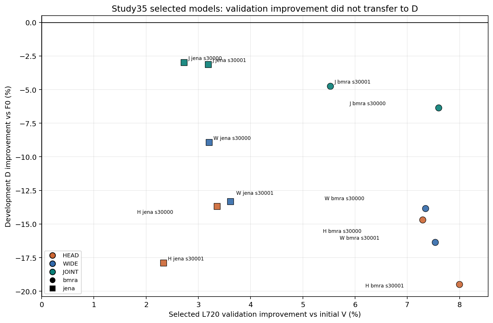
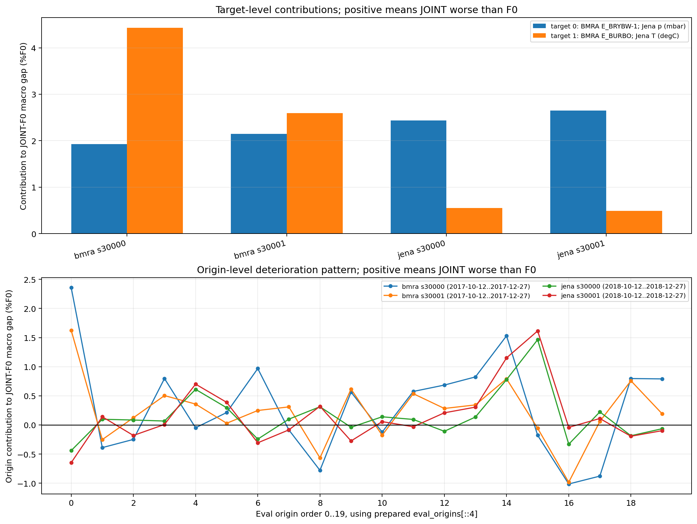
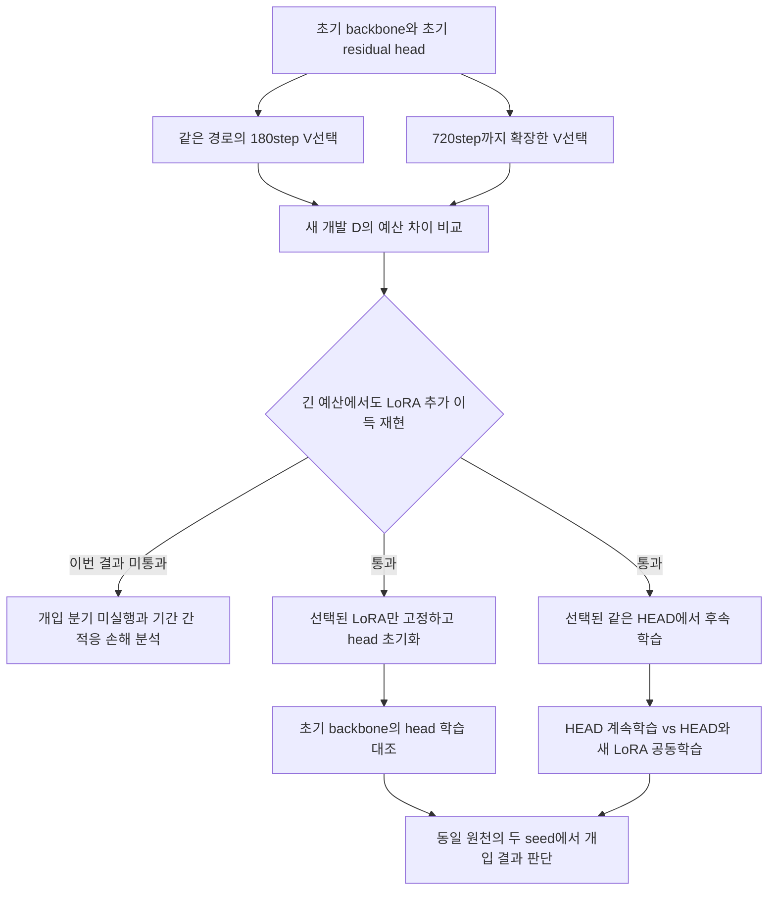

# Study35 — head 학습량을 늘려도 남는 상대 이득, 원래 모델보다 나쁜 적응

2026-09-11 완료. [34번 초기 LoRA 이득](34_initial_headroom_20260911.md) 이후 승인된 순차 검증을 실행했다. **[확인] LoRA는 같은 head 및 동일 총용량 head보다 좋았지만, 이번 새 개발 기간에서는 학습하지 않은 F0보다 네 조건 모두 나빴다.** 첫 기준 G1 미통과로 head 재학습·warm-start 단계 B는 사전 규칙에 따라 실행하지 않았다. G2/G3는 실패가 아니라 미측정이다.

48학습·24평가·3 smoke, 총75 GPU 실행 모두 정상 종료했다. 본실행75.78분, 독립 검산 통과. 새 방법의 우월성이나 논문 준비 완료를 주장할 결과는 아니다. 다만 **“head의 학습 부족을 해결하면 LoRA 차이가 사라진다”는 설명은 이번 관측과 맞지 않고, 검증 구간에서 선택한 적응이 다음 기간에서 손해를 낸다는 문제가 드러났다.**

[전체 결과와 실행 근거](../../../../results/peft_head_convergence_v1/README.md) · [40행 점수](../../../../results/peft_head_convergence_v1/metrics.csv) · [독립 감사](../../../../results/peft_head_convergence_v1/evidence/independent_audit.json).

## 가장 먼저 볼 결과

아래는 개발 평가 손실 / 같은 조건 F0 손실이다. **작을수록 좋고, 1보다 크면 적응하지 않은 모델보다 나쁘다.** HEAD는 residual MLP만 학습, WIDE는 JOINT와 학습 파라미터 수를 맞춘 큰 head, JOINT는 같은 기본 head와 LoRA를 함께 학습한다. S180/L720은 각각180/720step 이내에서 V로 선택한 모델이며 마지막 step 모델이라는 뜻이 아니다.

```text
원천 / seed       예산       HEAD       WIDE      JOINT    F0·보정
BMRA / 30000      S180      1.14688    1.13834    1.06353    1.00000
                  L720      1.14688    1.13834    1.06353    1.00000
BMRA / 30001      S180      1.16667    1.18447    1.04498    1.00000
                  L720      1.19484    1.16357    1.04742    1.00000
Jena / 30000      S180      1.09532    1.08922    1.02984    1.00000
                  L720      1.13691    1.08922    1.02984    1.00000
Jena / 30001      S180      1.05998    1.13323    1.03140    1.00000
                  L720      1.17895    1.13323    1.03140    1.00000
```

L720의 네 조건 평균에서 JOINT는 HEAD보다 **12.135%F0**, WIDE보다 **8.804%F0** 좋다. 하지만 F0보다 **4.305%** 나쁘다. 같은 head 대비 LoRA 추가 이득이 있다는 것과 적응 자체가 유용하다는 것은 서로 다른 판정이다. 이번에는 전자만 충족했다. 보정은 네 조건 모두 V에서 identity가 선택되어 F0와 같다.



G1은 L720 JOINT가 `min(F0, HEAD, WIDE, CORRECTION)`보다0.25%F0 이상 좋은 결과를 한 원천의 두 seed에서 모두 요구했다. 실제 이득은 BMRA **−6.353/−4.742**, Jena **−2.984/−3.140%F0**로 두 원천 모두 미통과다. 0.25는 사전에 정한 내부 진행 기준이며 유의성이나 논문 채택 기준이 아니다.

## head가 더 학습해서 따라잡았나 — 관측상 아니다

같은 새 기간의 S180에서도 JOINT는 F0보다 네 조건 모두 나빴다. 따라서 이전 Study34와 이번 결과의 차이를720step 때문이라고 해석할 수 없다. 기간이 바뀌었고 BMRA는 target 쌍·계절도 달라졌다.

S180→L720에서 HEAD의 D 변화는 순서대로 **0/2.817/4.159/11.897%F0 악화**였다. WIDE는 BMRA30001에서만2.089%F0 개선됐고 나머지는 같은 결과다. JOINT는 BMRA30001에서0.244%F0 악화됐고 나머지는 같다. 전체 평균 변화는 HEAD4.718%F0 악화, WIDE0.522%F0 개선, JOINT0.061%F0 악화다. **더 긴 head 학습으로 LoRA 차이가 사라지지 않았다.** 그렇다고 내부 표현 변화가 원인이라고 증명된 것도 아니다.



위 그림은 HEAD/WIDE 대비 차이다. 모두 양수여도 F0보다 좋은 것은 아니라는 점을 앞의 전체 비교와 함께 읽어야 한다.



양수는 긴 예산이 D를 개선, 음수는 악화했다는 뜻이다. 긴 예산은 추가 checkpoint 선택 기회와 다른 LR 선택 가능성도 포함한다. 모든 후보를 같은 D에서 평가한 순수 업데이트 수의 완전 요인 실험은 아니다.

```text
L720 선택 step         HEAD    WIDE    JOINT
BMRA / 30000            120     120     120
BMRA / 30001            360     360     360
Jena / 30000            540     180     180
Jena / 30001            720     120      60
```

HEAD 한 조건은720 상한에서 선택됐다. head 수렴을 입증하지 못했으며, 다른 조건의 조기 선택도 수학적 수렴 증명이 아니다. 그래프는 L720에서 선택된 LR 경로의 전체 곡선이고 별표가 반환 checkpoint다.





## 다음 문제정의의 단서

**[확인] L720에서 선택된12개 모델 모두 train/V에서는 개선됐지만 D에서는 F0보다 나빴다.** V 개선은2.335~7.998%, train 개선은5.755~24.644%다. LoRA의 V 개선은 BMRA7.598/5.525%, Jena2.726/3.188%였으나 D에서의 개선 부호는 모두 반대였다. V에는 step0도 후보에 있었으므로 F0 복귀 후보가 아예 없어서 생긴 결과는 아니다.



저장된 예측을 사후 분해했을 때 **네 조건의 두 target 모두 JOINT가 F0보다 나빴다.** Jena에서는 기압의 기여가 총 손해의 약81.5/84.4%였고, 온도도 소폭 악화됐다. BMRA는 E_BRYBW-1/E_BURBO의 기여가 각각1.924/4.429 및2.150/2.592%F0다. 채널 하나의 결측 처리나 다른 채널과의 평균만으로 반전되는 결과는 아니다.

전체20개 평가 origin 중 손해를 낸 것은 BMRA11/15개, Jena13/11개였다. 모든 창에서 일률적으로 실패한 것은 아니고, Jena의12월7일·11일 등 특정 창의 손해 기여가 크다. 아래 기여는 **전체 손실 차이에 더해지는 값**이며 각 창 자체의 상대 손실률과 다르다. 채널·origin 기여 합과 전체 손실 차이는 최대1.11e-16 오차로 일치한다. 같은 원천의 두 seed는 같은 정답 창을 공유하므로 독립 반복 표본으로 합치지 않는다.



[사후 분해 수치](../../../../results/peft_head_convergence_v1/descriptive_decomposition.json). 이 분해는 원인을 찾을 위치를 좁히는 기술통계다. 성능을 본 뒤 나쁜 창이나 채널을 제거하지 않았고 모델 선택·G1 판정도 변경하지 않았다.

**[추정] 시간에 따른 분포 변화, 좁은 V 기간에 맞춘 선택, 적응이 보존해야 할 기본모델 성질의 손실** 등이 경쟁 설명이다. 지금 확인한 것은 선택된 모델의 기간 간 성능 불일치이며, 어떤 원인이 이를 만들었는지는 미확정이다. V와 D가 다른 기간이라는 사실만으로 분포 변화를 원인으로 확정하면 안 된다.

현재 우선순위는 새 adapter 구조 추가보다 다음을 구분하는 것이다. 아래는 이번 결과를 본 뒤 정한 후속 가설이며 아직 새 학습으로 검증하지 않았다.

1. **선택의 시간적 불안정인가:** 새 train 구간 안에 여러 rolling 검증 구간을 미리 정하고, F0 대비 적응 이득의 부호·시간별 분산·최악 구간 손실을 측정한다. 한 V의 평균 개선이 다른 과거 구간 개선을 예측하는지부터 본다. 기존 단일 V 조기 종료·항상 LoRA·항상 F0와 비교해야 한다. 이번 D를 보고 threshold를 맞춘 뒤 같은 D에서 검증됐다고 하면 안 된다.
2. **기본모델 예측에서 벗어난 정도가 실제 손해를 설명하는가:** 과거 검증 구간에서 측정한 분위별 출력 변화, 잔차 bias/scale 변화가 다음 구간 손해를 예측하는지 본다. 이후에만 기본 출력 보존 강도를 바꾸는 제한된 개입을 설계한다. 변화량과 손해의 상관만으로 원인을 선언하지 않고, 같은 용량·예산의 head와 LoRA에서 보존 강도 개입이 예측대로 작동하는지 확인해야 한다.
3. **유용한 내부 적응을 먼저 재현한 뒤 원인 개입으로 복귀:** 이후 미리 고정한 다른 개발 기간에서 F0와 강한 head보다 좋은 적응을 확보하면, 이번에 실행하지 않은 backbone 고정·head 초기화와 같은 HEAD 출발 warm-start 대조를 수행한다. 음의 적응 이득만 있는 현재 기간에서 이 실험을 강행해 표현 필요성을 주장하지 않는다.

두 seed는 같은 정답을 공유하므로4개 독립 데이터셋이 아니다. 후속 방법을 논문으로 만들려면 측정 신호가 새로운 기간·원천에서 손해 또는 이득을 예측하고, 신호 제거/무작위 신호 대조보다 실제 제어가 좋아야 한다. 특히 F0 복귀와 단순 조기 종료를 포함한 품질·비용 기준을 함께 넘겨야 한다. 기존 후반 controller의 실패 결과를 새 이름으로 재활용하는 방향은 우선하지 않는다. **새 방법의 독창성 검토와 최종 평가는 아직 남아 있다.**

[고정 계획](../../../../experiments/peft_head_convergence_v1/PURPOSE.md).



## 무엇을 구분하나

1. 같은 경로에서180step 이내 V 선택 모델과720step 이내 선택 모델을 보존했다. 같은 새 기간 안의 예산 대조로 판단하며 예전 결과와의 차이를 전부 학습량 때문이라고 하지 않는다.
2. 이득이 두 seed에서 재현되면, 학습한 LoRA를 고정하고 head를 초기화해 다시 학습한다. 초기 backbone에 같은 head를 학습한 경로와 비교한다. native output 변화도 포함하므로 순수 hidden representation만 분리한 실험은 아니다.
3. 같은 학습된 HEAD에서 HEAD만 계속 학습하는 군과 새 LoRA를 추가하는 군을 비교한다. 두 군 모두 optimizer를 새로 만들고 같은 표본 순서·예산을 사용한다. 초기 출력은 정확히 같아야 한다. 조건이 실패하면 새 adapter를 계속 튜닝하지 않는다.

## 범위와 기준

FULL90,두 원천,두 seed30000/30001,HEAD/WIDE/JOINT 각각4LR,720step48학습. 같은180step까지의 선택을 함께 보존한다. 모든 선택은 V로 하고 D 전에 봉인한다. 강한 F0/HEAD/WIDE/출력보정 대비 JOINT 이득이 한 원천의 두 seed에서 모두0.25%F0를 넘으면 후속 개입으로 진입한다.

후속은 승리한 원천만 고르지 않고4조건 모두 수행한다. REFIT/WARM_HEAD/WARM_JOINT 각각4LR,추가48학습과12평가. REFIT은 같은원천 F0/HEAD, WARM_JOINT는 F0/WARM_HEAD 대비 두seed 모두0.25%F0 기준. 같은 원천에서 세 기준을 함께 만족하는지도 본다. 전체는 개발 진단이며 새 최종test를 열지 않는다.

## 데이터 검토 중 수정한 사항

초기 후보 Jena2020은 과거 hq_token/weather 실험과 실제 원시값이 같은 자료였다. 이 노출을 발견하여 제외하고 [MPI 공식 자료](https://www.bgc-jena.mpg.de/wetter/weather_data.html)의2018년 파일을 받았다. Python 인증서 저장소의 issuer 확인 실패 후 Windows의 정상 인증서 검증을 쓰는 다운로드로 완료했다.

BMRA2017년1월 시작은 기존 target 채널의 관측이 부족했다.5월 시작도 같은 채널에 결측 집중 창이 있어 개별48h 창의70% 기준을 통과하지 못했다. 같은 네 발전기 중 E_BRYBW-1/E_BURBO를 target, E_DALSW-1/E_BNWKW-1를 과거 covariate로 고정했다. 이 변경은 모델 결과를 보기 전 관측량에 따른 결정이다. **기존 BMRA와 다른 target 쌍·계절이며 동일 대상의 재현이 아니다.** 뒤 시기 관측량으로 고른 원래4채널 pool 및 이번기간 관측량에 조건화한 선택이라는 한계가 남는다.

최종 Jena2018/BMRA2017 모두05-04 시작242일,다음해01-01끝이다. train05-18~08-17,V08-19~09-19,cal09-21~10-12,D10-12~01-01(끝 제외).cal미사용,D는80origin중매4번째20개. 확인한 로컬 target 노출과 겹치지 않지만 같은원천이며 FM사전학습 중복은 모른다.

기존 준비 함수의 min_target_window_finite_fraction 이름은 실제로 split집계 관측률의 최솟값을 가리켰다. 이번에는 별도 window_qc로 개별origin도 검사했다. Jena개별target창 최저85.42%,BMRA pooled최저94.79%,개별target최저89.58%. 기준 완화 없이 통과했다. 메타데이터의 과거 selection_rule 표현을 수정하기 전 준비본은 runs/peft_head_convergence_v1/prepared_preflight_metadata에 보존했다.

## 실행·검증

계획SHA256 `33959c5c95e8a2cc91e7d278150bf008cfeb5d210025f7fc52dcda18ded19406`,source52/input7. CPU3tests 통과. 독립 코드 리뷰에서 StageB smoke와 원V의 shape 불일치를 지적해 GPU 전에 수정했고 추가 차단 결함은 없었다. StageA smoke는 train만 쓰며, StageB smoke는 이미 선택에 사용한 전체V에서 prefix출력 일치를 확인한다.

본학습 세션34300은 exit0,4546.778초(75.78분),2026-09-11 14:33:13 KST 종료다. StageA smoke3개를 포함한75 guard 모두 정상이며 B guard는0개다. 독립 stdlib/NumPy 감사는48개 학습·V 선택·24개 D 예측·40행 점수·loss archive·조건부 bootstrap·G1와 B 미실행 일치·시간 순서를 검산해 통과했다. prepared D의 target/quantile/scale/origin을 직접 재구성했고 합법적인 결측 target은 동일 위치 NaN을 허용했다. 이번 full audit의 실패 receipt는 없다.

`independent_audit.py`, `completion_review.py`와 사후 설명용 `completion_diagnostics.py`는 동결 후 추가한 보조이며 frozen 학습 코드에서 import하지 않는다. 보호된 source52/input7 및 Study34의51개·Study33의48개 해시 모두 일치했다. [완료 검사](../../../../results/peft_head_convergence_v1/completion_review.json).

조건부90% 구간은 D origin2개 길이 paired circular block bootstrap2,000회다. 원천 기간 고정, 같은 원천의 seed/방법에 같은 재표집을 적용하고 F0 분모도 다시 계산했다. L720 JOINT 이득은 HEAD `[+7.409,+17.091]`, WIDE `[+5.070,+12.803]`, F0와 같은 CORRECTION `[−7.309,−1.374]`%F0다. 새 원천 일반화 구간이 아니며 사후 개발 분석이다.

기존 admission commit13GiB/RAM5GiB, 비상중단commit6/RAM5GiB를 유지했다.442개 자원 표본에서 최소 가용 RAM14.275GiB/commit13.430GiB, 최대 자식 RSS1.695GiB, GPU1,828MiB/58°C였다. GPU는 장치 전체의 표본값이다. 종료시 해당 학습프로세스0, guard lock없음. [Windows 조회](../../../../results/peft_head_convergence_v1/evidence/windows_event_audit.json)는13:16~14:35 KST 지정 System/Application 이벤트0·조회오류0이며 영구적인 PC 안정성 증명은 아니다.

본실행 시간은 admission 간격을 포함하고 CPU 준비·최초 smoke는 제외한다. guard 합계에서 HEAD16개841.58초/WIDE16개847.67초/JOINT16개2277.28초이며 child 시작 비용을 포함하고 admission 간격은 제외한다. S180은720 경로에서 추출했으므로 별도180step 실행 시간으로 보고하지 않는다. 이번 실행으로 계산 효율 우월성을 주장하지 않는다.

다른 프로젝트 프로세스·OS설정·보안설정·기존 동결 코드를 변경하지 않았다. 전체 진행률과 guard 기록은 runs/peft_head_convergence_v1에 보존한다. 새 최종test는 열지 않았고 이번 작업에서 commit/push하지 않았다.
