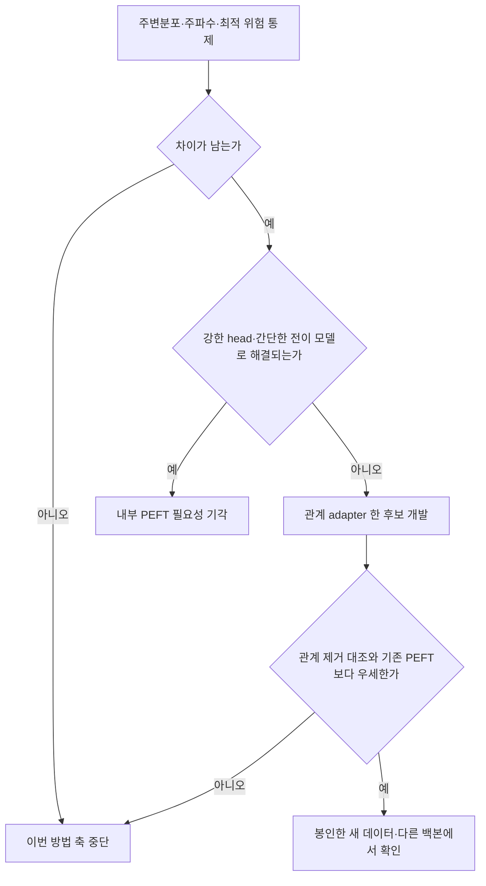

# 36. 순서 의존성에서 출발하는 PEFT 논문 계획

작성: 2026-09-11. 상태: **연구 설계안. 데이터 생성·학습·성공 판정은 아직 실행하지 않았다.**

## 1. 이번에 정하는 것

목적 위계: ML 방법 논문 → 기존 방법의 구체적인 한계를 설명하고 해결 → 방법 개발에 들어갈 근거가 있는지 제한된 실험으로 판정.

사용자의 포스터에서 가져올 것은 DLinear나 occurrence/size head가 아니라 **주변분포를 통제하고 시간 순서에 따른 예측 관계를 바꾸는 문제정의 방식**이다. 간헐 수요는 동기와 응용 후보이며, 처음부터 연구 대상을 간헐 수요에 한정하지 않는다.

권하는 질문:

> 주파수 특성과 기본 예측 난이도를 통제해도, 특정한 순서·상태 전이 관계에 대해 사전학습 모델과 일반 PEFT의 적응 한계가 남는가? 그 관계를 다루는 작은 모듈이 같은 자원의 기존 방법보다 그 손실을 줄일 수 있는가?

최종 논문에서 입증하려는 문장 — **현재 결과가 아닌 목표 주장**:

> 특정 순서 의존성에서 반복되는 적응 한계를 통제 실험으로 확인하고, 이에 대응하는 시간 관계 adapter가 동일 자원의 일반 PEFT보다 작은 데이터에서 더 잘 일반화한다.

이 문장을 주장하려면 현상, 대안 원인 배제, 방법의 작동 증거, 실데이터 일반화가 모두 필요하다. 좋은 상관 그림이나 한 데이터셋 LoRA 승리만으로 통과시키지 않는다. 아래 수치 기준은 연구비 배분을 위한 제안이며, 학회 채택을 보장하는 기준이 아니다.

## 2. 이전 작업에서 이어받을 사실과 버릴 추론

- [확인: 기존 기록] [Study35](35_head_convergence_20260911.md)에서 JOINT는 동일 용량 WIDE head보다 평균 8.804%F0 좋았지만 F0보다 4.305% 나빴다. 따라서 head 대비 개선과 실제 적응 효용은 별도 요건이다.
- [확인: 기존 기록] 같은 실험에서 선택된 12개 모델은 train/V 개선과 D 악화를 함께 보였다. 이 자체로 표현 부족이나 시간 의존성을 원인으로 확정하지 않는다.
- [확인: 기존 기록] covariate-trust-pilot의 합성 rho는 잠재 상태의 상관이다. 관측 크기 상관은 잡음 때문에 감쇠한다. 기존 실데이터는 강한 합성 조건을 충분히 포함하지 않았다.
- lag-1 상관이 0이라는 사실을 독립성으로 부르지 않는다. 교대도 강한 의존성이다. 스펙트럼 엔트로피가 같다는 사실을 전체 주파수 특성이 같다고 부르지 않는다.
- 이미 본 Study25–35 평가 구간을 새로운 최종 검증으로 재사용하지 않는다. 이전 실패한 freeze/controller의 이름만 바꾸어 재개하지 않는다.

기존 정의 기록: `E:/CODING/proj/covariate-trust-pilot/_docs/reference/rho_definition_synthetic_vs_real.md`. 이 기록의 낮은 lag-1 상관 → 일반적 독립성이라는 해석은 채택하지 않는다.

## 3. 선행연구 경계

1. **Time-PEFT**: 공식 README는 temporal complexity를 spectral entropy로 설명한다. 공식 구현의 frequency adapter는 복소 주파수 계수의 top-k를 남겨 복원하므로 엔트로피 한 숫자만 사용하는 방법이 아니다. 동일 엔트로피 반례는 이 방법의 실패를 증명하지 않는다. MOMENT에서 공식 방법 자체와 비교하는 단계가 필요하다. [공식 저장소](https://github.com/kaist-dmlab/TimePEFT), [구현](https://github.com/kaist-dmlab/TimePEFT/blob/main/run.py).
2. **Schreiber–Schmitz surrogate testing**: 주변분포와 선형 상관 특성을 보존하는 대조는 이미 있는 방법론이다. IAAFT를 사용했다는 것 자체는 새 기여가 아니다. 유한 표본에서는 분포와 스펙트럼을 동시에 완벽히 일치시킨다고 가정하면 안 된다. [원 논문](https://arxiv.org/abs/chao-dyn/9909041), [저자 측 TISEAN 구현 설명](https://www.pks.mpg.de/tisean/TISEAN_2.1/docs/docs_f/surrogates.html).
3. **STAR**: 상태를 조건으로 low-rank adapter를 만드는 선행연구가 이상 탐지에 존재한다. 예측과 태스크는 다르지만, 상태 조건 adapter라는 구조만으로 신규성을 주장할 수 없다. 현재 확인은 arXiv 원고 기준이다. [논문](https://arxiv.org/abs/2510.16014).

이는 핵심 경계 확인이며 전수 선행조사는 아니다. 방법 확정 전 temporal mixing adapter, conditional/bilinear adapter, lag representation, TSFM forecasting PEFT를 대상으로 수식·삽입 위치·학습 목적까지 비교한다. 구체적인 방법 차이가 없으면 새 이름을 붙이지 않는다.

## 4. 세 경쟁 가설과 판정

**H1 — 기존 복잡도/난이도 설명으로 충분하다.**
교대·지속 조건의 차이는 주파수 구성이나 Bayes 예측 난이도의 차이다. 이를 통제하면 적응 격차가 사라진다.

- 관측: 엔트로피뿐 아니라 전체 PSD/ACF, 주변분포, 알려진 DGP의 최적 예측 위험을 함께 기록한다.
- 판정: 통제 후 차이가 작거나 불안정하면 이번의 ‘주파수 설명 이후의 순서 의존성’ 방법 축은 중단한다. 원래 포스터의 발견 전체가 틀렸다는 뜻은 아니다.

**H2 — 내부 적응보다 읽어내기/입력 표현의 문제다.**
동결 표현의 강한 head, 원시 lag 특징, 간단한 전이 모델이면 해결된다.

- 관측: 동일 용량 nonlinear head, raw-history residual model, AR/전이 확률 추정기와 비교한다.
- 판정: 그 중 간단한 방법이 LoRA와 동등하거나 우세하면 내부 PEFT 필요성 주장을 닫는다. 표현/입력 방법으로의 전환은 별도 연구 결정이다.

**H3 — 기존 PEFT에 남는 관계 학습 한계가 있다.**
H1/H2를 통제하고도 손실이 남고, 특정 시간 관계를 조정하는 개입이 같은 예산의 일반 LoRA/adapter보다 그 손실을 줄인다.

- 관측: 관계 모듈과 관계 제거 대조 사이의 성능 차이가 해당 관계를 가진 데이터에서 선택적으로 커지는지 본다.
- 판정: 관계 제거·무작위 관계 대조와 구별되지 않으면 그 메커니즘 설명은 기각한다. 성능 개선과 설명의 성공은 따로 보고한다.



## 5. 데이터를 어떻게 통제할 것인가

### A. 포스터와 연결하는 쉬운 대조

정상 Gaussian AR(1)의 rho = -0.6, 0, +0.6을 사용한다. 분산이 1이 되게 innovation variance를 1-rho²로 둔다. 이는 교대/독립/지속의 의미를 확인하는 진단용이다. ±rho의 스펙트럼 위치는 다르므로 이것만으로 주파수 이후의 신규성을 주장하지 않는다.

### B. 더 강한 대조: 방향이 다른 정상 전이 과정

외부 자료의 순서를 임의로 섞어 예측 정답을 유지하는 대신, 처음부터 서로 다른 생성 과정을 정의한다. 후보는 균등 정상분포를 가진 3상태 순환 Markov chain이다.

```text
관측 상태값 v = (-1, 0, 1)
P_forward = [[0.2, 0.7, 0.1],
             [0.1, 0.2, 0.7],
             [0.7, 0.1, 0.2]]
P_reverse = transpose(P_forward)
P_balanced = [[0.2, 0.4, 0.4],
              [0.4, 0.2, 0.4],
              [0.4, 0.4, 0.2]]
```

前/逆 과정은 스칼라 정상 시계열의 시간 반전 관계이므로 모집단 주변분포와 자기공분산이 같으며, 따라서 PSD도 같다. 이 circulant 전이행렬에서는 균등 정상분포와 행렬의 정규성에 의해 각 horizon의 Bayes MSE도 전/역 사이에 같다. 예측 조건부 평균은 상태 i에서 `(P^h v)[i]`이다. **이 설계 유도는 준비 단계에서 행렬 계산과 독립 구현으로 검산해야 한다. 아직 실행 검증하지 않았다.** balanced는 별도 가역성 대조이며 전/역과 위험까지 같다고 가정하지 않는다.

두 방향에 대해 독립 경로를 생성한다. 같은 실현 경로를 뒤집어 train/test에 나눠 넣지 않는다. 유한 표본의 PSD는 완전히 같지 않으므로 잔차를 보고한다. 표본을 모델 성능이 잘 나오도록 골라내지 않는다.

이 장치는 특별한 후보인 **시간의 화살표 대조**다. 시간 복잡도를 새 숫자로 바꾸는 대신, 같은 2차 통계 아래 조건부 전이를 바꾼다. 다만 3상태 문제는 간단한 전이표로 풀릴 수 있다. 그 간단함은 치명적인 반례일 수 있으므로 전이 추정기를 필수 대조로 둔다. 이 toy 결과만으로 실데이터나 일반 TSFM의 약점을 주장하지 않는다.

### C. 실제 데이터와 연결

간헐 수요의 event-time gap/magnitude는 calendar-time 원시 수열과 별도로 측정한다. 합성의 ±0.8만 찾아 실데이터를 선별하지 않는다. 후보 도메인은 소매 수요, 전력, 교통/센서이며, 정확한 출처·기간·계열 ID는 **모델 성능을 열기 전에 train 자료의 가용성과 관계 분포로 고정**한다.

IAAFT는 보조 진단만 한다. 계절성·비정상성·0의 반복 때문에 발생할 수 있는 보존 오차와 귀무모형 부적합을 점검한다. 전체 기간으로 만든 surrogate를 나눠 미래가 train 생성에 들어가게 하지 않는다. 조건별 난이도 변화 없이 관계만 제거했다고 단정하지 않는다.

## 6. 첫 실험 패키지: 후보 모듈을 만들기 전

**Phase 0 — CPU 준비와 현실성 점검.**

- 위 6개 합성 조건의 정상분포, ACF/PSD, 전이행렬, Bayes risk를 검산한다. 전/역의 동일성은 population 계산과 finite-sample 오차를 구분한다.
- 실제 자료의 train 부분에서 비슷한 관계가 측정 가능한지 확인한다. 낮은 ACF를 독립성 판정으로 쓰지 않는다. 관계 측정기의 추정 오차·필요 사건 수를 보고한다.
- 원래 목적과 무관한 인위적인 조건만 남거나, 계획한 통제가 성립하지 않으면 GPU 학습으로 넘어가지 않는다. 생성기 수정은 정의/구현 오류를 고치는 한 번으로 제한하며 성능에 맞춘 DGP 탐색은 하지 않는다.

**Phase 1 — 기존 방법으로 설명되는지 보는 1개 묶음.**

- 백본: 우선 기존 실행 환경이 검증된 Chronos-2 한 개. 선택 이유는 구현/자원 교란을 줄이기 위해서다. 이 선택만으로 다른 TSFM까지 일반화하지 않는다.
- 태스크: 단변량 point forecasting, context 128, 주 horizon 1. 시간 전이 진단을 명확히 하려는 선택이다. 실제 장기 예측 효용은 다음 단계의 horizon 24 등에서 별도로 확인한다.
- 주 지표: train 분산으로 정규화한 MSE. 모든 적응 모델은 같은 point readout와 MSE를 사용한다. 사전학습 point readout의 정확한 추출 방식/API는 실행 명세에 고정하고 F0로 보존한다. MAE는 보조이며 유리한 지표로 교체하지 않는다.
- 데이터: 조건별 독립 train 64 / V 32 / D 128 경로, 길이 512. 각 경로에서 끝을 포함한 균등 간격의 16개 origin을 고정하고 context/label 경계가 맞는지 검사한다. 경로 및 생성 seed를 split 사이에 공유하지 않는다. 개별 window를 독립 표본으로 세지 않는다.
- GPU 학습군 3개: 동결 backbone + 기본 head, 동결 backbone + 동일 총 학습 파라미터 수 nonlinear head, 동일 기본 head + LoRA.
- 별도 필수 대조: F0, train-only affine/잔차 보정, AR, 추정 Markov transition, raw lag 기반 작은 nonlinear predictor. Markov oracle는 합성의 해석용 상한이며 배포 가능한 대조로 순위를 섞지 않는다.
- 예산: 6조건 × 3학습군 × 2독립 반복 × 2LR = **72 fit 상한**. 각 반복은 데이터 seed와 학습 seed를 묶되 대응 방법에는 같은 데이터를 쓴다. LR 후보 3e-5 / 3e-4, 최대 400 update, batch 8, V 체크 0/10/25/50/100/200/400. LoRA 시작 rank 8; 전체 trainable 수를 세어 WIDE와 맞춘다. matched capacity가 정보를 사용하는 구조까지 같다는 뜻은 아니다.
- CPU 대조는 최대 4개 사전 설정/방법, V로만 선택한다. GPU 방법은 각각 자기 V 최적 설정을 선택한다. D는 선택 명세를 저장한 뒤 한 번 평가한다.
- head가 마지막 예산에서 계속 개선된다면 ‘표현 부족’으로 판정하지 않는다. 학습량 보완을 계속 추가하지 않고 **원인 미결정**으로 이 패키지를 종료한다.

**Phase 1 진행 기준 제안:** 전/역 두 조건 각각에서 JOINT가 F0 및 가장 좋은 비내부적응 대조보다 상대 MSE 2% 이상 좋고, 두 반복에서 부호가 같을 때만 내부 PEFT 개발 후보로 진행한다. 매우 작은 분모에서는 상대 이득을 쓰지 않고 해당 셀을 판정 불가로 보고한다. 2개 반복은 가능성 스크린이며 유의성·일반화를 증명하지 못한다.

추가로 전/역의 excess risk 차이가 사전 기준(해당 Bayes risk의 5%)보다 작거나 일관되지 않으면 **방향에 따른 적응 한계라는 세부 가설은 닫는다.** LoRA가 둘 다 잘하는 사실만으로 방향 전용 방법을 만들지 않는다. 이 5% 또한 제안한 자원 투입 기준이지 자연법칙이 아니다.

## 7. 진행 기준을 통과했을 때 만들 후보 하나

후보: **현재 상태와 과거 상태의 순서 있는 상호작용을 조정하는 bottleneck residual adapter**. 기존 backbone을 동결하고 작은 추가 모듈과 공통 head만 학습하는 의미에서 PEFT다.

개념적인 연산 예:

`h'_t = h_t + U sum_lag a_lag * phi((V h_t) elementwise_product (W h_(t-lag)))`

- `h_t`: 토큰 표현, `U/V/W`: 작은 학습 행렬. 현재·과거 역할을 구분하고 lag를 처리한다. 실제 FM 토큰이 원시 시간과 어떤 관계인지 검토해야 한다.
- 이 수식 자체는 일반적인 저차원 상호작용 구성으로 **신규성이 검증되지 않았다**. STAR 및 temporal/bilinear adapter와 중복 검토 전 논문 방법으로 확정하지 않는다.
- lag 또는 상태 정보를 입력에서 잃었다면 hidden adapter는 복원할 수 없을 수 있다. raw lag를 추가했을 때만 해결되면 representation 연구로 분류해야 한다.
- 처음에는 같은 forecasting loss를 유지한다. loss, 토큰화, augmentation을 동시에 바꾸지 않는다.
- 대안 후보는 입력 lag/event token 보강이다. 더 단순하고 정보 손실을 직접 해결할 수 있어 반드시 비교하지만, 주된 기여가 입력 표현이면 PEFT 방법 우월성으로 포장하지 않는다.

Phase 2에서는 이 후보 1개만 구현한다. LoRA, 일반 bottleneck, 같은 크기 temporal convolution/linear lag adapter, 관계 항 제거, 무작위/고정 관계, 같은 파라미터 WIDE head와 비교한다. 관계가 제거된 데이터에도 train과 평가를 함께 맞춘다. test 입력만 섞어서 정답을 유지한 결과는 distribution shift 진단일 뿐 원인 증명으로 쓰지 않는다.

**방법 통과 기준 제안:** 같은 trainable 예산에서 가장 강한 기존 PEFT보다 평균 상대 MSE 2% 이상 개선, 독립 데이터 단위 95% CI가 0을 넘음, 관계 제거 대조 대비 개선도 양수. 목표 관계가 있는/없는 조건에서 방법-대조 차이의 interaction을 사전 지정한다. iid 조건에서는 평균 1% 초과 악화를 허용하지 않는다. 0/1/2% 기준과 검정 family는 평가 전에 동결한다. generic ablation 실패를 새 메커니즘 발견으로 즉석 전환하지 않는다.

## 8. 논문용 외부 확인과 공정성

- 실데이터는 개발 2개, 최종 확인 3개 데이터셋을 최소 목표로 한다. 최종 집합은 최소 2도메인에 걸치고 개발과 독립인 계열/기간을 가진다. 가용 자료와 표본 수가 부족하면 그 범위만 주장한다.
- 최소 2개의 시간 평가 구간과 3개 학습 seed. seed 수를 데이터셋 수처럼 세지 않는다. CI는 계열/원천을 보존하는 재표집으로 계산하고 데이터셋별 결과도 공개한다. 3개 데이터셋만으로 보편성을 주장하지 않는다.
- Chronos-2 외에 MOMENT에서 같은 backbone·head를 공유하며 공식 Time-PEFT와 직접 비교한다. MOMENT의 새 forecasting head를 zero-shot native forecaster로 부르지 않는다. Chronos-2에 옮긴 frequency module은 ‘이식 대조’로 표기하고 공식 원형과 구분한다.
- 2개 adapter parameter budget에서 비교하고, 추가 파라미터 수뿐 아니라 전체 학습 파라미터, 같은 예제 노출에서의 정확도, 실제 학습/추론 시간, peak memory, HPO 비용을 보고한다. 파라미터가 적다는 것만으로 빠르다고 주장하지 않는다.
- 최종 성능 판단: 봉인된 3개 데이터셋 중 최소 2개에서 가장 강한 기존 PEFT 대비 평균 2% 이상 개선, 나머지 1개 평균 악화 1% 이내, F0 및 강한 비내부적응 대조보다도 전체 평균 개선. 조건별 제한이 있으면 그 조건을 train 정보로 정의해야 한다.
- 방법의 핵심 주장이 다중 horizon이면 그 horizon 모두를 사전 지정한다. H=1 합성 진단만으로 장기 예측 주장을 하지 않는다.
- 최종 데이터가 실패하면 같은 데이터로 수치/조건을 다시 맞춘 뒤 최종 성공이라고 하지 않는다.

## 9. 중단 규칙과 산출물

실행 순서: **준비 1회 → 72fit 진단 1묶음 → 통과 시 후보 1개 → 통과 시 외부 확인 1회**. 어느 단계든 필요한 기준이 안 되면 자동 후속을 만들지 않는다. 실제 버그 수정은 원본 실패와 변경 이유를 남기며, 가설 실패와 구분한다.

약속할 수 있는 것은 이 판정 절차이지 논문 성공이나 양성 결과가 아니다. 진단 결과만 남아도 가치가 있을 수 있지만, 그때는 방법 논문 완성으로 보고하지 않는다.

논문에 필요한 그림:

1. 주변분포/PSD/Bayes risk가 통제된 조건과 실제 잔차.
2. F0 → 강한 head/단순 모델 → LoRA → 후보의 excess risk 및 데이터 양에 따른 곡선.
3. 관계 제거 × 방법 제거의 interaction과 confidence interval.
4. 미노출 실데이터·다른 backbone의 정확도/비용 비교.

현재 이 문서의 Mermaid는 실험 논리도이며 결과 그림이 아니다. 결과를 흉내 낸 수치는 넣지 않았다.

예상 시간: 준비와 구현 검토 0.5–1일, 첫 패키지 구현·검증·실행·분석까지 1–2일의 작업 범위를 예상한다. 학습 wall time은 3개 dry-run으로만 산정하고 아직 수치를 보장하지 않는다. 방법/외부 확인까지는 수 주 규모이며 첫 기준 실패 시 그 전에 종료한다. 기존 PC 프리즈 이력 때문에 실행은 GPU 1개 작업씩, CPU thread 제한과 기존 자원 guard를 유지한다.

다음 실행 전 고정할 manifest: 모델 snapshot·point readout·실제 trainable 수, 데이터 출처/기간/계열 ID·seed, 실제 adapter 위치/lag 후보와 선행 차이, 메모리 guard, sample-size/CI 방법, 최종 holdout 접근 규칙. 이 문서는 주장·단계·중단 기준을 제안한 연구 계획이며 **완성된 실행 계약이나 승인된 학습 시작 명령은 아니다**.
