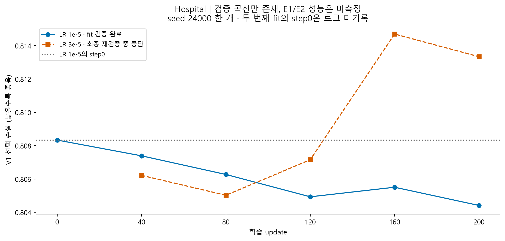
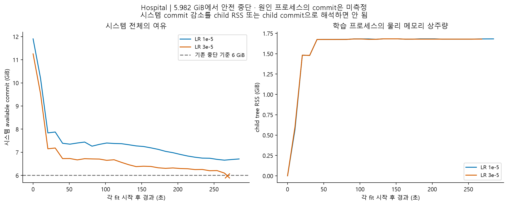

# Hospital 파일럿: 사용자 중지 요청 시점의 상태

> 최신 상태: 이후 사용자 재개 요청으로 실험을 완료했다. [최종 결과](24_hospital_results_20260910.md)를 우선하며 아래는 당시 기록이다.

2026-09-10. **PAUSED_BY_USER / INCOMPLETE.** 확인 시점에 프로젝트 학습·runner 프로세스가 없어 종료 명령은 보내지 않았다. 새 학습·추론·자동 재시도는 실행하지 않는다. 기존 실패 기록과 가중치는 유지한다.

[착수 기록](24_hospital_shared_strength_plan_20260909.md) · [결과와 그래프 요약](../research_review_20260910/README.md) · [개선·재개 조건](../research_review_20260910/next_steps.md).

## 실제 상태

```text
원 run     S0 attempt01/02 자원 중단 기록 보존
run2 S0    attempt01 완료; 모델 step0·업데이트·replay 검사 통과
fit 1      seed24000 / LR1e-5: 200 update + checkpoint replay + receipt 완료
fit 2      seed24000 / LR3e-5: 200 update 기록 있음; 마지막 replay 중 안전 중단
fit 3/4    seed24001 / 두 LR: 미실행
V1 선택    네 fit이 미완료이므로 LR 최종 선택 미실행
V2 alpha   미실행
E1/E2      미실행
최종 감사  미실행; completed.json 없음
```

현재 본 fit 완료율은 **1/4**다. 두 번째 fit에 adapter tensor 파일이 있더라도 검증 영수증 없는 산출물이며 완료로 승격하지 않는다. 저장 형식은 adapter-only이므로 exact optimizer/RNG resume와 다르다.



검증 완료 fit의 V1은 0.808339→0.804416으로 낮아졌다. 검증 성능만으로 LoRA의 E 이득, 계열별 강도 선택의 효용 또는 논문 가치를 판단하지 않는다. 첫 fit의 checkpoint는 step200이며 optimizer 표본에 포함된 계열은 685/767이다.

## 중단 근거

2026-09-10 00:30:53 KST, guard `available_commit_below_limit`; worker도 `Available Windows commit < 6 GiB`를 기록했다. 마지막 표본은 commit 여유 5.9816 GiB, RAM 여유 9.0293 GiB, child RSS 1.6795 GiB다. 수치·상태·오류 traceback은 [추출 스냅샷](../research_review_20260910/evidence/hospital_partial_snapshot.json), 시계열은 [CSV](../research_review_20260910/evidence/hospital_resource_samples.csv)에 보존했다.



이 중단 사유는 확인됐다. 하지만 시스템 commit 감소를 child의 commit 소비로 직접 귀속할 수 없고 과거 PC 프리즈 원인도 이 로그만으로 확정되지 않는다. 이전 history의 peak 추정에는 이 한계를 적용한다.

## 원 산출물과 재개 경계

- 원 run: `runs/hospital_shared_strength_v1_run/`
- 현재 run: `runs/hospital_shared_strength_v1_run2/`
- 원 runner 로그: `runs/hospital_shared_strength_v1_run2_pilot.log`
- 고정 계약: `runs/hospital_shared_strength_v1_run2/run_contract.json`
- 실패 fit: `stages/fit_s0_lr1/attempt_01/`의 `output/failure.json`, `guard/safety_stop.json`, `output/fit/progress.jsonl`

위 경로는 저장소 루트 기준이며 `runs/`는 Git 제외 대상이다. 최신 상태를 GitHub에서 읽을 수 있도록 필요한 작은 JSON/CSV만 문서 evidence에 추출했다. 원 run의 삭제·이동·변조는 하지 않았다.

재개 시에는 이 중지 요청 이후의 새 실행 요청이 필요하다. 자원 조건, 작업별 attempt 한도, 계약·입력 hash 및 성공 receipt를 다시 확인해야 한다. 이번 문서에 재개 명령을 실행 대기 상태로 등록하지 않았다.
