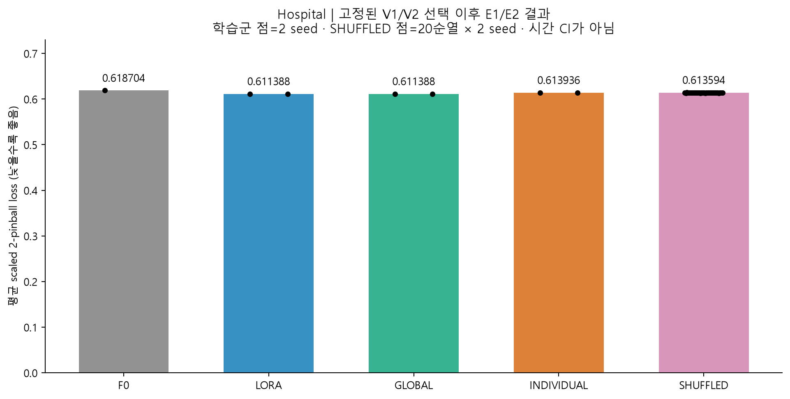
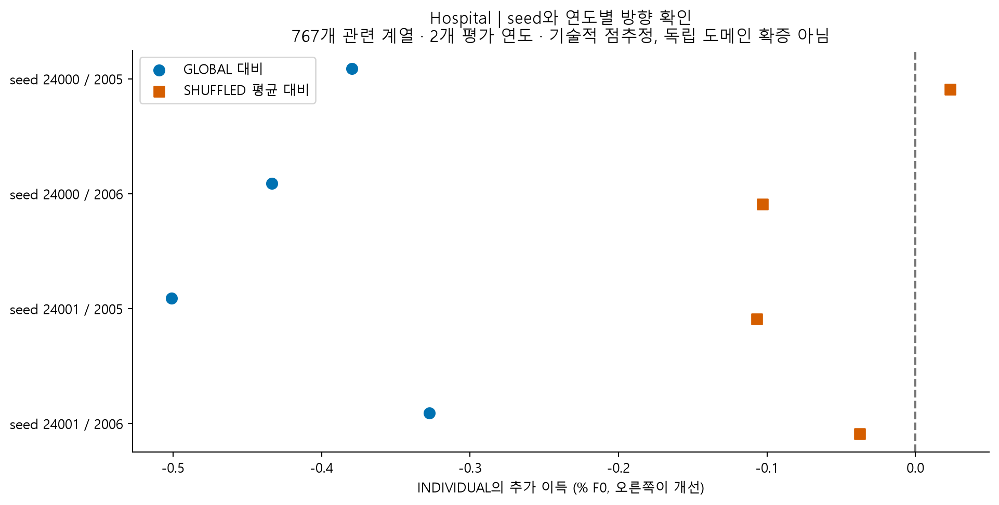
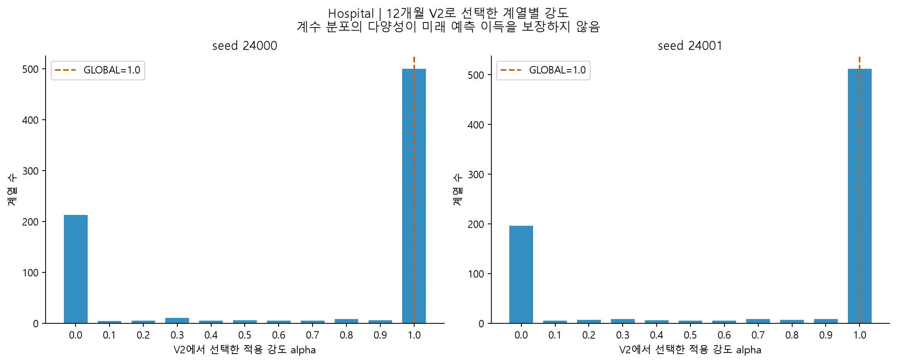

# Hospital 완료 결과: 공유 LoRA는 개선, 개별 적용 강도는 추가 이득 없음

2026-09-10. **본 4 fits, V1/V2 선택, E1/E2 평가, 독립 수치 감사를 완료했다.** [재개 전 중단 기록](24_hospital_pause_status_20260910.md)은 당시 상태로 보존한다. 새 방법을 입증한 실험은 아니며 추가 실험은 자동 실행하지 않는다.

## 1. 결론

[확인] 표준 shared LoRA는 F0 대비 주손실을 **1.183%** 줄였다. 하지만 V2에서 직접 고른 계열별 강도 INDIVIDUAL은 공통 강도 GLOBAL보다 **0.412%F0 나빴다**. GLOBAL은 두 seed 모두 alpha=1을 골라 표준 LoRA와 정확히 같은 예측이었다.

따라서 “LoRA 자체가 실패했다”는 결론은 틀리다. 이번에 추가 효용을 확보하지 못한 것은 **계열별 12개월 V2로 각각 alpha를 직접 선택하는 절차**다. 공유 적응의 모든 이질성이나 모든 선택 규칙을 반증하지 않는다.

## 2. 고정된 실험

- Hospital 767계열 × 84개월. Train 2000–2002, V1 2003, V2 2004, E1 2005/E2 2006, horizon12. 767개를 독립 병원·도메인 수로 세지 않는다.
- Chronos-2 revision `29ec3766d36d6f73f0696f85560a422f50e8498c`, rank8 shared LoRA 1,206,912계수. 서로 다른 계열을 하나의 multivariate group으로 섞지 않는다.
- LR {1e-5,3e-5} × seed {24000,24001}, 각 200 updates. 기존 완료 fit 1개를 재사용하고 중단 fit의 허용된 attempt02 및 미실행 fit 2개만 실행했다.
- V1의 두 seed 평균으로 LR1e-5 선택, 각 seed의 checkpoint는 둘 다 step200. LR와 step 모두 경계이므로 최적 성능/수렴을 확보했다고 주장하지 않는다.
- V2에서 GLOBAL 1계수 또는 INDIVIDUAL 767계수를 선택. alpha∈{0,.1,…,1}, 고정 규칙·동점 처리 유지. SHUFFLED는 동일한 alpha 분포의 계열 대응만 20번 교환했다.
- E를 보고 LR/강도/seed/순열을 다시 고르지 않았다. Seed별 손실 평균이며 예측 ensemble이 아니다.

## 3. 최종 점수

주지표는 scale로 정규화한 mean 2-pinball loss다. 낮을수록 좋다. 개선율은 F0 손실을 분모로 계산한다.

```text
방법             E 손실       F0 대비 감소
F0               0.618704       —
계절성 참조      0.807973      -30.591%
LORA             0.611388       +1.183%
GLOBAL           0.611388       +1.183%
INDIVIDUAL       0.613936       +0.771%
```



막대는 평균, 학습군 점은 2 seed, SHUFFLED 점은 20순열×2 seed다. CI가 아니며 계절성 참조는 위 수치로 별도 보고했다.

```text
INDIVIDUAL의 GLOBAL 대비 추가 이득       -0.411890 %F0
INDIVIDUAL의 SHUFFLED 평균 대비 이득     -0.055366 %F0
조건부 계열 재표집 기술적 95% 범위        [-0.517438, -0.311916] %F0
```

2,000회 계열 재표집 범위는 기술적 요약이다. 계열 간 의존성·공통 연도 충격·HPO·훈련자료 불확실성을 다루지 않는다. 독립 도메인 확증 CI 또는 정당한 permutation p-value로 제시하지 않는다.



GLOBAL 대비 효과는 seed24000에서 −0.380/−0.433%F0(2005/2006), seed24001에서 −0.501/−0.328%F0다. **4개 조합 모두 음수**다. SHUFFLED 대비는 한 조합만 미세한 양수, 나머지는 음수로 계열 대응의 유용한 신호를 확보하지 못했다. 원 flags의 `SEED_SIGN_NOT_UNANIMOUS`는 코드상 ‘두 seed 모두 양수가 아님’을 뜻한다. 이번 두 seed의 주효과 부호가 서로 다르다는 뜻은 아니다.

## 4. 무엇을 배웠나



GLOBAL은 두 seed 모두 LoRA를 전부 적용하는 alpha1을 골랐다. 개별 선택은 대체로 alpha0 또는1에 몰렸다. [추정] 제한된 V2의 선택 잡음이나 V→E 전이가 평균 이득을 손상시켰을 수 있다. 경계에 몰린 histogram만으로 과적합의 원인을 확정하지 않는다. 평균 SHUFFLED보다도 좋지 않았다는 결과는 ‘계열 대응을 알아서 이득을 얻었다’는 설명에 부합하지 않는다.

INDIVIDUAL이 F0보다 나쁜 계열 비율은 seed별 약17.47/20.21%, GLOBAL보다 나쁜 비율은24.77/23.21%였다. 이는 두 E 창의 평균 손실 기준 관측 비율이며 잠재적인 인과 피해 확률이 아니다. alpha1이면 GLOBAL과 같은 계열도 많으므로 ‘손해가 아닌 나머지는 모두 개선’으로 읽지 않는다.

분포 품질은 주손실과 함께 본다. 80% coverage는 F0 81.20%, LoRA/GLOBAL 78.88%, INDIVIDUAL 79.52%다. 폭은 각각2.9421/2.7475/2.8061이다. INDIVIDUAL의 coverage가80%에 더 가깝더라도 proper score가 나쁜 사실을 보조 지표로 덮지 않는다.

**후속 판단:** 현재 직접 개별 선택 분기는 닫고 표준 shared LoRA를 대조로 유지한다. 복잡한 gate·cluster adapter나 새로운 loss를 바로 추가할 근거는 부족하다. [앞서 적은 수축 후보](../research_review_20260910/next_steps.md)는 여전히 미실행 가설이며 이번 결과가 그 방법의 성공을 예고하지 않는다. 이를 다시 열려면 독립 개발 구간에서 선택 잡음과 시간 전이를 구분하고 단일 공통 축소를 넘는 필요성을 먼저 보여야 한다. 같은 E에서 lambda sweep을 이어가지 않는다.

## 5. 재개·메모리·비용

앱 정리 전 commit 여유는 약9.5~10.1 GiB였다. 사용자의 종료 승인 후 Claude/VS Code/Steam/Slack/Epic 및 일부 부가 UI를 닫았다. 파일 삭제, pagefile·드라이버·보안 설정 변경은 하지 않았다.

원 kit와 guard의 소스는 유지했다. 외부 실행 관리 스크립트가 GPU 작업 직전에 available commit13 GiB를 연속 두 표본으로 확인한 뒤 job을 넘겼다. 대기 중에는 attempt 디렉터리를 만들지 않으며 실행 중 원 commit6 GiB 안전 기준을 유지했다. 처음의 제어부 import 전 검사만으로는 충분하지 않았다. 제어부 자체가 private 약2.48 GiB를 점유해 실제 GPU 작업 직전에 다시 확인해야 했다.

- 재개 첫 GPU 작업: **14:50:35 KST**. 이번 runner invocation **544.5초(9분4.5초)**에는 제어부 preflight 이후 대기가 포함된다. 최초 앱 정리·모니터 진입 대기·독립 감사·문서 작업은 별도다.
- 새 본 fit 3개 guard 시간:115.421/123.516/121.391초. 기존 첫 fit288.734초는 재실행하지 않았다. 속도 차이를 앱 종료의 단독 인과 효과로 확정하지 않는다.
- V2/E forecast 내부 시간:30.178/52.183초. 각각 F0와 선택된 LoRA 두 개의 별도 모델 통과이며 한 번의 배포 추론 지연으로 해석하지 않는다. 예측 결합에는 F0와 적응 모델 두 예측이 필요하다.
- 이번 새 stage8개 모두 정상 완료. GPU를 쓰는 것은3 fits+2 forecast stages다. **새 안전 중단0회**. 원 run과 run2의 과거 실패도 보존했다.
- 새 stage의 저장 표본 기준 최소 commit8.735 GiB, 최대 GPU1,580 MiB. 소유 프로세스의 최대 관측 Python private memory4.573 GiB. RSS와 private commit을 구분한다.
- 원 run의 S0 시도와 run2 전체 stage guard 합계1,068.186초. 데이터 export/prepare, 최초 진입 대기 및 별도 감사/문서 비용은 제외한 범위다.
- 종료 후 프로젝트 학습 프로세스 없음. 측정 시 commit 여유14.615 GiB. 재개부터 최종 조회까지 Application1000/1001, nvlddmkm, Display4101, WHEA, 자원고갈2004는 조회 오류 없이0건이었다. [조회 범위](../../../../results/hospital_shared_strength_v1/windows_events.json).

## 6. 검증과 산출물

원 독립 NumPy 감사가 V2 GLOBAL/INDIVIDUAL 선택과 E 점수48행을 재계산했다. 점수 최대 차이1.11e−16, 주효과도 일치했다. 문서용 별도 추출에서는 receipt10개 및 보호 파일 hash를 확인하고,3,068행 CSV에서 주효과를 다시 계산해 차이1.38e−14였다. 모델을 추가 학습해 얻은 값이 아니다.

문서용 exporter 첫 실행은 CPU-only guard 로그의 GPU 필드가 null인 경우를 처리하지 못해 실패했다. null을 미측정으로 처리하도록 exporter만 수정한 뒤4.078초/exit0으로 재실행했다. 원 학습·예측·독립 감사 결과에는 변경이 없고 실패 로그도 monitor의 report_guard에 보존했다. ‘새 실험 안전 중단0’과 ‘문서 도구 오류1회’를 구분한다.

- [원본과 동일한 summary](../../../../results/hospital_shared_strength_v1/summary.json), [48행 metrics](../../../../results/hospital_shared_strength_v1/metrics.csv), [3,068행 계열 결과](../../../../results/hospital_shared_strength_v1/series_effects.csv).
- [독립 감사](../../../../results/hospital_shared_strength_v1/independent_audit.json), [수치·출처 검증](../../../../results/hospital_shared_strength_v1/publication_verification.json), [실행 비용·과거 실패 포함](../../../../results/hospital_shared_strength_v1/execution_summary.json).
- [모델 선택](../../../../results/hospital_shared_strength_v1/selected.json), [강도 선택](../../../../results/hospital_shared_strength_v1/policies.json), [연도별 효과](../../../../results/hospital_shared_strength_v1/seed_year_effects.json), [그림 PNG/SVG](../../../../results/hospital_shared_strength_v1/figures/).
- 원 run: `runs/hospital_shared_strength_v1_run2/`. 원 예측·체크포인트·run은 기존 Git 제외 정책대로 로컬에 있으며 작은 결과 파일은 위 results 폴더로 보존했다. commit/push는 하지 않았다.
