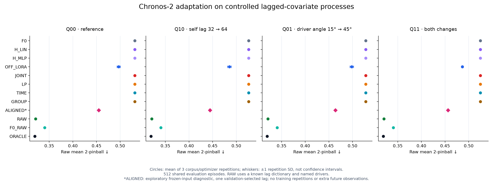
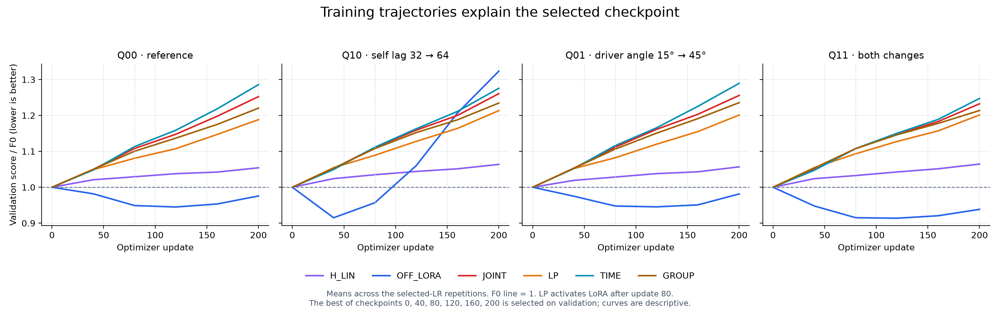

# 통제 PEFT 실험 결과와 방법론 주제 판단

2026-09-08. [실행 계획](08_peft_shift_mechanism_plan_20260908.md)과 [탐색적 진단 추가 계획](08_peft_shift_mechanism_diagnostic_addendum_20260908.md)에 따른 결과다. 기존 [실데이터 S1](04_peft_adaptation_scope_s1_results_20260908.md) 및 [출력부 투영 후보의 중단 판단](07_head_complement_method_gate_results_20260908.md)은 보존했다.

**[확인] 본실험 124개가 67분 53초에 모두 정상 종료됐고, 최종 비교 132행의 점수·입력·선택·소스 검증이 통과했다. 일반 LoRA는 네 조건 모두 개선됐다. 그러나 새 head를 포함한 여섯 절차는 모두 학습 전 상태로 돌아갔으며, 추가 학습 없는 입력 정렬이 일반 LoRA 평균보다 낮은 평가 점수를 냈다. 알려진 지연 사전을 가진 단순 회귀는 생성식 기반 oracle에 거의 도달했다.**

따라서 “PEFT가 전부 실패했다”는 결론은 틀리다. 또한 이번 결과로 time/group 위치 선택의 새 방법을 제안할 근거도 확보하지 못했다. 남길 문제 정의는 **“이미 관측한 과거 공변량의 예측 정보를 현재 TSFM 적응 경로가 충분히 회수하지 못하는 조건”**이다. 이 문제에 새 PEFT가 꼭 필요한지는 아직 입증되지 않았다.

## 1. 무엇을 비교했는가

Chronos-2의 동일한 원본 checkpoint를 네 조건에 각각 적응시켰다. Q00을 실제 사전학습 분포라고 가정하지 않는다. Train과 validation/evaluation은 각 조건 안에서 같은 생성법을 사용하므로, 이 실험을 적응 후 분포 이동이나 망각 검사라고 부르지 않는다.

```text
조건   자기지연 s   driver 각도 θ   바꾼 항
Q00    32           15°             기준
Q10    64           15°             자기지연
Q01    32           45°             보조변수 결합 방향
Q11    64           45°             두 항

Y[t] = .5Y[t−s] + sqrt(.39){cosθ U[t−48] + sinθ V[t−48]} + .6ε[t]
```

입력은 Y/U/V의 과거256, 목표는 Y의 미래16이다. 필요한 lag는 모두 과거에 있으며 원본 미래 U/V는 입력하지 않는다. 독립 train episode64개를 가진 corpus3개, 별도 validation128/evaluation512개를 사용했다. Validation/evaluation은 corpus 사이 공유하고, 조건 사이 같은 난수 충격을 사용한다. 세 반복은 train 데이터와 optimizer seed가 함께 바뀌며 각각의 분산을 분리하지 않는다.

200 updates, effective batch8/micro4 groups, Y-only native quantile loss, BF16 cache-disabled 조건이다. Corpus0에서 LR 두 후보를 validation으로 선택하고 corpus1/2에서 고정했다. 체크포인트는 0/40/80/120/160/200 중 validation 최소값을 실제 복구했다.

```text
방법        내용                                             학습 파라미터
F0          원본 동결 모델                                   0
H_LIN       동결 특징에 새 선형 residual head                 258,384
H_MLP       동결 특징에 새 MLP residual head                  589,301
OFF_LORA    time/group qkvo + native output projection r8     1,206,912
JOINT       time/group qkvo r4 + H_LIN                        848,208
LP          같은 JOINT 구조, head80 → joint120 updates        848,208
TIME        time qkvo r8 + H_LIN                              848,208
GROUP       group qkvo r8 + H_LIN                             848,208
RAW         이름이 있는 Y/U/V × lag{32,48,64} 9-feature ridge
F0_RAW      F0 median에 같은 9-feature 선형 잔차 보정
ORACLE      참 생성계수와 Gaussian 잡음 분포
```

TIME/GROUP/JOINT의 attention LoRA 예산은 동일하다. OFF_LORA는 더 큰 예산에 다른 출력층 갱신을 포함하므로 위치만 바꾼 대조가 아니다. JOINT/LP/TIME/GROUP의 새 head LR은1e-3으로 고정했다. RAW는 train episode 단위4-fold OOF 잔차로 분위수 offset을 추정하고 alpha를 validation으로 선택했다. 같은1024개 미래 Y label을 사용하며, 과거 Y를 추가 학습 label로 쓰지 않았다. RAW에는 참 지연을 포함하는 사전과 변수 이름이 주어진다.

## 2. 최종 평가 결과

점수는 raw mean **2-pinball**, 작을수록 좋다. 표의 학습 방법은 세 corpus 평균이다. F0와 oracle의 세 행은 공유 평가 표본에 대한 같은 예측이며 독립 반복 증거가 아니다. ALIGNED는 추가 계획의 동결 입력 진단 한 번이다.

```text
조건   F0/새 head 계열   OFF_LORA   ALIGNED*   RAW        F0_RAW     ORACLE
Q00    0.531068          0.496737   0.454828   0.321088   0.340533   0.319528
Q10    0.525933          0.485210   0.444394   0.321093   0.340465   0.319528
Q01    0.528097          0.498333   0.463806   0.321019   0.340542   0.319528
Q11    0.524772          0.486727   0.456206   0.320889   0.340634   0.319528
```

“새 head 계열”은 H_LIN/H_MLP/JOINT/LP/TIME/GROUP이다. 최종 선택72개 전부 step0였고, 저장된 전체 evaluation 예측이 F0와 bitwise 같음을 확인했다. 순수 head24개, head+LoRA48개다. 선택되지 않은 checkpoint의 검증 성능 악화와, early stopping을 포함한 최종 절차가 F0를 유지한 사실을 구분한다.



OFF_LORA의 선택 head 대비 효과 Δ=(S_H−S_OFF)/S_F0는 다음과 같다. 이번에는 H=H_LIN=F0라 F0 대비 상대 개선율과 같다.

```text
조건   개선율    98.75% paired CI     corpus0 / corpus1 / corpus2
Q00    +6.46%    [+5.19%, +7.68%]     +5.91% / +6.30% / +7.19%
Q10    +7.74%    [+6.57%, +8.89%]     +8.58% / +7.67% / +6.98%
Q01    +5.64%    [+4.28%, +6.90%]     +4.85% / +6.24% / +5.82%
Q11    +7.25%    [+5.91%, +8.62%]     +7.10% / +7.10% / +7.55%
```

네 조건 모두 운영 문턱1%를 넘었다. CI는 같은512개 episode를4000회 paired 재표집하고 네 조건 가족에 Bonferroni 보정한 것이다. **현재 학습된 세 모델에 조건부**이며 train corpus·초기화·validation 선택의 전체 불확실성을 포함하지 않는다. 세 반복의 방향 일치는 확인했지만 이를 모든 데이터·백본에 일반화하지 않는다.

RAW−OFF 대비는 F0 점수의 −31.20%~−33.58%로 RAW가 우세했고, 별도 네 조건 가족의98.75% CI 모두0 아래였다. 이 퍼센트의 분모는 OFF가 아니라 F0다. RAW의 oracle 평균에 대한 MSE는0.002406~0.002635였고, 점수는 oracle보다 약0.43~0.49% 높았다. 생성식이 9-feature 선형 클래스 안에 있다는 강한 이점이 있으므로 공정한 일반 TSFM 우열 순위로 해석하지 않는다.

Oracle 점수가 모든 조건에서 같은 것은 공통 난수와 동일한 참 잔차 분포의 결과다. 이 점수는 유한 표본에서 모든 모델이 반드시 넘을 수 없는 경험적 하한은 아니다. 수학적으로 도출한 모집단 기대 점수는 `mean_q 2×.6×φ(Φ⁻¹(q))=0.324102`다.

## 3. 처음의 가설에서 무엇이 남았는가

**적응의 추가 효용은 확인됐다. 내부 attention의 필수성은 확인되지 않았다.** OFF에는 native 출력 projection의 LoRA도 포함된다. 새 선형/MLP head와는 특징·갱신 형태·예산이 다르므로 OFF의 이득을 temporal attention에 귀속할 수 없다. RAW가 같은 입력값에서 더 잘 예측한다는 결과 역시 내부 PEFT 필요성의 증거가 아니다.

**Time/group 위치×변화 가설은 판별하지 못했다.** TIME−GROUP, 각도·자기지연 interaction, JOINT−LP는 모두0이고 CI도[0,0]이다. 이는 모두 F0를 선택해서 생긴 결과다. 역할이 같다는 정밀한 동등성 증거가 아니다. 새 head의 LR/정규화/용량이 위치 비교를 가렸을 가능성이 있지만, head LR이 직접 원인이라고 확정하지 않는다. Head 없는 위치 대조를 실행하지 않았다.

**단순히 학습을 늘리는 방향은 현재 곡선과 맞지 않는다.** 선택된 OFF checkpoint는40~120이고, 전체124개 실행에서 step200 선택은0건이다. 새 head 계열은 관측한 검증 지점에서 악화했고, Q10 OFF도 초기에 좋아졌다가 크게 악화했다. 첫 검증이40이므로 그 이전의 짧은 개선은 배제할 수 없다. 서로 다른 minibatch의 normalized train loss와 raw validation loss를 빼서 과적합 크기로 제시하지 않는다.



**출력 예측의 성분 진단은 다음 문제를 좁히는 단서다.** Median 예측을 참 조건부 평균의 자기지연/U/V 성분에 선형 투영했다. 이상적인 oracle 계수는 각각1이다.

```text
조건   OFF 자기지연 성분   OFF U 성분   OFF V 성분
Q00    0.838              0.0128       0.0104
Q10    0.902              0.0098       0.0039
Q01    0.828              0.0099       0.0103
Q11    1.029              0.0104      −0.0032
```

표는 조건별 corpus 평균이다. F0 자기지연 계수는0.143~0.166이었다. [추정] OFF는 자기지연 신호를 더 잘 반영하면서 공변량의 참 선형 성분은 적게 반영하는 패턴이다. **공변량을 전혀 사용하지 않는다거나 hidden에 정보가 없다는 증명은 아니다.** OLS 출력 분해로 모듈의 인과 기능을 식별할 수도 없다.

확률예측의 모든 측면이 좋아진 것도 아니다. OFF의 평균80% 구간 coverage는76.24~77.60%로, F0의79.60~80.33%보다 nominal80%에서 멀어졌다. Pinball/MSE 개선과 coverage 변화를 함께 기록한다. 이것만으로 새로운 calibration/보존 기법의 필요성을 주장하지 않는다.

F0_RAW가 RAW보다 나쁜 것도 FM이 무용하다는 증거는 아니다. F0_RAW는 F0의 계수가1로 고정돼 있고, 제한된 선형 잔차 회귀가 F0의 비선형 성분을 제거하지 못할 수 있다. 두 가설 클래스는 단순한 포함 관계가 아니다.

## 4. 학습 없는 입력 정렬이 보여준 것

원본 과거만 사용해 U/V를 후보 지연32/48/64만큼 정렬했다. 정렬된 과거의 첫 지연 길이는 결측으로 표시하고, 정렬된 미래 구간은 **원본 시점에서는 이미 관측된 과거 값**으로 채웠다. Y 과거는 유지하고 Y 미래는 마스킹했다. 네 조건의 validation128에서 각각48이 선택됐으며, 선택 JSON을 저장한 뒤 정렬 진단의 evaluation을 처음 실행했다.

```text
조건   F0 대비 개선   98.75% paired CI
Q00    +14.36%       [+12.97%, +15.79%]
Q10    +15.50%       [+14.18%, +16.87%]
Q01    +12.17%       [+10.84%, +13.46%]
Q11    +13.07%       [+11.71%, +14.40%]
```

[확인] Optimizer update0, 추가 원본 미래 관측0, native F0 재현 차이0이었다. Guard28.33초, 모델 측26.0초에 끝났다. 점수는 OFF 평균보다 낮았지만, 위 CI가 검정하는 비교는 **ALIGNED 대 F0**다. RAW와 oracle까지의 큰 격차는 남는다. 정확한 결론은 “정보 표현을 바꿔 부분적으로 회수 가능한 성능이 있었다”이다.

지연 후보는 생성식을 아는 사람이 구성했고 참48을 포함한다. 또한 정렬·초기 결측·과거 관측 축소·정규화·미래 공변량 경로 활성화가 동시에 바뀐다. 이 결과로 group attention 하나의 원인을 확정하지 않는다. 동결 모델과 evaluation이 corpus 사이 같으므로 이 진단에는 세 독립 학습 반복이 없다.

순열 대칭성도 별도로 확인했다. Train 첫4개에서 U/V 순서를 바꿀 때 FP32 normalized 최대 차이4.77e-7/raw1.19e-6, BF16 raw 최대0.04043이었다. 아키텍처의 수학적 순열 불변성과 유한 정밀도 차이를 구분한다. Y 과거와 driver 관계로 역할을 추론할 수 있으므로 채널 ID 부재만으로 큰 오차의 원인이나 분포상 불식별을 단정하지 않는다. [Chronos-2 원문](https://arxiv.org/html/2510.15821v1).

## 5. ML 논문 주제로 어떻게 판단하는가

현재 단계에서 **“변화 유형에 따라 time/group LoRA를 자동 선택하는 새 방법”은 보류한다.** 위치 차이를 입증하지 못했고, 비교 절차의 head 문제가 섞여 있다. 연구 축은 PEFT(5)를 중심에 두되, 표현(2)과 추론(6)의 더 간단한 변경이 같은 문제를 해결하는지 확인하는 방향이 맞다.

작업용 문제 문장은 다음 정도로 좁힐 수 있다.

> 소량의 target 데이터에서 native multivariate TSFM을 적응시킬 때, 이미 관측한 과거 공변량의 예측 신호가 최종 출력에 충분히 반영되지 않는 조건은 무엇이며, 기존 입력 정렬·출력 갱신보다 나은 적응 규칙이 필요한가?

이 문장은 **검증할 문제 정의**이며 새 알고리즘의 기여나 논문 완성을 뜻하지 않는다. 일반 LoRA가 나쁘다는 전제, attention의 표현 능력이 부족하다는 전제, 합성의 차이가 실세계에서도 크다는 전제를 넣지 않는다.

지연 정렬 자체를 새 방법으로 제안하는 것도 근거가 약하다. [LIFT, ICLR2024](https://proceedings.iclr.cc/paper_files/paper/2024/file/b52b07a239a7afa155ca25cf17a55074-Paper-Conference.pdf)는 lead 추정·target 지향 정렬·frozen backbone의 refinement를 이미 다룬다. [ChronosX](https://arxiv.org/html/2503.12107v1)는 frozen pretrained model에 과거/미래 공변량을 주입하는 adapter를 다룬다. 이번 ALIGNED는 이들 논문의 직접 재현이나 우열 검증이 아니다. Time-PEFT의 채널별 갱신과 frequency adapter도 가까운 비교지만, 이번 회차의 확인 범위는 공개 코드/초록이며 전문 독해로 확대해 표현하지 않는다. [확인한 코드 revision](https://github.com/kaist-dmlab/TimePEFT/blob/ea4e7e1887bb35587bab7ea93e2af3685ac55852/run.py).

다음 실험을 정한다면 대규모 adapter 탐색보다 **Q00 한 조건에서 native 출력층을 유지한 모듈 삭제 대조**가 우선이다. OFF의 출력 projection LoRA만 남긴 경우와 attention LoRA만 남긴 경우를 원 OFF와 비교하면, 이번 개선이 어느 경로에 의존하는지 더 직접적으로 묻는다. 이는 모듈 삭제 진단이며 동일 파라미터 예산의 방법 대결은 아니다. 이 대조는 이번 회차에 실행하지 않았다.

그 다음에도 방법 개발을 진행하려면 최소한 다음 문턱이 필요하다.

1. 참 지연을 포함한 작은 사전 대신 train-only lag search 등으로 사전지식 이점을 줄여도 단순 baseline이 구조를 회수하는지 확인한다. 특정 baseline의 실패만으로 문제의 불식별을 선언하지 않는다.
2. 같은 정보 조건의 기존 지연 정렬, native 출력 갱신, 적절한 LR/early stopping보다 반복적인 실패가 남는지 확인한다. 단순한 수정으로 해결되면 그 조건에서 새 PEFT 설계를 중단한다.
3. 남은 실패를 해결하는 최소 규칙을 제시하고, 비용을 포함한 비교·규칙 제거 대조·새 train/evaluation 표본·다른 backbone·실데이터 또는 반합성 유보 원천에서 확인한다. 새로운 이름이나 모듈을 붙였다는 사실만으로 기여를 삼지 않는다.

이번 결과는 실패 조건을 진단한 연구 자료로는 유용하지만, **현재 한 backbone·한 Gaussian 생성 family·세 학습 반복만으로 새로운 PEFT 방법론 논문을 완성했다고 보기는 어렵다.** B/C 후보가 자동으로 검증된 것도 아니다. 여기서 발견한 성능 차이를 기존 풀이로 해결할 수 있는지 먼저 확인하는 것이 불필요한 새 방법 개발을 줄인다.

## 6. 실행·안전·재현 확인

- [확인] 본학습112 fit + F0/cache12 =124/124, 10:21:19~11:29:12 KST, wall4073.25초. Guard 시간 합4071.49초, 각 trial 내부 시간 합3692.14초. 선택/HPO 비용을 합친 값이며 GPU kernel 시간과 같지 않다.
- [확인] Source/plan/data12개/manifest hash, 정확한 trial·선택 key, validation LR argmin과 추가 반복의 고정 LR, 예측에서 재계산한 점수, step0/F0 동일성 검증 통과. S0에서 동결 보존·그룹/target 격리·LP phase·checkpoint 복구를 확인했다. CPU 데이터4/RAW3/trainer5/추가 입력 진단7 검사 통과.
- [확인] 본실행 자원 표본427개: 여유 RAM 최소15.16GiB, commit 최소14.08GiB, child RSS 최대1.75GiB, Git 최대2개, GPU 메모리 최대2276MiB, 온도 최대58°C. Torch peak allocated 최대0.8323GiB. 정상 로그10초 간격의 표본이며 순간 시스템 peak를 보장하지 않는다.
- [확인] Precision guard8.16초, alignment28.33초, analysis6.08초 모두 exit0. 11:32:04의 Windows 조회에서 본학습 시작 이후 Application1000 및 대상 System NVIDIA/Display/resource/Kernel-Power 이벤트0건. 향후 OS/드라이버 무장애를 보장하는 결과는 아니다.
- [확인] PNG 두 개를 실제 열어 축·범례·표시를 확인했다. PDF 두 개도 생성했다. 기존 S1 소스와 결과, 원 실행 계획을 유지했고 드라이버·Defender·무관한 프로세스는 변경하지 않았다. Commit/push 없음.

원자료: [선택 결과 CSV](../../../results/peft_shift_mechanism_v1/selected_results.csv), [효과와 조건부 CI](../../../results/peft_shift_mechanism_v1/effects.json), [수치 검증](../../../results/peft_shift_mechanism_v1/verification.json), [입력 진단](../../../results/peft_shift_mechanism_v1/alignment_diagnostic/result.json), [정밀도 진단](../../../results/peft_shift_mechanism_v1/precision_diagnostic.json), [비용](../../../results/peft_shift_mechanism_v1/costs.json), [자원 표본 요약](../../../results/peft_shift_mechanism_v1/resource_summary.json), [Windows 조회](../../../results/peft_shift_mechanism_v1/windows_event_audit.json). 큰 예측·가중치·로그는 ignored runs에 남겼다. 재현 명령은 [README](../../../experiments/peft_shift_mechanism_v1/README.md)에 있다.
