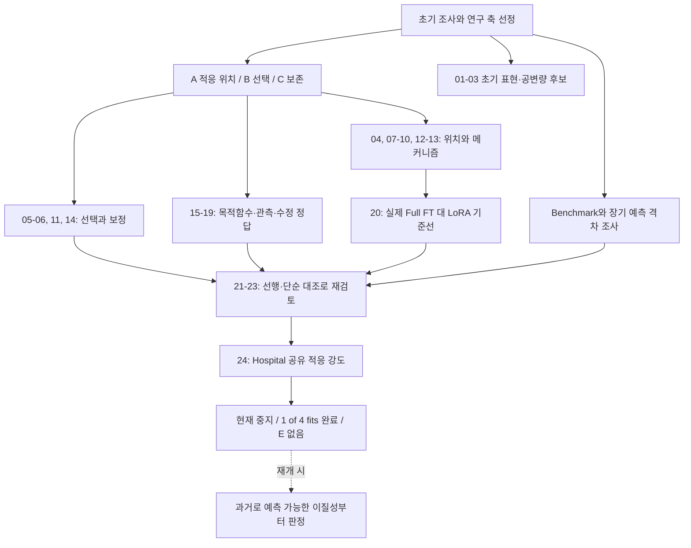
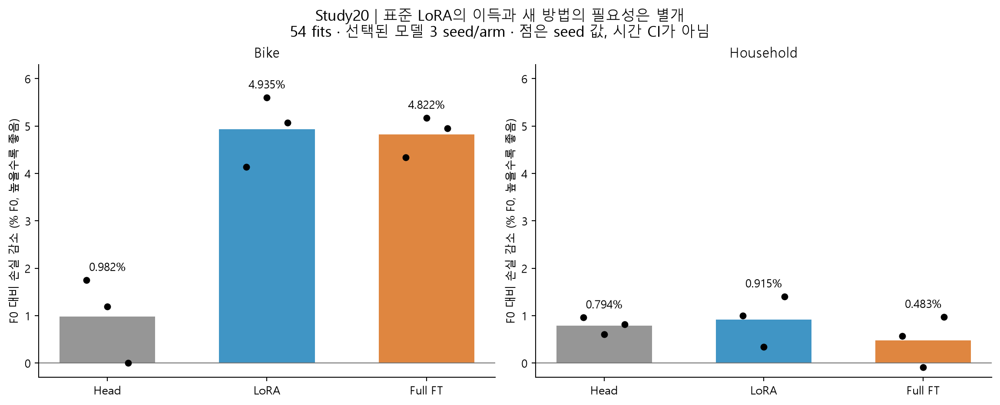
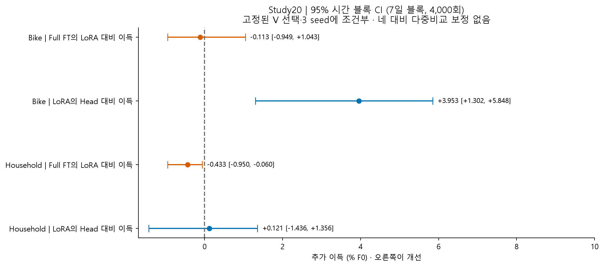
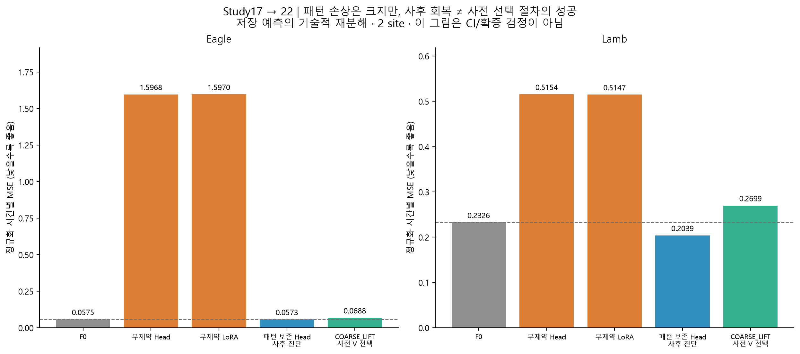
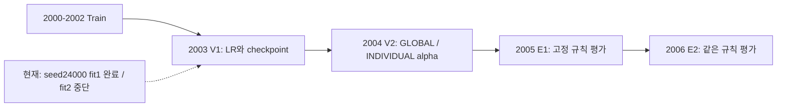

# 시계열 Foundation Model PEFT: 과정·결과·중단 시점 정리

> 이 문서는 재개 전 스냅샷이다. 이후 사용자 요청으로 Hospital을 완료했다. [최종 결과와 후속 판단](../08_hospital_shared_strength/24_hospital_results_20260910.md)이 현재 상태다. 과거 미완료 그림을 다시 생성하려고 build_review.py를 재실행하지 않는다.

작성: 2026-09-10. 저장된 결과·로그에 근거한 회고이며 이번 작업의 새 학습·모델 추론은 0회다. [전체 원문 목록](../README.md) · [개선 방향](next_steps.md) · [Hospital 상태](../08_hospital_shared_strength/24_hospital_pause_status_20260910.md).

## 1. 현재 결론

**표준 PEFT의 효용은 관측했지만, 새 PEFT 방법의 필요성과 추가 성능을 함께 입증하지 못했다.** 최신 Hospital은 실행 미완료이므로 양성·음성 어느 쪽으로도 판정할 수 없다.

- [확인] Study20에서 표준 LoRA의 F0 대비 손실 감소는 Bike 4.935%, Household 0.915%였다. Full FT가 LoRA를 넘어서는 정확도 여유는 이 제한된 비교에서 확인되지 않았다.
- [확인] Study17은 월합 감독으로 시간별 패턴이 손상되는 구체적인 현상을 보여줬다. 다만 사후 패턴 보존 계산의 회복을 새 학습 방법이나 사전 선택 절차의 성공으로 부를 수 없다.
- [확인] Hospital `_run2`는 S0 및 본 fit 1개 완료, fit 2는 최종 재검증 도중 안전 중단, 나머지 2개 미착수다. V2 선택·E1/E2·독립 최종 감사는 아직 없다.
- [추정] 다음으로 좁힐 수 있는 질문은 **공유 적응의 계열별 이득이 과거 자료로 예측 가능한가, 그 선택 잡음을 이기는 규칙이 필요한가**다. 현재는 필요성을 검사하는 단계다.

“전부 실패했다”는 표현은 서로 다른 상태를 섞는다. 실행 완료, 표준 방법의 이득, 신규 방법의 추가 이득, 선행 중복, 근거 부족, 자원 중단을 구분해야 한다. “20개 독립 실험이 모두 반증했다”는 표현도 부적절하다. 여러 번호가 같은 원천과 저장 결과의 후속 분석이다.

## 2. 우리가 찾으려던 연구 주제

처음 8개 접근 축 중 중심은 **5. Adaptation / Fine-tuning**, 특히 pretrained TSFM의 PEFT였다. A는 ‘어디까지 내부를 바꿔야 하는가’, B는 ‘제한된 validation으로 적응 방식을 잘 선택할 수 있는가’, C는 ‘필요한 예측 능력을 보존하는가’였다.

탐색 중 representation, objective, 관측·정답 구조, 출력 보정도 검사했다. 최신 Hospital은 shared LoRA라는 학습 절차 위에 예측 결합 강도를 선택하므로 5번과 6번 축에 걸친다. 아직 새 architecture나 adapter를 만든 성공 사례가 아니다.



화살표는 연구 판단의 연결이다. 모든 번호가 독립적인 데이터 또는 시간 순서의 새 실험이라는 뜻은 아니다.

## 3. 주제별로 무엇을 했고 무엇이 남았나

### 초기 후보와 벤치마크

[01–03 원문](../01_initial_topics/README.md). 예측 query tokenization은 27/27 fit을 완료했지만 주대비 macro −0.037%와 CI [−0.128%, +0.033%]로 `INCONCLUSIVE`였다. 해상도 후보는 현재 interval-integrated Fourier 확장을 닫았으며 넓은 이종 관측 질문까지 반증하지 않았다. 해당 본 결과는 현재 작업트리가 아닌 commit `4c6c805`에 보존됐다는 역사적 경계를 유지한다. 미래 공변량 경로 후보는 21 fits에서 평균 예보 대조를 넘어서는 경로 추가 가치를 확보하지 못했다.

[Benchmark 조사](../benchmark_gap_discovery_v1/README.md)는 174 cell, 363,180 origin 평가를 완료했고 등록된 강한 격차 게이트를 통과하지 못했다. [장기 예측 후속](../../../../results/tsfm_long_horizon_specialist_closure_v1/verdict.json) 역시 전문 모델을 포함한 대조에서 `SHARED_TASK_DIFFICULTY_CLOSE`였다. **어려운 조건이 있다는 것과, 새 알고리즘으로 회복 가능한 격차가 있다는 것은 다르다.** 기존 보고서의 oracle 이득을 전부 “잡음”이라고 일반화하기보다는, 시험한 과거 승자 router가 회수하지 못했다고 해석한다.

### A: 내부 적응의 필요성과 위치

[A S1](../02_adaptation_scope/04_peft_adaptation_scope_s1_results_20260908.md)은 ETTm2/Jena에서 내부 적응의 추가 효과가 일관되게 확증되지 않았다. 단순히 출력 head보다 LoRA가 높은 행 하나로 위치 필요성을 주장할 수 없었다.

[통제 합성08](../02_adaptation_scope/08_peft_shift_mechanism_results_20260908.md)에서는 일반 LoRA가 개선됐다. 그러나 native 출력층을 포함하는 대조와 새 head를 쓰는 대조가 섞여 위치 하나의 효과로 읽기 어려웠다. [모듈 삭제09](../02_adaptation_scope/09_peft_module_ablation_results_20260908.md)는 한 합성 조건에서 attention-only가 성능을 유지함을 보였지만 학습 파라미터 감소는 약 2.26%였다.

[Train-only 지연 추정10](../02_adaptation_scope/10_peft_trainlag_results_20260908.md)의 단순 RAW 회귀는 합성 oracle에 근접했다. 따라서 그 합성 격차를 새 adapter 필요성의 근거로 쓰기 어렵다. [외부12](../02_adaptation_scope/12_peft_external_gap_results_20260908.md)와 [시간 반복13](../02_adaptation_scope/13_peft_temporal_replication_results_20260908.md)은 두 원천의 사전 실용 진입 기준을 함께 통과하지 못했다. 큰 ‘Head 대 LoRA’ 차이가 Head의 악화에서 생기는 경우에는 F0와의 차이를 반드시 함께 봐야 한다.

### B/C: 선택 안정성·보정

[선택14](../03_selection_calibration/14_peft_selection_regret_results_20260908.md)는 validation 선택 손해가 일부 조건에 있었지만 고정 작은 LR 대조를 넘어서는 필요성을 확보하지 못했다. 사후 최적 후보가 더 좋다는 사실은 배포 가능한 선택 규칙이 있다는 뜻이 아니다.

[보정11](../03_selection_calibration/11_peft_calibration_closure_results_20260908.md)은 합성 조건에서 단순 offset으로 일부 undercoverage를 회수했다. 반면 실데이터의 QCAL은 proper score를 악화시키기도 했다. 따라서 C 전체가 해결됐다고 할 수 없다. Coverage, 폭, proper score를 함께 읽어야 하며 undercoverage 자체를 catastrophic forgetting의 증거로 쓰지 않는다.

### 목적함수·관측·수정 정답

[목적함수15](../04_objective_observation/15_peft_objective_alignment_results_20260908.md)의 raw-loss 추가 효과는 두 원천에서 작았고 사전 실용 기준을 넘지 못했다. [관측 연산16](../04_objective_observation/16_observation_operator_entry_results_20260908.md)은 알려진 Gaussian 조건에서 기존 conditioning의 충분성을 확인한 CPU 검사였다. 이것을 일반 관측 문제의 해결로 확장하지 않는다.

[월합 감독17](../04_objective_observation/17_coarse_supervision_results_20260908.md)은 아래 §5의 패턴 손상 현상을 남겼다. [수정 정답19](../05_revision/19_peft_revision_entry_results_20260908.md)는 실제 revision 자료를 확보했고 초기 CPU screen을 통과했지만, 같은 정칙화 강도 비교와 ZERO_GROWTH 대조를 보면 새 PEFT GPU 진입의 근거가 약했다. 초기 PASS와 후속 보류를 모두 기록한다.

## 4. 가장 중요한 완료 결과: 실제 Full FT 기준선



막대는 seed별 손실을 따로 계산한 뒤 평균한 값, 점은 선택된 세 optimizer seed다. Seed ensemble이 아니며 점의 분산은 시간 신뢰구간이 아니다. L336/H48, 원천별 train90/V30/C20/E80, 200 updates, 세 LR와 세 seed, 54 fits라는 범위에 한정된다. 주지표는 train scale로 정규화한 SORT mean 2-pinball loss다. 그림의 감소율은 `(F0−방법)/F0 × 100`이다.



[확인] Bike에서는 LoRA가 Head보다 +3.953%F0 좋았다. Full의 LoRA 대비 효과는 Bike −0.113%F0, Household −0.433%F0였다. 이 CI는 고정된 선택과 세 seed에 조건부인 시간 블록 변동이며 HPO·훈련자료·도메인·사전학습의 전체 불확실성을 포함하지 않는다. 네 대비의 다중비교도 보정하지 않았다.

**판단:** 표준 LoRA는 강한 대조다. 지금 두 원천에서 ‘Full과 LoRA의 큰 격차를 메울 새 adapter’를 찾을 근거는 약하다. 그러나 Full이 최적 상한이라는 보장도 없다. 선택된 6개 LR 중 5개가 grid 경계였으며 두 방법의 동등성을 입증한 실험이 아니다.

[원 결과와 실측 비용](../06_fullft_reference/20_peft_fullft_reference_results_20260909.md), [원 summary](../../../../results/peft_fullft_reference_v3/summary.json), [그림 수치 CSV](evidence/fullft_plot_values.csv). 이 구현에서 LoRA는 CUDA 메모리·저장량을 줄였지만 평균 fit 시간은 Full보다 길었다. 원인 프로파일링 없이 PEFT 일반의 속도 특성으로 확대하지 않는다.

## 5. 가장 구체적인 현상: 월합 감독의 패턴 손상



Eagle의 시간별 MSE는 F0 0.05749에서 무제약 Head 1.59680으로 약 27.77배 악화됐다. LoRA를 붙이기 전에 큰 손상이 있었다. 명목 계수 12,304개 대비 월합 design rank는 24로 기록돼 있다.

월별 평균을 유지하면서 패턴만 F0로 돌리는 사후 계산은 다음과 같다.

```text
보정 예측 = p0 + mean(p − p0)
시간별 MSE = F0의 평균 제거 패턴 MSE + p의 월평균 MSE
```

완전한 동일 월 창에 대한 항등식이며 저장 결과의 재분해 잔차는 약 2.8e−17이다. 이는 손상이 어떤 항에 있는지 보여준다. **그러나 Head의 월평균을 사용하는 arm은 E를 본 뒤 인용한 사후 진단**이었다. 실제 사전 V 규칙이 고른 COARSE_LIFT는 Eagle/Lamb 모두 F0보다 나빴다. 그림에서 이 둘을 별도 색으로 표시했다.

따라서 “간단한 제약으로 해결했으니 새 방법 성공”도, “LoRA의 추가 이득이 전혀 없다”도 과장이다. 현재 결과는 감독이 통제하지 못한 방향의 손상과 V→E 전이 문제를 가리킨다. 같은 투영은 고전 temporal disaggregation과 겹친다는 [22번 선행 경계·정정](../07_research_direction/22_peft_method_candidate_screen_20260909.md)도 유지한다. 제약을 손실에 넣고 처음부터 학습한 실험은 하지 않았다.

## 6. 최신 Hospital: 평가 실패가 아닌 미완료

현재 질문은 단일 shared LoRA에 대해 `q_i(a)=q0_i+a(qL_i−q0_i)`의 강도를 GLOBAL 1개로 고르는 것보다 INDIVIDUAL 계열별로 고르는 것이 미래에 유리한가이다. 이는 기존 예측 결합 baseline의 검사이며 새 PEFT 방법의 성공 실험이 아니다.



767개 계열은 767개 독립 병원·도메인을 뜻하지 않는다. 원본 84개월, 2 seed × 2 LR = 4 fits의 최신 계약이다. 23번의 ‘과거 길이 4수준’ 안과 다른 실험이다.


완료한 LR1e-5/seed24000의 V1은 step0 0.808339 → 선택 step200 0.804416, 약 0.485% 감소했다. 이 값은 **선택에 사용한 V1 성능**이며 미래 개선의 증거가 아니다. LR3e-5의 progress는 200 update까지 있으나 checkpoint replay 완료·receipt가 없으므로 성공 fit으로 집계하지 않는다. 작은 LR이 최적이라는 판단도 아직 하지 않는다.

실제 완료 fit은 767개 중 685개 계열을 optimizer 표본으로 봤고 82개는 보지 않았다. 1,600번의 window 추출은 가능한 9,971개 window 대비 약 16.05%의 명목 노출량이며 중복 추출을 포함한다. 이는 **공유 모델이 미관측 계열에 예측할 수 없다는 뜻이 아니고**, 충분히 수렴한 full-data 학습이라는 주장도 할 수 없다는 뜻이다.


2026-09-10 00:30:53 KST 마지막 guard 표본은 available commit 5.9816 GiB, available RAM 9.0293 GiB, child RSS 1.6795 GiB, GPU 2,045 MiB/42°C였다. 기존 commit 한도 6 GiB에 걸려 중단됐다. 이번 기록이 보여주는 직접 중단 사유는 guard 자원 기준이며 과거 화면 프리즈의 인과 원인을 확정하지 않는다.

**정정:** 이전 history의 “child commit 약 7 GiB”는 직접 측정값이 아니다. 이 로그에는 child의 private commit이 없고 시스템 전체 여유와 RSS만 있다. 시스템 commit 감소에는 다른 프로세스·드라이버 등의 변화가 섞일 수 있다. Windows의 committed memory와 물리 RAM은 다른 지표다. [Microsoft 설명](https://learn.microsoft.com/en-us/troubleshoot/windows-client/performance/introduction-to-the-page-file).

[중단 상태 상세](../08_hospital_shared_strength/24_hospital_pause_status_20260910.md) · [Git 제외 run에서 추출한 작은 근거](evidence/hospital_partial_snapshot.json) · [자원 표본 CSV](evidence/hospital_resource_samples.csv).

## 7. 연구 접근을 어떻게 개선할 것인가

**[제안] 새 adapter 구조를 먼저 정하기보다 ‘표준 공유 적응의 이득이 어느 계열에서 반복되고, 그 차이를 과거 자료로 예측할 수 있는가’를 먼저 판정한다.** Hospital이 이 질문의 최소 대조이며 아직 결과가 없으므로 정칙화 gate나 cluster adapter를 덧붙일 단계가 아니다.

GLOBAL과 INDIVIDUAL의 차이가 작으면 개별 적용 강도는 이 조건의 핵심 문제가 아니다. INDIVIDUAL이 나쁘면 계열별 V2 12개월에 계수 하나를 고르는 잡음과 시간 전이 실패를 구분해야 한다. INDIVIDUAL이 좋고 SHUFFLED가 이득을 잃으면 대응 정보의 가능성이 남지만, seed·연도·F0/LoRA 대조와 선행 검토가 뒤따라야 한다. 단순 평균도 강한 대조이며 복잡한 결합이 자동으로 더 좋지는 않다. [예측 결합 설명](https://otexts.com/fpp3/combinations.html).

현재 파일럿을 완료하더라도 계열별 결합 가중치 자체를 새로운 원리로 주장할 수는 없다. 특징으로 가중치를 학습하는 [FFORMA 원 저자 자료](https://robjhyndman.com/publications/fforma/)가 직접적인 비교 범주다. 방법 기여가 남으려면 어떤 정보 부족 또는 전이 문제를 기존 결합·축소 대조가 해결하지 못하는지 구체화해야 한다.

실행 안정성 복구와 연구 가설 검증을 별도로 추진하는 [후속 의사결정 문서](next_steps.md)에 조건부 가설, 경쟁 설명, 대조, 성공·종료 조건을 적었다. 모두 제안이며 이번에 실행하지 않았다.

## 8. 재현·기록 범위

- [문서·수치 검증 결과](evidence/verification.json): 이동 파일 존재, 로컬 링크·그림, 입력 hash 보존, 원 metrics.csv 44행에서 그림의 6개 집계값 재계산을 검사한다. 검증 스크립트는 [verify_review.py](verify_review.py)다. 이는 새 학습이나 원 예측 전체의 재감사가 아니다.
- 그래프 생성: 저장소 루트에서 `.venv-peft/Scripts/python.exe _docs/notes/tsfm_topics/research_review_20260910/build_review.py`. NumPy/Matplotlib만 사용하며 GPU 모델을 로드하지 않는다. 원 run이 있어야 Hospital 그림을 다시 만들 수 있다. 공개용 수치 스냅샷은 evidence에 있다.
- 그림은 PNG와 SVG 모두 제공한다. [그림 폴더](figures/), [입력 hash·스크립트 hash](evidence/figure_sources.json), [문서 이동 manifest](evidence/relocation_manifest.json).
- 원 실험 폴더와 원 수치 결과를 이동하거나 재학습하지 않았다. 원 run의 실패·중단 기록도 보존한다.
- 과거 보고서의 수치 감사 PASS는 당시 기록이다. 이번에는 해당 모델을 재실행하지 않고 summary·progress·guard에 근거해 그래프를 생성했다.
- 계획문서의 외부 절대경로, 로컬 raw data·checkpoint 및 `runs/`는 GitHub에서 직접 열리지 않을 수 있다. 최신 요약과 추출 근거는 이 폴더에서 읽을 수 있다. 기존 문헌 원본 `_docs/reference/`는 변경하지 않았다.
