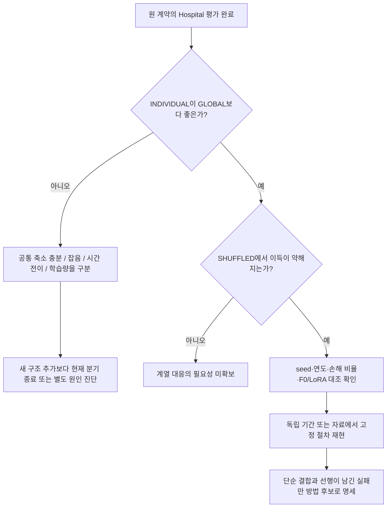

# 개선 방향: 실행 안정성과 방법론 진입을 분리한다

> 이 문서는 재개 전 스냅샷이다. 이후 사용자 요청으로 Hospital을 완료했다. [최종 결과와 후속 판단](../08_hospital_shared_strength/24_hospital_results_20260910.md)이 현재 상태다. 과거 미완료 그림을 다시 생성하려고 build_review.py를 재실행하지 않는다.

2026-09-10. [결과 요약](README.md)에 근거한 제안이다. **현재 사용자 요청은 중지·정리이며 아래 실험·환경 변경은 실행하지 않았다.**

## 1. 우선순위와 권고

현재 가장 가치 있는 일은 새 구조 구현이 아니라 **미완료 Hospital이 원래 질문에 답할 수 있도록 남은 근거와 재개 조건을 분명히 하는 것**이다. 같은 Bike/Household 평가를 계속 튜닝하거나, 사후 좋은 arm을 골라 방법 성공으로 바꾸면 논문의 신뢰성이 약해진다.

최신 질문은 ‘공유 적응의 적용 강도를 계열별로 달리할 근거가 있는가’이다. 구조상의 차별성은 아직 없다. 현재 결과만으로 새 ML 방법 논문을 쓰기에는 필요성·추가 효과·독립 전이가 부족하다. 잘 통제된 실증 연구의 재료는 있지만 그것도 두 원천과 한 백본 위주라는 한계를 보완해야 한다.

## 2. 실행 안정성: 무엇을 고쳐야 하는가

### 확정된 사실과 아직 모르는 원인

[확인] Hospital의 마지막 중단은 `available_commit_below_limit`와 worker의 `Available Windows commit < 6 GiB` 예외다. 마지막 RAM은 약 9.03 GiB 남아 있었다. 물리 RAM 사용률만으로는 이 중단을 예측할 수 없다. [Microsoft의 committed memory 설명](https://learn.microsoft.com/en-us/troubleshoot/windows-client/performance/introduction-to-the-page-file).

[확인] `_run2`의 두 번째 fit은 200 update를 수행한 뒤 checkpoint replay에서 중단됐다. 코드가 replay 전에 adapter tensor를 저장하지만, 이는 optimizer/RNG를 포함한 exact resume checkpoint가 아니며 검증 완료 영수증도 없다. 파일이 존재한다는 이유로 그 fit을 완료 처리하면 안 된다.

[미확인] 시스템 commit 여유 감소를 학습 child, 다른 앱, 드라이버, allocator 중 누가 얼마나 만들었는지 분해하지 못했다. 기존 history에서 시스템 여유 변화량을 child commit peak로 간주한 부분은 추정으로 낮춘다. 과거 DWM/NVIDIA 프리즈와 이번 guard 중단도 같은 원인으로 묶지 않는다.

### 재개 전에 준비할 순서

1. **같은 시각의 프로세스별 private bytes와 시스템 commit을 기록하는 진단을 먼저 설계한다.** 모델 로드·첫 optimizer·validation·체크포인트 저장·재로드의 단계 표시를 같이 남긴다. 현재 RSS 로그만으로 메모리 누수를 단정하지 않는다.
2. **시작 여유를 각 child 시작 직전에 검사한다.** 이번에는 runner 시작 때 약 13.2 GiB였지만 두 번째 fit 첫 guard 표본은 약 11.25 GiB였다. 전체 runner의 한 번 preflight로 후속 fit의 여유를 보장할 수 없다. 시작 조건은 `기존 중단 여유 6 GiB + 해당 작업의 관측 peak 증가 + 외부 변동 여유`로 산정하되 현재 로그만으로 보장 수치를 확정하지 않는다.
3. **검증 단계의 수명 관리를 점검한다.** training.py는 optimizer, gradient, 마지막 batch 변수 등이 살아 있는 함수 안에서 최종 replay를 수행한다. [추정] 불필요한 참조 해제나 프로세스 분리가 peak를 낮출 수 있다. 실제 private commit·CUDA allocated·동일 checkpoint 예측을 전후 비교해야 하며 이것이 현재 중단의 원인이라고 단정하지 않는다.
4. **안전 기준은 유지한다.** 6 GiB 기준을 낮추거나 실패 attempt 한도를 새 폴더로 계속 우회해 성공처럼 만들지 않는다. 현재 run의 재시도 횟수와 receipt를 먼저 확인한다. 같은 실행이 불가능하면 별도 런타임 또는 작업 환경 분리를 검토한다. 드라이버·pagefile·보안 제외 설정은 이번에 바꾸지 않았다.
5. **재개 단위는 실패 job과 나머지 미실행 job이다.** 완료한 S0와 fit의 계약·입력·checkpoint hash가 유지되는지 확인한 뒤 재사용한다. 원 계약에 없는 ‘replay만 수행해 완료로 승격’은 재개와 다른 변경이므로 명시적으로 설계해야 한다.

통과 조건은 ‘한 번 안 죽었다’가 아니다. 단계별 자원 기록이 기준을 만족하고, guard·worker·receipt가 모두 정상이며, step0·업데이트 범위·checkpoint replay가 유지돼야 한다. 그래도 PC 전체의 무크래시를 보장하는 증거는 아니다.

## 3. Hospital에서 실제로 판정할 경쟁 설명

**H0: 공통 축소로 충분하다.** GLOBAL이 INDIVIDUAL과 같거나 더 좋다면, 계열마다 별도 강도를 고르는 현재 규칙의 필요성이 약하다. F0보다 LoRA 평균이 좋은지와 이 질문은 별개다.

**H1: 계열별 적응 이득의 차이가 시간에 걸쳐 유지된다.** V2에서 정한 INDIVIDUAL이 E1/E2에서 GLOBAL보다 좋고 같은 강도 분포를 섞은 SHUFFLED보다도 좋아야 이 가설에 부합한다. 이는 기존 결합 baseline의 탐색적 양성 패턴이지 신규성 또는 인과 증명의 완료가 아니다.

**H2: 차이는 있지만 제한된 V2가 이를 추정하기에 너무 짧다.** INDIVIDUAL의 V2 이득이 E에서 사라지거나 손해로 바뀌면 추정 잡음과 비정상성 둘 다 가능하다. 현재 V2는 계열당 12개월 한 창이고, 21분위수 점수는 같은 12개 정답을 여러 방식으로 평가한다. 이를 252개의 독립 정답으로 세면 안 된다. 767계열도 독립 도메인 수가 아니다.

**H3: 학습량·최적화가 충분하지 않아 적응 신호 자체가 약하다.** 완료 fit은 optimizer가 685계열만 봤고 82계열은 직접 보지 않았으며 best step은 200 경계다. 이 사실은 현재 ‘200 update 제한’에서의 결과를 설명하는 단서다. 최종 결과를 본 뒤 업데이트를 늘려 같은 실험을 덮어쓰지 않는다. 별도 후속 비교가 필요하다면 같은 정보와 사전 예산 하에 분리한다.

H1/H2는 양립할 수 있다. 일부 계열에 반복 가능한 이득이 있어도 12개월의 직접 선택이 그 신호를 잘 회수하지 못할 수 있다. 반대로 V2에 과적합했다는 설명만으로 정칙화가 미래 성능을 개선할 것이라고 단정할 수 없다.

## 4. 결과에 따라 다음 행동을 달리한다



현재 계약의 부호 허용오차 1e-8 %F0는 실용 문턱이 아니다. 작지만 양수인 효과를 곧바로 논문 가치로 바꾸지 않는다. 새 연구의 실용 효과 크기는 downstream 요구·비용·독립 검증 설계와 함께 사전에 정해야 한다. 과거 study의 +1% 문턱을 이번 판정에 소급 적용하지 않는다.

평균 외에 seed×연도 효과, 계열 손해 비율, 손실 차이 분포, alpha 분포와 0/1 경계 질량, proper score·coverage·폭을 본다. 그림은 모든 계열을 포함하고 예쁜 사례만 선택하지 않는다. 20개 SHUFFLED는 기술적 대조이며 유효한 permutation p-value로 제시하지 않는다.

## 5. 방법론으로 이어질 조건부 후보 한 가지

**[제안·미실행] 제한된 검증 자료에서 계열별 선택을 공통 강도로 수축하는 규칙**을 후속 최소 대조로 고려할 수 있다. 현재 파일럿에서 개별 선택 잡음이 실제 문제로 남았을 때만 유효한 제안이다.

```text
개별 직접 선택: a_i = argmin_a L_i,V2(a)
후속 수축 후보: a_i = argmin_a {L_i,V(a) + lambda * (a − a_global)^2}

lambda = 0     : 개별 직접 선택
lambda 증가    : 공통 선택에 가까워짐
lambda → 무한대: 공통 강도
```

중요한 기여 후보는 식 자체가 아니다. **어떤 정보량·의존성·전이 조건에서 개별 적응 결정을 믿을 수 있는지**를 추정하고, 고정 축소가 못 하는 일반화를 보이는 것이 가능한 연구 질문이다. 수축·예측 결합은 선행이 풍부하고 FFORMA는 이미 특징 기반 가중치를 학습한다. 이 식에 이름을 붙이거나 적용 도메인만 바꿔 신규성을 주장하지 않는다. [FFORMA 원 저자 자료](https://robjhyndman.com/publications/fforma/), [예측 결합](https://otexts.com/fpp3/combinations.html).

후속에 필요한 대조는 F0, 표준 LoRA, 고정 0.5 결합, V로 고른 GLOBAL, 직접 INDIVIDUAL, 단일 lambda 수축, 특징 기반 기존 결합이다. 이들은 같은 base 예측·정보·선택 예산에서 비교해야 한다. 수축이 고정 GLOBAL을 넘지 못하면 복잡한 계열별 gate로 확대하지 않는다.

Lambda를 현재 E1/E2에서 고르면 누수다. 후속에서는 별도 시간 내 검증 또는 새로운 자료의 사전 선택 구간이 필요하다. 현재 12개월 V2를 임의로 쪼개면 독립성을 확보한 것처럼 보이지만 계절 주기를 훼손하고 원 계약도 바꾸므로 같은 실험에 몰래 넣지 않는다. 데이터 선택·모델 선택·gate 선택·최종 평가의 역할을 다시 명시해야 한다.

## 6. 논문 주제로 남기 위한 최소 요건

1. **필요성:** F0·표준 LoRA·공통 결합의 구체적 실패가 독립 원천/기간에서 반복돼야 한다. Oracle 상한만으로는 부족하다.
2. **원인:** 추가 정보, 더 많은 선택 자유도, 학습량, 계열 대응의 효과를 구분해야 한다. 통계적으로 약한 사후 설명을 메커니즘으로 확정하지 않는다.
3. **방법:** 데이터가 들어오는 시점에 실제 계산 가능한 학습·추론 규칙이어야 한다. 미래 정답으로 고른 oracle은 제외한다.
4. **추가 효과:** 단순 수축·기존 조합·동일 용량 대조보다 유리하고 기전 삭제에서 이득이 줄어야 한다. 한 seed/한 연도의 작은 양수만으로는 부족하다.
5. **일반화·비용:** 모델/기간/계열 의존성·오염 위험과 선택 비용을 보고한다. 많은 fit을 했다는 사실은 독립 근거를 대체하지 않는다.

현재는 1번을 검사하는 도중이다. 가장 현실적인 개선은 문제와 판정을 좁혀 한 번의 실험이 한 질문에 답하도록 하는 것이다. 새 방법의 근거가 남지 않으면 그 분기는 닫고, 잘 통제된 음성·경계 결과를 실증 자료로 보존한다.

## 7. 중단 시점 체크리스트

- [x] 프로젝트 학습 프로세스가 현재 없는지 확인.
- [x] Hospital 미완료를 결과 실패와 구분해 기록.
- [x] 문서를 주제별 폴더로 이동하고 그림·관련 링크 정리.
- [x] 원 결과 기반 그래프·입력 hash·작은 중단 근거 보존.
- [ ] 재개 요청 후 단계별 private commit 진단과 실행 조건 확정.
- [ ] 남은 Hospital fits 및 V1/V2/E/독립 감사 완료.
- [ ] 그 결과가 요구할 때만 별도 후속 방법 설계.

체크되지 않은 항목은 미실행 제안이다. 자동 실행 대기열이 아니다.
