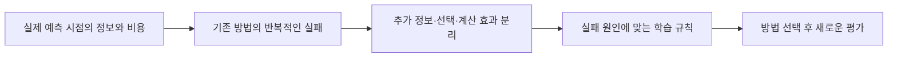

# TSFM PEFT 문제 중심 사전조사와 다음 연구 방향

작성·검색 기준: 2026-09-08. 이 문서는 [기존 PEFT 조사](time_series_peft_research_dossier_20260907.md)와 [17번 결과](../notes/tsfm_topics/17_coarse_supervision_results_20260908.md)를 이어받는다. **새 PEFT 방법의 성공이나 신규성을 확보한 보고서가 아니다.** 이번에는 문헌·공식 자료를 조사했으며 새 학습과 데이터 payload 다운로드는 하지 않았다.

## 1. 결론과 우선순위

**“시계열 PEFT는 거의 다 끝났다”는 결론은 근거가 부족하다. 그러나 주파수·채널 adapter, rank/layer 선택, regime별 LoRA, online correction 같은 넓은 아이디어에는 직접적인 선행이 많다.** 다음 연구는 작은 구조 변형을 먼저 정하기보다, 기존 방법이 실제로 실패하는 정보·운영 조건에서 시작해야 한다.

이번 조사에서 가장 먼저 확인할 후보는 **R1: 발표 후 수정되는 정답을 반영하는 적응**이다. 실제 revision 기록과 공개 날짜가 있어, 단순 입력 정정의 이득과 이미 학습한 업데이트를 고치는 이득을 분리할 수 있다. 이는 **검증할 가치에 대한 우선순위**이며 새 방법이 잘될 가능성을 수치로 확인했다는 뜻이 아니다.

```text
후보   구체적인 문제                              이번 판단
R1     잠정 정답으로 적응한 뒤 정정값이 도착함      자료 진입·기존 방법 반증부터 진행할 가치
R2     집계 정답 + 소량 fine 정답으로 패턴 적응    조건부 보류; 기존17 확대와 구분 필요
R3     입력 채널·측정 방식이 달라진 뒤 적응        예비 후보; 실제 forecasting 자료 계약 부족
```

지금 바로 새 adapter를 구현하거나 세 후보를 동시에 학습할 단계는 아니다. **R1의 실제 자료와 강한 기존 대조를 먼저 검사하고, R2/R3는 보류 이유를 보존한다.** 기존 ABC와 혼동하지 않도록 이번 후보는 R1–R3로 부른다.

## 2. 조사 범위와 증거 수준

[검색·문헌 카탈로그](time_series_peft_problem_first_catalog_20260908.json)에 29개 검토 항목을 기록했다. 논문 22개, 공식 모델 자료 1개, 공식 데이터 문서 5개, 공개 모델 artifact 1개다. 이 수는 새로 발견한 논문 수나 검색 결과 총수가 아니다. 기존 09-07 카탈로그의 PEFT 대조군도 함께 사용했다.

검색은 native forecasting TSFM을 중심으로 하되, 문제를 이미 해결하는 일반 ML·계량경제·temporal disaggregation 연구까지 확장했다. arXiv, PMLR/학회·저널 원문, 저자 코드, 데이터 제공기관 문서를 대조했다. 검색식과 접근 실패는 JSON에 남겼다. 전수 systematic review나 신규성 보증은 아니다.

- **[확인]** 실제 로컬 결과 또는 읽은 원문의 내용. 문헌의 성능은 저자 보고이며 우리 재현과 구별한다.
- **[추정]** 자료를 종합한 해석. 논문의 비어 있는 실험 칸을 곧 미해결 문제로 보지 않는다.
- **[가설·미검증]** 앞으로 반증할 주장. 후보의 순위는 이 범주를 벗어나지 않는다.

분류에서도 네 가지를 구분한다. Native TSFM과 LLM을 시계열에 적용한 모델, forecasting과 같은 창의 reconstruction/classification, frozen backbone과 최종 예측 함수의 보존, 파라미터 수와 실제 학습·추론 비용은 각각 다르다.

## 3. 이전 탐색에서 무엇을 배웠나

[확인] [13번 결과](../notes/tsfm_topics/13_peft_temporal_replication_results_20260908.md)에서 Bike의 LoRA 대 head 차이는 컸지만 LoRA가 frozen F0보다 좋지는 않았다. 따라서 “head보다 좋다”만으로 내부 적응의 필요성을 주장하면 안 된다. Household에서 관찰한 표준 LoRA의 제한된 이득 역시 우리가 고안한 새 방법의 이득이 아니다.

[확인] [10번 지연 회귀](../notes/tsfm_topics/10_peft_trainlag_results_20260908.md), [11번 보정](../notes/tsfm_topics/11_peft_calibration_closure_results_20260908.md), [16번 관측 연산](../notes/tsfm_topics/16_observation_operator_entry_results_20260908.md)은 각각 현재 조건에서 단순 추정·출력 보정·기존 조건부 계산의 충분성을 보였다. 이는 그 조건의 중단 근거이며 PEFT 전체가 불필요하다는 증거는 아니다.

[확인] 17번 Eagle에서 F0의 시간별 MSE는 약 0.05749, 월합으로 적합한 head는 1.59680이었다. 큰 손상은 LoRA 이전에 발생했다. 월평균 오차는 조금 줄었지만 패턴 오차는 약 29.78배 커졌다. 따라서 이번 실패는 먼저 **잘못된 head 출발점과 감독의 부족**을 의심하게 한다. 새 내부 구조의 필요성은 아직 보여주지 못했다.

[추정] 우리 탐색의 반복적인 약점은 “내부 adapter가 고칠 현상”을 먼저 만들고, 같은 정보로 가능한 간단한 해법과 가까운 선행을 나중에 확인한 것이다. 다음에는 다음 순서를 지킨다.



다만 기준을 불가능하게 만들 필요도 없다. 알려진 구성요소를 사용해도 새 조건에서 작동 원리를 밝히고 유의미한 성능·정답 효율·실제 비용 개선을 재현하면 방법론 기여가 가능하다. 모든 데이터셋에서 반드시 이기는 것을 보편적 논문 요건으로 두지 않는다. 기존 실험의 고정 중단 기준은 유지하되, 새 연구는 주장할 적용 범위와 평균 이득·실패 위험을 사전에 정한다.

## 4. 이미 선행이 강한 접근과 정확한 경계

### 4.1 구조·적응 위치·채널 관계

기존 조사에서 [Time-PEFT](https://icml.cc/virtual/2026/poster/61767), [PEFT TRACE](https://arxiv.org/html/2503.16991v3), [correlation-aware CoRA](https://proceedings.iclr.cc/paper_files/paper/2026/file/ae3e173398d6e43fea63cbcc16fbaa98-Paper-Conference.pdf), [UniCA](https://proceedings.iclr.cc/paper_files/paper/2026/file/0b5eb45a22ff33956c043dd271f244ea-Paper-Conference.pdf), [ChronosX](https://proceedings.mlr.press/v258/arango25a.html)를 이미 확인했다. 주파수 adapter, 채널 관계 추가, 모듈 선택, 공변량 주입 자체를 새 기여로 삼기는 어렵다. 그러나 서로 다른 backbone·학습 범위의 결과가 모든 native TSFM의 적응 문제를 해결했다는 뜻은 아니다.

특히 **CoRA 두 편을 구분**한다. Cheng 등의 correlation-aware CoRA와 Qin 등의 [covariate-aware CoRA, 2510.12681](https://arxiv.org/html/2510.12681v1)는 다른 연구다. “Adapter”라는 이름만으로 backbone 동결이 검증된 PEFT라고 분류하지 않는다. 기존 카탈로그에 논문·공개 구현 확인 범위를 남겼다.

[확인] 최신 [TimesFM-3 공식 설명](https://research.google/blog/timesfm-3-a-zero-shot-foundation-model-for-multivariate-forecasting/)은 다중 target, 과거 공변량, 과거·미래 공변량을 기본 기능으로 다룬다. Chronos-2와 TiRex-2의 native 다변량 기능도 기존 조사에 포함돼 있다. 따라서 오래된 channel-independent 모델의 약점을 그대로 현재 FM의 미해결 문제로 옮기면 안 된다.

### 4.2 온라인 적응·망각·출력 보정

- [MixFT](https://arxiv.org/html/2603.02840v1)는 sub-domain별 LoRA와 혼합·replay를 사용한다. Regime별 adapter나 replay 자체는 선행이다.
- [ORTCL](https://ojs.aaai.org/index.php/AAAI/article/view/39526/43487)은 streaming TSFM의 직교 회전 적응을 다룬다. “직교화로 망각을 줄인다”는 넓은 기여와 겹친다.
- [PROCEED](https://arxiv.org/html/2412.08435v5)는 horizon에 따른 정답 지연과 그 사이의 drift를 직접 문제로 삼는다. [ADAPT-Z](https://arxiv.org/html/2509.03810v1)는 feature adjustment를 다룬다.
- [AdapTS](https://arxiv.org/html/2502.12920v2)는 frozen forecast와 온라인 Fourier 선형 모델을 결합한다. [ORCA](https://arxiv.org/html/2606.14222v1)는 frozen TSFM의 입력·출력에 조건부인 온라인 오차 보정을 제안하며 Chronos-2 등에서 평가한다. 단순 상수 bias만 비교하면 너무 약하다.
- [FAC](https://arxiv.org/html/2605.17250v1)는 matured ground truth 프로토콜과 주파수 보정을 다룬다. 주실험은 iTransformer/PatchTST/DLinear/OLS/FreTS이며 native TSFM 성과로 인용하지 않는다. 비교할 때 입력·출력 보정 변형도 고려한다.

### 4.3 Retrieval·memory·few-shot도 비교 범위다

[TS-Memory](https://arxiv.org/html/2602.11550v1)는 학습 자료에서 만든 kNN 분포 정답을 작은 모델에 증류하고 frozen forecast와 혼합한다. 외부 기억의 유용한 정보를 추론 때 검색하지 않고 학습하는 발상도 이미 있다. 이를 구현하기 위한 실제 과거 정답·teacher 생성 비용을 동일하게 제공해야 한다. Backbone을 동결했다고 혼합된 예측의 기존 성능이 자동 보존되는 것은 아니다.

[ICML 2025 In-Context Fine-Tuning](https://proceedings.mlr.press/v267/faw25b.html)은 관련 시계열 예시를 활용하도록 모델을 추가 학습한다. “Few-shot 적응”의 비교 범위에는 gradient update 외 방법도 들어간다. 다만 이 능력을 위해 학습된 모델과 임의의 frozen checkpoint를 동일시하지 않는다.

## 5. R1 — 수정되는 정답으로 이미 학습한 적응을 교정하기

### 실제 문제

예를 들어 1월 고용 값이 2월에 처음 발표되고 3월·4월에 수정된다. 2월에 첫 값을 이용해 모델을 업데이트했다면, 3월에 CSV의 값만 교체해도 **그 값으로 이미 바뀐 파라미터와 optimizer 상태**는 그대로 남는다. 이 잔여 영향이 실질적인 예측 손실을 만드는지가 질문이다.

[확인] [BLS](https://www.bls.gov/web/empsit/cesnaicsrev.htm)는 첫 추정 뒤 한 달·두 달 후 수정과 연간 benchmark 수정을 명시한다. [ALFRED](https://alfred.stlouisfed.org/help)는 과거 vintage를 보존한다. 따라서 정답 수정이라는 조건 자체는 실제다. **그 때문에 PEFT가 반복적으로 실패한다는 것은 아직 미검증이다.**

### 가장 가까운 선행

[MacroCast](https://arxiv.org/html/2606.28670v1)는 이미 vintage에 맞춘 TSFM fine-tuning을 다룬다. §2.4의 vintage별 생성·bootstrap 자료와 §3의 재추정 프로토콜을 확인했다. 이전 잠정값의 업데이트를 도착한 수정분만으로 교정하는 PEFT 규칙으로 제시하지는 않는다. Warm start/reset의 정확한 실행은 미확정이다. 따라서 “최초의 vintage-consistent TSFM”이라는 주장은 불가하다.

[ALT 2025 Evolving Observations](https://proceedings.mlr.press/v272/bar-on25a.html)는 피드백이 소급해서 변하는 online learning 자체를 다룬다. [Corrective Machine Unlearning](https://arxiv.org/abs/2402.14015)과 [CUTS](https://arxiv.org/html/2511.18660v1)도 잘못된 학습의 영향을 제거하는 선행이다. 기존 gradient나 task vector를 빼는 발상만으로 차별화할 수 없다. 이 연구들의 설정·보장이 비선형 TSFM LoRA에 바로 적용된다는 뜻은 아니다.

### 반증할 가설

> [가설·미검증] 실제 revision을 반복해서 받는 예측에서 잠정 정답으로 생긴 내부 적응의 유해한 영향이 입력 정정 후에도 남는다. 같은 정보와 예산의 head 재적합·정정 자료 replay로 충분히 회복되지 않으며, 제한된 비용으로 이를 교정하는 학습 규칙이 필요하다.

이 주장은 세 부분으로 나뉜다. **실제 손실이 있는가 → 기존 방법으로 충분한가 → 새 방법이 더 나은가.** 첫 번째만 확인해도 아직 ML 방법 논문은 아니다.

### 먼저 이겨야 할 아주 강한 단순 방법

고정 feature z와 제곱 손실 ridge head에서

```text
A = Σ z_i z_iᵀ + λI
b = Σ z_i y_iᵀ
W = solve(A, b)

정답만 y_i → y_i + δ_i 로 바뀌면
b ← b + z_i δ_iᵀ
```

로 정확히 수정할 수 있다. 이는 ridge의 기존 충분통계 갱신이며 새 알고리즘이 아니다. Feature·가중치·λ가 고정된 조건의 대수적 동일성이다. Context가 수정되어 z도 달라지면 A와 b의 이전 항을 제거하고 새 항을 넣으며 feature 재계산 비용을 포함해야 한다.

비교군은 다음 순서가 합리적이다.

1. 현재 vintage 입력을 사용하는 frozen FM, AR/ridge, bias·scale 보정. 발표 차수·경과시간별 평균 revision 또는 작은 회귀로 잠정값을 보정하는 대조도 포함한다. 학습에는 그 시점에 이미 성숙한 과거 사례만 쓴다. 관측 수정의 news/noise를 모델링하는 [기존 state-space 연구](https://www.sciencedirect.com/science/article/pii/S0304407610002526)도 관련 선행이다.
2. 같은 raw input 또는 frozen hidden feature의 head를 현재 vintage로 재적합. 정확한 revision 갱신과 배치 해가 일치하는지도 확인.
3. AdapTS/ORCA처럼 입력을 고려하는 온라인 보정. 해당 프로토콜로 수정했다면 원 구현 결과와 구분.
4. 표준 LoRA의 정정된 replay, 원본과의 혼합·shrinkage, 현재 자료로 reset/refit.
5. 위 방법들이 남긴 손실이 실용적으로 클 때만 새 PEFT 규칙.

**수정 전 정답을 일부러 남긴 arm은 원인을 보는 진단군이다. 이것만 이겨서는 새 방법의 성능 증거가 아니다.** 실제 도착한 동일 정보를 모든 경쟁 방법에 제공한다. 반대로 향후 revision을 미리 아는 oracle은 정보 상한이며 정상 비교군이 아니다.

원인 분리에는 현재 예측 입력의 일치만으로 부족하다. 첫 진단에서는 **과거 학습 context/feature 버전도 고정하고 label revision만 변화**시킨다. 그다음 context와 label을 함께 정정하는 실제 운영 프로토콜을 별도로 평가한다. 두 효과를 섞어 모두 과거 파라미터 업데이트의 피해라고 해석하지 않는다.

### 데이터 진입 조건

첫 자료 후보는 PAYEMS다. 두 번째는 산업생산 등 다른 revision 생성 과정을 가진 계열을 검토하되, 실제 vintage coverage를 보기 전에 확정하지 않는다. 여러 macro series를 여러 독립 domain으로 세지도 않는다.

필요한 자료 행은 `series / event_date / vintage_date / value`다. 원 관측 시점과 발표·수정 시점을 함께 보존한다. [공식 API](https://fred.stlouisfed.org/docs/api/fred/series_observations.html)의 realtime 구간과 output_type 3/4, [vintage 목록](https://fred.stlouisfed.org/docs/api/fred/series_vintagedates.html)을 활용할 수 있다. API에는 key가 필요하며 공식 웹 다운로드 경로도 있다. 이번 조사에서는 payload coverage를 검사하지 않았다.

ALFRED 날짜는 원출처 발표일, 공급자 날짜, FRED 최초 가용일로 대체될 수 있다. 사용자 시스템의 정밀 수신 timestamp가 아니다. 일 단위의 보수적인 사용 시점과 같은 날 발표의 처리 순서를 고정한다. 목표값도 “현재 최신값”을 계속 바꾸지 말고 예를 들어 정해진 성숙 시점의 vintage로 고정한다. 그 값이 영구적인 최종 진실이라는 주장은 하지 않는다.

Native FM의 사전학습에 과거 macro 값이 있었는지는 별도 문제다. 같은 checkpoint 안 적응 비교는 가능해도, 그것만으로 모든 역사적 origin의 무누수를 보증할 수 없다. Synthetic-only base 또는 명시적으로 제외된 자료·검증 가능한 cutoff가 필요하다. 검증되지 않은 경우 개발 진단으로 표시한다.

[MacroCast 공개 모델](https://huggingface.co/shubhranshu/MacroCast)은 연간 checkpoint 26개를 제공한다. 월별 실험의 완전한 공개 재현물과 같지 않다. [고정 manifest](https://huggingface.co/shubhranshu/MacroCast/blob/294e473968d1cf970fa05a23d5b70b8ae5c4af90/manifest.json)의 cutoff와 train_vintage 관계는 사용 전에 확인해야 한다. 이 차이만으로 누수를 단정하지 않는다. 공개 작은 모델의 재적합이 충분히 싸다면 큰 FM의 PEFT가 비용에서도 불리할 수 있다.

### 가장 싼 검사와 중단 기준

- **자료 검사:** revision 빈도·크기·시차, 정의 변경, vintage 누락, 사용 가능한 origin 수부터 측정한다. 표본이 희박하거나 대부분 수정이 실용적으로 작으면 다른 자료 또는 주제로 이동한다.
- **CPU 검사:** 고정 raw feature의 배치 ridge와 revision 갱신을 대조한다. 미래 평가를 보며 λ나 계열을 고르지 않는다.
- **최소 FM 검사:** 같은 시점의 입력을 맞춘 뒤 frozen/head와 표준 LoRA만 비교한다. 작은 head와 LoRA 사이에 실제 남은 적응 이득이 있는지 확인한다.
- **중단:** 입력 교체나 현재-vintage head, 정정 replay, reset/refit으로 같은 비용 안에서 충분하면 새 revision PEFT 주제를 닫는다. 한 학습률의 과적합을 별도 알고리즘 필요성으로 만들지 않는다.
- **진행:** 최신 자료 refit 대비 유의미한 계산 절감과 미래 예측 손실의 균형이 남을 때, 그 원인을 겨냥한 교정 규칙을 설계한다. Adam의 비선형 경로를 과거 gradient의 단순 뺄셈으로 정확히 취소한다고 주장하지 않는다.

평가할 것은 정해진 성숙 정답에 대한 미래 손실, 수정 도착 후 회복 속도, 실제 누적 update 시간·메모리·재계산 비용이다. “보존”을 주장하면 같은 adapter를 적용한 사전 지정 조건의 손실도 측정한다. LoRA를 끄면 F0로 돌아간다는 사실만으로 보존 성능이 입증되지는 않는다.

## 6. R2 — 집계 정답과 소량 fine 정답으로 필요한 패턴만 적응

### 새로 발견한 직접 선행

[UAI 2025 Learning from Label Proportions and Covariate-shifted Instances](https://proceedings.mlr.press/v286/singh25b.html)는 source의 개별 정답과 target의 집계 평균 정답을 함께 사용하는 회귀를 다룬다. [공식 코드](https://github.com/google-deepmind/covariate_shifted_llp)도 있다. **Donor fine + target coarse + domain adaptation이라는 조합 자체는 새 문제가 아니다.** 이론의 covariate-shift 가정과 시간순 미래 예측은 구분해야 하며 correlated bag 실험도 있으므로 상관을 전혀 다루지 않는다고 쓰면 안 된다.

[AISTATS 2017 Frequency Domain Predictive Modelling with Aggregated Data](https://proceedings.mlr.press/v54/bhowmik17a.html)는 집계된 feature와 label에서 fine 수준의 공유 선형 예측기를 학습한다. 따라서 단일 월합의 미식별성만으로 모든 공유 모델의 학습 불가능성을 주장할 수 없다.

### 조건부로 남는 질문

> [가설·미검증] Target의 월합과 사전에 정한 소수의 fine 계측 구간만 있을 때, source/F0의 패턴을 보존하는 방법보다 target에 필요한 패턴 변화만 학습하는 방법이 적은 정답으로 더 잘 예측하는가?

필수 정보는 source fine와 target coarse 외에, source와 target 패턴의 차이를 구분할 수 있는 신호다. 소량 fine 정답, 실제 이용 가능한 공변량, 관측 구간의 다양성, 타당한 공유 구조 등이 될 수 있다. 허용된 모든 관측이 같은 두 세계에서 target fine만 달라진다면 추가 가정 없이 답을 알아낼 수 없다.

현재17의 0-fine 조건에서 이 질문을 이미 검증한 것은 아니다. [BDG2](https://github.com/buds-lab/building-data-genome-project-2)는 통제된 정답 접근 실험은 가능하지만 실제 계측비용·청구 도착일을 제공하지 않는다. 기존 site와 기간은 개발 자료다. [PGE 운영 사례](https://www.aceee.org/files/proceedings/1998/data/papers/0625.PDF)는 동기의 근거이며 현대 공개 자료 계약을 대신하지 못한다.

### 선행 대조와 중단 기준

현재17의 손상은 먼저 `p0 + mean(p − p0)`처럼 **같은 월평균 예측을 유지하며 F0 패턴을 보존하는 보정**으로 점검할 수 있다. 이것은 사후 원인 진단이며 동결17의 새 arm이나 새 방법이 아니다. 이번 조사에서는 실행하지 않았다.

새 조건을 연다면 0/1/2/4일 등의 fine budget은 자료의 가능한 계측 방식에 맞춰 먼저 정한다. 날짜는 숨긴 정답의 오차로 선택하지 않는다. Donor calendar ridge, 작은 MLP, frozen hidden head, 같은 label을 받는 hybrid LLP, 표준 LoRA를 비교한다. [Chow–Lin/Denton 계열](https://journal.r-project.org/articles/RJ-2013-028/)은 사용할 수 있는 과거 집계·indicator 조건에서 적용한다. 미래 실제 월합을 알려주면 forecasting 문제가 바뀐다.

[강수 disaggregation GAN](https://hess.copernicus.org/articles/25/3207/2021/index.html)은 fine 훈련 자료와 알려진 일합을 사용한다. [CLMT](https://arxiv.org/html/2605.13248v1)도 fine latent 정답을 쓴다. 이들의 합성·복원을 target coarse-only 미래 예측의 해결로 인용하지 않는다. 반대로 [FlowState](https://arxiv.org/html/2508.05287v3)는 sampling rate 차이만을 새 adapter의 이유로 삼을 때 고려할 강한 선행이다.

**판정:** coarse-only 새 구조는 현재 진행하지 않는다. 추가 fine 정보로 필요한 패턴 변화가 검출되고, 같은 정답을 받은 강한 head·기존 학습이 회수하지 못하는 이득이 있을 때만 재검토한다. 소수 정밀 라벨에 맞춰 자유도를 제한한다는 원리도 active learning·regularization·inverse problem 선행을 더 확인해야 한다.

## 7. R3 — 입력 채널·측정 방식이 달라진 뒤의 적응

### 남길 수 있는 좁은 질문

> [가설·미검증] Target 예측에 필요했던 특정 센서나 공변량의 측정 방식·가용성이 바뀌었을 때, 관측 가능한 변화 신호와 적은 target 정답으로 기존의 유용한 관계는 유지하고 잘못된 관계만 수정할 수 있는가?

단순 random masking이나 채널 추가만으로는 충분하지 않다. 실제 변경이 무엇인지, metadata·겹쳐 측정한 구간·남아 있는 센서 중 어떤 정보로 그 변경을 구분할 수 있는지 명시해야 한다. 측정 변화와 실제 시스템 변화가 입력상 구별되지 않으면 새로운 adapter가 자동으로 원인을 알아낼 수 없다.

### 왜 지금 우선순위가 낮나

Native 다변량 FM과 기존 CoRA/UniCA가 이미 관계·공변량 적응을 다룬다. 다른 [TRACE, 2606.06285](https://arxiv.org/html/2606.06285v1)는 결측 modality의 조건부 추정을 제안한다. 이 TRACE는 PEFT TRACE와 다른 논문이며 임상·감정 분석 과제를 native forecasting 결과로 확대하면 안 된다. 그러나 “결측을 mask 대신 조건부 복원한다”는 큰 발상은 이미 겹친다.

실자료 선택도 까다롭다. [UCI Gas Sensor Drift](https://archive.ics.uci.edu/dataset/224/gas)는 drift 연구에 쓰이지만 제공된 128차원 파생 feature 행을 이어 붙여 연속 예측 시계열로 만들면 잘못된 문제가 된다. [E-Nose TSFM 연구](https://arxiv.org/html/2606.27672v1)도 gas 분류·농도 추정을 다루며, 그 결과가 곧 미래 예측의 적응 필요성은 아니다.

### 열기 전에 필요한 최소 대조

실제 변경이 기록된 forecasting 자료에서 target-only F0, native multivariate F0, 알려진 단위·센서 보정, causal imputation, mask/dropout을 학습한 작은 모델·head, 표준 LoRA를 동일 정보로 비교한다. 단순 공변량 제거가 해결하면 새 관계 adapter의 필요성이 약하다. 정상 기간과 변경 이후를 모두 평가하고, 사용할 수 없는 미래 결측 구간을 양방향 보간하지 않는다.

**판정:** 현 단계는 자료·문제 정의 보류다. 문헌 검색에서 정확한 조합을 못 찾았다는 사실을 신규성으로 주장하지 않는다. 실제 교체·공개 지연·측정 정의가 기록된 자료를 확보하기 전에는 synthetic corruption sweep을 확대하지 않는다.

## 8. 새 ML 방법 논문으로 이어지려면

첫 번째 원고 문장은 “새로운 LoRA 변형을 제안한다”보다 다음처럼 써야 한다.

> “정답이 발표 후 수정되는 순차 예측에서, 기존 적응은 ______ 때문에 실패한다. 우리는 ______라는 조건을 이용해 ______를 갱신하고, 같은 정보와 실제 계산 예산에서 기존 ______보다 ______를 개선한다.”

빈칸은 실험으로 채워야 한다. R1이 살아남는 경우 기대할 수 있는 기여의 형태는 다음과 같다.

1. 실제 revision과 잠정 감독의 영향을 분리하는 명확한 문제·평가 계약.
2. 입력 교체·head 갱신·replay로 설명되지 않는 실패 기전.
3. 그 기전에 맞는 구체적인 학습 또는 업데이트 알고리즘.
4. 새로운 평가에서의 정확도·회복 속도·실제 비용의 재현 가능한 개선과 실패 범위.

프로토콜과 진단만 확보했다면 분석·benchmark 연구로는 가치가 있어도 **우리가 목표로 하는 새 PEFT 방법 논문의 완료는 아니다.** 반대로 알고리즘의 구성요소가 알려져 있다는 이유만으로 자동 탈락시키지 않는다. 가장 가까운 방법과 연산·가정·복잡도·작동 범위가 무엇이 다른지를 증명해야 한다.

## 9. 다음 작업의 구체적인 순서

**다음 1회차는 R1의 자료 진입 조사다.** 원천·vintage 범위·사용 가능한 날짜·고정 성숙 정답·checkpoint의 사전학습 범위를 확정한다. 해결되지 않으면 학습을 시작하지 않고 자료 단계의 미확보로 기록한다. 이를 알고리즘 실패로 세지 않는다.

자료가 통과하면 CPU의 기존 통계 대조부터 실행하고, 이후 표준 LoRA로 필요한 내부 적응 이득이 있는지만 검사한다. 그 전에 source split, 선택 기간, 미래 평가, 예산, 실용 개선 기준을 별도 실험 계획으로 고정한다. 이 문서는 구체적 series·origin·수치 gate가 확정된 실행 계약이 아니다.

여러 후보를 본 뒤 가장 좋은 결과만 뽑는 위험을 줄이기 위해 모든 중단을 남긴다. Window 수를 독립 표본 수로 세지 않으며 시간 블록·계열 상관과 seed 변동을 구분한다. 방법을 고른 다음 새 원천·기간 또는 검증 가능한 다른 backbone에서 확인한다. 사전학습 비중복이 모르면 UNKNOWN을 유지한다.

실제 실행은 기존 단일 GPU guard와 자원 점검을 이어받는다. 이번 사전조사에서 GPU 학습, 패키지 설치, 드라이버·Defender 설정 변경은 하지 않았다. 이전 연구의 원본·동결 결과도 변경하지 않았다.

## 10. 읽는 순서와 산출물

1. R1 판단: [MacroCast](https://arxiv.org/html/2606.28670v1) → [ORCA](https://arxiv.org/html/2606.14222v1) → [ALFRED 공식 도움말](https://alfred.stlouisfed.org/help) → [Evolving Observations](https://proceedings.mlr.press/v272/bar-on25a.html).
2. 기존17과의 차이: [Hybrid LLP](https://proceedings.mlr.press/v286/singh25b.html) → [2017 집계 예측](https://proceedings.mlr.press/v54/bhowmik17a.html) → [17번 결과](../notes/tsfm_topics/17_coarse_supervision_results_20260908.md).
3. 작업용 짧은 결정 기록: [18번 후보 노트](../notes/tsfm_topics/18_peft_problem_first_candidates_20260908.md).
4. 전체 검토 출처·상태·접근 한계·검색식: [JSON 카탈로그](time_series_peft_problem_first_catalog_20260908.json).

**현재 확보한 것은 더 좁고 검증 가능한 연구 질문이다. 새 방법의 성공, PEFT의 필요성, 신규성은 아직 검증해야 한다.**
