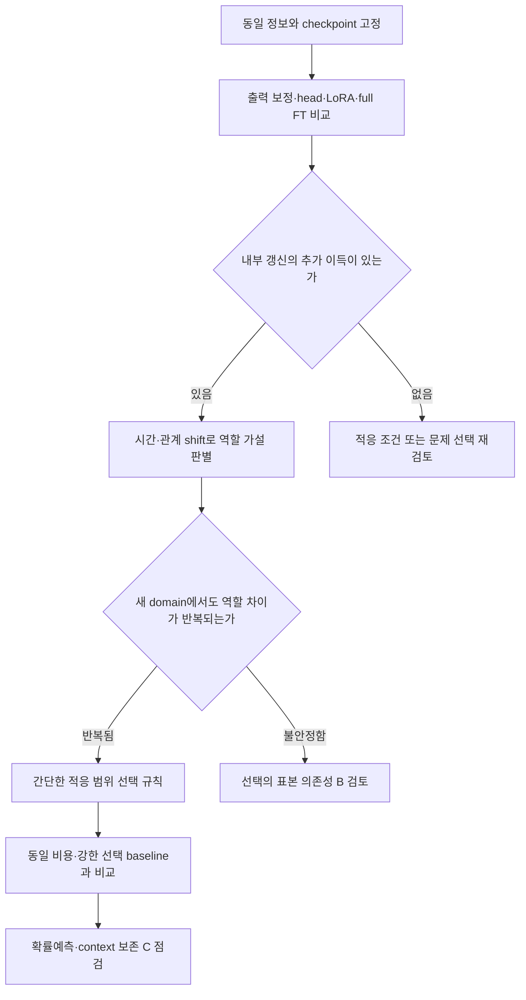

# 시계열 Foundation Model PEFT 사전조사와 연구 방향

기준일: **2026-09-07**

목적: 이미 사전학습된 시계열 foundation model을 적은 target 데이터와 제한된 자원으로 적응시키는 연구의 선행연구, 비교 조건, 반증 가능한 가설을 정리한다. [기존 시계열 조사](time_series_research_dossier_20260906.md)의 fine-tuning/adapter 연구군을 확장한 별도 문서다.

**추천하는 출발 질문은 “어떤 분포 변화는 출력 보정으로 충분하고, 어떤 변화는 시간 처리 또는 변수 관계 처리의 갱신을 요구하는가?”이다.** 이를 먼저 관찰하고, 반복되는 차이를 설명할 수 있을 때 필요한 부분만 적응시키는 방법으로 나아간다. 현재 문헌 검토만으로 새 방법의 필요성이나 novelty가 입증된 것은 아니다.

## 1. 조사 범위와 증거 수준

- 대상: forecasting을 중심으로 한 TSFM PEFT, full fine-tuning 비교, covariate adaptation, continual adaptation, 실제 공개 학습 경로. 일반 NLP/CV PEFT는 비교 설계에 필요한 범위만 포함한다.
- 출처: 공식 proceedings·학회 프로그램, arXiv 저자 원문, 저자 저장소·공식 모델 코드. 블로그·검색 요약은 탐색 단서로만 사용했다.
- `[확인: 원문]`: 해당 내용이 논문에 기재됨을 확인했다. 성능은 **저자 보고**이며 독립 재현 수치가 아니다.
- `[확인: 코드]`: 해당 버전의 소스 실행 경로 또는 설치 metadata를 확인했다. 실제 backward나 학습 결과를 확인했다는 의미는 아니다.
- `[추정]`: 문헌·코드에서 도출한 해석. `[가설·미검증]`: 앞으로 실험으로 판별할 주장.
- 핵심 논문은 방법·실험·관련 부록을 읽었으나, 모든 수식·표·코드의 전수 감사는 아니다. Time-PEFT는 공식 초록·코드를 확인했지만 본문 접근이 막혔다. TS-PET는 초록 수준이다.
- 이 문서는 목적에 맞춘 사전조사다. 완전한 체계적 문헌고찰, 분야 전체의 빈도 조사, SOTA 재산출이 아니다. 공개 코드 미확인은 코드가 세상에 없다는 뜻이 아니다.
- 이번 작업에서는 **학습·패키지 설치·새 실험을 실행하지 않았다.** 연구 후보와 아래 실험 설계는 아직 실행 결과가 아니다.

총 29개 항목을 T(시계열 적응 논문 17개), G(일반 PEFT·보존 비교 논문 8개), M(공식 모델·구현 3개), R(본문 미확인 공개 artifact 1개)로 구분한다. 같은 식별자의 기계 판독 목록은 [PEFT 카탈로그](time_series_peft_paper_catalog_20260907.json)에 있다. 모델 구현과 workshop·preprint를 본학회 PEFT 논문 수로 합산하면 안 된다.

## 2. 먼저 분리해야 할 네 가지 문제

### 2.1 무엇을 바꾸는가와 왜 바꾸는가는 다르다

사용자가 정리한 8개 축에서 PEFT는 주로 **5. Adaptation / Fine-tuning**에 해당한다. 그러나 연구 가치는 “5번 축을 택했다”에서 생기지 않는다. 어떤 오류를 해결하는지 먼저 정해야 한다.

```text
관찰할 현상                  원인 후보                         가능한 개입
예측 수준·분산이 어긋남       출력 scale / bias 불일치           출력 보정, head tuning
주기·지연에 따라 오류가 바뀜  시간 의존성 또는 표현 불일치       temporal-module PEFT
변수를 함께 넣으면 악화      관계 변화, 잡음, group 구성 변화   group-module PEFT
짧은 적응 뒤 미래에서 악화    모델 선택 불안정, 과적합, 시점 변화 rank/범위 제한, 검증 개선
점오차와 구간 품질이 엇갈림   objective·분포 head·shift          proper-score 적응, calibration
```

이 대응은 **진단 가설**이지 증명된 일대일 관계가 아니다. 예를 들어 group attention에도 시간 표현이 들어가며, head가 시간 구조의 오류를 일부 흡수할 수 있다. 모듈 이름만 보고 오류 원인을 확정하면 안 된다.

### 2.2 세 가지 “효율”을 분리한다

1. **파라미터 효율:** 저장할 adapter와 학습 파라미터가 작다.
2. **계산 효율:** 학습 시간·peak memory·추론 지연이 작다.
3. **표본 효율:** 같은 target 관측 정보에서 더 잘 적응한다.

LoRA의 한 행렬 업데이트는 보통 `W' = W + (alpha/r) BA`이며 추가 파라미터는 `r(d_in+d_out)`이다. 이는 작은 저장량을 설명하지만 전체 forward/backward 비용이 같은 비율로 줄어든다는 뜻은 아니다. 앞쪽 adapter를 학습하려면 동결된 뒤쪽 연산도 입력 gradient를 전달해야 할 수 있다. 서로 다른 모듈에 같은 rank를 사용해도 전체 학습 파라미터 수는 다르다. [G02](https://arxiv.org/abs/2106.09685), [G06](https://arxiv.org/abs/2308.03303).

### 2.3 Target 적응과 새 정보를 넣는 적응을 구분한다

UniCA·ChronosX·covariate-aware CoRA는 외생변수나 이질적 정보를 모델에 전달한다. 그 모델이 target-only SFT를 이겨도, 그 차이를 PEFT의 정규화 효과라고 해석할 수 없다. 반대로 이미 변수들을 함께 처리하는 native multivariate FM에서는 “변수 관계를 처음 넣는다”는 동기를 그대로 가져올 수 없다. [T03](https://proceedings.iclr.cc/paper_files/paper/2026/hash/0b5eb45a22ff33956c043dd271f244ea-Abstract-Conference.html), [T15](https://proceedings.mlr.press/v258/arango25a.html).

### 2.4 Frozen weight와 기능 보존을 구분한다

Base weight를 고정해도 adapter를 켠 예측 함수는 달라진다. 보존해야 할 것은 배포할 함수의 성능이다. Adapter를 끄면 원모델로 돌아간다는 사실만으로 새 기간·다른 series·다른 context에서 일반화가 유지된다고 주장하면 안 된다. 순차 적응의 이전 task 성능, target의 다음 기간 성능, 원래 zero-shot 능력은 별도로 정의한다. [T09](https://arxiv.org/html/2510.00809v1), [G08](https://openaccess.thecvf.com/content/CVPR2022/html/Wortsman_Robust_Fine-Tuning_of_Zero-Shot_Models_CVPR_2022_paper.html).

## 3. 기존 작업에서 이어받을 것과 새로 확인할 것

[확인: 로컬 기록] 기존 연구는 forecast-query tokenization, observation resolution, uncertain future covariates와 이후 TSFM gap·specialist 비교를 다뤘다. 이들은 **같은 pretrained checkpoint에서 PEFT와 full FT를 비교한 실험이 아니다.** 따라서 이전의 음성 결과를 PEFT의 반증으로 옮길 수 없다.

최근 long-horizon specialist closure에서는 specialist ensemble이 10개 task 모두 TSFM envelope에 뒤졌다. 중앙 상대 개선율은 development −25.47%, holdout −48.47%였다. 그러나 학습 이력이 짧은 조건에서 scratch specialist를 학습한 결과다. 이것이 pretrained model을 target에 적응시킬 여지가 없다는 증거는 아니다. 기록 자체에도 specialist의 linear AR 대비 우위가 안정적이지 않다는 계약 해석의 긴장이 명시돼 있다. 근거: [당일 history](../history/2026-09-07.md), [closure verdict](../../results/tsfm_long_horizon_specialist_closure_v1/verdict.json).

[추정] 유지할 가장 좋은 자산은 방법 이름이 아니라 **같은 정보로 비교하기, 간단한 대조군 먼저 두기, 실패 원인을 분리하기**다. 개선할 점은 여러 가설을 각각 완성된 방법으로 만든 뒤 benchmark 승패로만 판단하는 순서다. 이번에는 하나의 관찰을 두세 원인으로 나누고, 원인들이 서로 다른 결과를 예측하는 작은 실험부터 설계하는 것이 낫다.

기존에 여러 번 본 dataset·family는 이제 연구 개발 자료다. 새 방법을 고른 뒤 같은 자료를 “처음 보는 holdout”으로 부르면 안 된다. 기존 [contamination matrix](../../results/tsfm_benchmark_gap_discovery_v1/contamination_matrix.csv)의 상태도 참고하되, `unknown`을 clean 또는 contaminated로 바꾸지 않는다. 공식 corpus 제외 주장은 독립 검증과 구별한다.

## 4. 시계열 PEFT·적응 핵심 문헌

### T01 — Time-PEFT: Temporal and Multichannel Complexity-Based Fine-Tuning for Time-Series Foundation Models

- **상태:** ICML 2026 poster. 공식 프로그램 metadata 확인.
- **기전:** temporal/multichannel complexity 진단과 frequency·channel adapter. 공개 구현은 MOMENT에 encoder LoRA와 forecasting head 학습을 함께 사용한다.
- **확인 범위:** 공식 초록, 공개 `run.py` 정적 흐름. OpenReview 본문/PDF는 403으로 확보하지 못했다.
- **핵심 근거:** 코드에서 backbone을 동결하고 frequency adapter·채널별 projection·head·LoRA를 학습한다. Channel adapter는 공유 down projection과 채널별 up projection이며, 그 경로에서 다른 채널 값을 직접 집계하는 연산은 확인되지 않았다. 채널별 파라미터와 채널 간 mixing은 다르다.
- **해석 한계:** 본문의 split·HPO·수치·ablation은 미확인. “최대 개선율”을 비교 수치로 채택하지 않는다. 공개 early-stopping 경로의 best checkpoint 복구 여부도 재현 전에 점검해야 한다.
- **우리에게 주는 질문:** 복잡도 측정, 주파수 adapter, 채널별 adapter 자체는 새 출발점으로 약하다. Native group mechanism의 적응 실패를 별도로 입증해야 한다.
- **출처:** [ICML](https://icml.cc/virtual/2026/poster/61767), [OpenReview](https://openreview.net/forum?id=n8seTOinYs), [고정 코드](https://github.com/kaist-dmlab/TimePEFT/blob/ea4e7e1887bb35587bab7ea93e2af3685ac55852/run.py).

### T02 — CoRA: Boosting Time Series Foundation Models for Multivariate Forecasting through Correlation-aware Adapter

- **상태:** ICLR 2026 본학회. Cheng et al.의 correlation-aware CoRA다.
- **기전:** time-varying/invariant low-rank correlation, 양·음 관계 projection, partial-correlation contrastive objective를 forecasting에 결합한다.
- **확인 범위:** 최종 공식 PDF 방법·실험·App.D/E/F 및 공개 코드. 최종 Table 1 수치는 arXiv v1과 달라 최종본을 우선했다.
- **핵심 근거:** 10 datasets, 5% training, horizon 96/192/336/720 평균. Table 1은 GPT4TS/CALF/UniTime/MOMENT/Timer/TTM을 다룬다. 저자 보고 Timer ETTh1 MSE .450→.421.
- **해석 한계:** adapter라는 명칭만으로 frozen-backbone PEFT로 분류하면 안 된다. 공개 active `plugin` 경로는 freeze 호출이 주석이며 optimizer에 `self.model.fm.parameters()`를 등록한다. 별도 plugin 파라미터 등록 및 논문상 inference 계산 생략과 공개 forward의 일치를 먼저 해결해야 한다. 이 불일치만으로 논문 성능이 잘못됐다고 단정하지 않는다.
- **우리에게 주는 질문:** 관계 추가 효과, backbone 학습 효과, auxiliary loss 효과를 분리했는가?
- **출처:** [최종 PDF](https://proceedings.iclr.cc/paper_files/paper/2026/file/ae3e173398d6e43fea63cbcc16fbaa98-Paper-Conference.pdf), [optimizer 고정 코드](https://github.com/decisionintelligence/CoRA/blob/1292f7b114e26d477675291004acb018e81896ca/ts_benchmark/baselines/pre_train/adapters_for_plugin.py#L343), [forward 고정 코드](https://github.com/decisionintelligence/CoRA/blob/1292f7b114e26d477675291004acb018e81896ca/ts_benchmark/plugin/plugin.py#L161).

### T03 — UniCA: Unified Covariate Adaptation for Time Series Foundation Model

- **상태:** ICLR 2026 본학회; arXiv 최초 2025-06, v2 2026-03.
- **기전:** 이질적 공변량을 시계열 표현으로 바꾸고 frozen FM 전후에 fusion한다. 과거 관측과 미래에 알려진 공변량을 구분한다.
- **확인 범위:** 최종 PDF 방법·실험·관련 부록 및 공개 동결 경로.
- **핵심 근거:** 주 backbone은 Chronos-Bolt-base와 TimesFM 2.0 500M. SFT는 target-only(App.B.4). Fusion 위치별 차이는 작다고 보고한다(App.G.1). Noise covariate 추가 실험은 informative covariate가 misleading해지는 drift와 다르다. MOMENT 확장은 imputation이다.
- **해석 한계:** 추가 정보와 PEFT 효과를 분리해야 하며 baseline default와 자체 HPO가 동일 예산이라는 보장은 없다. 동결 코드는 확인했지만 2025-09 snapshot이 2026 최종 부록 전체를 재현한다고 확정할 수 없다.
- **우리에게 주는 질문:** 이미 공변량을 받는 FM에 같은 정보를 주어도 새 적응이 필요한가?
- **출처:** [최종 PDF](https://proceedings.iclr.cc/paper_files/paper/2026/file/0b5eb45a22ff33956c043dd271f244ea-Paper-Conference.pdf), [고정 adapter 코드](https://github.com/hanlu-nju/UniCA/blob/727d3670e9b7993472b19f47e42ac0d75142b127/models/adapter/unica/module.py#L72), [동결 구현](https://github.com/hanlu-nju/UniCA/blob/727d3670e9b7993472b19f47e42ac0d75142b127/models/wrapper/fm/chronos_wrapper.py#L129).

### T04 — CoRA: Covariate-Aware Adaptation of Time Series Foundation Models

- **상태:** 2025-10 arXiv 공개본. 정식 채택 미확인. Qin et al.; T02와 다른 논문이다.
- **기전:** frozen TS/텍스트/이미지 feature, 학습 공변량 가중치, head 전후 adaLN scale/shift, zero initialization.
- **확인 범위:** arXiv v1 본문·관련 부록. 공식 구현 미확인.
- **핵심 근거:** Sundial을 중심으로 TimesFM/Chronos-Bolt/FlowState를 추가한다. EPF·multimodal·few-shot 평가가 있다. Table 5 EPF 평균 MSE는 CoRA .278, target-only SFT .296으로 저자 보고한다.
- **해석 한계:** extra covariate 정보와 adaptation 효과가 함께 달라진다. GCE라는 명칭의 학습 가중치가 인과식별을 보장하지 않는다. Exact checkpoint revision·matched compute는 미확인.
- **우리에게 주는 질문:** 간단한 scale/shift head 적응과 공변량 주입을 통제한 뒤에도 내부 PEFT 이득이 남는가?
- **출처:** [원문](https://arxiv.org/html/2510.12681v1), [OpenReview](https://openreview.net/forum?id=Y7IZlDttMM).

### T05 — Beyond LoRA: Exploring Efficient Fine-Tuning Techniques for Time Series Foundational Models

- **상태:** NeurIPS 2024 TSALM workshop. 본학회 논문이 아니다.
- **기전:** Chronos-T5 계열에 BitFit, LayerNorm tuning, VeRA, FourierFT를 적용·비교한다.
- **확인 범위:** arXiv v1 본문·부록, workshop PDF. 전용 공식 코드 미확인.
- **핵심 근거:** ICU 생체신호 forecasting. FourierFT 2,400 parameters는 Chronos Tiny 사례이며, 함께 언급되는 700K는 N-HiTS 파라미터다. Tiny LoRA는 49K, Base LoRA는 442K이므로 모델 크기를 섞어 비교하면 안 된다.
- **해석 한계:** 일부 LoRA/full FT 결과는 이전 연구에서 가져온다. 동일 HPO 비교를 가정할 수 없다. FourierFT의 Fourier 표현은 weight matrix에 대한 것이며 입력 시계열의 계절 주파수를 보존한다는 뜻이 아니다.
- **우리에게 주는 질문:** 일반 PEFT의 단순 이식보다 명확한 시계열 실패 기전이 있는가?
- **출처:** [원문](https://arxiv.org/html/2409.11302v1), [공식 workshop PDF](https://openreview.net/pdf?id=YZJ8Re0gQv).

### T06 — TRACE: Time SeRies PArameter EffiCient FinE-tuning

- **상태:** Neurocomputing 664, article 132098, 2026-02-01. arXiv 최초 2025-03, 읽은 버전 v3.
- **기전:** prediction head 축소와 validation masking으로 추정한 LoRA module 중요도에 따른 선택.
- **확인 범위:** arXiv v3 방법·실험, 출판사 서지정보. 전용 공식 코드 미확인.
- **핵심 근거:** MOMENT-base 중심으로 LP, LP+LoRA, head 축소, AdaLoRA 등을 비교한다. 기본 rank 2, masking과 선택 비용이 포함된다.
- **해석 한계:** head 구조 변경과 adapter 선택의 효과를 분리해야 한다. Validation을 반복 사용하는 구조 선택 비용도 예산에 넣어야 한다. arXiv의 volume 표기와 출판사가 충돌하여 출판사 정보를 채택했다.
- **우리에게 주는 질문:** “중요한 layer에 rank를 배분한다”를 넘어선 새 관찰이 있는가?
- **출처:** [원문](https://arxiv.org/html/2503.16991v3), [출판사](https://www.sciencedirect.com/science/article/pii/S0925231225027705).

### T07 — Adapting Time Series Foundation Models through Data Mixtures (MixFT)

- **상태:** 2026-03 arXiv 공개본; 정식 채택 미확인.
- **기전:** context embedding의 Bayesian GMM으로 데이터를 묶고 domain LoRA와 routing을 학습한다. MixUp과 pretraining replay를 사용한다.
- **확인 범위:** arXiv v1 방법·실험·관련 부록. 전용 공식 코드 미확인.
- **핵심 근거:** Chronos-Bolt-small, Moirai-1.1-R-small; 관련 6 datasets로 학습하고 다른 10 datasets에서 평가한다. Shared adapter 및 여러 mixture 접근이 비교군이다.
- **해석 한계:** target-only adaptation과 정보 조건이 다르다. Adapter library·routing 비용도 있다. 평균 순위 개선이 모든 dataset에서 frozen을 이긴다는 뜻은 아니다.
- **우리에게 주는 질문:** regime별 LoRA를 제안한다면 기존 routing·replay 대비 어떤 실패를 새로 해결하는가?
- **출처:** [원문](https://arxiv.org/html/2603.02840v1).

### T08 — Lost in the Non-convex Loss Landscape: How to Fine-tune the Large Time Series Model? (SFF)

- **상태:** ICLR 2026 본학회. arXiv 등록은 2026-06.
- **기전:** pretrained weight와 variance-controlled random initialization을 보간한 뒤 full fine-tuning한다.
- **확인 범위:** 공식 proceedings, arXiv 방법·실험·관련 부록, 공식 저장소 존재 확인.
- **핵심 근거:** 여러 TSFM에서 FF, LP, LP→FF, 최적화·정규화 대조군과 비교한다. LoRA 비교는 App.A.5.1 Table 10의 **Timer, H=96, rank=8** 설정이다. ETTh1 MSE LoRA .418, FF .367, SFF .355를 보고한다.
- **해석 한계:** 모든 backbone에서 LoRA를 이겼다는 결과가 아니다. SFF 자체는 PEFT가 아니다.
- **우리에게 주는 질문:** PEFT의 이득이 low-rank 제한 때문인지, full FT의 불리한 최적화 설정 때문인지 분리했는가?
- **출처:** [공식 proceedings](https://proceedings.iclr.cc/paper_files/paper/2026/hash/6255f22349da5f2126dfc0b007075450-Abstract-Conference.html), [원문](https://arxiv.org/html/2606.08578v1), [공식 코드](https://github.com/Meteor-Stars/SFF).

### T09 — Are Time Series Foundation Models Susceptible to Catastrophic Forgetting?

- **상태:** 2025-10 arXiv 공개본; 정식 채택 미확인.
- **기전:** TimesFM을 합성 sine-mixture A 다음 B에 순차 fine-tuning하며 적응과 이전 성능 유지의 관계를 분석한다.
- **확인 범위:** arXiv v1 본문 실험·한계.
- **핵심 근거:** learning rate·epoch에 따라 B 개선과 A 악화가 함께 나타난다.
- **해석 한계:** 단일 backbone, 합성 데이터, 제한된 전이이며 PEFT 대 full FT의 체계적 비교가 아니다. 원래 모든 pretraining 지식의 손실을 측정한 것으로 읽지 않는다.
- **우리에게 주는 질문:** 유지할 능력을 이전 적응 task, 새로운 target 기간, 다른 series 중 무엇으로 정의하는가?
- **출처:** [원문](https://arxiv.org/html/2510.00809v1).

### T10 — ORTCL: Towards Continual Learning of Time Series Foundation Models on Streaming Data via Orthogonal Rotation

- **상태:** AAAI 2026 본학회; 40(28):23541–23549, 공식 출판 2026-03-14.
- **기전:** 입력·출력 feature space의 orthogonal rotation으로 기존 metric structure를 유지하며 순차 적응한다.
- **확인 범위:** 공식 본문 method/setup/table 및 일부 부록. 전체 비용·코드 재현성 감사는 하지 않았다.
- **핵심 근거:** Timer 중심, 부록 Moirai/PatchTST. 단일·다중 domain stream에서 비교한다. 실험 설명은 downstream dataset을 제외한 UTSD-12G 사전학습을 사용한다.
- **해석 한계:** 배포된 off-the-shelf checkpoint를 그대로 target-only 적응시키는 조건과 다르다. 본문의 retention 주장과 우리 deployment 조건을 맞춰야 한다.
- **우리에게 주는 질문:** 직교 제약이나 망각 방지라는 이름만으로 차별화할 수 있는가?
- **출처:** [공식 논문](https://ojs.aaai.org/index.php/AAAI/article/view/39526), [공식 PDF](https://ojs.aaai.org/index.php/AAAI/article/view/39526/43487).

### T11 — Probabilistic Forecasting for Building Energy Systems using Time-Series Foundation Models

- **상태:** Energy and Buildings 348, 116446; DOI 10.1016/j.enbuild.2025.116446. Crossref publication year 2025, 최초 preprint 2025-05.
- **기전:** Chronos의 q/v LoRA와 full FT를 building energy probabilistic forecasting에 적용한다.
- **확인 범위:** 저자 원문, 출판사·연구기관 서지정보. 날짜 표기가 혼재하여 DOI/volume을 기준으로 기록했다.
- **핵심 근거:** 일본 한 건물 8 zone·4 season, 15분 간격. LoRA rank 4/16/64, 1,000 iterations; point와 quantile·interval 점수를 함께 비교한다.
- **해석 한계:** LoRA가 경쟁력 있는 사례이지만 일부 point metric은 full FT가 더 좋다. 장비별 속도 보고를 현재 GPU 예상치로 환산하지 않는다. 단일 건물 결과로 일반적인 calibration 보존을 주장할 수 없다.
- **우리에게 주는 질문:** 새 adapter가 보통의 LoRA보다 필요한 이유를 먼저 확인했는가?
- **출처:** [원문](https://arxiv.org/html/2506.00630v1), [출판사](https://www.sciencedirect.com/science/article/abs/pii/S0378778825011764), [저자 기관](https://www.merl.com/publications/TR2026-030).

### T12 — Time Series Foundation Models for Process Model Forecasting

- **상태:** CAiSE 2026 본학회 채택 목록 확인; 최초 preprint 2025-12.
- **기전:** process event log의 일별 directly-follows count 예측에 TSFM의 zero-shot·LoRA·full FT를 비교한다.
- **확인 범위:** arXiv v1 실험, 공식 채택 목록·코드.
- **핵심 근거:** 4개 public log, 7일 예측, 60/20/20 시간 분리. Chronos-Bolt/Moirai LoRA는 rank 2, q/k/v/o, LR 1e−4, 3 epochs. Chronos-2 full FT도 포함한다.
- **해석 한계:** 이득은 작거나 음수인 조건도 있다. 제한된 설정이 충분한 HPO 뒤의 성능 상한은 아니다. Series 간 표준편차와 학습 seed 불확실성을 구별한다.
- **우리에게 주는 질문:** target에 특화하면 언제나 유리하다는 가정을 버리고 frozen baseline을 유지했는가?
- **출처:** [원문](https://arxiv.org/html/2512.07624v1), [공식 채택 목록](https://caise26.polimi.it/?page_id=948), [공식 코드](https://github.com/YongboYu/pmf-tsfm).

### T13 — Dual Adaptation of Time-Series Foundation Models for Financial Forecasting

- **상태:** ICML 2025 1st Workshop on Foundation Models for Structured Data. 본학회 논문이 아니다.
- **기전:** frozen TimesFM에 shared Generalizer Adapter와 asset Identity Signature를 학습하며 후자는 추론 때 제거한다.
- **확인 범위:** 공식 workshop PDF method·실험. 공식 코드 미확인.
- **핵심 근거:** SP100 학습 후 겹치지 않는 SP500 assets를 평가하며 LoRA/LN/bias/full FT 등과 비교한다. 대표 OOD MSE는 제안 20.65, LoRA 20.97, full FT 20.79로 저자 보고한다.
- **해석 한계:** 단일 시장·backbone, raw-price MSE와 HPO 조건을 검토해야 한다. 작은 차이를 일반적인 PEFT OOD 실패로 확대하지 않는다.
- **우리에게 주는 질문:** asset identity에 대한 과적합과 시간적 distribution shift를 구분했는가?
- **출처:** [공식 PDF](https://openreview.net/pdf?id=SSdBpVNYxd).

### T14 — TS-PET: A Novel Framework for Fine-Tuning Pretrained Time-Series Models

- **상태:** Big Data, OnlineFirst 2026-04-28.
- **기전:** 경량 prediction module 및 parameter synergy를 고려한 stochastic pruned LoRA/rank allocation을 초록에서 제안한다.
- **확인 범위:** 출판사 초록·참고문헌. 본문 상세 실험 접근 미확보.
- **핵심 근거:** adaptive LoRA와 head 관련 접근을 비교 대상으로 명시한다.
- **해석 한계:** backbone·동일 예산·split·코드·재현성을 깊게 확인하지 못했다. 핵심 수치 증거가 아니라 중복 가능성 확인 항목이다.
- **우리에게 주는 질문:** layer/rank 선택을 주제로 정하기 전에 이 논문의 본문까지 확보해야 한다.
- **출처:** [출판사](https://journals.sagepub.com/doi/full/10.1177/2167647X261439005).

### T15 — ChronosX: Adapting Pretrained Time Series Models with Exogenous Variables

- **상태:** AISTATS 2025 본학회, PMLR 258:2242–2250.
- **기전:** input/output injection block으로 과거·미래 공변량을 pretrained model에 넣는다. Adapter-only와 full-finetuned 변형을 구분한다.
- **확인 범위:** 공식 proceedings, arXiv v1 method·variant·covariate ablation. 논문이 연결한 코드 branch의 완전 재현성은 미확인.
- **핵심 근거:** 32개 합성 데이터 및 실제 데이터를 다룬다. 공변량을 제거한 adapter 대조가 있어 정보 추가와 layer 추가를 분리하는 설계에 참고된다.
- **해석 한계:** ChronosX를 Chronos-2의 내장 covariate/group attention과 동일시하면 안 된다. 추가 공변량을 가진 모델 대 target-only 모델의 차이는 PEFT만의 효과가 아니다.
- **우리에게 주는 질문:** 단순 input/output adapter와 강한 residual correction을 넘어서는 문제가 있는가?
- **출처:** [공식 proceedings](https://proceedings.mlr.press/v258/arango25a.html), [원문](https://arxiv.org/html/2503.12107v1), [논문 연결 코드](https://github.com/amazon-science/chronos-forecasting/tree/chronosx).

### T16 — Market-Information-Aware Gated-LoRA of Foundation Models for Transferable Day-Ahead Electricity Price Forecasting

- **상태:** 2026-08-11 arXiv 공개본; 정식 채택 미확인.
- **기전:** Chronos-2의 source-market rank-8 LoRA를 학습한 뒤 adapter를 동결하고 시장 상태로 adapter 강도를 조절하는 gate를 학습한다.
- **확인 범위:** arXiv v1 method·ablation·limitations. 공식 코드·데이터 공개 미확인.
- **핵심 근거:** Target-market label 없이 4개 시장의 leave-one-market-out 평가. Table III MAE는 Source-LoRA 76.98, 실제 gate 74.633, shuffled-state gate 74.873이다. III-C4는 MAE/CRPS 개선과 함께 PICP80 하락·coverage deviation 증가를 명시한다.
- **해석 한계:** State 연결을 깨도 개선 대부분이 남는다. Gate 전체 이득을 상태 해석의 증거로 쓰면 안 된다. Target-only 적응과 source-transfer는 다른 조건이며 미래 시장 정보의 실제 공개 시점도 중요하다.
- **우리에게 주는 질문:** 조건부 LoRA 강도는 이미 직접 선행연구가 있다. 상태가 필요한 이유를 shuffled-state·constant gate와 분리해야 한다.
- **출처:** [원문](https://arxiv.org/html/2608.11359v1).

### T17 — OpenMHC: Accelerating the Science of Wearable Foundation Models

- **상태:** 2026-07 arXiv 공개본; 읽은 버전 v3. 정식 채택 미확인.
- **기전:** wearable 데이터·benchmark와 여러 모델 비교. Chronos-2의 일반 LoRA를 실제 adaptation baseline으로 사용한다.
- **확인 범위:** v3 forecasting 결과·Table 35, 공식 repository의 공개 범위.
- **핵심 근거:** 19 channels, 14일 input→24시간 예측. LoRA rank 16/alpha 16, 25 epochs, 15-trial Bayesian HPO. Table 4 aggregate skill은 frozen 36.4, FT 37.6으로 저자 보고한다.
- **해석 한계:** 새 PEFT 방법 논문이 아니다. v3에서 Table 34는 Toto이며 Chronos-2는 Table 35다. 공식 공개 XS와 논문 전체 데이터 규모를 구분해야 한다. 구간의 겹침 여부만으로 paired 효과의 유의성을 판정하지 않는다.
- **우리에게 주는 질문:** Native multichannel의 충분히 조정된 일반 LoRA와 비교했는가? 데이터 접근이 가능하면 cross-person 평가 후보가 될 수 있다.
- **출처:** [원문 v3](https://arxiv.org/html/2607.16235v3), [공식 코드](https://github.com/AshleyLab/OpenMHC).

### R01 — TSFM-PEFT-Bench: A Cross-Architecture Benchmark for PEFT Selection in Time Series Foundation Models

- **상태:** Hugging Face 공개 artifact. NeurIPS 2026 Datasets and Benchmarks 제출은 카드의 자가 신고이며 채택 확인이 아니다.
- **기전:** 카드상 cross-architecture PEFT 비교·shift profile 기반 선택. 공개 결과 파일에 selector 평가가 있다.
- **확인 범위:** HF card·파일 목록·일부 JSON. Revision `634649d2275084dd87bb6afc60702471a57c7ce6`.
- **핵심 근거:** 공개 HF 파일 목록에는 결과·manifest가 있지만 카드가 소개한 manuscript·학습 source는 확인되지 않았다. 연결된 익명 repository API는 조사 시 `not_connected`를 반환했다.
- **해석 한계:** 본문·코드·전처리·제외 기준을 감사할 수 없어 검증된 benchmark 결론으로 사용하지 않는다. Run 수를 독립 domain 수로 세지 않는다.
- **우리에게 주는 질문:** PEFT selector·rank/locus sweep의 설계 중복을 확인할 공개물이다. 후보를 확정하기 전 원문 확보가 필요하다.
- **출처:** [카드](https://huggingface.co/datasets/EvalData/tsfm-peft-bench), [고정 manifest](https://huggingface.co/datasets/EvalData/tsfm-peft-bench/blob/634649d2275084dd87bb6afc60702471a57c7ce6/results/paper_manifest.json), [고정 selector 결과](https://huggingface.co/datasets/EvalData/tsfm-peft-bench/blob/634649d2275084dd87bb6afc60702471a57c7ce6/results/selector_evaluation.json).

## 5. 일반 PEFT에서 반드시 가져와야 할 비교 관점

아래 성과는 주로 NLP/CV에서 나온 것이다. 그대로 시계열에서 검증된 기전으로 서술하지 않는다. 모든 방법을 한꺼번에 재현할 필요는 없으며, 선택한 가설과 직접 경쟁하는 방법만 추가한다.

### G01 — Parameter-Efficient Transfer Learning for NLP

- **상태:** ICML 2019 본학회.
- **기전:** pretrained model을 동결하고 작은 bottleneck adapter를 학습한다.
- **확인 범위:** 공식 proceedings·초록.
- **해석 한계:** NLP 결과다. 일반적인 비선형 adapter는 LoRA처럼 단순 weight merge가 되지 않아 추론 비용이 달라질 수 있다.
- **출처:** [PMLR](https://proceedings.mlr.press/v97/houlsby19a.html).

### G02 — LoRA: Low-Rank Adaptation of Large Language Models

- **상태:** 2021 arXiv 원문; ICLR 2022 발표 논문.
- **기전:** 동결 weight에 low-rank increment를 학습하며 배포 시 선형 weight에 합칠 수 있다.
- **확인 범위:** 저자 arXiv·공식 구현 자료.
- **해석 한계:** 저장 파라미터 절감과 학습 전체 비용 절감은 다르다. 공식 TSFM default LoRA가 이미 어디까지 적응하는지 먼저 확인해야 한다.
- **출처:** [원문](https://arxiv.org/abs/2106.09685), [공식 저장소](https://github.com/microsoft/LoRA).

### G03 — Adaptive Budget Allocation for Parameter-Efficient Fine-Tuning (AdaLoRA)

- **상태:** ICLR 2023; arXiv metadata 확인.
- **기전:** 중요도에 따라 업데이트 행렬별 rank 예산을 배분한다.
- **확인 범위:** arXiv 원문 요약·서지정보.
- **해석 한계:** “layer마다 다른 rank” 자체는 이미 일반 PEFT의 연구 주제다. 시계열 특유의 추정 실패를 보여줘야 한다.
- **출처:** [원문](https://arxiv.org/abs/2303.10512).

### G04 — DoRA: Weight-Decomposed Low-Rank Adaptation

- **상태:** ICML 2024 본학회.
- **기전:** weight magnitude와 direction을 분리해 적응한다.
- **확인 범위:** 공식 proceedings·초록.
- **해석 한계:** 새 scale-aware TS adapter의 유용한 대조군이지만 시계열 성능을 이번에 재현하지 않았다.
- **출처:** [PMLR](https://proceedings.mlr.press/v235/liu24bn.html).

### G05 — Parameter Efficient Fine-tuning via Explained Variance Adaptation (EVA)

- **상태:** NeurIPS 2025 본학회.
- **기전:** activation SVD 기반 초기화와 설명 분산에 따른 rank 재배분.
- **확인 범위:** 공식 proceedings·초록.
- **해석 한계:** activation 기반 rank 선택도 선행연구가 있다. 시계열 residual·독립 기간 부족의 영향은 별도 검증해야 한다.
- **출처:** [공식 proceedings](https://proceedings.neurips.cc/paper_files/paper/2025/hash/41d33bd41fd44bd9dba0e092047cf213-Abstract-Conference.html).

### G06 — LoRA-FA: Efficient and Effective Low Rank Representation Fine-tuning

- **상태:** 2023 arXiv 공개본; 이번 조사에서 정식 venue 미확인.
- **기전:** LoRA의 A를 고정하고 B만 학습하여 activation memory 요구를 줄인다.
- **확인 범위:** 현재 arXiv 제목·초록.
- **해석 한계:** 모든 backbone activation이 사라지는 것은 아니다. 메모리 효율을 주장할 경우 고려할 대조군이다.
- **출처:** [원문](https://arxiv.org/abs/2308.03303).

### G07 — Fine-Tuning can Distort Pretrained Features and Underperform Out-of-Distribution

- **상태:** 2022 arXiv 원문; ICLR 2022 발표 논문.
- **기전:** full FT의 표현 변형과 OOD 성능 관계를 분석하고 linear probe 뒤 fine-tuning하는 LP-FT를 검토한다.
- **확인 범위:** 저자 원문 요약·주장 범위.
- **해석 한계:** CV 및 제한된 이론 설정이다. 시계열에서 head-first 적응이 유리하다는 근거는 아직 아니다.
- **출처:** [원문](https://arxiv.org/abs/2202.10054).

### G08 — Robust Fine-Tuning of Zero-Shot Models (WiSE-FT)

- **상태:** CVPR 2022 본학회.
- **기전:** zero-shot와 fine-tuned weight를 보간하여 target/OOD 성능의 균형을 조절한다.
- **확인 범위:** 공식 proceedings·초록.
- **해석 한계:** CV 결과다. 우리 연구에서는 adapter strength shrinkage나 forecast mixture를 새 복잡한 보존 기법보다 먼저 비교한다. 두 방식은 비선형 모델에서 서로 같은 연산이 아니다.
- **출처:** [CVF](https://openaccess.thecvf.com/content/CVPR2022/html/Wortsman_Robust_Fine-Tuning_of_Zero-Shot_Models_CVPR_2022_paper.html).

## 6. 실제 시작할 수 있는 모델과 구현 경계

### M01 — Chronos-2: From Univariate to Universal Forecasting / 공식 fine-tuning 구현

- **상태:** 2025-10 arXiv 모델 논문 및 현재 공식 OSS. 로컬 chronos-forecasting 2.3.1.
- **기전:** 시간 attention과 group attention으로 target·관련 series·공변량을 처리한다. 공식 `fit`에 full/LoRA 모드가 있다.
- **확인 범위:** 공식 repository·pipeline 문서, 설치 metadata와 로컬 pipeline/model/layers/loss 정적 추적.
- **해석 한계:** 실제 PEFT backward·GPU 메모리·최종 성능은 미측정. 아래 구현 점검 결과를 따른다.
- **출처:** [논문](https://arxiv.org/abs/2510.15821), [공식 pipeline](https://github.com/amazon-science/chronos-forecasting/blob/main/src/chronos/chronos2/pipeline.py), [공식 저장소](https://github.com/amazon-science/chronos-forecasting).

### M02 — TimesFM 2.5 / TimesFM 3 공식 구현

- **상태:** 공식 모델·소프트웨어 자료. 로컬 timesfm 3.0.1.
- **기전:** TimesFM 3는 native multivariate 기능을 제공한다. 공개 LoRA fine-tuning 예제는 TimesFM **2.5** 경로다.
- **확인 범위:** 공식 README·finetuning 예제, 로컬 TimesFM 3 forward/decode 경로.
- **해석 한계:** 2.5 예제를 3의 end-to-end PEFT 지원으로 인용하면 안 된다. 3의 raw forward는 존재하지만 학습 loss/mask/loader/backward의 검증은 별도다. 3 모델 weight 사용 조건도 코드 라이선스와 별도로 확인해야 한다.
- **출처:** [공식 저장소](https://github.com/google-research/timesfm), [2.5 LoRA 예제](https://github.com/google-research/timesfm/tree/master/timesfm-forecasting/examples/finetuning).

### M03 — TiRex-2: Generalizing TiRex to Multivariate Data and Streaming / 공식 구현

- **상태:** 2026-07 arXiv 및 공식 OSS. 로컬 tirex-2 0.2.1.
- **기전:** temporal xLSTM과 변수 attention을 결합한 multivariate forecaster.
- **확인 범위:** 공식 논문·문서와 로컬 raw forward/predict 경로. 기존 프로젝트의 inference 실행 기록.
- **해석 한계:** 공개 제품 설명의 fine-tuning은 Pro 확장이다. Raw forward가 있으므로 연구자가 학습을 구현할 수 없다는 뜻은 아니다. 다만 Windows의 커널·컴파일 환경과 backward가 검증되지 않아 첫 PEFT backbone으로는 준비 비용이 크다.
- **출처:** [논문](https://arxiv.org/abs/2607.01204), [공식 문서](https://nx-ai.github.io/tirex-2/introduction/), [공식 코드](https://github.com/NX-AI/tirex-2).

### 6.1 로컬에서 확인한 중요한 사실

확인 대상은 기존 `.venv-tsfm`이다. 시스템 site-packages를 참조하므로 패키지 위치가 가상환경 밖일 수 있다.

```text
Python                3.11.16
chronos-forecasting    2.3.1
timesfm               3.0.1
tirex-2               0.2.1
torch                 2.11.0+cu128
transformers          5.16.1
peft                  미설치
```

**[확인: 코드] 현재 Chronos-2 2.3.1은 `peft`가 없는데 LoRA 모드를 요청하면 경고 후 full FT로 fallback한다.** 따라서 나중에 실험할 때는 import 가능 여부와 실제 trainable parameter 목록을 assert하고, 저장 전후 tensor 차이로 동결 여부를 검사해야 한다. “인자에 lora라고 썼다”는 실행 증거가 되지 않는다. 이번에는 설치하거나 학습하지 않았다.

로컬 경로: `C:/Users/User/anaconda3/envs/mlts/Lib/site-packages/chronos/chronos2/pipeline.py`의 `fit`, `model.py`의 `Chronos2EncoderBlock`·`_compute_loss`, `layers.py`의 `TimeSelfAttention`·`GroupSelfAttention`.

[확인: 코드] 공식 기본 LoRA는 `r=8`, `alpha=16`이며 다음 suffix를 사용한다.

```text
self_attention.q
self_attention.k
self_attention.v
self_attention.o
output_patch_embedding.output_layer
```

Time와 group layer 모두 내부 이름이 `self_attention`이다. 따라서 기본 설정은 temporal-only가 아니며 두 경로와 output layer를 대상으로 한다. 연구 구현 시 실제 `named_modules()`와 PEFT 적용 후 목록을 다시 확인해야 한다. 후보 경로는 `encoder.block.<i>.layer.0`(time), `.layer.1`(group)이다. PEFT wrapper prefix와 허용 module type은 실체로 검증한다.

추가로 확인한 경계:

- 공식 loss는 quantile/pinball 계열이며 future covariate 위치를 target loss에서 제외한다. “MSE 대신 quantile loss를 넣는다”만으로 새 기여가 되지 않는다.
- 기본 LR은 full FT와 LoRA에 동일하게 최적인 값이 아니다. 문서도 LoRA에 더 높은 LR을 권고한다.
- `validation_inputs=None`이 기본이며 이때 validation-based model selection이 없다. 비교 실험에서는 시간 분리된 validation과 checkpoint 선택을 명시해야 한다.
- Batch size는 target·covariate series 수를 포함한다. 변수 수가 바뀌면 같은 숫자의 batch가 같은 예측 문제 수를 뜻하지 않는다.
- `fit`은 기존 모델을 유지하고 학습할 모델을 새로 복사한다. PEFT parameter 수만으로 peak memory를 예측할 수 없다.

**[추정] 첫 실험은 Chronos-2가 적절하다.** 공개 fit, native group/time 구분, 확률 loss가 연결돼 있기 때문이다. Chronos-2-small이나 synthetic checkpoint는 크기·사전학습 민감도 보조 분석에 유용하지만 독립 architecture 재현은 아니다. Temporal-only 주장은 TimesFM 2.5의 공식 학습 경로로 확장할 수 있으나 group 역할 주장에는 다른 native multivariate 모델의 검증된 학습 경로가 필요하다.

## 7. 추천 연구 가설 세 가지

세 가설을 한 논문에 모두 넣으라는 제안이 아니다. **A로 관찰을 확보한 뒤, 가장 뚜렷한 실패에 따라 B 또는 C로 좁힌다.** 아래 제목은 연구 질문을 명확히 하기 위한 가제다.

### A. 변화의 종류에 따라 필요한 적응 위치가 달라지는가? — 우선순위 1

가제: **Where Should a Multivariate Time-Series Foundation Model Adapt?**

**[가설·미검증]** 작은 target 데이터에서 적응 이득의 일부는 output calibration으로 설명되며, 내부 PEFT의 추가 이득은 temporal dependency 또는 cross-series dependence가 바뀌는 조건에 집중된다. 이 차이가 반복된다면 모든 모듈에 일괄 적용하는 LoRA보다 필요한 기능에 예산을 배분할 근거가 생긴다.

**가설을 지지할 관찰:** 단순 location/scale 변화는 head·출력 보정이 해결하지만, 자체 시간 구조 변화에서는 temporal update, 다른 series와의 관계 변화에서는 group update가 추가 이득을 준다. 이것은 기대 패턴일 뿐 실제 분업이 깨질 수도 있다.

**첫 판별 실험:**

1. 같은 target·covariates·loss·checkpoint에서 frozen, affine output correction, head-only, 공식 LoRA, time-only, group-only, full FT를 비교한다. 최종 출력만 보정하는 방법과 동결 hidden representation을 읽는 linear/작은 nonlinear probe를 구분한다. 출력 보정은 실패해도 probe가 성공하면 정보가 표현에 남아 있을 수 있다. Head를 함께 학습하는 변형은 관련 비교군에 동등하게 허용한다.
2. Affine shift, 자기 시간 구조 shift, 변수 간 관계 shift를 별도 통제한다. Normalization이 affine 차이를 이미 제거한다면 그 조건은 PEFT 과제로서 이득이 없어도 정상이다.
3. 관계 변화는 각 series의 주변 특성·예측 난이도가 가능한 한 유지되는 생성과 실측 검사를 함께 사용한다. 단변량 예측 가능성, 공변량의 추가 예측 가치, 알려진 생성과정의 oracle risk를 각각 검사한다. 동시점 correlation 변화만으로 미래 예측 정보가 바뀌었다고 단정하지 않는다. Channel 이름을 섞는 것은 관계 제거가 아니다. 시간 shuffle도 자기상관·예측 가능성을 바꾸므로 단독 증거로 쓰지 않는다.
4. 합성에서 역할 차이가 보인 경우에만 독립적인 실제 domain에서 재현한다. 실제 데이터의 failure label을 test 정답으로 정해 routing에 사용하지 않는다.

여기서 shift의 기준은 관측 가능한 source 기간/분포 P와 target Q로 정한다. `P→P` 정상 대조와 `P→Q` 변화 조건을 두고, Q의 support를 관측해 적응한 뒤 그 다음 query 구간을 평가한다. Frozen의 P/Q 오차·oracle 대비 격차·Q 적응 이득을 분리한다. FM의 사전학습 분포를 모르므로 synthetic Q가 다르다는 사실만으로 pretraining shift라고 부르지 않는다. P에서 사전 적응을 추가한다면 그 상태와 비용은 모든 비교군에 공통으로 적용한다.

**직접 경쟁:** Time-PEFT, CoRA/UniCA/ChronosX, TRACE, AdaLoRA/EVA. 단순히 “어느 layer를 고른다”를 넘어 **변화의 성격이 적응 위치의 이득을 예측하는지** 보여야 한다.

**반증·중단 조건:** 강한 head나 residual calibration이 같은 예산에서 차이를 모두 설명한다. 역할 간 차이가 parameter 수·head 포함·LR를 맞추면 사라진다. 합성에서만 성립하고 새로운 실제 domain으로 옮겨지지 않는다. Validation에서 고른 고정 위치보다 선택 규칙이 낫지 않다.

**논문으로 발전하려면:** 적응 위치와 shift 유형 사이의 재현 가능한 상호작용을 먼저 확인한다. 그 상호작용이 관측 가능한 진단량으로 예측되고 독립 domain에서 단순 validation 선택보다 유용할 때 선택 규칙을 연구한다. 모듈 역할이 섞여 있다면 인과적인 오류 진단이라는 주장을 낮추고, 효과적인 위치 선택 범위로 제한한다. 약한 probe가 실패했다는 사실만으로 모든 출력 적응의 한계를 주장하지 않는다. 복잡한 router는 그 이후 문제다. 현재로서는 novelty 후보이지 확정된 빈틈이 아니다.

### B. 적은 데이터에서 adapter·rank 선택의 근거가 안정적인가? — A의 선택 단계가 흔들릴 때

가제: **When Is PEFT Selection Reliable for Time-Series Adaptation?**

**[가설·미검증]** 겹치는 window를 많이 만들어도 새로운 regime·독립 target 사건이 충분하지 않으면 layer/rank 중요도 추정이 불안정하다. 이때 복잡한 adaptive PEFT가 고정된 작은 adapter보다 불리할 수 있다.

**첫 판별 실험:**

1. 동일 원시 기간에서 window stride만 바꾸는 실험은 정보량 실험이 아니라 **중복 sampling·weighting 실험**으로 이름 붙인다. 동일 optimizer update budget과 unique target timestamp 노출도 함께 기록한다.
2. 별도 실험에서 중복 window 수를 늘리는 조건과 독립 기간·entity를 추가하는 조건을 구분한다. 후자는 정보뿐 아니라 diversity·shift를 바꿀 수 있으므로 통제된 생성과 실제 데이터 검증을 병행한다.
3. Head/LN tuning, fixed LoRA, TRACE/AdaLoRA류 선택을 비교한다. 시계열 block을 바꿔 재선택했을 때 module overlap, rank 배분, **선택된 모델의 미래 성능**을 함께 측정한다.

선택된 module이 달라도 예측 성능이 같으면 단순 비식별성일 수 있다. 선택 불안정만으로 문제라고 주장하지 않는다. 실제 독립 test에서 발생하는 selection regret를 보고하되, 사후 최적 방법은 평가 상한일 뿐 선택에 사용하지 않는다. 입력의 자기상관만으로 유효 표본수를 단정하지 말고 target 사건·예측 잔차의 의존성도 살핀다.

**직접 경쟁:** TRACE, TS-PET, AdaLoRA/EVA, Time-PEFT의 complexity 기반 적응 판단. 작은 sample 일반론과 구별되는 시계열 의존성의 실증이 필요하다.

**반증·중단 조건:** overlap을 통제한 뒤 선택 안정성과 미래 성능의 관계가 없거나, 일반적인 temporal validation·early stopping만으로 문제가 해소된다.

**논문으로 발전하려면:** 선택 불확실성이 클 때 범위를 제한하는 단순 규칙이 고정 LoRA 및 일반 adaptive allocation 대비 성능·비용·worst-domain degradation의 개선을 보이는지 검증한다. 또 다른 rank heuristic부터 만들지 않는다.

### C. Target에 적응하면서 어떤 예측 능력을 잃는가? — A의 평균 이득에 숨은 손실이 있을 때

가제: **Preserving Conditional Forecasting Ability during Target-Specific PEFT**

**[가설·미검증]** target의 일부 기간에 적응한 adapter는 같은 조건의 평균 점수는 개선하면서 새로운 기간·series·context 구성에서 확률예측 또는 조건부 활용 능력을 악화시킬 수 있다. 그 크기는 trainable parameter 수만으로 설명되지 않는다.

**먼저 범위를 하나 고른다:** 확률 calibration 보존 또는 group/context 변화에 대한 일반화 중 하나를 1차 endpoint로 삼는다. 하나의 active adapter를 해당 새 조건에 계속 사용할 실제 요구도 명시한다. 다른 series에서 사용할 필요가 없는 task-specific adapter라면 그 series의 성능 하락은 허용된 specialization일 수 있다. 순차 continual learning 전체까지 한꺼번에 확장하지 않는다.

**첫 판별 실험:**

1. 실제 배포할 adapter-on 함수를 평가한다. Target validation으로 선택한 상태를 고정한 뒤 다음 기간·유보 series·다른 context 구성을 평가한다.
2. 공식 native quantile loss LoRA를 주 비교군으로 둔다. MSE로 바꿔 일부러 quantile 악화를 만드는 실험만으로 문제를 입증하지 않는다.
3. Head-only calibration, early stopping, adapter-strength shrinkage, frozen fallback을 먼저 비교한다. Fallback 선택도 당시 관측 가능한 validation 정보로 결정하며 사후 oracle 선택은 상한 분석으로만 표기한다.
4. Proper score와 coverage·width를 함께 본다. 구간을 넓혀 coverage만 높이는 결과는 개선으로 보지 않는다. 유한 quantile grid의 WQL을 주변분포 CRPS의 연속 적분값과 동일시하지 않는다. 주변분포 점수만으로 공동 경로분포의 품질을 주장하지 않으며, 공동분포에는 별도의 표본과 energy/variogram score 등의 평가가 필요하다.

**직접 경쟁:** MixFT/replay, ORTCL, SFF/LP-FT, WiSE-FT, building-energy LoRA와 Gated-LoRA(T16). Replay가 허용된다면 양쪽에 동일 source 정보를 허용해야 한다. 강도를 상태별로 조절한다면 실제 상태·shuffled state·고정 강도 대조를 구분한다.

**반증·중단 조건:** 간단한 checkpoint selection·shrinkage·calibration으로 손실이 해결된다. 효과가 합성의 극단 shift에만 있거나 proper score를 쓰는 기본 학습에서는 재현되지 않는다.

**논문으로 발전하려면:** 보존할 능력을 명시하고 target 개선과 그 능력의 손실을 함께 줄여야 한다. 성능들을 임의 가중합으로 숨기지 말고 tradeoff를 공개한다.

## 8. A를 먼저 보는 이유와 피할 출발점

[추정] A는 기존 프로젝트에서 부족했던 **적응 가능한 오류가 실제로 존재하는지**를 가장 직접적으로 확인한다. 공식 모델의 있는 구조를 사용하므로 처음부터 새 adapter·손실·routing·데이터 생성법을 동시에 만드는 부담도 작다. 다만 구조상 time/group 분리가 곧 기능적 인과 분리는 아니므로 실험에서 그 가정을 깨볼 수 있어야 한다.

다음 출발점은 현재 우선순위가 낮다.

- **“시계열은 주기적이므로 frequency LoRA.”** Time-PEFT와 FourierFT의 작동 대상부터 구분해야 한다. 주기성 존재가 weight-update 공간의 Fourier 제약을 정당화하지 않는다.
- **“변수별로 다른 adapter.”** Channel-specific parameter와 실제 관계 modeling을 구분한다. Native multivariate FM이 이미 처리하는 관계의 실패를 먼저 보여야 한다.
- **“regime별 LoRA 여러 개와 router.”** MixFT·Gated-LoRA 등과 가까우며 데이터 mixture·routing·replay의 기여가 섞이기 쉽다.
- **“full FT는 과적합하므로 PEFT가 낫다.”** Full FT의 적절한 LR·early stopping·head-first/SFF류 조건을 배제할 수 없다.
- **“파라미터가 적으니 효율적.”** Peak memory와 시간까지 측정하지 않으면 주장은 adapter 저장량에 한정된다.

이 목록은 연구가 불가능하다는 뜻이 아니다. **현재 설명만으로는 기존 방법을 넘어설 이유가 부족하다**는 판단이다.

## 9. 공정한 비교 계약

### 9.1 정보와 시간

- 같은 checkpoint revision에서 시작한다. Adapter 초기화, head 학습 여부, tokenizer/normalizer, context/horizon, covariate availability를 명시한다.
- Target-only, related-source training, pretraining replay, multimodal 정보 조건을 나눈다. 서로 다른 조건을 하나의 PEFT 순위로 합치지 않는다.
- Train/validation/test는 시간 순서대로 둔다. Train window의 label horizon이 validation 또는 test로 넘어가면 안 된다. 예측 시점 전에 관측된 context를 validation에서 쓰는 것은 허용할 수 있지만 label 재사용과 구별한다.
- 미래에 알려진 calendar·계획 변수와 나중에 측정된 실제 날씨·가격을 구분한다. 예보는 그 시점에 발행된 버전을 사용한다.
- “5% 데이터” 대신 실제 기간, 고유 target timestamp, entity/group 수, forecast origin 수, 중복 window 규칙을 보고한다.

### 9.2 비교군과 예산

첫 단계는 다음 최소 묶음이다. 모든 조합의 대규모 sweep을 시작하라는 뜻이 아니다.

```text
출력으로 충분한지    Frozen / affine correction / frozen-feature probe / head-only
내부 수정의 가치     Official LoRA / full FT
역할을 구분할 때     Temporal-only / group-only / matched head controls
새 선택 규칙 이후    Fixed placement / random placement / adaptive allocation challenger
```

같은 trainable parameter 예산 비교와 같은 wall-clock 예산 비교는 별도 표로 낸다. Full FT를 억지로 같은 parameter 수로 맞추지는 않는다. 모델 선택 비용, importance 계산, 실패한 HPO trial도 전체 비용에 포함한다. 각 방법에 적절한 LR 범위를 주되 총 탐색 예산을 기록한다.

측정 항목: target proper score·point score, adapter bytes, optimizer state 포함 peak memory, 학습 wall time, forward/backward 시간, merged/unmerged 추론 지연, 총 HPO 비용. Cost를 직접 잰 결과와 추산을 구분한다.

### 9.3 통계와 반증

- 서로 겹치는 forecast window를 독립 표본으로 계산하지 않는다. Dataset family·series 또는 시간 block을 단위로 paired 효과와 불확실성을 요약한다. 독립 단위가 적으면 확정적인 유의성 주장을 줄인다.
- 여러 seed는 optimizer 불확실성을, 여러 독립 domain은 일반화 불확실성을 다룬다. Seed 3개를 dataset 3개로 계산하지 않는다.
- 평균뿐 아니라 dataset별 효과, 악화 비율, 비용 대비 효과를 남긴다. 점수가 거의 같은 방법을 억지로 순위화하지 않는다.
- 개선율 threshold는 예측 손실·비용의 실용적 의미와 pilot 변동성을 보고 정한다. 이전 프로젝트의 +8%/+5%를 자동 재사용하지 않는다.
- 동일 loss에서 비교하되 MSE의 mean과 MAE/MASE의 median을 구별한다. Quantile 기반 점수에는 정의·quantile grid·집계 방식을 함께 기록한다.

### 9.4 사전학습 중복과 해석 범위

최신 TSFM이 과거 공개 benchmark를 사전학습에 포함했을 가능성과 downstream split 누수는 다른 문제다. 같은 checkpoint에서 PEFT delta를 비교해도 새 domain 일반화의 유효성이 자동 보장되지는 않는다. 알려진 제외 정책, 불명확한 corpus, 공개 이후 수집한 데이터 구간을 분리해 보고한다.

Chronos-2 synthetic checkpoint와 원본 차이는 pretraining mixture 차이도 포함하므로 순수한 contamination 인과 효과로 해석하지 않는다. 이름이 다른 checkpoint의 byte identity도 dataset이 실제 학습에 들어갔다는 직접 증거는 아니다.

## 10. 실행으로 옮길 때의 순서



그림은 연구 의사결정 개념도이며 실행 결과가 아니다.

**단계 0 — 구현 계약 확인.** Chronos-2의 필요한 의존성을 격리 환경에서 맞춘 뒤 작은 backward로 trainable map·freeze·loss mask·메모리를 확인한다. 이번 조사에서는 이 단계를 실행하지 않았다. 이 실측 전에는 GPU 수용 여부나 전체 실험 시간을 단정하지 않는다.

**단계 1 — 적응 여지 확인.** 기존 실패 task를 전부 재학습하는 대신 분포 변화의 종류와 충분한 train/validation 기간을 기준으로 소수의 development domain을 고른다. 성능이 잘 나오는 domain을 사후 선택하지 않는다. Frozen/head/LoRA/full FT가 어떤 오류를 바꾸는지 확인한다.

**단계 2 — 원인 판별.** A의 역할 차이가 parameter budget·head·LR·sampling을 통제해도 남는지 검사한다. Null 또는 음성 결과도 유지한다. 내부 갱신의 일관된 추가 가치가 없으면 새 module 개발을 멈춘다.

**단계 3 — 방법의 최소화.** 관찰된 차이를 사용해 단순한 고정 규칙 또는 작은 선택 규칙을 설계한다. Generic adaptive PEFT와 같은 예산에서 비교한다. 새 loss·rank scheduler·router를 동시에 넣지 않는다.

**단계 4 — 독립 검증.** 새 family·기간과 가능한 독립 native architecture에서 확인한다. Best test score로 방법을 다시 선택하지 않는다. 이때 B나 C 중 실제로 드러난 문제가 있으면 후속 핵심 질문으로 좁힌다.

이 순서의 산출물은 처음부터 새 아키텍처가 아니다. **“어떤 조건에서, 무엇을 바꾸어야, 왜 이득이 생기는가”를 반증 가능한 형태로 설명하는 것**이 먼저다.

## 11. 검색·선정 기록과 남은 확인 사항

조사일은 2026-09-07이다. 기존 dossier의 SFF/Time-PEFT/CoRA/UniCA에서 출발해 직접 인용 문헌을 추적하고, `time series foundation model PEFT`, `time series parameter efficient fine tuning`, `Chronos-2 LoRA paper fine tuning`, `ChronosX covariates fine tuning frozen backbone` 및 각 논문명을 검색했다. Venue는 가능한 경우 공식 proceedings로 교차 확인했다. 검색 engine의 날짜 요약 대신 원문 버전·공식 출판정보를 우선했다.

선정 기준은 (a) forecasting FM adaptation에 직접 해당하거나, (b) 세 후보 가설의 강한 반례·baseline이거나, (c) 실제 시작할 모델의 공식 구현인 자료다. 순수 classification/anomaly-detection PEFT, LLM-to-TS reprogramming 전반, 모든 도메인 적용 사례의 전수 목록은 범위 밖이다.

아직 닫히지 않은 항목:

1. Time-PEFT 본문·부록 확보 및 공개 코드와 final method 대조.
2. TS-PET 상세 실험, TRACE/MixFT/일부 covariate 논문의 재현 코드 및 TSFM-PEFT-Bench 원문 확보.
3. CoRA correlation-aware 공개 optimizer·inference 경로와 논문 설정의 불일치 확인.
4. Chronos-2 PEFT의 실제 backward/메모리 확인, 독립 native multivariate backbone 학습 경로 확보.
5. 후보 A의 기능적 역할 차이, B의 선택 실패, C의 보존 손실이 실제로 존재하는지 확인.

서지 검증 보충: 문서에서 추출한 DOI 2개의 resolver 등록을 확인했다. Building-energy 논문은 Crossref 제목·권호·연도도 대조했으며, TS-PET는 resolver 등록은 확인했지만 Crossref metadata 응답은 확보하지 못했다. 후자의 제목·공개일은 출판사 페이지 기준이다. 검증 결과는 카탈로그의 `citation_verification`에 남겼다. 이 DOI 검사는 모든 링크의 접근성이나 논문 주장 전체를 검증했다는 뜻이 아니다.

**문헌상 가까운 방법이 있다는 사실과 우리 질문이 이미 해결됐다는 판단은 다르다.** 반대로 현재 읽은 논문에서 직접 실험을 찾지 못했다는 사실도 novelty의 증명은 아니다. 이 문서의 추천은 더 유망한 판별 순서에 대한 판단이다.
