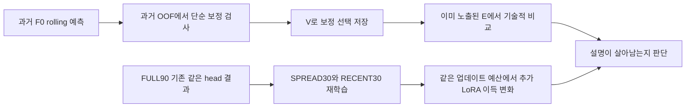

# R1 후속 검증 — 2026-09-10

사용자 승인: 앞선 R1 잔여 이득의 원인을 좁히고 검증해 달라는 요청. 새 방법 설계의 근거를 확인하는 개발 실험이다. 원 연구와 안전 기준은 수정하지 않는다.

## 경쟁 설명과 고정 범위

1. 단순한 과거 패턴·편향으로 회수할 수 있는 오차를 LoRA가 줄였을 수 있다. F0의 과거 rolling forecast에 ZERO/BIAS/SEASONAL_RIDGE/CONTEXT_RIDGE 보정을 비교한다. ZERO를 포함해 V로 선택하고, 선택 저장 후 기존 E를 기술적으로 평가한다. 과거 train OOF 2구간에서도 방향을 확인한다. F0는 현 target train으로 학습하지 않았으므로 F0 train-origin 예측 자체는 local-fit in-sample 잔차가 아니다. 사전학습 데이터 중복 여부는 미확인이다.
2. 학습 origin의 양·기간 구성 때문에 내부 적응 효용이 달라질 수 있다. FULL90 기존 r0와 같은 초기화/200updates/LR를 유지하고 SPREAD30=round(linspace(0,89,30)), RECENT30=60..89를 비교한다. 두 dataset × 두 추가 조건 × MLP/ALL × seed25000/25001 = 16개 새 fit + 16개 E 평가. FULL90은 hash 검증한 기존 fit/예측을 재사용한다. SPREAD30은 기간 양끝을 보존하지만 60일의 target 시간을, RECENT30은31일을 덮는다. 두 조건을 순수한 자료량×시간 변화의 완전 요인 분리라고 부르지 않는다. 업데이트 수 고정이므로 작은 표본의 반복 노출은 증가한다.
3. 대안은 calendar/context routing 병목이다. 외부 calendar linear 보정으로 해결될 수도 있으나 현재 관측만으로 새로운 adapter를 만들 근거가 없다. 시계열을 임의 셔플해서 망가뜨리는 검사는 분포 전체를 바꾸므로 이번에는 하지 않는다.

모델은 앞선 Chronos-2와 같은 residual MLP, ALL attention q/k/v/o rank8이다. Linear head의 추가 탐색은 없다. 모든 새 fit은 recipe0(head/LoRA LR1e-4), V40마다 checkpoint 선택, micro4/effective8/threads2/BF16. 원 FULL90의 두 recipe 중 r0가 모든 arm에서 선택된 결과를 이번 개발 기본값으로 고정하며 subset별 LR 재탐색은 하지 않는다. 따라서 최적 성능의 자료량 곡선은 아니다.

보정은 median residual을 예측한 뒤 모든 quantile을 동일 이동해 원 폭·순서를 보존한다. BIAS는 train median residual의 target/lead별 값. SEASONAL_RIDGE는 과거 일·주 template, context target 평균/표준편차, F0 median으로 residual을 예측한다. CONTEXT_RIDGE는 전체 multivariate past336와 F0 median이다. Ridge lambda=.01,1,100은 기존 단순 기준선과 같은 grid다. OOF는 train origins30:60/60:90이고 각 구간 첫 예측시각까지48h 정답이 모두 도착한 이전 origin만 학습한다. 데이터 표준화도 해당 과거 fold에서만 적합한다. V에서 전체 train으로 fit한 후보 중 최소 pinball score를 고른다. 동률은 ZERO 우선, BIAS, seasonal, context 및 lambda 오름차순. Ridge residual은 squared error 학습이므로 모든 가능한 pinball 보정법을 배제하는 검사는 아니다.

주대비는 (MLP−ALL)/F0의 FULL90→SPREAD30 변화다. RECENT30은 시간 구성 민감도 참조. 효과 방향 두 seed 일치 여부와 절대 F0 효용을 보고한다. 단 두 seed/두 원천으로 유의성·기전 확정하지 않는다. 보정의 미래 이득과 FULL90 LoRA 이득의 잔여 차이도 함께 보고한다.

## 자료·안전·중단

기존 E는 이미 노출된 개발 평가다. 이번에 새로운 원천/미노출 test를 확보했다고 주장하지 않는다. 조건/특성/정규화/선택 규칙은 결과 전에 고정한다. 별도 미래 확증은 가설이 살아남은 이후의 단계다. 새 결과를 보고 LR·feature·조건을 늘리는 재시도는 없다.

GPU는 한 작업씩, 기존 admission13GiB commit/5GiB RAM, 실행 guard6GiB commit/5GiB RAM/85C, child900초를 유지한다. 실패 출력은 보존하고 자동 덮어쓰기·안전 문턱 완화는 하지 않는다. 작은 분석·그림은 CPU2threads. 새 checkpoint/예측은 별도 runs에, 보고서는 기존 연구 방향 폴더에 기록한다. commit/push/시스템 설정 변경은 없다.

예상 새 GPU 실행15~25분(메모리 진입 대기 제외), 코딩·감사·보고서 별도. 모델/기존 성능 재현 무결성이 깨지면 결과 해석 전에 중단한다.

## 설계 근거

- [FPP3 rolling-origin evaluation](https://otexts.com/fpp3/tscv.html): 평가시각 이후 관측을 fit에 넣지 않는다. 여기서는48h horizon 정답 도착까지 확인한다.
- [FPP3 residual diagnostics](https://otexts.com/fpp3/diagnostics.html): 잔차 구조는 추가 정보의 단서이지만 잔차 검사만으로 방법을 선택하지 않는다. 여기서는 직접 미래 보정 점수도 평가한다.
- [Time-PEFT 저자 구현](https://github.com/kaist-dmlab/TimePEFT): temporal/multichannel complexity와 adapter 연결이 이미 있어 단순 entropy 기반 새 방법 주장을 하지 않는다. 이번에는 그 구현을 재현하지 않는다.

