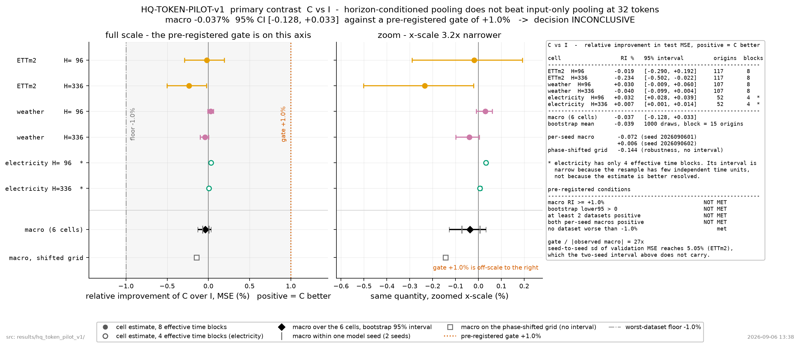

# HQ-TOKEN-PILOT-v1 — STATUS

**execution_status = COMPLETE**, **scientific_decision = INCONCLUSIVE**, evidence_level = DEVELOPMENT_SCREEN.

27 of 27 pre-registered fits completed. Total wall time this invocation: 38.3 min.

## 1. What this run does and does not claim

This is a development screen of horizon-conditioned local pooling at a fixed token budget. It is not a foundation-model result, not a benchmark submission, and not a statement that the topic as a whole works or fails. The model is a small pilot that borrows patching and channel independence from PatchTST; it is not official PatchTST and has no instance normalization, so its absolute numbers are not comparable to published tables.

## 2. Primary contrast — C versus I

| dataset | H=96 | H=336 | dataset mean |
| --- | --- | --- | --- |
| ETTm2 | -0.02% | -0.23% | -0.13% |
| weather | +0.03% | -0.04% | -0.01% |
| electricity | +0.03% | +0.01% | +0.02% |
| **macro (6 cells, equal weight)** | | | **-0.04%** |

Paired circular moving block bootstrap, 1000 draws, block = 15 origins: macro mean -0.04%, 95% interval [-0.13%, +0.03%]. Model seeds are not resampled, so this is a time-sample interval conditional on the two observed seeds.

Bootstrap flags: LOW_EFFECTIVE_TIME_BLOCKS:electricity:4.

Effective time blocks per dataset: ETTm2 8, weather 8, electricity 4.

Per-seed macro RI (sign condition of section 14):

- seed 2026090601: -0.07%
- seed 2026090602: +0.01%

## 3. Pre-registered decision conditions

| condition | met |
| --- | --- |
| core complete for I H STATIC C both seeds | yes |
| macro RI C vs I at least 1pct | no |
| at least 2 datasets positive | no |
| no dataset worse than -1pct | yes |
| both seed macros positive | no |
| bootstrap lower95 positive | no |
| macro RI C vs H STATIC at least 0.3pct | yes |
| seed0 C vs R positive | no |

Reading notes:

- effect present but at least one pre-registered condition failed
- seed-to-seed sd of validation MSE reaches 5.05 percent, at or above the 1.0 percent gate; the two-seed interval does not carry that source of variation

## 4. Scope and explanation contrasts

| contrast | macro RI | role |
| --- | --- | --- |
| C vs I | -0.04% | primary |
| C vs H_STATIC | +1.89% | separates content-conditioned pooling from a fixed horizon prior |
| C vs R | -0.01% | seed0 only; random query control |
| C vs U | +2.84% | seed0 only; uniform pooling |
| C vs DENSE | -0.97% | seed0 only; no compression |
| DENSE vs U | +3.72% | precondition: how much accuracy the 64 to 32 compression costs at all |

The DENSE versus U row bounds what any pooling rule could win at this budget. If it is smaller than the 1.0 percent gate, the gate was unreachable by construction and a null must not be read as evidence against the hypothesis.

Robustness: on a phase-shifted evaluation grid the C versus I macro is -0.14% against -0.04% on the pre-registered grid. The pre-registered grid uses stride 96, which is exactly 24 h on ETTm2 and exactly 4 days on electricity, so all of its origins share one time of day.

## 5. Can this architecture express the mechanism at all

Verdict: **CAPACITY_CONFIRMED**.

The task gives every group one a-patch and one b-patch at independent levels; the short future is the mean of the a-levels and the long future the mean of the b-levels. Because the a-levels are mutually independent, no fixed allocation of the 32 groups serves both futures.

| arm | weight on the a-patch at H=96 | at H=336 | MSE H=96 | MSE H=336 |
| --- | --- | --- | --- | --- |
| I | 0.956 | 0.956 | 0.0106 | 0.0283 |
| C | 0.999 | 0.186 | 0.0052 | 0.2911 |

C moves its pooling weight by 0.813 between the two horizons and improves the H=96 cell by +50.65%. The verdict reads the H=96 cell and the weight separation. The H=336 cell is expected to favour I on this task and is not evidence against capacity: the H=336 loss mask spans steps 0..335, so it still contains the 96 a-steps, and a single weight per horizon cannot serve both halves of that window. What matters is whether the scorer moves the weight when the horizon changes.

This is synthetic and is not a benchmark result. Its only job is to keep a null on real data from being ambiguous between a wrong hypothesis and an architecture that cannot learn the function. Two rejected earlier versions of this check are themselves informative and are recorded in the run notes: with a single shared level on the a-patches, the input-only pooler solved the task by giving different groups different roles, so horizon conditioning bought nothing. Spatial allocation across 32 groups is a real alternative to horizon conditioning, and H_STATIC is the arm that probes it.

## 6. Resolution available to the 1.0 percent gate

| dataset | mean validation MSE | seed sd | sd as percent of mean |
| --- | --- | --- | --- |
| ETTm2 | 0.19924 | 0.01006 | 5.05% |
| weather | 0.43137 | 0.00413 | 0.96% |
| electricity | 0.15291 | 0.00119 | 0.78% |

Arm I trained at eight extra seeds, validation split only, before the core. Worst per-seed spread 5.05 percent against a 1.0 percent gate. This is a measurement of resolution, not an input to the verdict; the core uses exactly the two pre-registered seeds.

## 7. Accuracy table

| dataset | H | B | seed | arm | MSE | MAE |
| --- | --- | --- | --- | --- | --- | --- |
| ETTm2 | 96 | 32 | 2026090601 | C | 0.20641 | 0.30404 |
| ETTm2 | 96 | 32 | 2026090602 | C | 0.20022 | 0.29741 |
| ETTm2 | 96 | 64 | 2026090601 | DENSE | 0.21466 | 0.31369 |
| ETTm2 | 96 | 32 | 2026090601 | H_STATIC | 0.22600 | 0.32697 |
| ETTm2 | 96 | 32 | 2026090602 | H_STATIC | 0.19719 | 0.29861 |
| ETTm2 | 96 | 32 | 2026090601 | I | 0.20561 | 0.30302 |
| ETTm2 | 96 | 32 | 2026090602 | I | 0.20095 | 0.29859 |
| ETTm2 | 96 | 32 | 2026090601 | R | 0.20637 | 0.30384 |
| ETTm2 | 96 | 32 | 2026090601 | U | 0.22751 | 0.32823 |
| ETTm2 | 336 | 32 | 2026090601 | C | 0.29441 | 0.36332 |
| ETTm2 | 336 | 32 | 2026090602 | C | 0.36054 | 0.40866 |
| ETTm2 | 336 | 64 | 2026090601 | DENSE | 0.30071 | 0.36779 |
| ETTm2 | 336 | 32 | 2026090601 | H_STATIC | 0.29887 | 0.37222 |
| ETTm2 | 336 | 32 | 2026090602 | H_STATIC | 0.34817 | 0.40188 |
| ETTm2 | 336 | 32 | 2026090601 | I | 0.29444 | 0.36294 |
| ETTm2 | 336 | 32 | 2026090602 | I | 0.35899 | 0.40834 |
| ETTm2 | 336 | 32 | 2026090601 | R | 0.29456 | 0.36329 |
| ETTm2 | 336 | 32 | 2026090601 | U | 0.29794 | 0.37115 |
| electricity | 96 | 32 | 2026090601 | C | 0.14623 | 0.25967 |
| electricity | 96 | 32 | 2026090602 | C | 0.14599 | 0.25823 |
| electricity | 96 | 64 | 2026090601 | DENSE | 0.13761 | 0.24984 |
| electricity | 96 | 32 | 2026090601 | H_STATIC | 0.15023 | 0.26537 |
| electricity | 96 | 32 | 2026090602 | H_STATIC | 0.14887 | 0.26173 |
| electricity | 96 | 32 | 2026090601 | I | 0.14628 | 0.25973 |
| electricity | 96 | 32 | 2026090602 | I | 0.14603 | 0.25827 |
| electricity | 96 | 32 | 2026090601 | R | 0.14623 | 0.25966 |
| electricity | 96 | 32 | 2026090601 | U | 0.15111 | 0.26628 |
| electricity | 336 | 32 | 2026090601 | C | 0.19583 | 0.30165 |
| electricity | 336 | 32 | 2026090602 | C | 0.19519 | 0.30027 |
| electricity | 336 | 64 | 2026090601 | DENSE | 0.18926 | 0.29484 |
| electricity | 336 | 32 | 2026090601 | H_STATIC | 0.19857 | 0.30578 |
| electricity | 336 | 32 | 2026090602 | H_STATIC | 0.19726 | 0.30313 |
| electricity | 336 | 32 | 2026090601 | I | 0.19586 | 0.30169 |
| electricity | 336 | 32 | 2026090602 | I | 0.19519 | 0.30026 |
| electricity | 336 | 32 | 2026090601 | R | 0.19584 | 0.30165 |
| electricity | 336 | 32 | 2026090601 | U | 0.19889 | 0.30613 |
| weather | 96 | 32 | 2026090601 | C | 0.16274 | 0.22825 |
| weather | 96 | 32 | 2026090602 | C | 0.16584 | 0.23924 |
| weather | 96 | 64 | 2026090601 | DENSE | 0.16223 | 0.23248 |
| weather | 96 | 32 | 2026090601 | H_STATIC | 0.16530 | 0.23482 |
| weather | 96 | 32 | 2026090602 | H_STATIC | 0.17614 | 0.25138 |
| weather | 96 | 32 | 2026090601 | I | 0.16269 | 0.22818 |
| weather | 96 | 32 | 2026090602 | I | 0.16599 | 0.23947 |
| weather | 96 | 32 | 2026090601 | R | 0.16274 | 0.22816 |
| weather | 96 | 32 | 2026090601 | U | 0.16679 | 0.23663 |
| weather | 336 | 32 | 2026090601 | C | 0.26103 | 0.30972 |
| weather | 336 | 32 | 2026090602 | C | 0.25253 | 0.30947 |
| weather | 336 | 64 | 2026090601 | DENSE | 0.25660 | 0.31004 |
| weather | 336 | 32 | 2026090601 | H_STATIC | 0.25902 | 0.31009 |
| weather | 336 | 32 | 2026090602 | H_STATIC | 0.26170 | 0.31913 |
| weather | 336 | 32 | 2026090601 | I | 0.26085 | 0.30954 |
| weather | 336 | 32 | 2026090602 | I | 0.25250 | 0.30947 |
| weather | 336 | 32 | 2026090601 | R | 0.26081 | 0.30941 |
| weather | 336 | 32 | 2026090601 | U | 0.25943 | 0.31097 |

Seasonal-naive anchor on the same grid, same standardized space:

| dataset | H=96 MSE | H=336 MSE | period (samples) |
| --- | --- | --- | --- |
| ETTm2 | 0.26602 | 0.36898 | 96 |
| weather | 0.32035 | 0.38159 | 144 |
| electricity | 0.29910 | 0.32461 | 24 |

## 8. Efficiency

| config | tokens | params | tokenizer params | model call b64 (ms) | end-to-end b64 (ms) | p90 (ms) | peak alloc (MiB) |
| --- | --- | --- | --- | --- | --- | --- | --- |
| U_B32 | 32 | 1,538,992 | 0 | 2.020 | 2.124 | 2.361 | 39.7 |
| I_B32 | 32 | 1,563,697 | 24,705 | 2.477 | 2.488 | 3.222 | 39.8 |
| C_B32 | 32 | 1,563,697 | 24,705 | 2.526 | 2.733 | 2.809 | 39.8 |
| H_STATIC_B32 | 32 | 1,539,120 | 128 | 2.062 | 2.187 | 2.344 | 39.7 |
| R_B32 | 32 | 1,563,697 | 24,705 | 2.543 | 2.627 | 2.788 | 39.8 |
| DENSE_B64 | 64 | 1,538,992 | 0 | 1.821 | 1.970 | 2.163 | 45.7 |

Fewer attention FLOPs is not the same claim as a faster forecast. The end-to-end column includes the host-to-device copy; the model-call column does not. Token counts from BPE-style or foundation tokenizers are not comparable to these numbers, because a token does not mean the same thing.

## 9. Query contribution diagnostics (C only)

| dataset | H | MSE with true query | MSE with swapped query | change |
| --- | --- | --- | --- | --- |
| ETTm2 | 96 | 0.20641 | 0.20642 | +0.01% |
| ETTm2 | 336 | 0.29441 | 0.29441 | -0.00% |
| weather | 96 | 0.16274 | 0.16274 | -0.00% |
| weather | 336 | 0.26103 | 0.26104 | +0.00% |
| electricity | 96 | 0.14623 | 0.14622 | -0.00% |
| electricity | 336 | 0.19583 | 0.19585 | +0.01% |

| dataset | mean absolute weight difference (96 vs 336) | mean token centre shift (samples) |
| --- | --- | --- |
| ETTm2 | 0.0005 | 0.01 |
| weather | 0.0012 | 0.02 |
| electricity | 0.0013 | 0.02 |

A swapped query hurting is not by itself evidence for the method: the model never saw that mismatch during training. The separately trained I, H_STATIC and R arms carry the argument. Weight pictures are explanatory and cannot stand in for an accuracy effect.

## 10. Fits, blocks and evaluation scope

- completed fits / planned fits: 27 / 27
- no blocked or failed fits
- evaluation scope: sparse origin grid at stride 96, both horizons, all channels. This is a development screen and is not the official stride-1 benchmark.
- training budget as a fraction of one pass over eligible windows: ETTm2 0.826, weather 0.257, electricity 0.035. Every arm gets the same budget, so the contrast is fair, but what is measured is early-optimization quality rather than converged quality.
- peak process-tree RSS 1.51 GiB, peak GPU allocated 0.13 GiB, minimum available RAM 16.16 GiB. This guard bounds this job only and is not a guarantee about the machine.

## 11. Stated limitations

- **epoch fraction** — The fixed 3000-update budget is far below one pass over the eligible windows, most severely on electricity. What is measured is early-optimization quality, not converged quality.
- **horizon reaches the encoder through the tokens** — In C the pooling weights depend on H, so the merged tokens themselves encode H and the encoder can read it; in I they cannot. H_STATIC controls this path because its weights also depend on H while ignoring content, which is why the C versus H_STATIC contrast carries the identification weight here.
- **shared horizon embedding** — Section 6 defines a single e_H and section 7 reuses that same e_H as the C/R pooling query, so the module is shared. In C its parameters therefore receive gradient from both the decoder and the scorer path, which I does not. Implemented as written rather than split, because splitting it would create an arm the plan does not contain.
- **checkpoint selection noise** — One checkpoint out of five is chosen on the validation grid, which is only 24 origins on electricity. That selection noise is not carried into the interval.
- **no instance normalization** — The pilot model has no RevIN-style instance normalization. Section 6 does not include one. Absolute accuracy is therefore not comparable to published PatchTST numbers.

## 12. Artifacts

- `results/hq_token_pilot_v1/bootstrap.json`
- `results/hq_token_pilot_v1/contrasts.json`
- `results/hq_token_pilot_v1/data_manifest.json`
- `results/hq_token_pilot_v1/diagnostics.json`
- `results/hq_token_pilot_v1/efficiency.csv`
- `results/hq_token_pilot_v1/environment.json`
- `results/hq_token_pilot_v1/execution_spec.json`
- `results/hq_token_pilot_v1/execution_spec.sha256`
- `results/hq_token_pilot_v1/fit_manifest.csv`
- `results/hq_token_pilot_v1/mechanism_capacity_check.json`
- `results/hq_token_pilot_v1/metrics.csv`
- `results/hq_token_pilot_v1/seed_noise_floor.json`
- `results/hq_token_pilot_v1/sources.json`

<!-- appendix: references and figures -->

## 13. Existing dynamic tokenization baselines (section 16)

| method | official code found | status | how it was checked |
| --- | --- | --- | --- |
| LocalTokenMerging_2025_ICML | no | MISSING_OFFICIAL_BASELINE | PMLR landing page carried no code link; the 21-page PDF was downloaded and its text and link annotations were scanned. The only GitHub URL in it is a citation to Lyken17/pytorch-OpCounter, a FLOP counter, not the authors' implementation. GitHub repository search on the title terms returned nothing matching. |
| BPE4TS_2026_ICML | no | MISSING_OFFICIAL_BASELINE | arXiv abstract page and the 32-page PDF text carried no repository link; GitHub repository search on the title terms returned nothing matching. |
| TimeSqueeze | no | MISSING_OFFICIAL_BASELINE | arXiv abstract page and the 21-page PDF text carried no repository link; GitHub repository search returned nothing matching. |
| PATK_2026_AAAI | no | MISSING_OFFICIAL_BASELINE | AAAI OJS landing page carried no code link; GitHub search returned nothing matching. |

No official implementation of Local Merging, BPE for time series, TimeSqueeze or PATK was located inside the timebox, so this pilot has no strong dynamic tokenization baseline. Writing an adjacent-cosine merge heuristic here would be a LOCAL_HEURISTIC and must never be labelled a reproduction of any of those papers. Their absence says nothing about whether the core hypothesis holds.

## 14. Native foundation reference (section 17)

Declared subgrid: ETTm2 117 origins x 7 channels, weather 107 origins x 21 channels, electricity 52 origins x 16 channels (channel subsample).

Declared before any reference number existed. It is a subset of the frozen test keys, so the core arms are re-scored on exactly these keys for a like-for-like row. These numbers must not be placed beside the full-grid core table.

| dataset | H | C (32 tok) | I (32 tok) | DENSE (64 tok) | Chronos-2 | TiRex-2 |
| --- | --- | --- | --- | --- | --- | --- |
| ETTm2 | 96 | 0.20641 | 0.20561 | 0.21466 | 0.17491 | 0.16971 |
| ETTm2 | 336 | 0.29441 | 0.29444 | 0.30071 | 0.29972 | n/a |
| weather | 96 | 0.16274 | 0.16269 | 0.16223 | 0.14798 | 0.14765 |
| weather | 336 | 0.26103 | 0.26085 | 0.25660 | 0.25859 | n/a |
| electricity | 96 | 0.15363 | 0.15369 | 0.14746 | 0.12665 | 0.12763 |
| electricity | 336 | 0.18577 | 0.18580 | 0.18127 | 0.15775 | n/a |

- Chronos-2 (amazon/chronos-2): status COMPLETE, point forecast is the median.
- TiRex-2 (NX-AI/TiRex-2): status PARTIAL_HORIZON_UNSUPPORTED, device cpu. CPU only on this machine. flashrnn compiles a fused sLSTM CUDA kernel at runtime and needs MSVC plus a CUDA Toolkit, neither of which is installed; the Triton backend exceeds the RTX 4070 shared-memory limit. No Docker, WSL or driver change was attempted, as section 17 forbids it.
  - H=336: BLOCKED_CONTRACT: model caps prediction_length at 320. Rolling the model forward to cover it was not attempted.

Interpretation limits carried from the spec:

- These references were pretrained elsewhere and are evaluated zero-shot; the core arms were fitted on each target. The training conditions are not comparable.
- Pretraining overlap with ETTm2, weather and electricity was not checked, so no unseen zero-shot claim is made.
- Both references return quantiles. Scoring a median under MSE, against arms trained for the mean, is a handicap of unmeasured size.
- No adaptation or tokenizer surgery on these models is attempted in this run.

## 15. Figures

### fig1_primary_contrast.png

Relative improvement in test MSE of the horizon-conditioned pooler (C) over the input-only pooler (I) for each dataset x horizon cell, with paired moving-block bootstrap 95% intervals, shown at full scale next to the pre-registered +1.0% gate and again on a 3.2x narrower x-scale; the macro over the six cells is -0.037% [-0.128, +0.033], about 27 times smaller than the gate it had to clear. Limitation: the intervals resample time origins only and not model seeds, so they do not carry the seed-to-seed spread of up to 5.05% measured on ETTm2, and the two electricity cells rest on 4 effective time blocks, which makes their intervals narrow for a reason that has nothing to do with precision.

### fig2_accuracy_vs_latency.png

Test MSE against measured end-to-end latency for every configuration that was actually trained - the five 32-token arms (U, H_STATIC, I, C, R) and the 64-token DENSE arm - one panel per dataset x horizon cell, showing that learned pooling is worth about +2.84% over uniform pooling at the same token budget while the choice of query is worth -0.04%, and that the 64 to 32 compression itself gave up +3.72% of accuracy. Limitation: filled markers are the single model seed 2026090601, the only seed that has all six arms, the open markers show the second seed for the three core arms and the gap between seeds is often wider than the gap between arms; latency was measured on this 1.5M-parameter pilot, where the pooling scorer costs more than the shorter sequence saves, so the x-axis must not be read as the cost profile of a large model.

### fig3_pooling_weights.png

Mean pooling weight on the first patch of each of the 32 groups at H=96 against H=336 for the same inputs: on the three real datasets the two horizon curves are indistinguishable (mean absolute weight change 0.00051, 0.00122, 0.00135, and no single group moves more than 0.00224), while the same architecture trained on a synthetic task where the horizon must matter separates the two horizons by 0.813 on an identical y-axis. Limitation: the right panel is a capacity check on a synthetic task and is not a benchmark result, and the left panel is a mean over 256 test windows of the first weight in a group of two, so it shows that the horizon-conditioned query is inert on average, not that no individual window ever moved.

