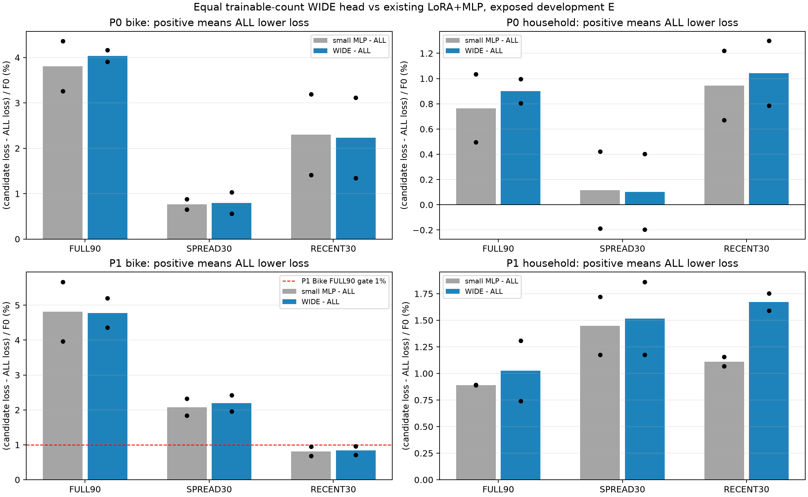
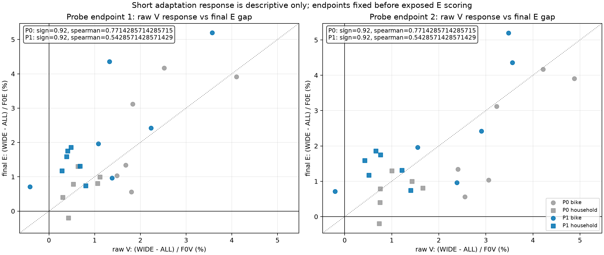
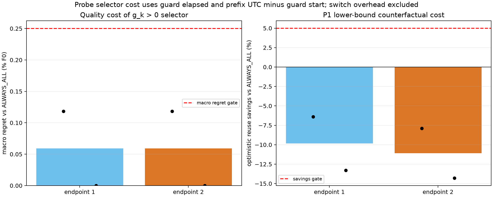

# Equal-count head and short adaptation response — completed

[한국어 결과·해석·다음 방향](../../_docs/notes/tsfm_topics/07_research_direction/30_capacity_probe_20260910.md)

36 WIDE fits +24 actual short ALL fits +24 WIDE forecasts +1 smoke:85 clean guard jobs. Same trainable count1,768,949. Both E periods are exposed development data.

P1 Bike FULL90 additional LoRA gain:4.358/5.200%F0, mean4.779. Capacity continuation gate passed. P1 final LoRA advantage12/12; probe sign accuracy11/12 vs ALWAYS_ALL12/12. Six-cell Spearman0.543. Current probe rule passed quality but increased counterfactual cost6.397–14.294%; efficiency gate failed. This is diagnostic evidence, not a new PEFT method.

- [Summary JSON](summary.json)
- [All24 paired capacity outcomes](capacity_metrics.csv)
- [All48 raw response rows and prefix clocks](probe_metrics.csv)
- [P1 rule quality/cost](p1_probe_rule_cost.csv)
- [Contracts and independent audits](evidence)
- [Frozen protocol](../../experiments/peft_capacity_probe_v1/PURPOSE.md)

Costs use guard elapsed and checkpoint UTC. Reuse counterfactual excludes switch overhead, includes the measured separate model loads, and is not a universal lower bound or a realized selector. Full checkpoints and prediction archives remain under runs/peft_capacity_probe_v1; compact review evidence is copied here. Original experiments are unchanged.
