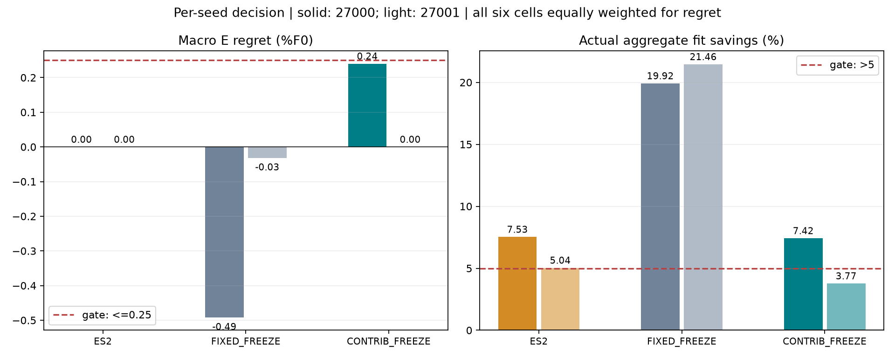
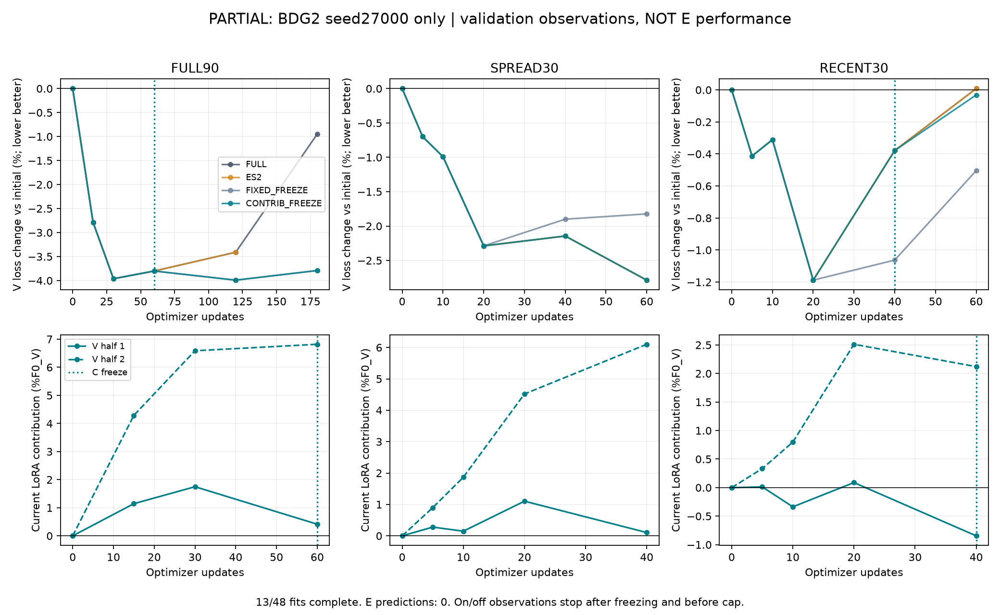
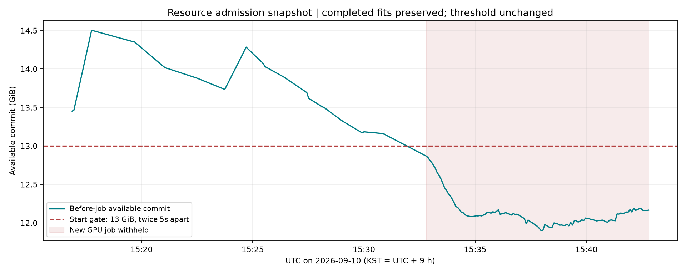

# Study31 — completed; contribution-based freezing did not pass

48 fits,50 E forecasts,one lifecycle smoke, and13 timing replays completed. All112 GPU guards exited0. **CONTRIB_FREEZE fails the two-seed decision gate; fixed freezing is the stronger simple baseline in this pilot.** Two source families and two seeds support a descriptive pilot, not a new-method claim.

[Korean report and next steps](../../_docs/notes/tsfm_topics/07_research_direction/31_contribution_freeze_20260911.md) · [original frozen protocol](../../experiments/peft_contribution_freeze_v1/PURPOSE.md)

## Resource-matched supplemental results



```text
Arm              seed     E regret (%F0)    Fit savings (%)    Gate
ES2              27000        0.000             7.530          pass
                 27001        0.000             5.037          pass
FIXED_FREEZE     27000       -0.492            19.917          pass
                 27001       -0.032            21.461          pass
CONTRIB_FREEZE   27000       +0.240             7.422          pass
                 27001        0.000             3.774          cost fail
```

Regret is E loss minus FULL loss divided by F0 loss; negative is better. Each seed requires macro regret<=0.25%F0, maximum source-mean regret<=0.5%F0 and aggregate fit savings>5%. Quality is averaged across six cells; fit cost uses summed actual guard times. The fixed baseline dominates the candidate in macro quality and cost in both seeds, but is not harmless in every cell: BDG2 FULL90 worsens by1.441/0.385%F0. ES2 dominance has small timing margins:0.175s versus the candidate in seed27000 and only5.037% savings in seed27001. These margins are not robust timing evidence without repeats.

- [Supplemental summary](resource_matched/summary.json), [48 rows](resource_matched/metrics.csv).
- [Per-source and condition plot](resource_matched/01_quality_cost.png), [on/off trajectories](resource_matched/03_observed_contribution.png). All Jena regrets are0; the tiny automatic axis scale is not a measured effect.
- [Mechanism diagnostics](mechanism_diagnostics.csv), [complete resource and mechanism review](completion_review.json), [48 full fit histories](fit_histories.json).

The candidate freezes8/12 cells;7 of these select a checkpoint before freezing. Its E predictions are exactly FULL in11/12 cells. The remaining cell equals fixed freezing and is worse than FULL. Thus this rule did not select a better E forecast than FULL. This is not a rejection of LoRA itself.

## Why the timing analysis is supplemental

Closing user-authorized background helpers changed throughput. Identical Jena FULL90 seed27000 checkpoints trained for180updates took109.641s before cleanup versus40.344s after cleanup. Original mixed-session timings are confounded.

The timing contract was sealed at20:11:13UTC, before the first E job at20:22:58UTC. It selected all13 pre-cleanup fits solely from the saved partial snapshot. Replays ran after E completion. Their checkpoints, full histories excluding timestamps,90 NPZ files and371 arrays match exactly. We replace those13 times with the replay measurements and retain35 post-cleanup times; no minimum-time selection is used. Original13 cost837.110s and repeated13 cost326.923s are both preserved. Each replay is a single timing measurement under the resumed environment, not proof of identical machine state.

The raw candidate savings12.574/3.774% become7.422/3.774%; the overall failure remains. Raw ES2 seed27000 timing changes from14.804% slower to7.530% saved, demonstrating why raw cross-session timing must not support a speed claim.

- [Original mixed-session summary](summary.json), [original metrics](metrics.csv).
- [Original gate plot](02_gate_summary.png), [original quality/cost plot](01_quality_cost.png), [original contribution plot](03_observed_contribution.png).
- [Pre-E timing contract](evidence/timing_contract.json), [timing completion](evidence/timing_completed.json).
- [Independent replay audit](evidence/independent_timing_replay_audit.json), [independent cost/quality audit](evidence/independent_timing_analysis_audit.json).

## Completion and evidence

- [Original completion](evidence/completed.json), [sealed selection](evidence/selection.json).
- [Independent fit audit](evidence/independent_fit_audit.json), [independent forecast audit](evidence/independent_forecast_audit.json).
- [Cleanup plan](evidence/resume_cleanup_plan.json), [cleanup result](evidence/resume_cleanup_result.json).
- [Resumed Windows event audit](evidence/resume_system_event_audit.json):0 selected events,0 query errors from20:05:50 to20:43:31UTC.
- [Final memory, process and protected-input check](evidence/final_resource_integrity.json):no study training process or guard lock; study31 and study30 protected hashes passed.
- [Resume evidence copy manifest](resume_evidence_manifest.json):13 byte-identical new evidence copies.

112 successful guards contain266 resource samples and112 separate finish events. Sample minimum available RAM9.130GiB/commit9.482GiB; maximum childRSS1.689GiB, GPU1891MiB/53C. Sampling is not a continuous peak-memory proof. The post-outcome resource helper initially treated finish events as samples; [the failure record](evidence/completion_review_failure.json) is preserved and the final helper separates them. Training, evaluation and frozen analyses were not changed.

## Historical admission-stop snapshot

The following partial files preserve the earlier13-fit stop. They do not describe the final study status.




- [Partial selected-V audit](evidence/partial_validation_audit.json), [partial metrics](partial_metrics.csv), [partial histories](partial_histories.json), [V equivalence](evidence/partial_equivalence_audit.json).
- [Stop record](evidence/admission_stop.json), [captured exception](evidence/admission_exception.txt), [earlier event audit](evidence/system_event_audit.json), [earlier memory snapshot](evidence/resource_pause_snapshot.json).
- [Independent data audit](evidence/independent_data_audit.json), [data audit](evidence/data_audit.json), [prepared summary](evidence/prepared_summary.json), [preparation failures](evidence/preparation_failures.json).
- [Original plan](evidence/plan.json), [run contract](evidence/contract.json), [independent audit contract](evidence/independent_audit_contract.json), [environment](evidence/environment.json).

No new-method or AFLoRA-superiority claim. No commit or push was performed in this resumed turn.
