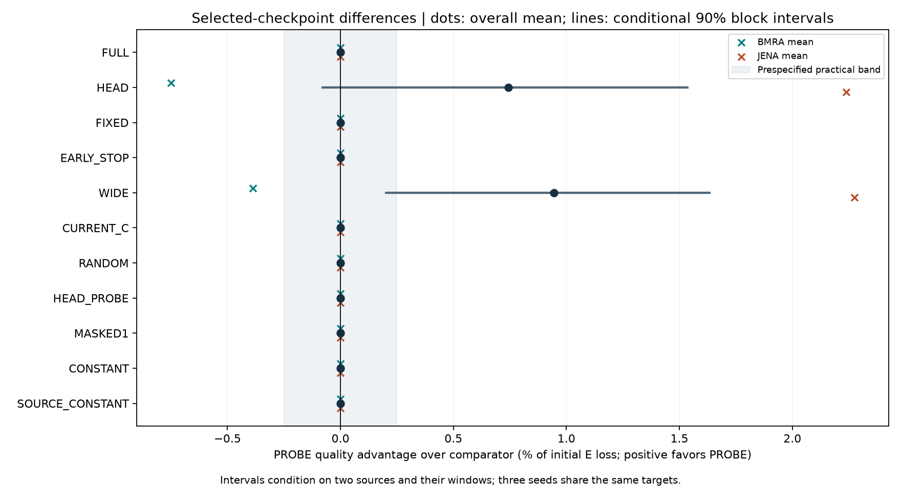
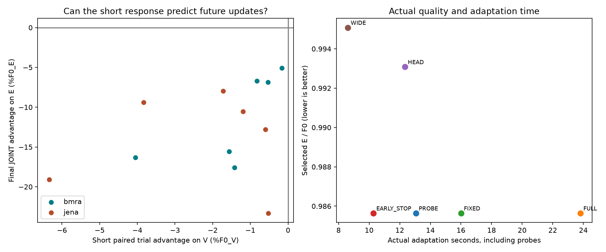
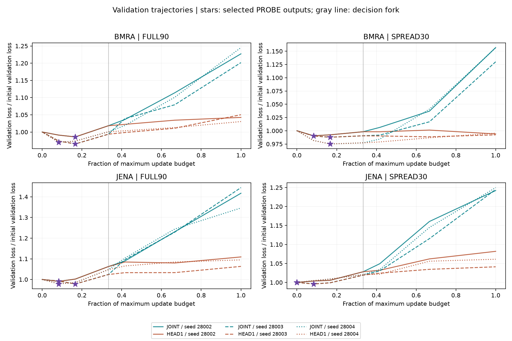

# PEFT decision transfer — 완료, 세 기준 미통과

[전체 분석·원인·다음 연구 순서](../../_docs/notes/tsfm_topics/07_research_direction/33_decision_transfer_20260911.md)

새 확인 기간의 12조건에서 PROBE는 STOP10/HEAD2를 선택했으나 실제 선택 모델은 모두 STOP과 같았다. JOINT·HEAD1·STOP의 V 최적 모델도 12/12 동일했다. 결정은 예산33.3%에서 했지만 최종 선택 모델은 모두0~16.7% 지점에 있었다. 현재 후보는 종료하며 새로운 PEFT 방법의 우월성을 주장하지 않는다.

```text
검증 항목                       판정과 근거
새 기간에서 조건별 판단의 가치   미통과 — 공통/원천별/무작위 행동 대비 이득0
짧은 JOINT 신호의 필요성         미통과 — CURRENT_C/HEAD_PROBE 대비 이득0
강한 단순 대조 대비 실제 효용    미통과 — 조기 종료와 같은 품질이지만
                                seed별28.37/20.12/33.68% 더 느림

방법         평균 E/F0  평균 적응 시간
PROBE        .985639     13.058초
FULL         .985639     23.817초
FIXED        .985639     16.006초
EARLY_STOP   .985639     10.284초
HEAD         .993080     12.341초
WIDE         .995080      8.612초
```

초기 LoRA 포함 적응의 WIDE 대비 평균 이득은 +0.944%F0지만 Jena +2.275/BMRA −0.387로 원천에 따라 부호가 다르다. 조건부90% 구간은 WIDE 대비[0.197,1.639], 좁은 HEAD 대비[−0.083,1.541]%F0다. F0는 초기 손실이며 %F0는 그 값으로 정규화한 손실 차이다. 두 원천을 고정한 구간이므로 새로운 데이터셋 전체로 일반화하지 않는다. 0.25%F0·5%는 사전 고정한 연구 진행 기준이지 논문 합격선이 아니다.







[전체 선택 점수 그림](01_selected_quality.png)도 제공한다. 별표가 gray fork보다 앞에 있다는 점이 핵심이다. 두 HEAD 선택은 현재 fork V보다 trial V가 조금 나아 생겼지만, 실제 출력은 더 좋은 과거 모델이었다. [독립 설계 검토](evidence/independent_policy_review.json). 이는 사전 고정한 규칙의 한계이며 모델 저장·재실행 오류는 아니다.

## 결과·검산 자료

- [144행 metrics.csv](metrics.csv), [고정 분석 summary.json](summary.json), [개발 선택](development_choice.json).
- [전체 V 학습 곡선·분기 상태 검사](evidence/validation_histories.json), [72번 실제 재실행](evidence/replay_records.json).
- [per-origin 손실 합·유효 target 수·scale](per_example_losses.npz). 원시 target/예측을 담지 않은 작은 통계 재현 자료다.
- [독립 감사](evidence/independent_audit.json): source39/input9 해시, V1,260점·E379점·current_C32개,144행,72재실행,177guard,시간 순서 검산 통과. 최대 오차 V4.25e-14/E2.22e-16.
- [고정 계획](evidence/plan.json), [개발 fit 봉인](evidence/dev_fits_sealed.json), [시험 fit 봉인](evidence/test_fits_sealed.json), [본실험 완료](evidence/completed.json), [시간 측정 완료](evidence/timing_completed.json).
- [준비 자료 요약](evidence/prepared_summary.json), [데이터 감사](evidence/prepared_data_audit.json), [환경](evidence/environment.json), [CPU 검사](evidence/cpu_checks.json), [실행 전 검토](evidence/preflight_review.json).
- [완료·자원·세 행동 출력 비교](completion_review.json), [177개 guard](evidence/guard_statuses.json), [지정 Windows 이벤트](evidence/windows_event_audit.json).
- [준비 helper 실패 보존 기록](evidence/prepared_attempt01_failed_preparation_failures.json): 학습 전 키 오류1건 수정, 원시 파일·partial 보존. GPU 실패와 구분한다.

## 실행과 재현 범위

개발20fit+20forecast, 시험32fit+32forecast, S0+72실제 시간 재실행 =177 GPU 작업이 모두 정상 종료했다. 본 controller5,371.231초(89.52분), 별도 S0 22.266초. 508자원 표본에서 최소 여유 RAM12.792GiB/commit12.420GiB, 최대 GPU1864MiB/54°C. 완료 시 이번 학습 프로세스와 guard lock 없음. 지정 Windows 이벤트0건/조회 오류0건.

정책 적응 시간은 함수 시작 후 로딩·학습·V·시험·복원을 포함하고, import 전 시간 및 사후 검증·파일 저장·E 예측을 제외한다. 조건마다 한 번 측정한 결과로 정밀 하드웨어 벤치마크는 아니다.

[프로토콜](../../experiments/peft_decision_transfer_v1/PURPOSE.md) · [자료 계약](../../experiments/peft_decision_transfer_v1/PURPOSE_DATA.md) · [prepare.py](../../experiments/peft_decision_transfer_v1/prepare.py) · [panel.py](../../experiments/peft_decision_transfer_v1/panel.py) · [fit.py](../../experiments/peft_decision_transfer_v1/fit.py) · [policy.py](../../experiments/peft_decision_transfer_v1/policy.py) · [replay.py](../../experiments/peft_decision_transfer_v1/replay.py) · [run.py](../../experiments/peft_decision_transfer_v1/run.py) · [analyse.py](../../experiments/peft_decision_transfer_v1/analyse.py) · [independent_audit.py](../../experiments/peft_decision_transfer_v1/independent_audit.py) · [completion_review.py](../../experiments/peft_decision_transfer_v1/completion_review.py).

실행 순서는 자료 준비·감사 → `run --prepare` → `run --smoke-only` → `run` → `analyse` → `independent_audit --run` → `completion_review`였다. 모듈 prefix는 `experiments.peft_decision_transfer_v1.`이다. 완료 경로에 재실행하면 덮어쓰기를 거부한다. 새 학습 재현에는 기존32번 계획·의존 코드, 원시 데이터/준비 archive, 모델 캐시와 고정 환경, 별도 run 경로 설계가 필요하다. 이 폴더만으로 전체 학습이 자동 재현된다는 뜻은 아니다.

공개용 작은 NPZ에서 CSV 점수를 재계산하는 핵심식은 다음과 같다. 한 row의 배열 기준이다.

```python
score = (pinball_numerator.sum(axis=0)
         / valid_target_count.sum(axis=0)[:, None]
         / scale[:, None]).mean()
```

paired 재표집에서는 numerator와 count에 같은 origin 가중치를 적용한다. source 안에서는 모든 seed·구성·방법에 같은 가중치를 써야 한다. 각 seed를 독립 데이터셋으로 세지 않는다.

원시 예측 NPZ·모델 checkpoint·개별 실행 로그는 로컬 `runs/peft_decision_transfer_v1`에 남겼다. 이 결과 폴더에는 GitHub에서 읽기 쉬운 표·그림·전체 V history·작은 근거 파일을 모았다. 이번 턴에는 commit/push하지 않았다.

