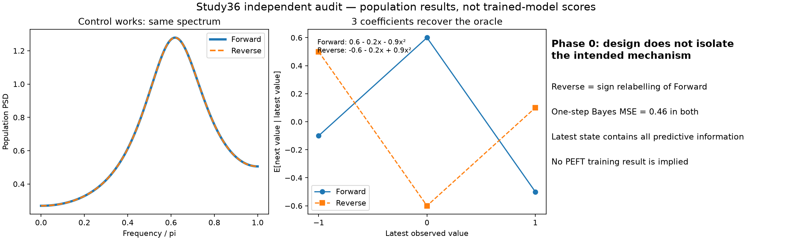

# Study36: preparation audit

**STOP at Phase 0 for the proposed design. No TSFM training was performed.**

[Korean report](../../_docs/notes/tsfm_topics/07_research_direction/36_dependence_phase0_results_20260911.md) · [Original plan](../../_docs/notes/tsfm_topics/07_research_direction/36_dependence_peft_paper_plan_20260911.md)

The proposed direction contrast is exactly an observation-sign relabelling. A three-coefficient quadratic of the latest observed state represents the one-step Bayes mean. Spectrum matching succeeds, but the proposed contrast does not isolate the intended temporal-interaction mechanism.

- [Independent population audit](independent_gate_audit/audit.json)
- [Executed audit code](../../experiments/peft_dependence_screen_v1/independent_gate_audit.py)
- [Data gate summary](data_gate/summary.json)
- [Data gate report](data_gate/data_gate_report.md)
- [Attempt 01 preserved: shared RNG finite-sample run](data_gate_attempt01_shared_rng/summary.json)
- [Per-predictor scores](data_gate/predictor_metrics.csv)
- [Final independent verification](verification.json)

This plot contains population calculations, not learned PEFT results. The original 72-fit cap was conditional, not a required workload. Adapter development and external validation were not entered.

The train-only, three-coefficient quadratic leaves at most 0.0482–0.3719% population MSE reduction in the four forward/reverse cases, below the proposed 2% practical-benefit requirement. The 1024-origin training control is separate from the full-transition control with 32704 training pairs. Historical real-data warnings are not a fresh real-data failure result.
