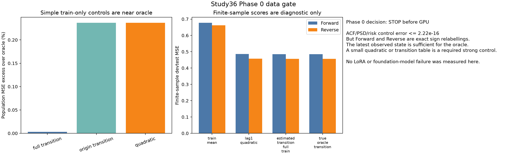

# Study36 Phase 0 Data Gate

Created: 2026-09-11T07:10:42.830873+00:00

## Executive Summary

Overall decision: **STOP_BEFORE_GPU_PHASE1**.

The proposed forward/reverse Markov contrast technically controls marginal distribution, population ACF/PSD, and Bayes risk, but it does **not** isolate the intended temporal-dependence mechanism. Forward and reverse are exact sign relabellings of each other under the chosen observation values `(-1, 0, 1)`, and the latest observed state is sufficient for one-step prediction. A tiny train-only transition table or quadratic readout is therefore a mandatory strong control and already sits near the oracle in population risk.

This is a design-gate result, not a trained-model result. No LoRA, Chronos, MOMENT, Time-PEFT, or new adapter training was started.

## Domain Context

```text
domain              time-series ML / forecasting PEFT
downstream decision decide whether to spend GPU time and method-design effort
target claim        temporal-relation adapter is needed beyond frequency/difficulty/simple controls
quality bar         publication-oriented screen, zero tolerance for leakage/confounded DGP
main leakage paths  shared paths across splits, D-tuned generator changes, whole-period real descriptors
```

## Gate Results

```text
population controls forward/reverse   PASS
construct validity for PEFT mechanism FAIL
simple-control necessity              FAIL for internal-PEFT claim
real-data support from old records     HISTORICAL WARNING, not a stop reason
GPU Phase 1                            NOT STARTED
adapter Phase 2                        NOT STARTED
external Phase 3/4                     NOT STARTED
```

## Key Numbers

```text
reflection conjugacy error             0.000e+00
observation sign-flip error            0.000e+00
ACF difference h=1..128                5.551e-17
PSD difference max over 257 freq        2.220e-16
Bayes-risk difference h=1..128          2.220e-16
one-step Bayes MSE forward/reverse      0.460000 / 0.460000
full train transition excess risk mean  0.0032% over oracle
origin-only transition excess mean      0.2368% over oracle
quadratic latest-value excess mean      0.2368% over oracle
```

The full train transition estimator used all adjacent transitions in the 64 train paths: `64 * 511 = 32704` transitions per seed and condition. The origin-only transition estimator used only the planned forecasting origins: `64 * 16 = 1024` transitions. Both are train-only.
These excess-risk percentages use the oracle risk as denominator, so they are not the same denominator as the later 2% model-improvement screen.

## Interpretation

The control objective partly works: forward and reverse have the same second-order statistics and the same Bayes risk. That is useful as a mathematical diagnostic.

The construct fails for the intended paper claim. Because reverse is just the reflected forward chain and reflection also flips the observed values, a model gap could be about sign handling or a simple nonlinear readout, not about a special temporal relation that needs an internal adapter. Also, this is first-order Markov: once the latest state is observed, older left/right context has no additional information for the one-step target. That makes it a weak test for a current-past interaction adapter.

The old `covariate-trust-pilot` record adds only a historical warning. It found no M5 or Favorita series with `|rho_interval| >= 0.8`; that does not prove the new direction is absent in real data, and it is not used as a stop reason here. It only means a revised design still needs a train-only real-data availability check before a paper-scale claim.

## Figure



## Outputs

```text
results/peft_dependence_screen_v1/data_gate/summary.json
results/peft_dependence_screen_v1/data_gate/condition_metrics.csv
results/peft_dependence_screen_v1/data_gate/predictor_metrics.csv
results/peft_dependence_screen_v1/data_gate/02_data_gate.png
```

## Recommended Next Design

Do not run the 72-fit GPU package on this DGP. The next viable design should remove the sign-relabel confound and force a simple-control contest before any adapter is proposed. A better synthetic family would need at least these properties:

1. Same marginal distribution and matched second-order statistics under the intended contrast.
2. Same latest value can imply different next-step distributions depending on ordered history, so a last-state transition table is insufficient.
3. A prespecified raw-history predictor, Markov/hidden-state estimator, and same-capacity head are included from the first run.
4. Real train-only descriptors show that the relation exists in candidate datasets before model scores are opened.

