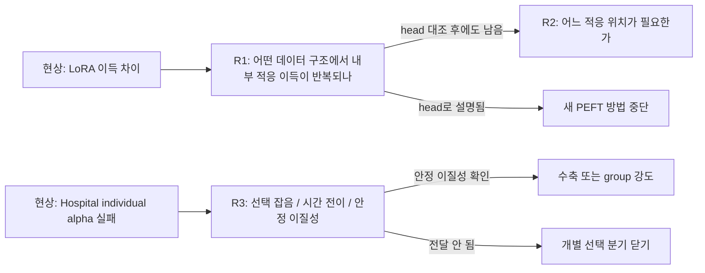
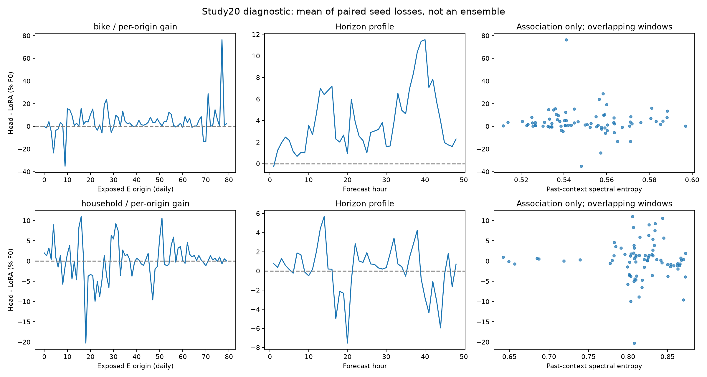
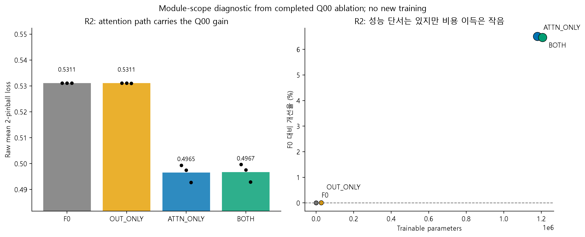
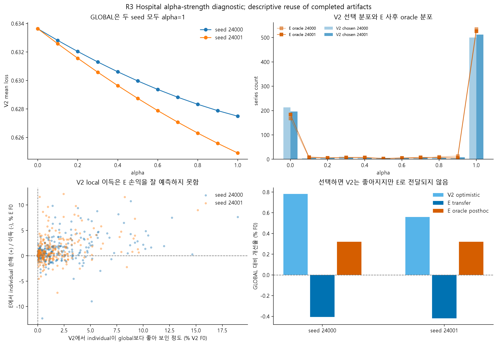

> Historical saved-artifact CPU snapshot only. New controlled training in runs/peft_mechanism_diagnostics_v1 is reported separately.

# PEFT 현상에서 원인으로: R1-R3 진단 결과

2026-09-10. 이 문서는 사용자가 요청한 `1, 2, 3` 순차 진단을 저장된 실험 산출물로 실행한 결과다. 새 학습은 하지 않았고, 기존 run과 checkpoint는 읽기만 했다. 품질 기준은 논문 확증이 아니라 **탐색적 원인 진단**이다.

## 도메인과 누수 기준

도메인은 시계열 foundation model의 target-domain PEFT다. 다운스트림 결정은 "어떤 adapter를 만들까"가 아니라 **논문 주제로 밀 수 있는 부족 원인을 고를지**다. 그래서 이번 산출물은 세 가지 누수를 분리한다.

- R1: 과거 context에서 계산한 특성만 사용했지만, 이미 본 E 구간과 gain의 상관은 탐색적이다.
- R2: Q00 합성 개발 결과라 layer 일반화 주장이 아니다.
- R3: 2005/2006 E oracle은 사후 진단이며, 새 선택 규칙의 test가 아니다.

## R1. Bike와 Household 차이

[확인] 저장된 Study20 예측을 seed, origin, horizon, 과거 context 특성으로 다시 분해했다. Bike의 head 대비 LoRA 추가 이득은 seed별 `2.386`, `4.406`, `5.068`%F0이고, 80개 evaluation origin 중 양수 비율은 `76.2%`다. Household는 `0.043`, `-0.264`, `0.584`%F0이고 양수 비율은 `57.5%`다.

[확인] Bike는 평균 spectral entropy `0.550`, 24시간 ACF `0.754`, 168시간 ACF `0.871`로 반복 구조가 강했다. Household는 entropy `0.812`, 24시간 ACF `0.237`, 168시간 ACF `0.236`로 더 불규칙했다.

하지만 [확인] 각 데이터셋 내부에서 과거 spectral entropy와 origin별 LoRA 이득의 상관은 Bike `-0.019`, Household `-0.013`로 약했다. 즉 "복잡도 하나가 크면 LoRA가 된다"는 단순 문장은 지금 증거와 맞지 않는다. 더 그럴듯한 문장은 **recoverable temporal structure가 남는 데이터에서 내부 적응 이득이 반복될 수 있다**다.

다음 R1 실험은 matched head control이어야 한다. Frozen+MLP와 LoRA+같은 MLP를 같은 출력 형식, 같은 선택 예산으로 비교해야 head 용량/최적화 설명을 걷어낼 수 있다.

## R2. 일부 모듈만으로 충분한가

[확인] Q00 module deletion 결과에서 ATTN_ONLY는 F0 대비 `6.506%` 개선했고 BOTH는 `6.464%` 개선했다. Attention 삭제 비용은 `6.462%F0`, output projection 삭제 비용은 `-0.042%F0`다.

해석은 꽤 차갑다. attention 경로가 중요하다는 단서는 살아 있다. 그런데 ATTN_ONLY가 BOTH 대비 줄인 학습 파라미터는 `2.259%`뿐이다. 그래서 지금 단계에서 "효율적 layer PEFT"라고 부르면 약하다. R2는 **위치/범위 선택 문제**로 남겨야 한다.

다음 R2 실험은 R1이 통과한 뒤에만 의미가 있다. 앞/중간/뒤 attention layer group을 미리 고정하고, random 위치와 같은 총 파라미터 예산 대조를 같이 둬야 한다.

## R3. Hospital individual alpha는 왜 실패했나

[확인] 완료 결과의 주효과는 INDIVIDUAL이 GLOBAL보다 `-0.412%F0` 나빴다는 것이다. 이번 추가 진단에서 V2에서는 individual 선택이 seed별로 global보다 `0.781`, `0.559%F0` 좋아 보였다. 그런데 E에서는 각각 `-0.405`, `-0.419%F0`로 손해였다.

[확인] E를 사후 oracle로 고르면 GLOBAL 대비 `0.320%F0`의 여지는 있다. 그러나 이것은 test를 보고 고른 상한이다. 방법 결과가 아니다. V2 alpha와 E oracle alpha의 Spearman 상관은 seed별 `0.030`, `0.040`이고, 선택 alpha가 E oracle top1인 비율은 `52.9%`, `53.6%`다.

[미확정] **12개월 V2 선택 잡음, 시간 전이, 안정적인 계열별 이질성 부족을 현재 자료로 구분하지 못한다.** 사후 oracle 이득은 잡음만 있어도 생길 수 있으므로 안정적 개인화 가능성의 증거가 아니다. 과거로 예측 가능한 차이를 별도로 확보할 때만 단순 수축을 검토한다.

## 지금 잡을 주제

가장 좋은 주제 문장은 아직 "새 adapter를 제안한다"가 아니다. 지금은 다음처럼 잡는 게 맞다.

> 시계열 foundation model PEFT에서 target 데이터의 원시 복잡도보다, frozen representation이 남긴 회수 가능한 시간 구조와 그 구조가 위치한 적응 범위를 진단해 PEFT 필요성과 배치를 결정한다.

이 문장은 R1과 R2를 하나로 묶는다. R3는 별도 보조 결과로, per-series personalization이 얼마나 쉽게 validation noise에 먹히는지 보여준다.

## 다음 실행 순서

1. Bike/Household에서 Frozen+MLP vs LoRA+같은 MLP matched control을 먼저 실행한다.
2. 그 차이가 남으면 attention layer group을 사전 지정해서 R2를 실데이터로 옮긴다.
3. Hospital은 이미 본 E를 새 test로 쓰지 않는다. 더 긴 과거 반복에서 안정적 차이가 있는지 먼저 검사하고, 그 근거 없이 수축이나 그룹 adapter를 실행하지 않는다.

이번 산출물: [R1 summary](../../results/peft_mechanism_diagnostics_v1/reference/summary.json), [R2 summary](../../results/peft_mechanism_diagnostics_v1/layer_scope/summary.json), [R3 summary](../../results/peft_mechanism_diagnostics_v1/hospital_strength/summary.json), [통합 summary](../../results/peft_mechanism_diagnostics_v1/followup_summary.json).
